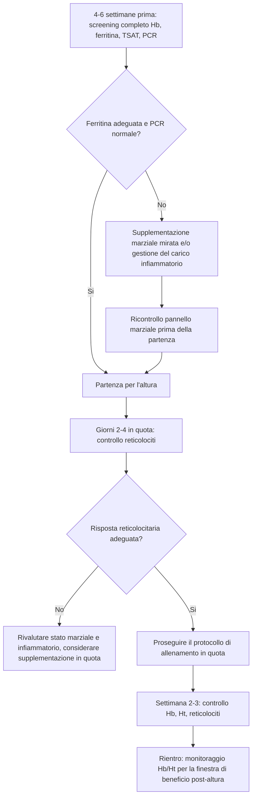

# Sezione 8 — Preparazione e risposta all'altura

*Vedi [[manuale-operativo-interpretazione-degli-esami-ematici-nello-sportivo]] per il metodo generale, [[sezione-2-biomarcatori-emocromo]] per emocromo e reticolociti, [[sezione-3-biomarcatori-metabolismo-del-ferro]] per il metabolismo del ferro e [[sezione-4-biomarcatori-infiammazione-e-danno-muscolare]] per la PCR, tutti richiamati estesamente in questa sezione.*

---

### Perché l'ematologia è centrale nella preparazione all'altura

#### Il razionale fisiologico

L'esposizione all'ipossia ipobarica riduce la pressione parziale di ossigeno disponibile, innescando una cascata di adattamenti finalizzati a preservare l'apporto di ossigeno ai tessuti. La risposta eritropoietica — aumento della produzione di eritropoietina (EPO) renale, seguito da stimolazione midollare e incremento della massa eritrocitaria — è l'adattamento cronico più rilevante per la performance di endurance, ma richiede tempo (settimane) e, soprattutto, richiede substrati adeguati: primo tra tutti il ferro.

Un soggiorno in altitudine con riserve marziali insufficienti non produce l'adattamento eritropoietico atteso, e può anzi risultare in un peggioramento dello stato di forma per la combinazione di stress ipossico e carenza funzionale di substrati, senza il beneficio compensatorio dell'aumento di massa eritrocitaria.

#### I parametri cardine del monitoraggio in altura

| Parametro | Ruolo nel contesto altura | Vedi capitolo |
|---|---|---|
| Emoglobina (Hb) / Ematocrito (Ht) | Valutazione dell'adattamento cronico (aumento atteso dopo 2-3 settimane) | [[sezione-2-biomarcatori-emocromo]] |
| Reticolociti | Indicatore precoce e diretto della risposta eritropoietica acuta (giorni) | [[sezione-2-biomarcatori-emocromo]] |
| Ferritina, TSAT | Stato delle riserve marziali disponibili a sostenere l'eritropoiesi indotta | [[sezione-3-biomarcatori-metabolismo-del-ferro]] |
| PCR | Esclusione di stati infiammatori che confondono la lettura della ferritina e possono compromettere la risposta all'altura | [[sezione-4-biomarcatori-infiammazione-e-danno-muscolare]] |

---

### Il ruolo del ferro e della ferritina in preparazione all'altura

#### Perché il ferro è il fattore limitante più comune

L'eritropoiesi indotta dall'ipossia richiede una quota di ferro significativamente superiore rispetto alle condizioni di normossia, per sostenere la sintesi di emoglobina nei nuovi eritrociti prodotti in maggiore quantità. Se le riserve marziali sono insufficienti all'ingresso in quota, la risposta eritropoietica risulta attenuata o assente, vanificando parte del beneficio atteso dal soggiorno in altitudine.

#### Target pratici di ferritina pre-altura

| Parametro | Target pratico | Note |
|---|---|---|
| Ferritina pre-partenza | >40-50 ng/mL (posizione non unanime in letteratura, soglia operativa diffusa nella pratica di alto livello) | Al di sotto di questa soglia, molti protocolli sportivi raccomandano supplementazione marziale prima della partenza, non durante il soggiorno |
| TSAT pre-partenza | >20% | Conferma la disponibilità funzionale di ferro, non solo le riserve di deposito |

> **Nota metodologica.** Il valore soglia di ferritina pre-altura non ha un consenso scientifico assoluto: diverse federazioni e centri di ricerca (tra cui indicazioni riconducibili a posizioni IOC/AIS) propongono soglie comprese tra 30 e 50 ng/mL. La posizione più diffusa nella pratica di alto livello tende verso il limite superiore di questo intervallo, per massimizzare il margine di sicurezza data l'elevata domanda marziale dell'eritropoiesi in quota. Questa raccomandazione deriva più dalla pratica applicata che da trial randomizzati definitivi (evidenza moderata/limitata).

#### Timing della supplementazione marziale

La correzione di una carenza marziale richiede tempo: idealmente, lo screening del profilo marziale va effettuato 4-6 settimane prima della partenza, per lasciare margine sufficiente a una supplementazione orale efficace (che richiede tipicamente diverse settimane per normalizzare la ferritina) prima dell'esposizione in quota. Uno screening effettuato a ridosso della partenza lascia poco margine di correzione.

---

### Il ruolo della PCR nella preparazione all'altura

#### Perché l'infiammazione compromette la lettura del quadro marziale

Come discusso nel capitolo dedicato, la ferritina è una proteina di fase acuta positiva: uno stato infiammatorio concomitante (anche subclinico, da carico allenante elevato nelle settimane precedenti la partenza) può far risultare la ferritina falsamente normale o elevata, mascherando una sideropenia reale. Per questo motivo, un controllo pre-altura completo dovrebbe sempre includere la PCR insieme al pannello marziale.

#### Applicazione pratica

Se la PCR è elevata al momento dello screening pre-altura, è buona pratica ripetere il pannello marziale completo (ferritina, TSAT, e se disponibile sTfR, meno influenzato dall'infiammazione) dopo la risoluzione dello stato infiammatorio, per evitare di sottostimare una carenza di ferro reale sulla base di una ferritina falsamente rassicurante.

---

### Il ruolo dei reticolociti nel monitoraggio della risposta

#### Perché sono il parametro più informativo durante il soggiorno

A differenza di Hb ed Ht, che riflettono un equilibrio cumulativo di settimane, i reticolociti riflettono l'attività eritropoietica degli ultimi 1-2 giorni: sono quindi il parametro più tempestivo per verificare se l'organismo sta rispondendo efficacemente allo stimolo ipossico, ben prima che questo si traduca in un aumento misurabile di Hb/Ht.

#### Pattern atteso nel tempo

| Fase | Reticolociti | Hb / Ht |
|---|---|---|
| Primi 2-4 giorni in quota | Aumento significativo atteso, come primo segnale di risposta eritropoietica efficace | Generalmente ancora stabili o in lieve riduzione (emoconcentrazione iniziale da diuresi indotta dalla quota) |
| Settimana 2-3 in quota | Reticolociti elevati persistono, sostenendo l'incremento della massa eritrocitaria | Hb/Ht iniziano ad aumentare in modo misurabile |
| Rientro a livello del mare | Calo dei reticolociti verso valori basali o sotto il basale (fisiologico feedback negativo da riduzione dello stimolo ipossico) | Hb/Ht rimangono elevati per un periodo variabile (giorni-settimane) prima del ritorno ai valori di pianura |

#### Come interpretare una risposta reticolocitaria inadeguata

Se nei primi giorni di quota l'aumento atteso dei reticolociti non si verifica, o è marcatamente inferiore a quanto atteso per lo stimolo ipossico applicato (in base a quota e durata), questo è un segnale precoce che merita attenzione: le cause più probabili sono uno stato marziale insufficiente all'ingresso in quota o uno stato infiammatorio concomitante che inibisce l'eritropoiesi (tramite l'aumento dell'epcidina, vedi [[sezione-3-biomarcatori-metabolismo-del-ferro]]).

---

### Timing dei controlli ematici in un ciclo di preparazione all'altura

---

### Interpretazione nelle tre fasi: prima, durante e dopo l'altura

#### Prima della partenza

L'obiettivo è verificare che le riserve marziali siano sufficienti a sostenere l'eritropoiesi indotta dalla quota, ed escludere stati infiammatori che possano confondere il quadro. Una ferritina insufficiente rilevata a ridosso della partenza, senza tempo per la correzione, dovrebbe far riconsiderare l'intensità o la durata del protocollo di quota pianificato, in accordo con lo staff medico.

#### Durante il soggiorno

Il monitoraggio dei reticolociti nei primi giorni fornisce il segnale più precoce sull'efficacia della risposta. Un monitoraggio intermedio di Hb/Ht verso la seconda-terza settimana permette di verificare l'entità dell'adattamento cronico. Va sempre considerato che i primi giorni in quota comportano tipicamente una diuresi indotta dall'ipossia con relativa emoconcentrazione, che può temporaneamente elevare Hb/Ht per un effetto di volume più che di massa eritrocitaria reale: questo va distinto dall'aumento reale della massa eritrocitaria che si manifesta più tardivamente.

#### Dopo il rientro

I benefici ematologici dell'altura (massa eritrocitaria aumentata) si mantengono per un periodo limitato e variabile da individuo a individuo dopo il rientro a livello del mare, generalmente nell'ordine di alcune settimane, prima del ritorno ai valori basali. Questo definisce una finestra temporale entro cui pianificare le competizioni per massimizzare il beneficio dell'esposizione in quota. Un controllo post-rientro dello stato marziale è inoltre buona pratica, poiché l'eritropoiesi accelerata in quota può aver consumato ulteriormente le riserve di ferro.

---

### Errori comuni nella gestione ematologica dell'altura

- Effettuare lo screening marziale a ridosso della partenza, senza margine per correggere un'eventuale carenza;
- non controllare la PCR insieme alla ferritina, rischiando di considerare adeguato uno stato marziale in realtà insufficiente;
- interpretare un aumento precoce di Hb/Ht nei primissimi giorni di quota come "adattamento reale", quando è più probabilmente un effetto di emoconcentrazione da diuresi indotta dall'altitudine;
- non monitorare i reticolociti, perdendo il segnale più precoce e informativo della qualità della risposta eritropoietica;
- non pianificare un controllo post-rientro dello stato marziale, dopo un periodo di eritropoiesi accelerata che consuma ulteriormente le riserve di ferro.

---

### Applicazione pratica per lo staff

- Programmare lo screening ematologico completo (Hb, Ht, ferritina, TSAT, PCR, reticolociti) almeno 4-6 settimane prima della partenza per l'altura.
- In caso di ferritina insufficiente, avviare supplementazione mirata e ricontrollare prima della partenza, non durante il soggiorno.
- Durante il soggiorno, privilegiare il monitoraggio dei reticolociti nei primi giorni come segnale precoce di efficacia della risposta.
- Non interpretare l'aumento precoce di Hb/Ht come adattamento reale nei primissimi giorni di quota.
- Pianificare un controllo dello stato marziale al rientro, data l'eritropoiesi accelerata avvenuta in quota.
- Integrare sempre il dato ematologico con la valutazione soggettiva del recupero e della qualità dell'allenamento in quota, poiché la risposta individuale all'ipossia è altamente variabile.

---

### Take Home Messages

- Il ferro è il fattore limitante più comune dell'adattamento eritropoietico in altura: lo screening marziale va programmato con largo anticipo.
- La ferritina va sempre letta insieme alla PCR nel contesto pre-altura, per escludere un mascheramento infiammatorio.
- I reticolociti sono il parametro più precoce e informativo per monitorare l'efficacia della risposta eritropoietica in quota.
- L'aumento precoce di Hb/Ht nei primi giorni di quota può riflettere emoconcentrazione, non necessariamente adattamento reale.
- Il beneficio ematologico dell'altura ha una finestra temporale limitata dopo il rientro, utile per la pianificazione competitiva.
- Un controllo post-rientro dello stato marziale è buona pratica, data la maggiore richiesta di ferro durante il soggiorno.

---

*Prosegui con [[sezione-9-monitoraggio-stagionale]] per i protocolli di monitoraggio nelle diverse fasi della stagione.*
