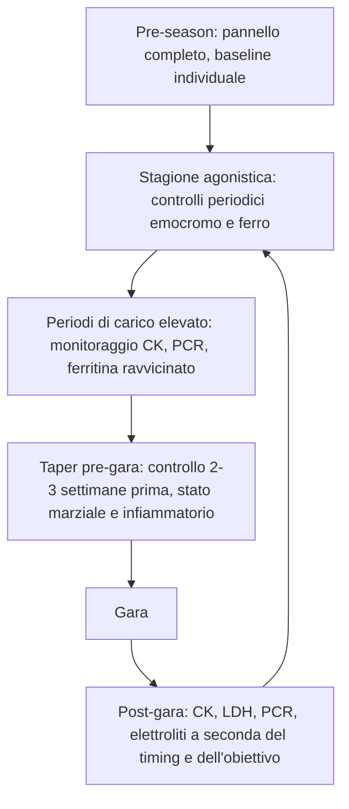

# Sezione 9 — Monitoraggio stagionale

*Vedi [[sezione-1-fondamenti-di-interpretazione]] per i principi generali di timing e variabilità, e le Sezioni 2-7 per il dettaglio dei singoli biomarcatori richiamati in questa sezione.*

---

### Perché il monitoraggio va pianificato per fase di stagione

#### Il principio guida

Un pannello ematico ha significato diverso a seconda della fase di stagione in cui viene eseguito: gli stessi valori che sarebbero preoccupanti in un periodo di scarico risultano spesso attesi in una fase di carico elevato, e viceversa. Pianificare il monitoraggio per fase di stagione, con obiettivi specifici per ciascuna fase, rende i controlli molto più informativi di una serie di prelievi eseguiti a intervalli regolari senza una logica legata alla programmazione dell'allenamento.

#### Struttura generale di un protocollo stagionale

| Fase | Obiettivo principale del controllo | Parametri prioritari |
|---|---|---|
| Pre-season | Stabilire il baseline individuale, screening di salute generale | Pannello completo: emocromo, ferro, funzione renale/epatica, elettroliti, vitamina D, profilo lipidico |
| Stagione agonistica (carico moderato-alto) | Monitoraggio del recupero e dello stato marziale | Emocromo, ferritina/TSAT, PCR, CK (se pertinente) |
| Periodi di carico molto elevato | Rilevare segnali precoci di carico eccessivo/scarso recupero | Emocromo, ferritina, PCR, CK/LDH, eventualmente rapporto T/C con le cautele discusse |
| Taper pre-gara | Verificare che l'atleta arrivi in condizioni ottimali | Emocromo, ferritina/TSAT, marker infiammatori (per esclusione di stati subclinici) |
| Post-gara | Valutare l'entità dello stress indotto dalla competizione e programmare il recupero | CK, LDH, PCR, elettroliti (specialmente in eventi di endurance prolungata) |

---

### Pre-season: costruire il baseline

#### Perché è la fase più importante del monitoraggio

Come discusso in [[sezione-1-fondamenti-di-interpretazione]], il confronto più informativo per molti parametri (in particolare quelli ad alta variabilità biologica come ferritina, CK, cortisolo, testosterone) è con il baseline individuale dell'atleta, non con il range di popolazione generale. La pre-season, in condizioni di carico relativamente basso rispetto al periodo agonistico, è il momento ideale per stabilire questo riferimento.

#### Cosa includere nel pannello di pre-season

- Emocromo completo con formula leucocitaria e reticolociti;
- pannello marziale completo (ferritina, sideremia, transferrina/TIBC, TSAT);
- PCR;
- funzione renale (creatinina, eGFR, urea) e funzione epatica (AST, ALT, GGT, bilirubina);
- elettroliti;
- vitamina D (particolarmente rilevante se lo screening avviene a fine inverno);
- profilo lipidico e glicemia, come screening metabolico generale;
- nelle atlete donne, valutazione dello stato mestruale come parte integrante della raccolta anamnestica.

#### Applicazione pratica

I valori di pre-season, raccolti in condizioni standardizzate (mattino, digiuno, distanza da sforzi intensi), costituiscono il riferimento individuale a cui confrontare i controlli successivi durante la stagione, in particolare per i parametri ad alta variabilità biologica.

---

### Stagione agonistica: monitoraggio del recupero e dello stato marziale

#### Obiettivo pratico

Durante la stagione, l'obiettivo principale del monitoraggio ematico si sposta dalla caratterizzazione generale della salute alla verifica che l'atleta stia recuperando adeguatamente dal carico di allenamento e gara, con particolare attenzione allo stato marziale, spesso progressivamente eroso dal volume di allenamento cronico e dalle perdite mestruali nelle atlete donne.

#### Frequenza indicativa dei controlli

Non esiste una frequenza universalmente valida; la frequenza va calibrata sul rischio individuale dell'atleta (sesso, volume di allenamento, disciplina, storia di sideropenia pregressa) e sulla durata della stagione. Nella pratica sportiva, controlli del pannello marziale ogni 6-12 settimane nelle popolazioni a rischio (atlete donne, sport di endurance ad alto volume) sono un intervallo frequentemente adottato, con evidenza principalmente di tipo pratico applicato più che di trial randomizzati specifici.

#### Segnali che giustificano un controllo aggiuntivo non programmato

- Calo prestativo inspiegato e persistente;
- affaticamento anomalo non giustificato dal carico recente;
- infezioni ricorrenti;
- alterazioni del ciclo mestruale nelle atlete donne;
- segnali soggettivi di scarso recupero riportati dall'atleta o rilevati da questionari di monitoraggio del carico.

---

### Periodi di carico elevato: rilevare segnali precoci

#### La sfida interpretativa specifica

Nei periodi di carico molto elevato (blocchi di volume, ritiri, doppie sedute), numerosi parametri (CK, PCR, leucociti, in parte anche ferritina come proteina di fase acuta) sono fisiologicamente elevati come risposta attesa allo stimolo allenante. La sfida in questa fase è distinguere una risposta adattativa attesa da un segnale di carico eccessivo rispetto alla capacità di recupero individuale, applicando i criteri discussi in [[sezione-1-fondamenti-di-interpretazione]] (andamento temporale, coerenza tra parametri, sintomatologia).

#### Pattern da monitorare con attenzione

| Pattern | Interpretazione |
|---|---|
| CK/PCR elevate ma in progressiva normalizzazione tra una sessione di carico e la successiva | Risposta attesa e recupero adeguato |
| CK/PCR che non si normalizzano tra sessioni successive, con trend in accumulo | Possibile segnale di carico eccessivo rispetto al recupero disponibile |
| Ferritina in calo progressivo su controlli successivi, anche senza anemia conclamata | Deplezione marziale progressiva, da intercettare prima che comprometta l'eritropoiesi |
| Rapporto neutrofili/linfociti elevato in modo persistente | Possibile indicatore aggiuntivo di stress cronico da carico, da integrare con altri segnali |

#### Applicazione pratica

In questa fase, il valore del monitoraggio ematico aumenta quando integrato con indicatori di carico interno ed esterno (RPE, volume, intensità) e con indicatori soggettivi di recupero, permettendo allo staff di distinguere un pattern coerente con la programmazione da un pattern che segnala la necessità di un aggiustamento del carico.

---

### Taper pre-gara: verificare le condizioni ottimali

#### Obiettivo del controllo in questa fase

Il taper è la fase in cui il carico di allenamento viene ridotto per permettere la piena espressione degli adattamenti accumulati e massimizzare la freschezza in vista della competizione. Un controllo ematico in questa fase ha l'obiettivo di escludere stati subclinici (infiammatori, marziali) che potrebbero compromettere la prestazione, in una finestra temporale in cui c'è ancora margine per un intervento correttivo mirato prima della gara.

#### Cosa privilegiare

- Emocromo e stato marziale, per verificare che non vi siano deplezioni non ancora intercettate;
- PCR, per escludere stati infiammatori subclinici;
- integrazione con lo stato soggettivo di recupero e la qualità del sonno, che in questa fase hanno pari o maggiore importanza del solo dato ematico.

#### Timing pratico

Il controllo va programmato con margine sufficiente prima della gara per permettere un eventuale intervento (es. supplementazione marziale, gestione di uno stato infiammatorio) — indicativamente 2-3 settimane prima, non a ridosso della competizione, quando un intervento correttivo non avrebbe più tempo per essere efficace.

---

### Post-gara: valutare lo stress indotto e programmare il recupero

#### Obiettivo del controllo

Dopo una competizione, specialmente se di endurance prolungata o particolarmente intensa, un controllo mirato può aiutare a quantificare l'entità dello stress fisiologico indotto e a programmare la durata e le modalità del recupero successivo, oltre a intercettare eventuali condizioni acute (disidratazione severa, iponatriemia, rabdomiolisi) che richiedono attenzione medica immediata.

#### Parametri prioritari

- CK e LDH, per l'entità del danno muscolare indotto dalla gara;
- PCR, per l'entità della risposta infiammatoria;
- elettroliti (sodio in particolare), specialmente in eventi di ultra-endurance o condizioni climatiche estreme, per il rischio di iponatriemia o disidratazione severa (vedi [[sezione-6-biomarcatori-vitamine-micronutrienti-ed-elettroliti]]);
- funzione renale, in caso di sospetta rabdomiolisi severa.

#### Timing del controllo

Il timing dipende dall'obiettivo: un controllo nelle ore immediatamente successive alla gara è indicato principalmente per l'esclusione di condizioni acute pericolose (iponatriemia sintomatica, rabdomiolisi severa); un controllo a 24-72 ore è più indicato per quantificare l'entità del danno muscolare e infiammatorio e programmare il recupero, poiché CK, LDH e PCR raggiungono tipicamente il picco in questa finestra dopo sforzi prolungati.

#### Applicazione pratica

Un pattern di recupero post-gara atipico rispetto alla storia individuale dell'atleta (es. normalizzazione di CK/PCR molto più lenta del solito) può fornire informazioni utili per la programmazione del carico nelle settimane successive, ed eventualmente per approfondimenti se il pattern persiste in modo anomalo.

---

### Sintesi: un calendario tipo di monitoraggio stagionale

---

### Errori comuni nel monitoraggio stagionale

- Eseguire controlli a intervalli fissi senza una logica legata alla fase di stagione e al carico recente;
- non stabilire un baseline individuale in pre-season, perdendo il riferimento più informativo per i parametri ad alta variabilità biologica;
- interpretare i valori di un periodo di carico elevato con gli stessi criteri di un periodo di scarico;
- programmare il controllo pre-gara troppo a ridosso della competizione, senza margine per un intervento correttivo;
- non integrare il dato ematico con indicatori di carico interno/esterno e con indicatori soggettivi di recupero.

---

### Take Home Messages

- Il monitoraggio ematico va pianificato per fase di stagione, con obiettivi specifici per ciascuna fase.
- La pre-season è il momento chiave per stabilire il baseline individuale dell'atleta.
- Nei periodi di carico elevato, la distinzione tra risposta adattativa attesa e segnale di carico eccessivo richiede sempre il criterio del trend, non del valore singolo.
- Il controllo pre-gara va programmato con margine sufficiente per un eventuale intervento correttivo.
- Il controllo post-gara ha timing diverso a seconda dell'obiettivo (esclusione di condizioni acute vs quantificazione del recupero).
- Il dato ematico ha il massimo valore quando integrato con indicatori di carico e con indicatori soggettivi di recupero, mai utilizzato isolatamente.

---

*Prosegui con [[sezione-10-differenze-tra-sport]] per le differenze di interpretazione tra discipline sportive.*
