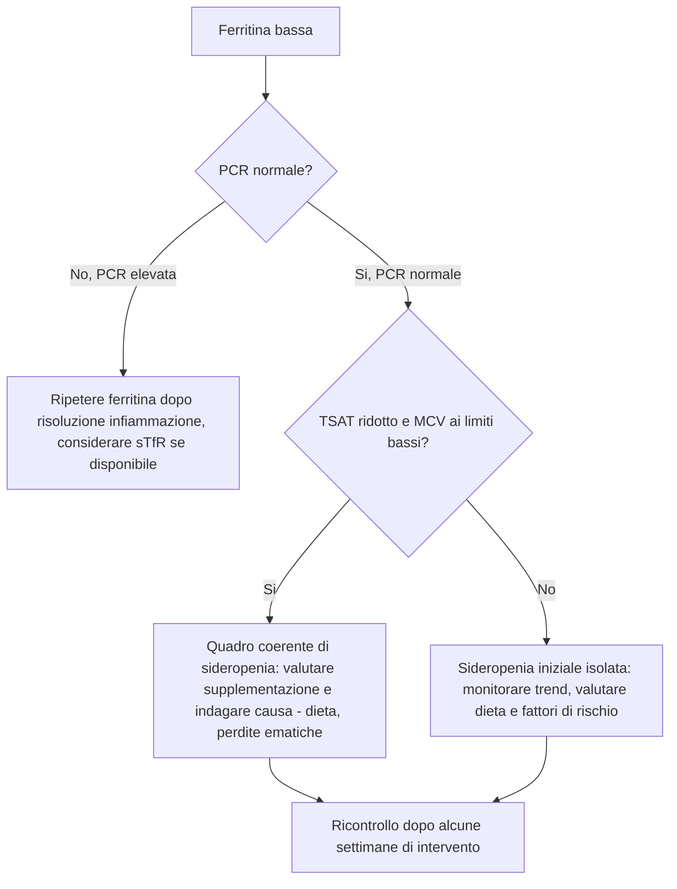
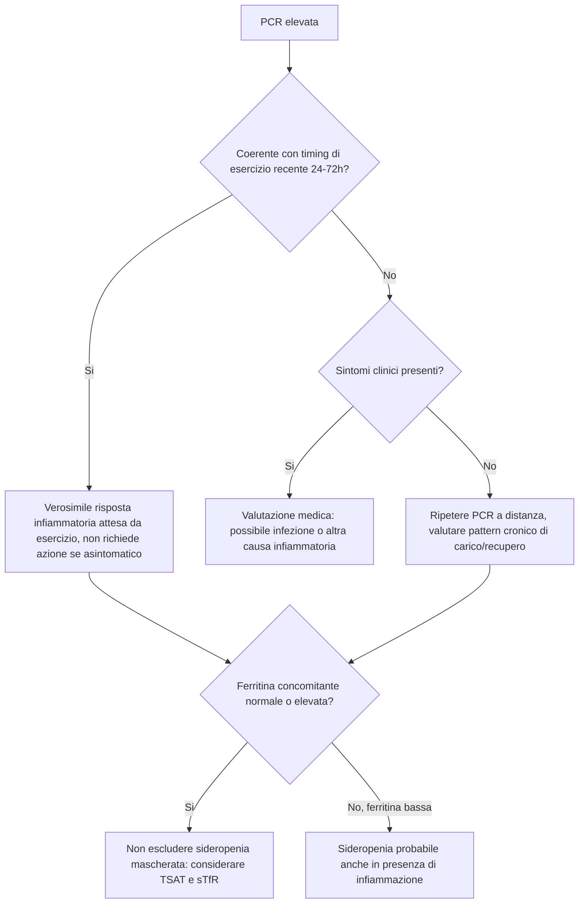
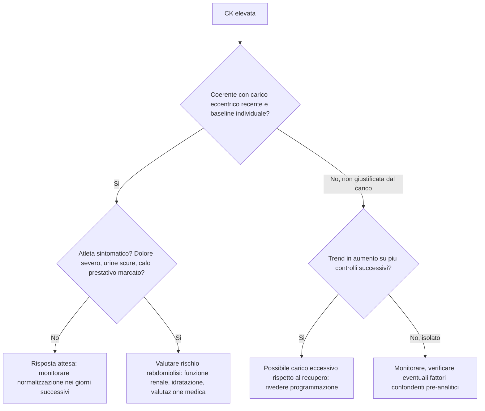
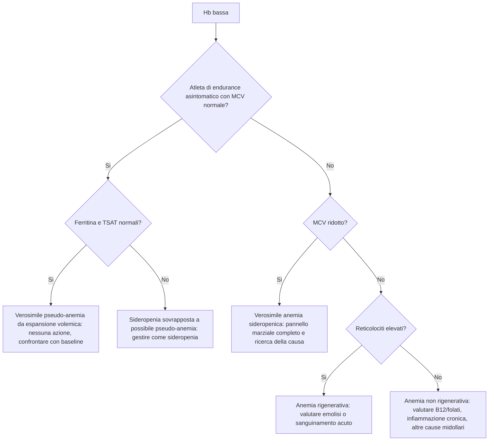
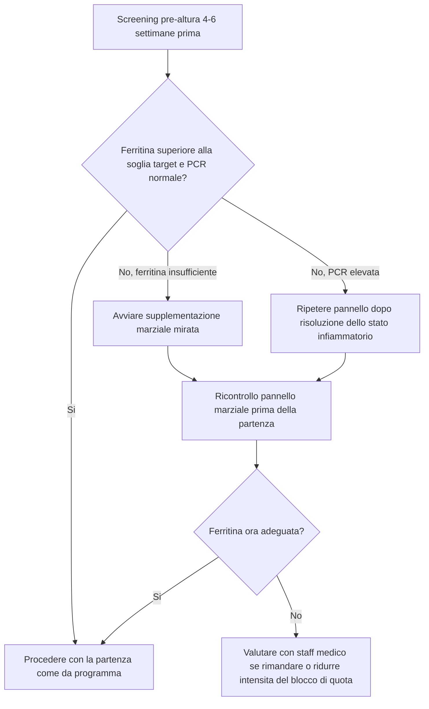

# Sezione 11 — Algoritmi decisionali

*Le flow chart di questa sezione sintetizzano i ragionamenti sviluppati nelle Sezioni 2-9 e non sostituiscono la lettura dei capitoli dedicati, richiamati in ciascun algoritmo. Sono strumenti di supporto rapido alla decisione, non protocolli diagnostici autosufficienti.*

---

### Ferritina bassa: cosa controllare?

#### Ragionamento alla base dell'algoritmo

Una ferritina bassa isolata richiede sempre di essere contestualizzata con lo stato infiammatorio (PCR) e con gli altri indicatori del quadro marziale, prima di essere considerata conclusiva. Vedi [[sezione-3-biomarcatori-metabolismo-del-ferro]] per il dettaglio completo.

---

### PCR alta: come interpretare la ferritina?

#### Ragionamento alla base dell'algoritmo

La PCR elevata è il primo elemento da valutare prima di interpretare una ferritina normale o elevata, poiché la ferritina è una proteina di fase acuta positiva. Vedi [[sezione-4-biomarcatori-infiammazione-e-danno-muscolare]] e [[sezione-3-biomarcatori-metabolismo-del-ferro]].

---

### CK elevata: danno muscolare atteso o problema?

#### Ragionamento alla base dell'algoritmo

L'elemento chiave è sempre il confronto con il baseline individuale e la coerenza con il tipo di allenamento svolto nelle 24-72 ore precedenti. Vedi [[sezione-4-biomarcatori-infiammazione-e-danno-muscolare]].

---

### Hb bassa: quali passi successivi?

#### Ragionamento alla base dell'algoritmo

La distinzione principale è tra pseudo-anemia da espansione volemica (adattamento atteso nell'endurance) e anemia vera, da caratterizzare poi per tipo (rigenerativa vs non rigenerativa, microcitica vs normo/macrocitica). Vedi [[sezione-2-biomarcatori-emocromo]] e [[sezione-3-biomarcatori-metabolismo-del-ferro]].

---

### Atleta pronto per l'altura?

#### Ragionamento alla base dell'algoritmo

Prima di un blocco di allenamento in altitudine, lo stato marziale e infiammatorio dell'atleta condiziona l'efficacia dell'adattamento eritropoietico atteso. Vedi [[sezione-8-preparazione-e-risposta-all-altura]] per il dettaglio completo.

---

### Come usare questi algoritmi nella pratica

- Ogni algoritmo è un punto di partenza per orientare il ragionamento, non un sostituto della valutazione clinica completa né della consultazione con il medico dello sport nei casi dubbi o sintomatici.
- Il criterio del trend nel tempo e della coerenza tra parametri, discusso in [[sezione-1-fondamenti-di-interpretazione]], resta sempre prioritario rispetto alla lettura isolata di un singolo nodo decisionale.
- La presenza di sintomi clinici significativi deve sempre portare a una valutazione medica, indipendentemente dal percorso indicato dall'algoritmo.

---

*Prosegui con [[sezione-12-casi-pratici-emocromo-e-metabolismo-del-ferro]] per i casi pratici commentati, che applicano questi algoritmi a scenari realistici.*
