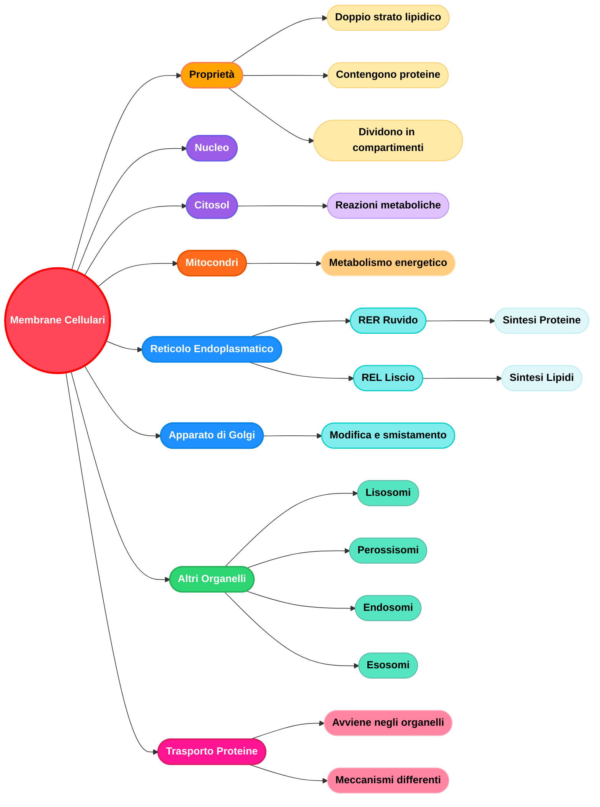
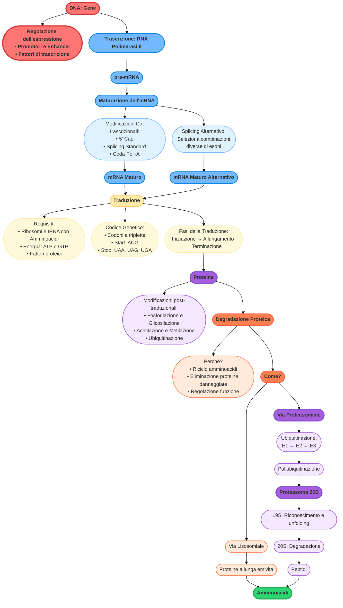

# Indice

Capitolo 1.1

```mermaid
graph LR
    classDef default fill:#f9f9f9,stroke:#333,stroke-width:1px,color:#000;
    
    %% NODO CENTRALE (Fucsia/Rosso Intenso)
    classDef root fill:#FF4757,stroke:#FF0000,stroke-width:3px,font-weight:bold,color:#fff;
    
    %% RAMO PROPRIETÀ (Giallo/Arancio -> Giallo Chiaro -> Giallo Chiarissimo)
    classDef propL1 fill:#FFA502,stroke:#FF7F50,stroke-width:2px,font-weight:bold,color:#000;
    classDef propL2 fill:#FFEAA7,stroke:#FDCB6E,stroke-width:1px,color:#000;

    %% RAMO NUCLEO (Viola -> Lilla -> Lilla Chiarissimo)
    classDef nucL1 fill:#9B5DE5,stroke:#6C5CE7,stroke-width:2px,font-weight:bold,color:#fff;
    classDef nucL2 fill:#E0C3FC,stroke:#B388FF,stroke-width:1px,color:#000;

    %% RAMO MITOCONDRI (Arancione Intenso -> Arancione Chiaro -> Arancione Chiarissimo)
    classDef mitL1 fill:#FF6B1A,stroke:#E65100,stroke-width:2px,font-weight:bold,color:#fff;
    classDef mitL2 fill:#FFCC80,stroke:#FFE0B2,stroke-width:1px,color:#000;

    %% RAMO RETICOLO/GOLGI (Azzurro/Blu -> Turchese -> Celeste Chiarissimo)
    classDef retL1 fill:#1E90FF,stroke:#0984E3,stroke-width:2px,font-weight:bold,color:#fff;
    classDef retL2 fill:#81ECEC,stroke:#00CEC9,stroke-width:1.5px,color:#000;
    classDef retL3 fill:#E0F7FA,stroke:#B2EBF2,stroke-width:1px,color:#000;

    %% RAMO ORGANELLI (Verde Smeraldo -> Verde Menta -> Verde Chiarissimo)
    classDef orgL1 fill:#2ED573,stroke:#26AF58,stroke-width:2px,font-weight:bold,color:#fff;
    classDef orgL2 fill:#55E6C1,stroke:#58B19F,stroke-width:1px,color:#000;

    %% RAMO TRASPORTO (Rosa Acceso -> Rosa Pastello -> Rosa Chiarissimo)
    classDef traL1 fill:#FF1493,stroke:#D81B60,stroke-width:2px,font-weight:bold,color:#fff;
    classDef traL2 fill:#FF85A2,stroke:#FFB7C5,stroke-width:1px,color:#000;

    MC((Membrane Cellulari)):::root

    %% Proprietà (Sfuma verso il giallo chiaro)
    MC --> Prop([Proprietà]):::propL1
    Prop --> P1([Doppio strato lipidico]):::propL2
    Prop --> P2([Contengono proteine]):::propL2
    Prop --> P3([Dividono in compartimenti]):::propL2

    %% Nucleo & Citosol (Sfuma verso il lilla)
    MC --> N([Nucleo]):::nucL1
    MC --> Cit([Citosol]):::nucL1
    Cit --> CitD([Reazioni metaboliche]):::nucL2

    %% Mitocondri (Sfuma verso l'arancione chiarissimo)
    MC --> Mit([Mitocondri]):::mitL1
    Mit --> Mit1([Metabolismo energetico]):::mitL2

    %% Reticolo ed Apparato di Golgi (Sfumatura a 3 livelli: Blu -> Turchese -> Celeste)
    MC --> RE([Reticolo Endoplasmatico]):::retL1
    RE --> RER([RER Ruvido]):::retL2
    RE --> REL([REL Liscio]):::retL2
    RER --> RER1([Sintesi Proteine]):::retL3
    REL --> REL1([Sintesi Lipidi]):::retL3
    
    MC --> G([Apparato di Golgi]):::retL1
    G --> G1([Modifica e smistamento]):::retL2

    %% Altri Organelli (Sfuma verso il verde menta chiaro)
    MC --> Org([Altri Organelli]):::orgL1
    Org --> O1([Lisosomi]):::orgL2
    Org --> O2([Perossisomi]):::orgL2
    Org --> O3([Endosomi]):::orgL2
    Org --> O4([Esosomi]):::orgL2

    %% Meccanismi di Trasporto (Sfuma verso il rosa chiarissimo)
    MC --> T([Trasporto Proteine]):::traL1
    T --> T1([Avviene negli organelli]):::traL2
    T --> T2([Meccanismi differenti]):::traL2
```

Capitolo 1.2

```mermaid
%%{init: {
  'theme': 'base',
  'themeVariables': {
    'fontSize': '15px',
    'fontFamily': 'arial'
  },
  'flowchart': {
    'nodeSpacing': 20,
    'rankSpacing': 35,
    'padding': 12
  }
}}%%
graph TD
    %% =========================================================================
    %% DEFINIZIONE STILI (Coerenza cromatica per ogni macro-fase biologica)
    %% =========================================================================
    classDef dna fill:#ff7675,stroke:#d63031,stroke-width:3px,font-weight:bold;
    classDef rna fill:#74b9ff,stroke:#0984e3,stroke-width:2px,font-weight:bold;
    classDef rnaL2 fill:#e0f2fe,stroke:#74b9ff,stroke-width:1.5px;
    
    classDef trad fill:#ffeaa7,stroke:#fdcb6e,stroke-width:2px,font-weight:bold;
    classDef tradL2 fill:#fff9db,stroke:#ffeaa7,stroke-width:1.5px;

    classDef prot fill:#a55edd,stroke:#8854d0,stroke-width:3px,font-weight:bold;
    classDef protL2 fill:#f3e8ff,stroke:#a55edd,stroke-width:1.5px;

    classDef deg fill:#ff7f50,stroke:#ff6348,stroke-width:2px,font-weight:bold;
    classDef degL2 fill:#ffeadb,stroke:#ff7f50,stroke-width:1.5px;

    classDef endG fill:#2ed573,stroke:#26af58,stroke-width:3px,font-weight:bold;

    %% =========================================================================
    %% FLUSSO CONTINUO DAL GENE ALLA DEGRADAZIONE
    %% =========================================================================

    A(["DNA: Gene"]):::dna
    
    %% Regolazione del Gene (Compattata in un unico blocco per non allargare)
    A --> B(["Regolazione dell'espressione<br/>• Promotori e Enhancer<br/>• Fattori di trascrizione"]):::dna

    %% Trascrizione
    A --> C(["Trascrizione: RNA Polimerasi II"]):::rna
    C --> D(["pre-mRNA"]):::rna

    %% Maturazione mRNA (Flusso standard e alternativo)
    D --> E(["Maturazione dell'mRNA"]):::rna
    E --> E_Std(["Modificazioni Co-trascrizionali:<br/>• 5' Cap<br/>• Splicing Standard<br/>• Coda Poli-A"]):::rnaL2
    E --> E_Alt(["Splicing Alternativo:<br/>Seleziona combinazioni<br/>diverse di esoni"]):::rnaL2

    E_Std --> F(["mRNA Maturo"]):::rna
    E_Alt --> F_Alt(["mRNA Maturo Alternativo"]):::rna

    %% Traduzione
    F --> G(["Traduzione"]):::trad
    F_Alt --> G

    G --> G_Comp(["Requisiti:<br/>• Ribosomi e tRNA con Amminoacidi<br/>• Energia: ATP e GTP<br/>• Fattori proteici"]):::tradL2
    
    G --> G_Cod(["Codice Genetico:<br/>• Codoni a triplette<br/>• Start: AUG<br/>• Stop: UAA, UAG, UGA"]):::tradL2

    G --> G_Fasi(["Fasi della Traduzione:<br/>Iniziazione → Allungamento → Terminazione"]):::tradL2

    %% Proteina
    G_Fasi --> H(["Proteina"]):::prot
    
    %% Modificazioni Post-Traduzionali
    H --> I(["Modificazioni post-traduzionali:<br/>• Fosforilazione e Glicosilazione<br/>• Acetilazione e Metilazione<br/>• Ubiquitinazione"]):::protL2

    %% Destino Finale: Degradazione
    H --> J(["Degradazione Proteica"]):::deg

    %% Perché e Come (Ispirato al tuo schema perfetto)
    J --> J_Perche(["Perché?<br/>• Riciclo amminoacidi<br/>• Eliminazione proteine danneggiate<br/>• Regolazione funzione"]):::degL2
    
    J --> J_Come(["Come?"]):::deg
    
    J_Come --> K(["Via Lisosomiale"]):::degL2
    J_Come --> L(["Via Proteasomiale"]):::prot

    %% Sotto-flusso 1: Lisosoma
    K --> K1(["Proteine a lunga emivita"]):::degL2
    K1 --> O(["Amminoacidi"]):::endG

    %% Sotto-flusso 2: Proteasoma (La cascata lineare e corretta)
    L --> L1(["Ubiquitinazione:<br/>E1 → E2 → E3"]):::protL2
    L1 --> L2(["Poliubiquitinazione"]):::protL2
    L2 --> M(["Proteasoma 26S"]):::prot
    M --> M1(["19S: Riconoscimento e unfolding"]):::protL2
    M1 --> M2(["20S: Degradazione"]):::protL2
    M2 --> N(["Peptidi"]):::protL2
    N --> O
```