# Indice

## Capitolo 1.1 — Membrane cellulari e organelli

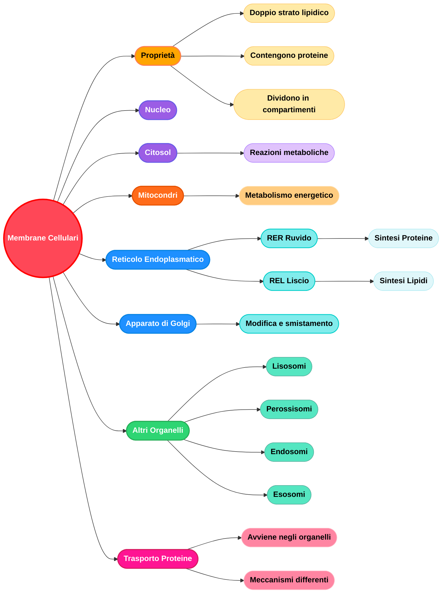

## Capitolo 1.2 — Il codice della vita: dal gene alla proteina

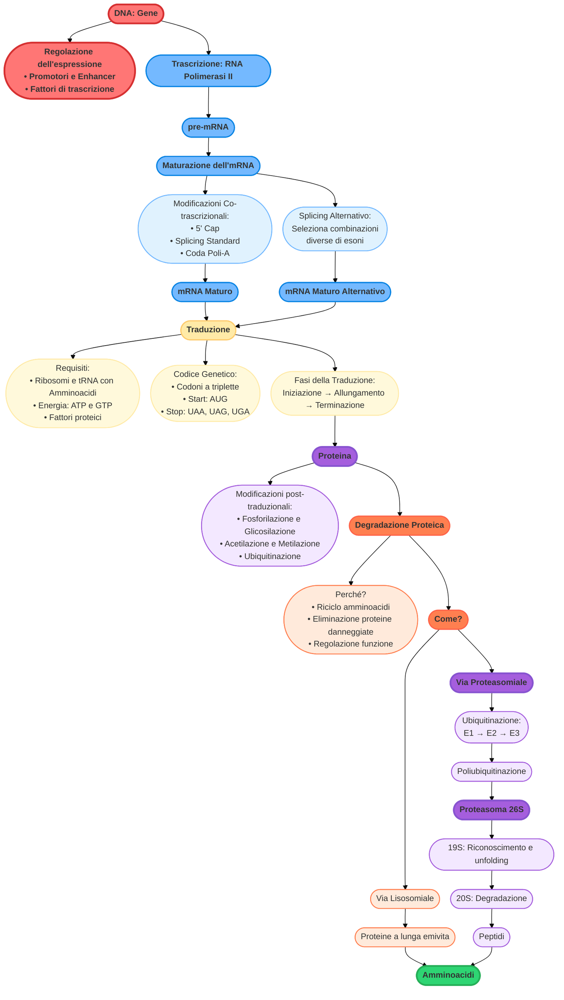

## Capitolo 1.3 — Cell Signaling

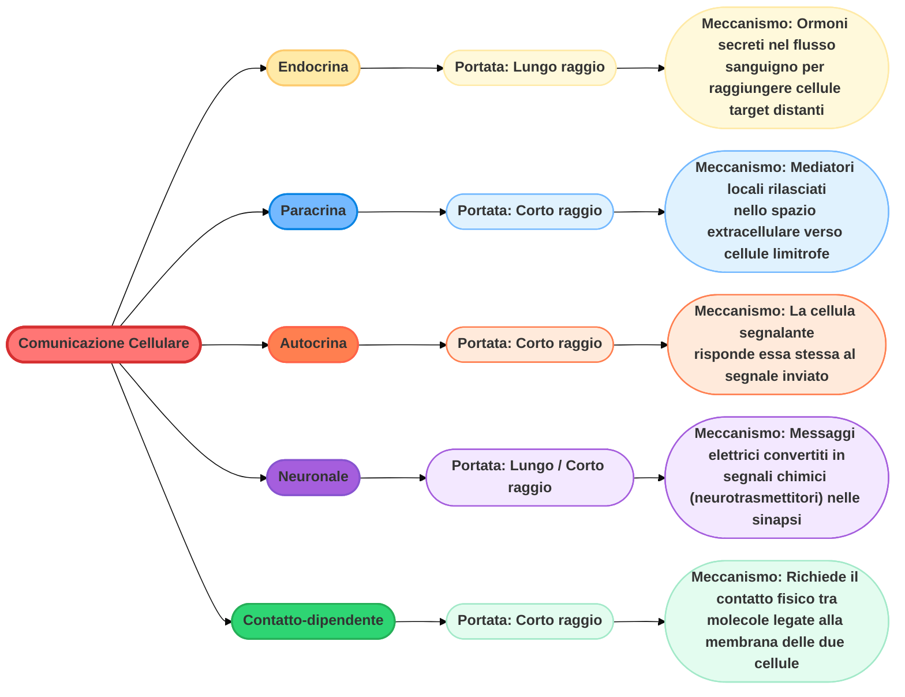

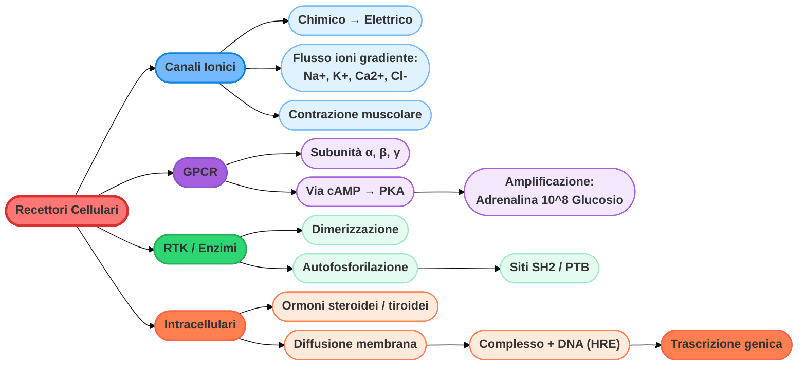

## Capitolo 2 — Omeostasi durante l'esercizio fisico

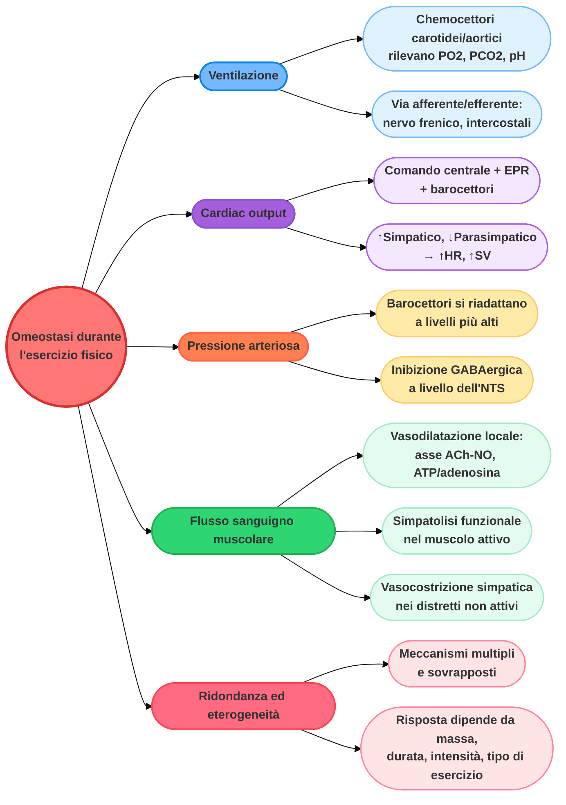

## Capitolo 3 — Risposta mitocondriale all'esercizio di endurance

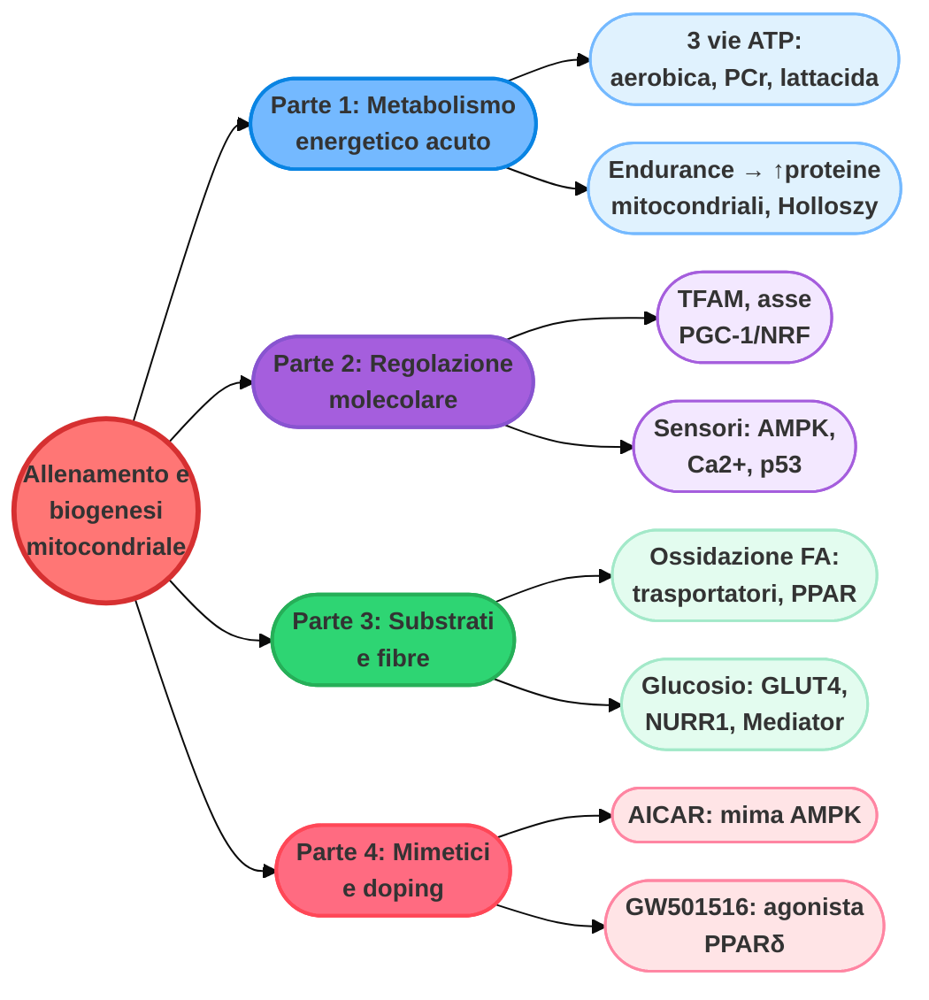

## Capitolo 4 — Risposta ipertrofica all'esercizio

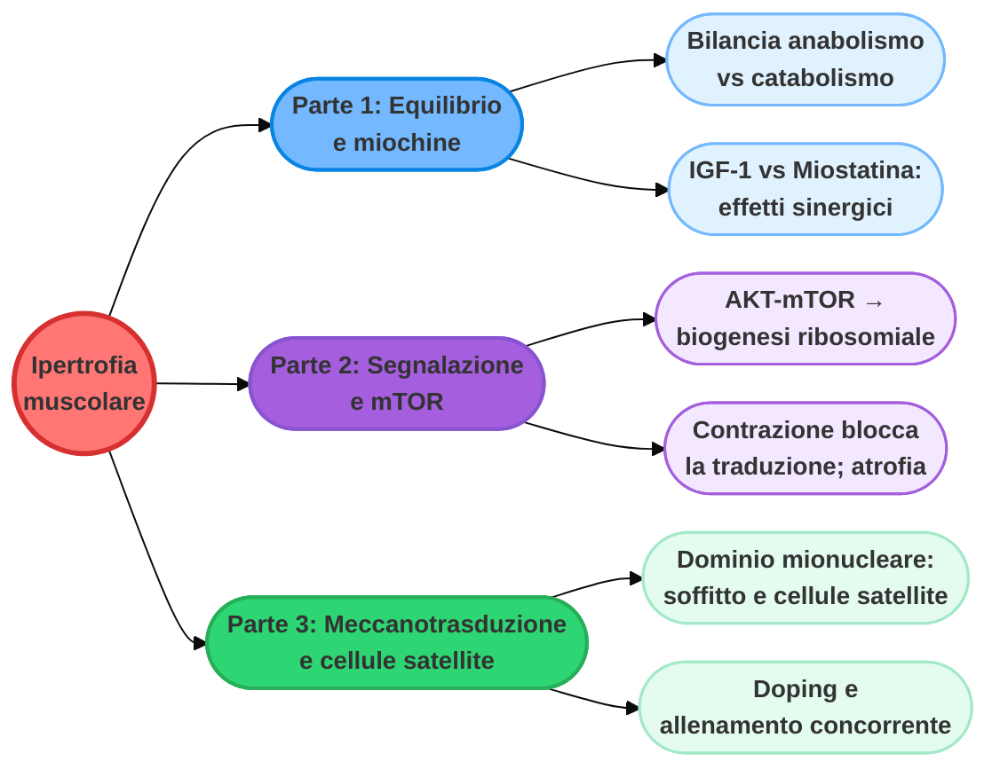

## Capitolo 5 — Ipossia: adattamenti fisiologici e sistema respiratorio

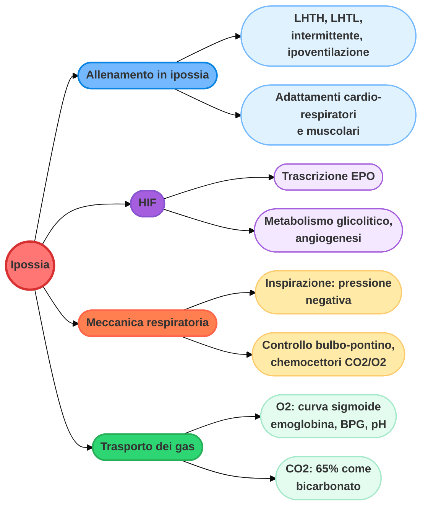

## Capitolo 6 — Esercizio fisico e cervello: BDNF

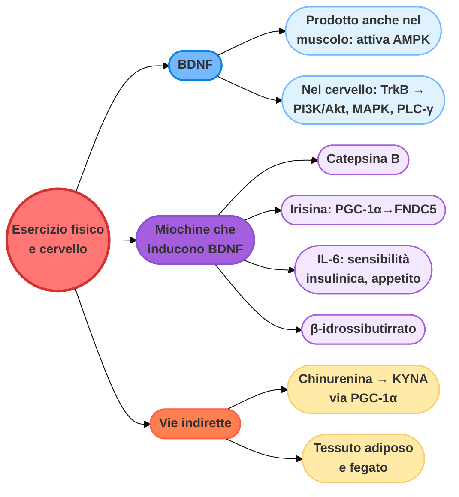

## Capitolo 7 — Ipossia molecolare: HIF-1α

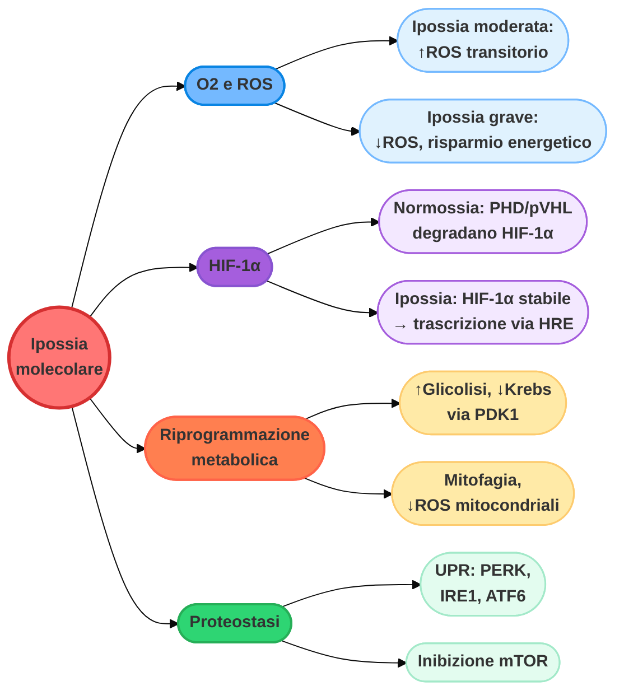

## Capitolo 8 — Ipossia e attività fisica nel muscolo scheletrico

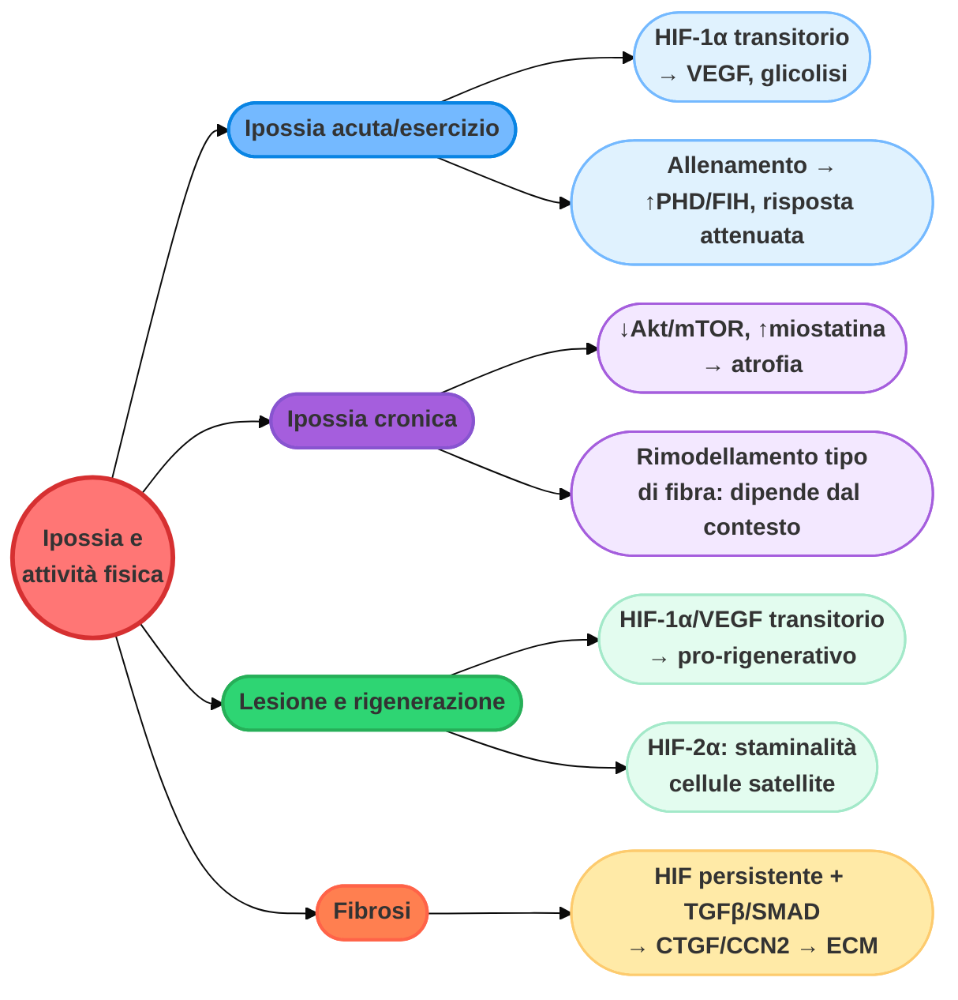

## Capitolo 9 — Adattamento sistemico all'alta quota

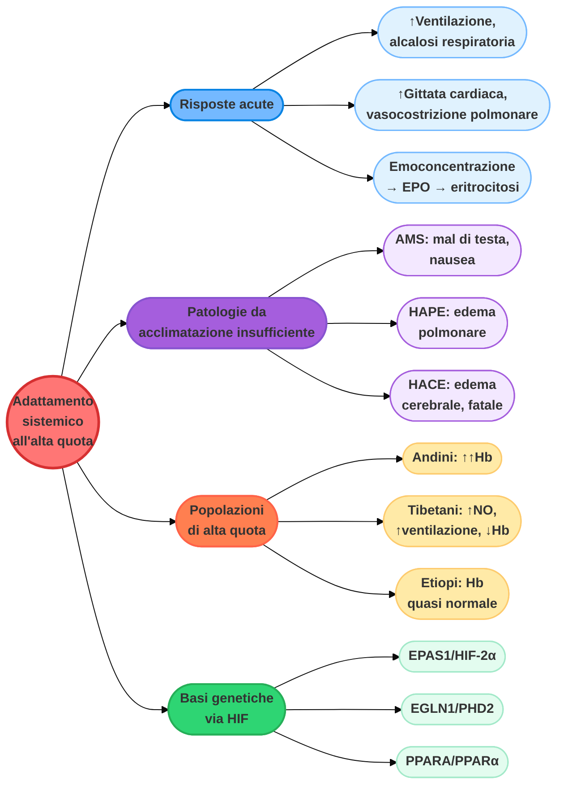