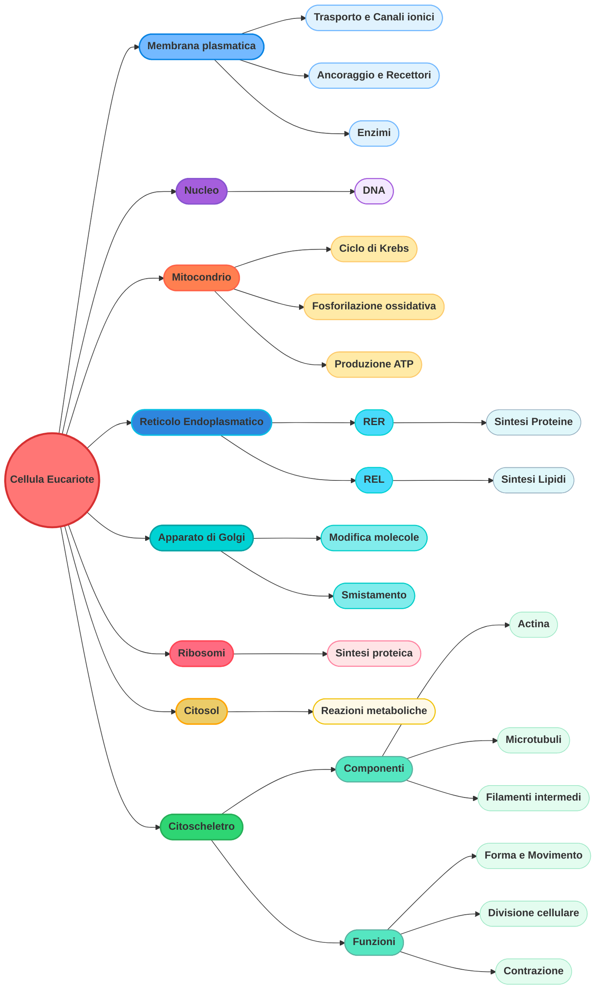
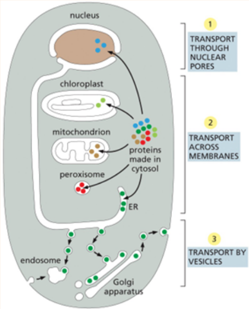
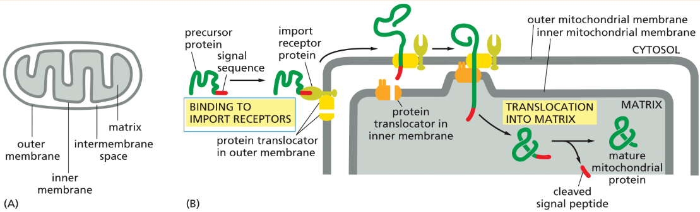
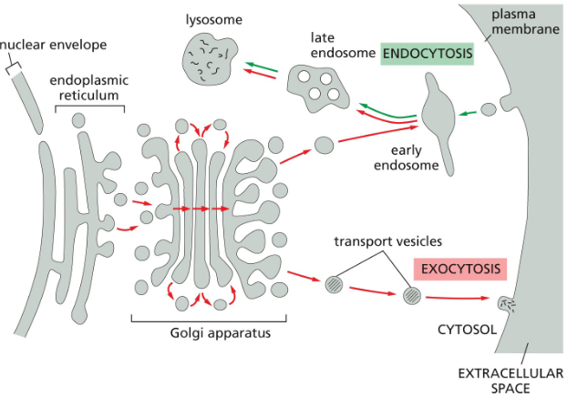
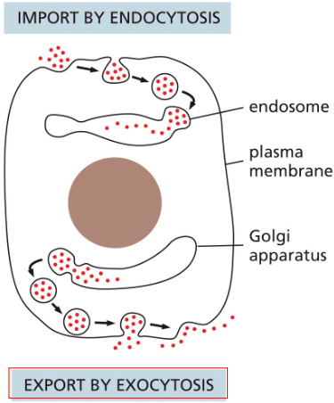
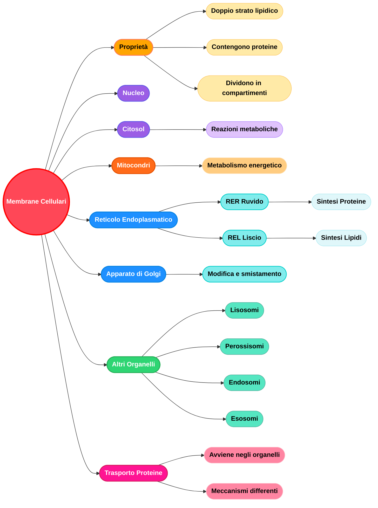

# Cellula: l'unità base della vita

## Introduzione cellulare

Tutti gli organismi sono costituiti da **cellule**. Le cellule viventi sono insiemi di **reazioni catalitiche** in grado di **autoriprodursi**.

Distinguiamo principalmente **2 tipi di cellule**: **procariote** ed **eucariote**.

- ***Cellule procariote***: tipiche dei batteri e delle archea, non presentano **nucleo**, **organelli con membrana**, **citoscheletro**... *Non tratteremo queste.*
- ***Cellule eucariote***: si ha **nucleo** rivestito con la sua **membrana nucleare**. Contiene il **DNA**. Si hanno anche **organelli con membrana** nel citoplasma, **citoscheletro** ecc. Esse sono racchiuse all'interno di una **membrana a doppio strato fosfolipidico**, in cui sono immerse proteine. Le **proteine di membrana** svolgono ruoli molto importanti. Tra di esse:

    - ***Proteine di trasporto*** (es. pompa del Na+/K+): trasportano attivamente specifici ioni o molecole attraverso la **membrana plasmatica**. Ad esempio, la pompa del sodio espelle gli ioni Na+ dalla cellula, contribuendo al mantenimento del **potenziale di membrana** e dell'**omeostasi cellulare**.
    - ***Canali ionici*** (es. canale del K+): formano pori selettivi che consentono il passaggio di specifici ioni secondo il loro **gradiente elettrochimico**. Ad esempio, i canali del potassio permettono la fuoriuscita degli ioni K+ dalla cellula.
    - ***Proteine di ancoraggio*** (es. integrine): collegano il **citoscheletro intracellulare**, in particolare i filamenti di **actina**, con le proteine della **matrice extracellulare**, garantendo **adesione**, **supporto meccanico** e **trasmissione di segnali**.
    - ***Recettori*** (es. recettore per il PDGF): riconoscono e legano specifiche molecole di **segnalazione extracellulare**. Il legame con il **PDGF** (*Platelet-Derived Growth Factor*), ad esempio, attiva una **cascata di segnali intracellulari** che promuove la **crescita** e la **divisione cellulare**.
    - ***Enzimi*** (es. adenilato ciclasi): catalizzano reazioni sulla superficie della membrana o ad essa associate. L'adenilato ciclasi, in risposta a specifici **segnali extracellulari**, catalizza la formazione dell'**AMP ciclico (cAMP)**, un importante **secondo messaggero** coinvolto nella **trasduzione del segnale**.

---

### Nucleo

Il nucleo è presente, come già detto, **solo** nelle **cellule eucariote**. È il **magazzino delle informazioni**, contiene la maggior parte del **DNA**.

---

### Mitocondri

I mitocondri derivano dall'evoluzione di **batteri inglobati**. Sono strutture **dinamiche** in termini di allocazione e numero. Si duplicano attraverso il processo di **fissione** e contengono del **DNA mitocondriale**.

#### Struttura del mitocondrio

I mitocondri sono formati da una **membrana esterna** ed una **membrana interna**, con uno spazio tra di esse chiamato *spazio intermembrana*. Presentano inoltre una **matrice mitocondriale**.

- ***Matrice mitocondriale***: è lo spazio interno delimitato dalla **membrana interna**. Contiene una soluzione altamente concentrata di **enzimi**, tra cui quelli coinvolti nell'**ossidazione del piruvato**, degli **acidi grassi** e quelli del **ciclo dell'acido citrico (ciclo di Krebs)**. Sono inoltre presenti il **DNA mitocondriale**, **ribosomi** e **tRNA**, che consentono al mitocondrio di sintetizzare parte delle proprie proteine.
- ***Membrana interna***: è fortemente ripiegata a formare numerose **creste mitocondriali**, che aumentano notevolmente la superficie disponibile per le reazioni metaboliche. Ospita i complessi della **catena di trasporto degli elettroni**, l'**ATP sintasi**, responsabile della sintesi di **ATP**, e numerose **proteine di trasporto** che regolano il passaggio selettivo di molecole tra matrice e citosol.
- ***Membrana esterna***: delimita il mitocondrio ed è relativamente permeabile grazie alla presenza delle **porine**, proteine canale che consentono il passaggio di molecole con massa molecolare inferiore a circa **5.000 Dalton**.
- ***Spazio intermembrana***: è lo spazio compreso tra la membrana esterna e quella interna. Contiene enzimi coinvolti nel **metabolismo dei nucleotidi** e numerose proteine che, se rilasciate nel citoplasma, partecipano all'attivazione dell'**apoptosi** (*morte cellulare programmata*).

#### Funzioni del mitocondrio

Il mitocondrio è il principale organello deputato alla **produzione di energia** nella cellula, convertendo l'energia chimica contenuta nei nutrienti in **ATP (adenosina trifosfato)**, la principale **valuta energetica cellulare**.

Le due principali fasi di questo processo sono:

1. ***Ciclo di Krebs (o ciclo dell'acido citrico)***: si svolge nella **matrice mitocondriale**. In questa fase, le molecole derivate dal metabolismo di **carboidrati**, **lipidi** e, in parte, **proteine** vengono completamente ossidate, con produzione di:

    - **anidride carbonica (CO₂)**;
    - **coenzimi ridotti (NADH e FADH₂)**, che immagazzinano **elettroni ad alta energia**.

2. ***Fosforilazione ossidativa***: avviene sulla **membrana interna**. Gli elettroni trasportati da **NADH** e **FADH₂** vengono trasferiti lungo la **catena di trasporto degli elettroni**, liberando energia che viene utilizzata per pompare **protoni (H⁺)** nello **spazio intermembrana**. Il **gradiente protonico** così generato costituisce una forma di **energia potenziale** che alimenta l'**ATP sintasi**, un complesso enzimatico capace di sintetizzare grandi quantità di **ATP** a partire da **ADP** e **fosfato inorganico**.

---

### Reticolo endoplasmatico e apparato del Golgi

> **Differenza principale:** il **reticolo endoplasmatico (RE)** è in continuità con la membrana esterna dell'involucro nucleare, mentre l'**apparato del Golgi** è un organello distinto, formato da cisterne membranose appiattite e privo di continuità con la membrana nucleare.

#### Reticolo endoplasmatico (RE)

Il **reticolo endoplasmatico (RE)** è un sistema di membrane intracellulari continuo con l'involucro nucleare. Si distingue in:

- **Reticolo endoplasmatico rugoso (RER):** presenta ribosomi associati alla membrana.
- **Reticolo endoplasmatico liscio (REL):** è privo di ribosomi.

##### Funzioni principali

- Sintesi dei lipidi (REL).
- Sintesi delle proteine destinate alla secrezione, alla membrana o ad altri organelli (RER).
- Prime modificazioni post-traduzionali (es. glicosilazione).
- Trasporto delle proteine verso l'apparato del Golgi.

##### Sintesi e maturazione delle proteine

La sintesi proteica inizia sui ribosomi liberi.

- Le proteine destinate al **citosol** vengono sintetizzate completamente su ribosomi liberi.
- Le proteine destinate alla **secrezione**, alla **membrana** o ad altri organelli possiedono una **sequenza segnale** che dirige il ribosoma al **RER**.

Nel RER la proteina entra nel lume durante la sintesi e subisce le prime modificazioni, tra cui la **N-glicosilazione**, cioè l'aggiunta di oligosaccaridi a residui di **asparagina**. Questa modifica è essenziale per il corretto ripiegamento, la stabilità e lo smistamento della proteina.

#### Apparato del Golgi

L'**apparato del Golgi** riceve le proteine provenienti dal RE tramite vescicole di trasporto, le modifica ulteriormente, le seleziona e le indirizza verso la loro destinazione finale.

##### Funzioni principali

- Completamento delle modificazioni di proteine e lipidi.
- Selezione e smistamento delle molecole.
- Formazione di vescicole di trasporto.
- Invio delle proteine alla membrana plasmatica, ai lisosomi o ad altri compartimenti cellulari.

Il Golgi rappresenta quindi il principale **centro di elaborazione, smistamento e distribuzione** dei prodotti sintetizzati nel reticolo endoplasmatico.

---

### Ribosomi

Si trovano sparsi: nel citoplasma, nei mitocondri, nel nucleo, nei perossisomi, nel RER.

> **Esistono ribosomi liberi nel citoplasma e ribosomi uniti al reticolo endoplasmatico. Le proteine vengono sintetizzane nei ribosomi legati al RE.**

### Altri organelli

Oltre a quelli già citati, vi sono:

- Lisosomi;
- Perossisomi;
- Vescicole trasportatrici.

### Citosol e citoscheletro

Il **citosol** è un **gel acquoso altamente concentrato**, costituito da molecole di grandi e piccole dimensioni, tra cui numerose proteine. Si tratta di una componente **estremamente dinamica**, nella quale le molecole sono in continuo movimento e interagiscono per catalizzare le numerose reazioni biochimiche necessarie alla vita della cellula.

Gli **organelli intracellulari** sono immersi e dispersi nel citosol, che insieme a essi costituisce il **citoplasma**.

Dispersa nel citoplasma è presente una rete di proteine che forma il **citoscheletro**, responsabile del mantenimento della forma della cellula, della sua organizzazione interna e di numerose funzioni dinamiche. Il citoscheletro è costituito da tre principali componenti:

- **Filamenti di actina**
- **Microtubuli**
- **Filamenti intermedi**

Il citoscheletro è collegato alla **membrana plasmatica** attraverso specifiche proteine, che spesso fungono da ponte con la **matrice extracellulare** (ad esempio le **integrine**).

Oltre a fornire supporto strutturale, il citoscheletro svolge funzioni essenziali in numerosi processi cellulari. Ad esempio:

- i **microtubuli** sono fondamentali per la **segregazione dei cromosomi** durante la divisione cellulare;
- i **filamenti di actina** partecipano ai movimenti cellulari e sono indispensabili per la **contrazione muscolare**.

---

### Riassunto tabellare

| Compartimento | Funzione principale |
| :--- | :--- |
| **Citosol** | Contiene molte vie metaboliche; sintesi proteica; il citoscheletro. |
| **Nucleo** | Contiene il genoma principale; sintesi di DNA e RNA. |
| **Reticolo endoplasmatico (RE)** | Sintesi della maggior parte dei lipidi; sintesi di proteine da distribuire a molti organelli e alla membrana plasmatica. |
| **Apparato di Golgi** | Modifica, smistamento e confezionamento di proteine e lipidi sia per la secrezione sia per l'invio a un altro organello. |
| **Lisosomi** | Degradazione intracellulare. |
| **Endosomi** | Smistamento del materiale endocitato. |
| **Mitocondri** | Sintesi di ATP tramite fosforilazione ossidativa. |
| **Cloroplasti** *(nelle cellule vegetali)* | Sintesi di ATP e fissazione del carbonio tramite fotosintesi. |
| **Perossisomi** | Degradazione ossidativa di molecole tossiche. |

## Protein sorting

Con esso, si intende come le proteine vengono smistate. Abbiamo diverse sequenze di segnale che dirigono le proteine nel compartimento corretto:

| Funzione del segnale | Esempio di sequenza segnale |
| :--- | :--- |
| **Importazione nel RE** *(Reticolo Endoplasmatico)* | +H₃N-Met-Met-Ser-Phe-Val-Ser-**Leu-Leu-Leu-Val-Gly-Ile-Leu-Phe-Trp-Ala**-Thr-**Glu**-Ala-**Glu**-Gln-Leu-Thr-**Lys**-Cys-**Glu**-Val-Phe-Gln- |
| **Ritenzione nel lume del RE** *(Sequenza KDEL)* | -**Lys**-**Asp**-**Glu**-**Leu**-COO⁻ |
| **Importazione nei mitocondri** | +H₃N-Met-Leu-Ser-Leu-**Arg**-Gln-Ser-Ile-**Arg**-Phe-Phe-**Lys**-Pro-Ala-Thr-**Arg**-Thr-Leu-Cys-Ser-Ser-**Arg**-Tyr-Leu-Leu- |
| **Importazione nel nucleo** *(NLS)* | -Pro-Pro-**Lys**-**Lys**-**Lys**-**Arg**-**Lys**-Val- |
| **Esportazione dal nucleo** *(NES)* | -**Met**-Glu-Glu-**Leu**-Ser-Gln-Ala-**Leu**-Ala-Ser-Ser-**Phe**- |
| **Importazione nei perossisomi** | -Ser-**Lys**-Leu- |

> *Legenda e Note:*
> 
> - **Amminoacidi carichi positivamente** (es. Lisina/Lys, Arginina/Arg).
> - **Amminoacidi carichi negativamente** (es. Acido glutammico/Glu, Acido aspartico/Asp).
> - **Amminoacidi idrofobici importanti** (es. Leucina/Leu, Isoleucina/Ile, Valina/Val, Fenilalanina/Phe, Triptofano/Trp, Alanina/Ala, Metionina/Met).
> - **+H₃N** indica l'estremità *N-terminale* di una proteina.
> - **COO⁻** indica l'estremità *C-terminale* di una proteina.

Le proteine vengono trasportate dagli organelli attraverso 3 meccanismi. 

- Trasporto attraverso pori nucleari;
- Trasporto attraverso le membrane;
- Trasporto mediato da vescicole.

Tutti questi necessitano di energia. Durante i meccanismi 1 e 3 la proteina viene ripiegata. Durante il meccanismo 2 deve essere stirata o aperta.

#### Protein sorting nel mitocondrio

Due traslocatori trasportano le proteine dotate di sequenza di segnale mitocondriale attraverso le membrane mitocondriali, provocando nel frattempo il ripiegamento della proteina.

#### Trasporto vescicolare 

Le vescicole trasportatrici portano proteine solubili e membrane tra i compartimenti.

#### Pathway secretorio

Le cellule eucarioti secretano materiale cellulare attraverso l'esocitosi.

### Mermaid finale

