# Il codice della vita: DNA

## Introduzione al codice genetico

### Funzioni del materiale genetico

- **Informazione**: contiene le informazioni necessarie per costruire l'intero organismo;
- **Replicazione**: viene replicato accuratamente;
- **Trasmissione**: passa da genitori a figli e da cellula a cellula durante la divisione cellulare;
- **Variazione**: è responsabile delle variazioni all'interno e tra specie.

---

### Struttura del DNA

L’informazione genetica umana, nota collettivamente come **genoma**, è presente sotto forma di **acido desossiribonucleico (DNA)** all’interno di ogni cellula somatica nucleata dell’organismo. 

- Il **codice genetico** contenuto nel **DNA** è composto da quattro “lettere” o **basi**. 

    - Due di queste basi sono **purine**: *adenina (A)* e *guanina (G)*.
    - Due sono **pirimidine**: *citosina (C)* e *timina (T)*. 

- La struttura del **DNA** deriva dalla sua **catena principale di desossiribosio fosforilato**. La catena principale è costituita da molecole di **zucchero a cinque atomi di carbonio (pentosi)** legate a una **A, G, C o T** e a **gruppi fosfato**, in modo da formare i **nucleotidi**. 
- I nucleotidi sono uniti da legami fosfodiestere covalenti. 
- I **legami idrogeno** tra nucleotidi complementari (**G:C** o **A:T**) interagiscono per stabilizzare e formare la **struttura a doppia elica**.

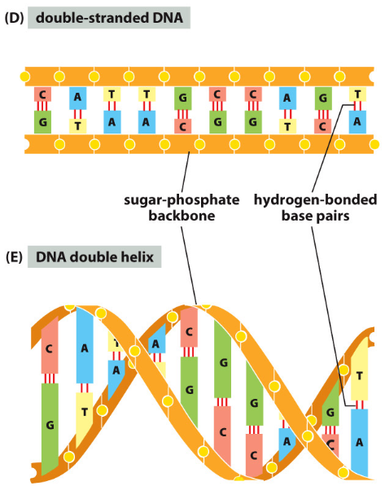

---

#### Replicazione

Durante il processo di **replicazione** si ha un processo **semi-conservativo**. **Un filamento** viene conservato nelle **cellule figlie**, mentre **l’altro** viene sintetizzato.

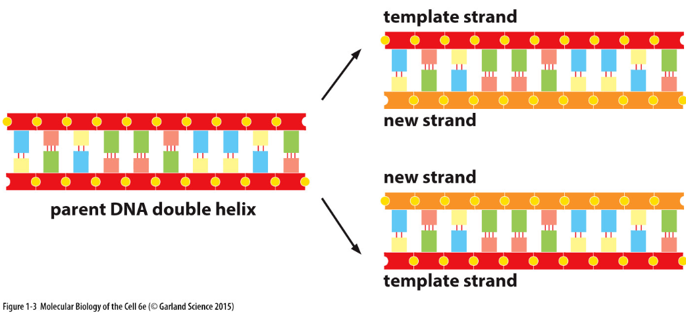

---

### Organizzazione del genoma umano

#### DNA nucleare e mitocondriale

Il genoma umano è contenuto in due compartimenti distinti: il **nucleo** (>20000 geni) e i **mitocondri** (13-14 geni codificanti proteine). Il DNA mitocondriale viene generalmente, ma non sempre, ereditato dalla madre. Nel mitocondrio si trova circa l'1% del DNA totale.

#### Cromosomi

Il nostro genoma è formato da tanti pezzi di DNA che sono organizzati in **cromosomi**. Il genoma aploide umano contiene circa 3x109 coppie di basi organizzate in 23 cromosomi (diploide = 46).

All’interno del DNA sono presenti nucleotidi disposti in sequenze specifiche che formano i geni:  Un gene è responsabile della produzione di un singolo polipeptide e delle sue isoforme. Alcuni geni non codificano polipeptidi, ma codificano RNA strutturali o regolatori. 
Le cellule forniscono il meccanismo necessario per garantire che le istruzioni genetiche contenute nel DNA vengano riprodotte e seguite con fedeltà.

---

### Mermaid materiale genetico

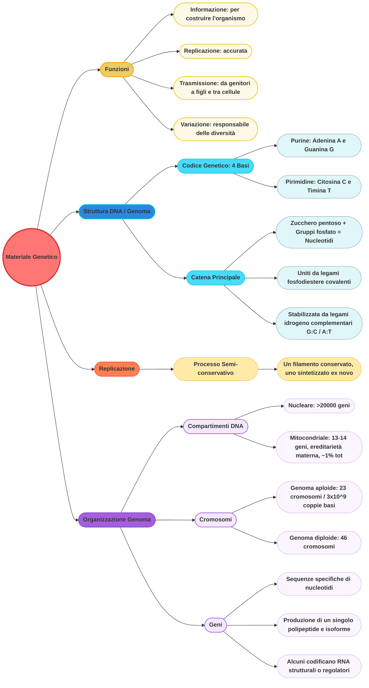
```mermaid
graph LR
    %% =========================================================================
    %% DEFINIZIONE STILI (Sfumature coerenti per ramo, NO grigi, leggibili ovunque)
    %% =========================================================================
    
    %% NODO CENTRALE (Rosso/Fucsia Inteso)
    classDef root fill:#ff7675,stroke:#d63031,stroke-width:3px,font-weight:bold;

    %% RAMO FUNZIONI (Giallo Sole -> Giallo Pastello)
    classDef funL1 fill:#eccc68,stroke:#ffa502,stroke-width:2px,font-weight:bold;
    classDef funL2 fill:#fef9e7,stroke:#f1c40f,stroke-width:1.5px;

    %% RAMO STRUTTURA DNA (Blu Cobalto -> Azzurro -> Celeste)
    classDef strL1 fill:#2e86de,stroke:#0abde3,stroke-width:2px,font-weight:bold;
    classDef strL2 fill:#48dbfb,stroke:#00d2d3,stroke-width:1.5px;
    classDef strL3 fill:#e0f7fa,stroke:#95afc0,stroke-width:1px;

    %% RAMO REPLICAZIONE (Arancione -> Giallo/Arancio Pastello)
    classDef repL1 fill:#ff7f50,stroke:#ff6348,stroke-width:2px,font-weight:bold;
    classDef repL2 fill:#ffeaa7,stroke:#fdcb6e,stroke-width:1.5px;

    %% RAMO ORGANIZZAZIONE GENOMA (Viola -> Lilla -> Lilla Chiaro Coerente)
    classDef orgL1 fill:#a55edd,stroke:#8854d0,stroke-width:2px,font-weight:bold;
    classDef orgL2 fill:#f3e8ff,stroke:#a55edd,stroke-width:1.5px;
    classDef orgL3 fill:#faf5ff,stroke:#d6bbf2,stroke-width:1px;


    %% =========================================================================
    %% STRUTTURA DEL DIAGRAMMA (Bordi smussati con parentesi '([ ])')
    %% =========================================================================

    Genetica((Materiale Genetico)):::root

    %% Funzioni del Materiale Genetico
    Genetica --> Funz([Funzioni]):::funL1
    Funz --> F1([Informazione: per costruire l'organismo]):::funL2
    Funz --> F2([Replicazione: accurata]):::funL2
    Funz --> F3([Trasmissione: da genitori a figli e tra cellule]):::funL2
    Funz --> F4([Variazione: responsabile delle diversità]):::funL2

    %% Struttura del DNA
    Genetica --> Strut([Struttura DNA / Genoma]):::strL1
    Strut --> Cod([Codice Genetico: 4 Basi]):::strL2
    Cod --> Pur([Purine: Adenina A e Guanina G]):::strL3
    Cod --> Pir([Pirimidine: Citosina C e Timina T]):::strL3
    
    Strut --> Cat([Catena Principale]):::strL2
    Cat --> C1([Zucchero pentoso + Gruppi fosfato = Nucleotidi]):::strL3
    Cat --> C2([Uniti da legami fosfodiestere covalenti]):::strL3
    Cat --> C3([Stabilizzata da legami idrogeno complementari G:C / A:T]):::strL3

    %% Replicazione
    Genetica --> Rep([Replicazione]):::repL1
    Rep --> Rep1([Processo Semi-conservativo]):::repL2
    Rep1 --> Rep2([Un filamento conservato, uno sintetizzato ex novo]):::repL2

    %% Organizzazione del Genoma Umano (Tutto rigorosamente Viola/Lilla)
    Genetica --> Org([Organizzazione Genoma]):::orgL1
    
    Org --> Comp([Compartimenti DNA]):::orgL2
    Comp --> Nuc([Nucleare: >20000 geni]):::orgL3
    Comp --> Mit([Mitocondriale: 13-14 geni, ereditarietà materna, ~1% tot]):::orgL3
    
    Org --> Cromosoma([Cromosomi]):::orgL2
    Cromosoma --> Cr1([Genoma aploide: 23 cromosomi / 3x10^9 coppie basi]):::orgL3
    Cromosoma --> Cr2([Genoma diploide: 46 cromosomi]):::orgL3
    
    Org --> Geni([Geni]):::orgL2
    Geni --> G1([Sequenze specifiche di nucleotidi]):::orgL3
    Geni --> G2([Produzione di un singolo polipeptide e isoforme]):::orgL3
    Geni --> G3([Alcuni codificano RNA strutturali o regolatori]):::orgL3
```

---

## Geni ed espressione genica

### Struttura e funzione dei geni
- I **geni** contengono le informazioni necessarie per generare un organismo e permetterne un’interazione favorevole con l’ambiente.
- Ogni gene contiene le istruzioni per la produzione di un **polipeptide**, che rappresenta un’unità funzionale delle **proteine**.
- Le attività delle **proteine** determinano la struttura e la funzione delle cellule, dalle quali dipendono i tratti e le caratteristiche di un organismo.
- Tutte le cellule di un organismo multicellulare possiedono lo stesso **DNA**, ma esprimono **geni diversi** in base alla loro funzione.

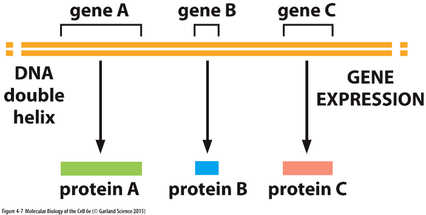

---

### Espressione genica negli eucarioti
- La sintesi delle **proteine** avviene attraverso un processo indiretto:
    - il **DNA** viene prima copiato in **RNA** attraverso la **trascrizione**;
    - l’**RNA** viene poi utilizzato per produrre proteine attraverso la **traduzione**.
- Negli eucarioti:
    - la **trascrizione** avviene nel **nucleo**, dove il DNA viene convertito in RNA;
    - l’**RNA** esce dal nucleo e raggiunge il **citoplasma**, dove avviene la **traduzione** e la sintesi dei **polipeptidi**.

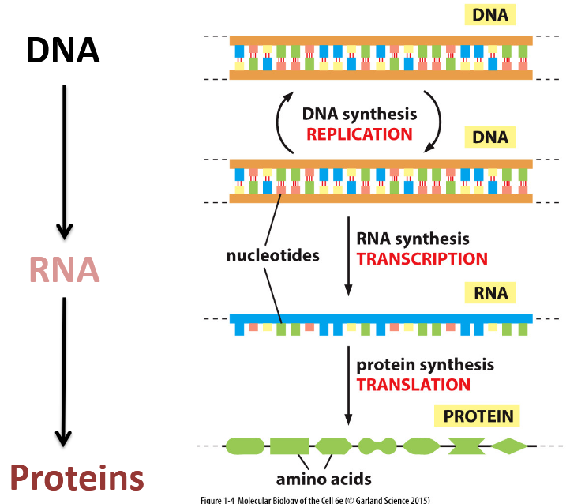

---

## Trascrizione: dal DNA all'RNA

### Processo di trascrizione

In biologia, la trascrizione è il primo passo dell'espressione genica. È il processo in cui le istruzioni contenute nel DNA vengono copiate in una molecola complementare di RNA (generalmente **RNA messaggero** o **mRNA**), che servirà poi da stampo per costruire le proteine. 

- L'RNA a singolo filamento viene prodotto a partire da un DNA a doppio filamento. 
- L'**RNA polimerasi** eucariotica è una RNA polimerasi DNA dipendente, in quanto utilizza le informazioni contenute nel DNA per sintetizzare una sequenza complementare. Solo un filamento del gene viene utilizzato come matrice per la trascrizione e viene definito **filamento matrice**. Il prodotto è un RNA a filamento singolo complementare. 
- L’**RNA polimerasi** legge il DNA in senso **3' → 5'** (in base ai legami della catena zuccherina) e produce una molecola di RNA ad esso complementare. 

---

### Le molecole di RNA

#### RNA e differenze rispetto al DNA

Le differenze tra RNA e DNA sono poche ma fondamentali:

- **Ribosio**: nel DNA è presente desossiribosio, sostituito da ribosio nel RNA;
- **Uracile**: la base azotata timina è sostituita da uracile;
- **Struttura a singolo filamento**: la struttura tipica del DNA a doppio filamento è sostituita da un unico filamento; questo, può formare dei "loop" e impacchettarsi.

---

### Tipi principali di RNA

| Tipo di RNA | Funzione                                                                                                                                                           |
| :---------- | :----------------------------------------------------------------------------------------------------------------------------------------------------------------- |
| **mRNA**    | RNA messaggeri, codificano per le proteine                                                                                                                         |
| **rRNA**    | RNA ribosomiali, formano la struttura di base del ribosoma e catalizzano la sintesi proteica                                                                       |
| **tRNA**    | RNA di trasporto, fondamentali per la sintesi proteica come adattatori tra mRNA e amminoacidi                                                                      |
| **snRNA**   | Piccoli RNA nucleari, funzionano in una varietà di processi nucleari, compreso lo *splicing* del pre-mRNA                                                          |
| **snoRNA**  | Piccoli RNA nucleolari, aiutano a processare e modificare chimicamente i rRNAs                                                                                     |
| **miRNA**   | MicroRNA, regolano l'espressione genica bloccando la traduzione di specifici mRNA e causandone la degradazione                                                     |
| **siRNA**   | Piccoli RNA interferenti, spengono l'espressione genica dirigendo la degradazione di mRNA selettivi e promuovendo la formazione di strutture cromatiniche compatte |
| **piRNA**   | RNA interagenti con Piwi, si legano alle proteine Piwi e proteggono la linea germinale da elementi trasponibili                                                    |
| **lncRNA**  | Lunghi RNA non codificanti, molti dei quali fungono da *scaffold* (impalcature); regolano diversi processi cellulari, inclusa l'inattivazione del cromosoma X      |

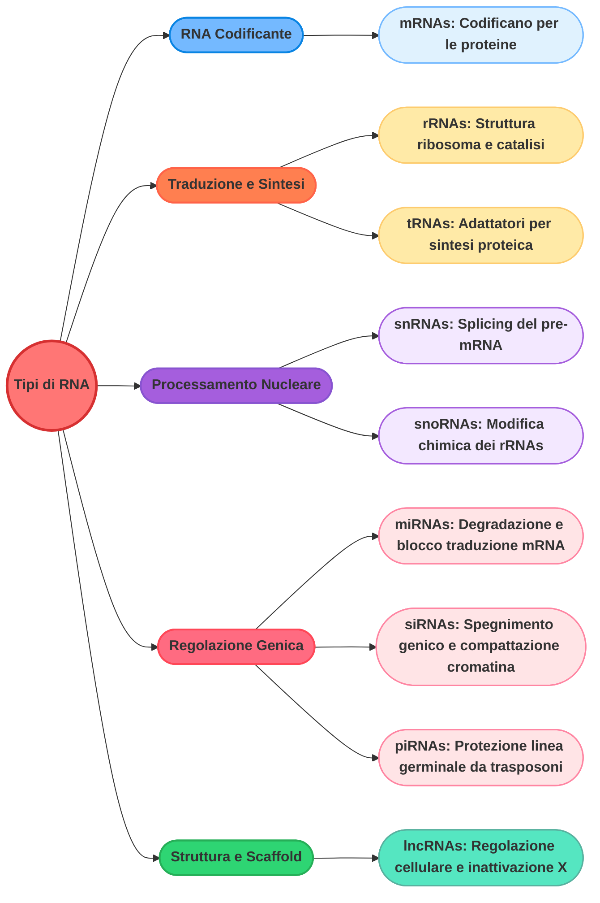
```mermaid
graph LR
    %% =========================================================================
    %% DEFINIZIONE STILI (Sfumature coerenti per ramo, NO grigi, leggibili ovunque)
    %% =========================================================================
    
    %% NODO CENTRALE (Rosso/Fucsia Inteso)
    classDef root fill:#ff7675,stroke:#d63031,stroke-width:3px,font-weight:bold;

    %% RAMO CODIFICANTE (Azzurro -> Celeste)
    classDef codL1 fill:#74b9ff,stroke:#0984e3,stroke-width:2px,font-weight:bold;
    classDef codL2 fill:#e0f2fe,stroke:#74b9ff,stroke-width:1.5px;

    %% RAMO TRADUZIONE (Arancione -> Giallo/Arancio Pastello)
    classDef tradL1 fill:#ff7f50,stroke:#ff6348,stroke-width:2px,font-weight:bold;
    classDef tradL2 fill:#ffeaa7,stroke:#fdcb6e,stroke-width:1.5px;

    %% RAMO NUCLEARE (Viola -> Lilla)
    classDef nucL1 fill:#a55edd,stroke:#8854d0,stroke-width:2px,font-weight:bold;
    classDef nucL2 fill:#f3e8ff,stroke:#a55edd,stroke-width:1.5px;

    %% RAMO REGOLAZIONE (Rosa Inteso -> Rosa Confetto)
    classDef regL1 fill:#ff6b81,stroke:#ff4757,stroke-width:2px,font-weight:bold;
    classDef regL2 fill:#ffe4e6,stroke:#ff85a2,stroke-width:1.5px;

    %% RAMO SCAFFOLD/LUNGHI (Verde Smeraldo -> Verde Menta)
    classDef lncL1 fill:#2ed573,stroke:#26af58,stroke-width:2px,font-weight:bold;
    classDef lncL2 fill:#55e6c1,stroke:#58b19f,stroke-width:1.5px;


    %% =========================================================================
    %% STRUTTURA DEL DIAGRAMMA (Integrità dei dati 1:1, angoli smussati)
    %% =========================================================================

    RNA((Tipi di RNA)):::root

    %% Ramo Codificante (Azzurro)
    RNA --> COD([RNA Codificante]):::codL1
    COD --> mRNA([mRNAs: Codificano per le proteine]):::codL2

    %% Ramo Traduzione (Arancione)
    RNA --> TRAD([Traduzione e Sintesi]):::tradL1
    TRAD --> rRNA([rRNAs: Struttura ribosoma e catalisi]):::tradL2
    TRAD --> tRNA([tRNAs: Adattatori per sintesi proteica]):::tradL2

    %% Ramo Nucleare (Viola)
    RNA --> NUC([Processamento Nucleare]):::nucL1
    NUC --> snRNA([snRNAs: Splicing del pre-mRNA]):::nucL2
    NUC --> snoRNA([snoRNAs: Modifica chimica dei rRNAs]):::nucL2

    %% Ramo Regolazione (Rosa)
    RNA --> REG([Regolazione Genica]):::regL1
    REG --> miRNA([miRNAs: Degradazione e blocco traduzione mRNA]):::regL2
    REG --> siRNA([siRNAs: Spegnimento genico e compattazione cromatina]):::regL2
    REG --> piRNA([piRNAs: Protezione linea germinale da trasposoni]):::regL2

    %% Ramo Lunghi/Struttura (Verde)
    RNA --> STRU([Struttura e Scaffold]):::lncL1
    STRU --> lncRNA([lncRNAs: Regolazione cellulare e inattivazione X]):::lncL2
```

---

### Confronto tra RNA non codificanti: miRNA vs siRNA vs lncRNA

| Caratteristica         | 🔵 microRNA (miRNA)                                         | 🟢 small interfering RNA (siRNA)                             | 🟠 long non-coding RNA (lncRNA)                                                          |
| :--------------------- | :--------------------------------------------------------- | :---------------------------------------------------------- | :-------------------------------------------------------------------------------------- |
| **Dimensione**         | Piccolo (~22 nucleotidi)                                   | Piccolo (~21–23 nucleotidi)                                 | Lungo (>200 nucleotidi)                                                                 |
| **Origine**            | Endogena (codificato nel genoma)                           | Spesso esogena (virale/sperimentale), talvolta endogena     | Endogena (non codificano per proteine)                                                  |
| **Complementarità**    | Parziale con l'mRNA bersaglio                              | Perfetta con l'mRNA bersaglio                               | N/D (agisce su DNA, cromatina e proteine)                                               |
| **Effetto Principale** | • Repressione della traduzione • Degradazione dell'mRNA | • Taglio (*cleavage*) dell'mRNA • Degradazione dell'mRNA | • Regolazione della struttura cromatinica • Controllo della trascrizione             |
| **Specificità**        | Regola molti geni contemporaneamente (regolazione fine)    | Silenziamento genico altamente specifico (forte)            | Spesso specifico per tipo cellulare                                                     |
| **Funzioni Chiave**    | Sviluppo, differenziamento cellulare, cancro               | Ricerca scientifica, terapie geniche                        | • Funge da impalcatura (*scaffold*) molecolare • "Spugna" per miRNA (*miRNA sponge*) |
| **Ruolo Generale**     | Regolazione fine dell'espressione genica                   | Silenziamento genico mirato                                 | Epigenetica e regolazione complessa                                                     |

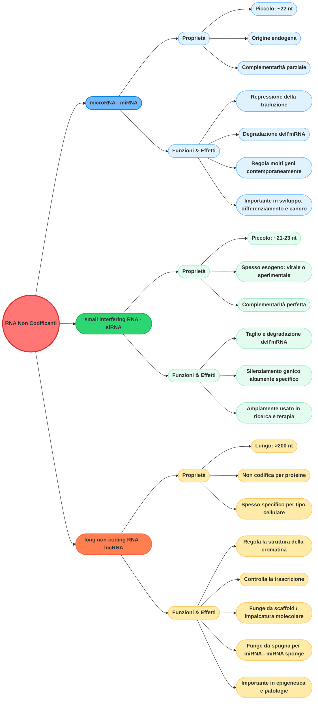
```mermaid
graph LR
    %% =========================================================================
    %% DEFINIZIONE STILI (Sfumature coerenti per ramo, NO grigi, leggibili ovunque)
    %% =========================================================================
    
    %% NODO CENTRALE (Rosso/Fucsia Inteso)
    classDef root fill:#ff7675,stroke:#d63031,stroke-width:3px,font-weight:bold;

    %% RAMO miRNA (Blu -> Celeste Chiaro Coerente)
    classDef miL1 fill:#74b9ff,stroke:#0984e3,stroke-width:2px,font-weight:bold;
    classDef miL2 fill:#e0f2fe,stroke:#74b9ff,stroke-width:1.5px;

    %% RAMO siRNA (Verde -> Verde Menta Chiaro Coerente)
    classDef siL1 fill:#2ed573,stroke:#26af58,stroke-width:2px,font-weight:bold;
    classDef siL2 fill:#e3fcef,stroke:#a3e9c9,stroke-width:1.5px;

    %% RAMO lncRNA (Arancione -> Giallo/Arancio Pastello Coerente)
    classDef lnL1 fill:#ff7f50,stroke:#ff6348,stroke-width:2px,font-weight:bold;
    classDef lnL2 fill:#ffeaa7,stroke:#fdcb6e,stroke-width:1.5px;


    %% =========================================================================
    %% STRUTTURA DEL DIAGRAMMA (Integrità dei dati 1:1, angoli smussati)
    %% =========================================================================

    NC((RNA Non Codificanti)):::root

    %% microRNA (miRNA)
    NC --> MI([microRNA - miRNA]):::miL1
    MI --> MI_Prop([Proprietà]):::miL2
    MI_Prop --> MI_P1([Piccolo: ~22 nt]):::miL2
    MI_Prop --> MI_P2([Origine endogena]):::miL2
    MI_Prop --> MI_P3([Complementarità parziale]):::miL2
    
    MI --> MI_Funz([Funzioni & Effetti]):::miL2
    MI_Funz --> MI_F1([Repressione della traduzione]):::miL2
    MI_Funz --> MI_F2([Degradazione dell'mRNA]):::miL2
    MI_Funz --> MI_F3([Regola molti geni contemporaneamente]):::miL2
    MI_Funz --> MI_F4([Importante in sviluppo, differenziamento e cancro]):::miL2

    %% small interfering RNA (siRNA)
    NC --> SI([small interfering RNA - siRNA]):::siL1
    SI --> SI_Prop([Proprietà]):::siL2
    SI_Prop --> SI_P1([Piccolo: ~21-23 nt]):::siL2
    SI_Prop --> SI_P2([Spesso esogeno: virale o sperimentale]):::siL2
    SI_Prop --> SI_P3([Complementarità perfetta]):::siL2
    
    SI --> SI_Funz([Funzioni & Effetti]):::siL2
    SI_Funz --> SI_F1([Taglio e degradazione dell'mRNA]):::siL2
    SI_Funz --> SI_F2([Silenziamento genico altamente specifico]):::siL2
    SI_Funz --> SI_F3([Ampiamente usato in ricerca e terapia]):::siL2

    %% long non-coding RNA (lncRNA)
    NC --> LN([long non-coding RNA - lncRNA]):::lnL1
    LN --> LN_Prop([Proprietà]):::lnL2
    LN_Prop --> LN_P1([Lungo: >200 nt]):::lnL2
    LN_Prop --> LN_P2([Non codifica per proteine]):::lnL2
    LN_Prop --> LN_P3([Spesso specifico per tipo cellulare]):::lnL2
    
    LN --> LN_Funz([Funzioni & Effetti]):::lnL2
    LN_Funz --> LN_F1([Regola la struttura della cromatina]):::lnL2
    LN_Funz --> LN_F2([Controlla la trascrizione]):::lnL2
    LN_Funz --> LN_F3([Funge da scaffold / impalcatura molecolare]):::lnL2
    LN_Funz --> LN_F4([Funge da spugna per miRNA - miRNA sponge]):::lnL2
    LN_Funz --> LN_F5([Importante in epigenetica e patologie]):::lnL2
```

---

### RNA polimerasi

Le RNA polimerasi sono enzimi DNA-dipendenti che sintetizzano molecole di RNA utilizzando il DNA come stampo. Nelle cellule eucariotiche sono presenti tre principali RNA polimerasi, ciascuna specializzata nella sintesi di specifiche classi di RNA.

| RNA polimerasi         | Principali prodotti               |
| :--------------------- | :-------------------------------- |
| **RNA polimerasi I**   | rRNA (5,8S, 18S e 28S)            |
| **RNA polimerasi II**  | mRNA, miRNA e lncRNA              |
| **RNA polimerasi III** | tRNA, rRNA 5S e altri piccoli RNA |

L'**RNA polimerasi II** è la più importante nell'espressione genica perché trascrive i geni codificanti per le proteine.

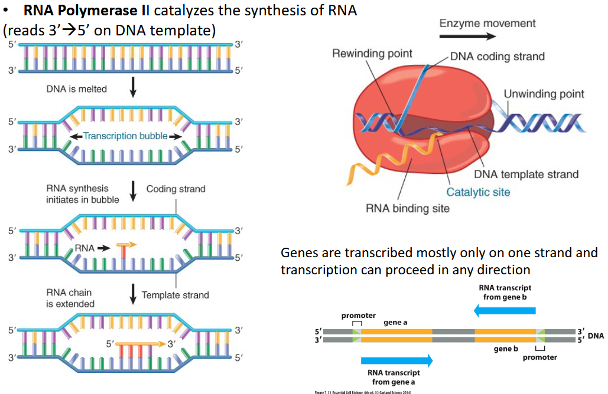

Caratteristiche principali:

- legge il filamento stampo del DNA in direzione **3' → 5'**;
- sintetizza l'RNA in direzione **5' → 3'**;
- la trascrizione avviene attraverso tre fasi:
    - **Initiation**
    - **Elongation**
    - **Termination**

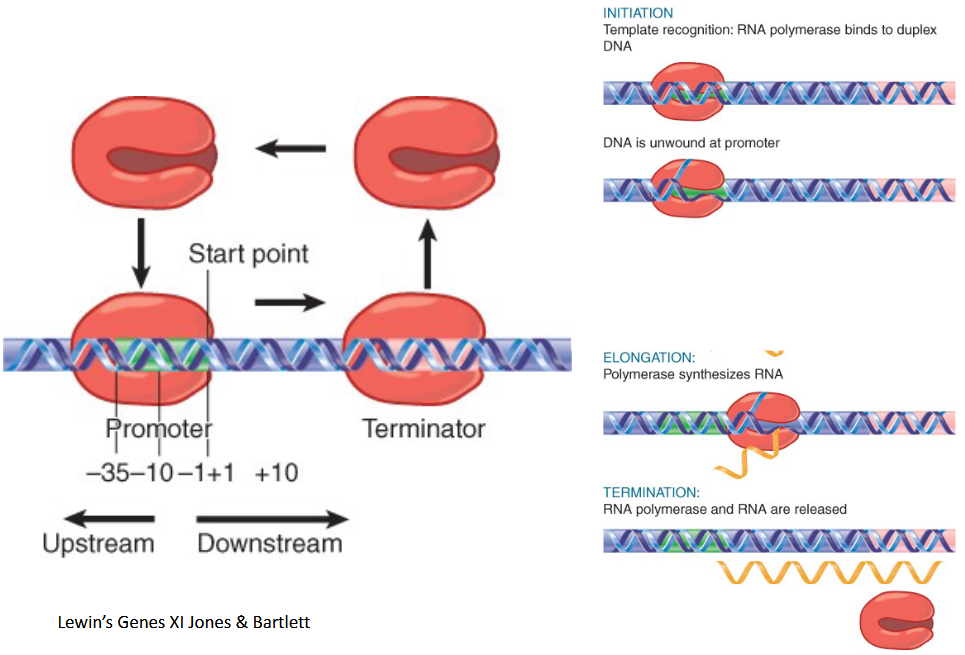

---

## Regolazione della trascrizione

### Principi generali della regolazione

L'**RNA polimerasi** II catalizza la sintesi dell'mRNA a una velocità pressoché costante di **30-40 nucleotidi al secondo**.

La velocità di sintesi di una singola RNA polimerasi è costante; la velocità complessiva di trascrizione di un gene dipende invece dal **numero di RNA polimerasi** che stanno trascrivendo contemporaneamente quel gene.

Specifici **fattori di trascrizione** modulano il numero di molecole di RNA polimerasi attivamente impegnate nella sintesi dell'RNA, regolando così il livello di espressione genica.

> **L'espressione di un gene dipende quindi dall'interazione tra regioni regolatorie del DNA, fattori di trascrizione e stato della cromatina.**

---

### Regioni regolatorie dei geni

Un gene eucariotico che produce mRNA può essere suddiviso in **regioni codificanti** e **regioni regolatorie**, definite dai siti di inizio e terminazione della trascrizione.

- **Regione codificante**: contiene la sequenza di DNA che viene trascritta in mRNA e successivamente tradotta in una proteina.
- **Regione regolatoria**: contiene le sequenze che controllano l'espressione genica, garantendo sia l'espressione basale sia quella regolata.

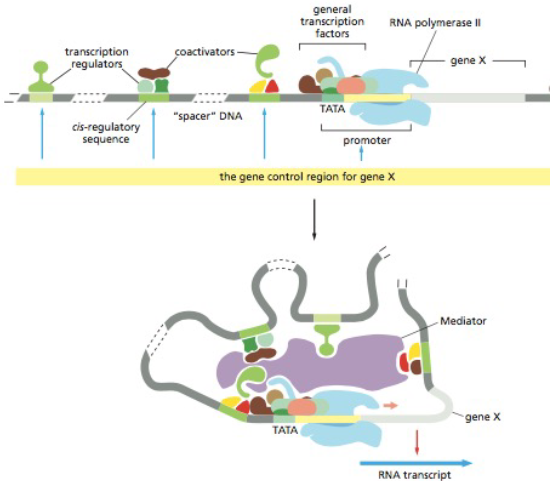

---

### Fattori di trascrizione

I fattori di trascrizione sono proteine che regolano l'espressione genica controllando il reclutamento e l'attività della RNA polimerasi.

Presentano una struttura modulare costituita da almeno due domini:

- **Dominio di legame al DNA**: riconosce specifiche sequenze di DNA.
- **Dominio di attivazione della trascrizione**: interagisce con il macchinario trascrizionale, favorendo l'assemblaggio dei fattori di trascrizione generali e l'inizio della trascrizione.

Fattori di trascrizione differenti riconoscono sequenze specifiche diverse.

#### Fattori generali

L'espressione basale di un gene dipende dagli **elementi basali di risposta (BRE)** presenti nel promotore.

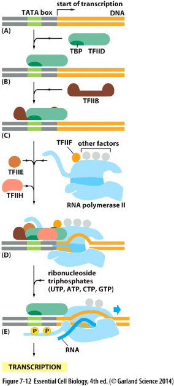

Essi comprendono:

- **TATA box** (componente prossimale): indirizza la RNA polimerasi II verso il corretto sito di inizio della trascrizione.
- **CAAT box** e **GC box** (componenti distali): regolano la frequenza di inizio della trascrizione.

Queste sequenze vengono riconosciute dai **fattori di trascrizione generali** mediante interazioni proteina-DNA.

##### I fattori di trascrizione generali per l'inizio della trascrizione (RNA polimerasi II)

| Fattore (GTF) |    Subunità    | Ruolo principale nell'inizio della trascrizione                                                                                                                                                                                                             |
| :------------ | :------------: | :---------------------------------------------------------------------------------------------------------------------------------------------------------------------------------------------------------------------------------------------------------- |
| **TFIID**     | **~12** totali | Complesso fondamentale per il riconoscimento iniziale del promotore: • Subunità **TBP** (1): Riconosce la sequenza *TATA box*. • Subunità **TAF** (~11): Riconoscono altre sequenze di DNA vicine al sito d'inizio; regolano il legame di TBP al DNA. |
| **TFIIB**     |     **1**      | Riconosce l'elemento *BRE* nei promotori; posiziona con precisione la RNA Polimerasi II sul sito di inizio della trascrizione.                                                                                                                              |
| **TFIIF**     |     **3**      | Stabilizza l'interazione della RNA Polimerasi II con TBP e TFIIB; aiuta a reclutare sul promotore TFIIE e TFIIH.                                                                                                                                            |
| **TFIIE**     |     **2**      | Recluta e regola l'attività di TFIIH.                                                                                                                                                                                                                       |
| **TFIIH**     |     **9**      | Il fattore motore con doppia funzione: Srotola il DNA (attività elicasica) nel punto di inizio. Fosforila la Serina 5 del dominio C-terminale (**CTD**) della RNA polimerasi II, liberandola dal promotore per iniziare la trascrizione.              |

*Abbreviazioni utili:* **TBP** = *TATA-binding protein* (proteina che lega la TATA box); **TAF** = *TBP-associated factors* (fattori associati a TBP); **CTD** = *C-terminal domain* (dominio C-terminale della polimerasi).

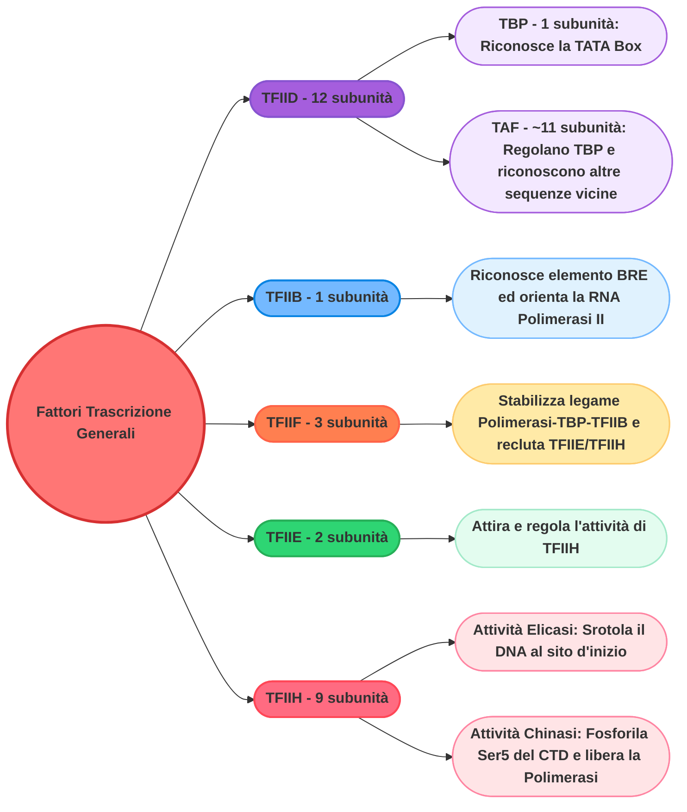
```mermaid
graph LR
    %% =========================================================================
    %% DEFINIZIONE STILI (Sfumature coerenti per ramo, NO grigi, leggibili ovunque)
    %% =========================================================================
    
    %% NODO CENTRALE (Rosso/Fucsia Inteso)
    classDef root fill:#ff7675,stroke:#d63031,stroke-width:3px,font-weight:bold;

    %% RAMO TFIID (Viola -> Lilla Chiaro Coerente)
    classDef tfiidL1 fill:#a55edd,stroke:#8854d0,stroke-width:2px,font-weight:bold;
    classDef tfiidL2 fill:#f3e8ff,stroke:#a55edd,stroke-width:1.5px;

    %% RAMO TFIIB (Azzurro -> Celeste Chiaro Coerente)
    classDef tfiiBL1 fill:#74b9ff,stroke:#0984e3,stroke-width:2px,font-weight:bold;
    classDef tfiiBL2 fill:#e0f2fe,stroke:#74b9ff,stroke-width:1.5px;

    %% RAMO TFIIF (Arancione -> Giallo/Arancio Pastello Coerente)
    classDef tfiiFL1 fill:#ff7f50,stroke:#ff6348,stroke-width:2px,font-weight:bold;
    classDef tfiiFL2 fill:#ffeaa7,stroke:#fdcb6e,stroke-width:1.5px;

    %% RAMO TFIIE (Verde Smeraldo -> Verde Menta Chiaro Coerente)
    classDef tfiiEL1 fill:#2ed573,stroke:#26af58,stroke-width:2px,font-weight:bold;
    classDef tfiiEL2 fill:#e3fcef,stroke:#a3e9c9,stroke-width:1.5px;

    %% RAMO TFIIH (Rosa Inteso -> Rosa Confetto Coerente)
    classDef tfiiHL1 fill:#ff6b81,stroke:#ff4757,stroke-width:2px,font-weight:bold;
    classDef tfiiHL2 fill:#ffe4e6,stroke:#ff85a2,stroke-width:1.5px;


    %% =========================================================================
    %% STRUTTURA DEL DIAGRAMMA (Integrità dei dati 1:1, angoli smussati)
    %% =========================================================================

    GTF((Fattori Trascrizione Generali)):::root

    %% TFIID (Viola)
    GTF --> TFIID([TFIID - 12 subunità]):::tfiidL1
    TFIID --> TBP([TBP - 1 subunità: Riconosce la TATA Box]):::tfiidL2
    TFIID --> TAF([TAF - ~11 subunità: Regolano TBP e riconoscono altre sequenze vicine]):::tfiidL2

    %% TFIIB (Azzurro)
    GTF --> TFIIB([TFIIB - 1 subunità]):::tfiiBL1
    TFIIB --> TFIIB_F([Riconosce elemento BRE ed orienta la RNA Polimerasi II]):::tfiiBL2

    %% TFIIF (Arancione)
    GTF --> TFIIF([TFIIF - 3 subunità]):::tfiiFL1
    TFIIF --> TFIIF_F([Stabilizza legame Polimerasi-TBP-TFIIB e recluta TFIIE/TFIIH]):::tfiiFL2

    %% TFIIE (Verde)
    GTF --> TFIIE([TFIIE - 2 subunità]):::tfiiEL1
    TFIIE --> TFIIE_F([Attira e regola l'attività di TFIIH]):::tfiiEL2

    %% TFIIH (Rosa)
    GTF --> TFIIH([TFIIH - 9 subunità]):::tfiiHL1
    TFIIH --> TFIIH_H([Attività Elicasi: Srotola il DNA al sito d'inizio]):::tfiiHL2
    TFIIH --> TFIIH_K([Attività Chinasi: Fosforila Ser5 del CTD e libera la Polimerasi]):::tfiiHL2
```

#### Fattori specifici

> **A differenza dei fattori generali, i fattori specifici regolano l'espressione di particolari geni in risposta a segnali cellulari.**

Gli **enhancer**, i **repressori** e gli **elementi di risposta** vengono riconosciuti da proteine specifiche e regolano l'espressione genica in risposta a diversi segnali cellulari (ormoni, sostanze chimiche, ecc.).

Caratteristiche principali:

- possono trovarsi sia a monte sia a valle del sito di inizio della trascrizione;
- possono agire anche se localizzati a centinaia o migliaia di basi di distanza;
- funzionano indipendentemente dal loro orientamento.

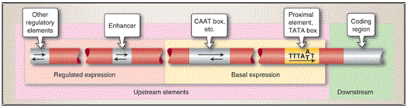

#### Meccanismi di regolazione

**DNA looping**

Alcuni fattori di trascrizione possono agire a distanza grazie al **DNA looping**, che permette il contatto tra regioni del DNA molto lontane tra loro.

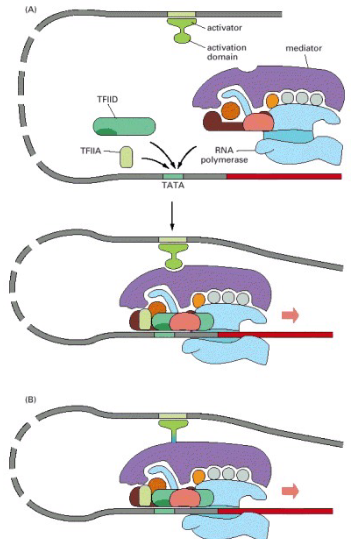

**Sinergia trascrizionale**

La sinergia trascrizionale si verifica quando più proteine attivatrici si legano contemporaneamente alle regioni regolatorie di un gene, producendo un effetto superiore alla semplice somma delle singole azioni.

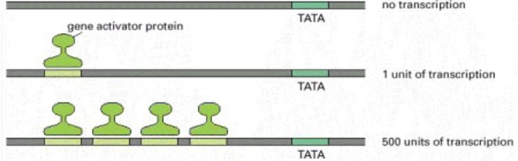

**Meccanismi di repressione**

Le proteine repressive possono inibire la trascrizione attraverso diversi meccanismi:

- legame competitivo con il DNA;
- legame con l'attivatore, impedendogli di interagire con il DNA;
- interazione diretta con il fattore di trascrizione.

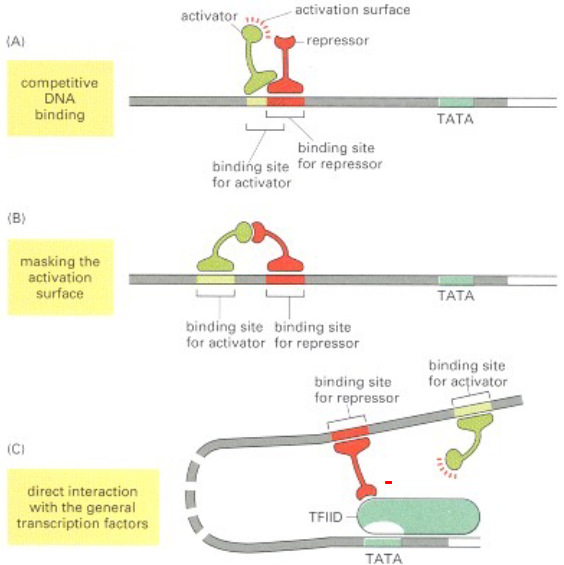

### Mermaid riassuntivo

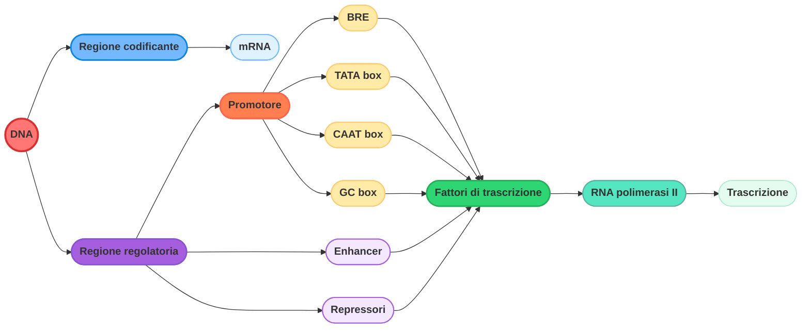
```mermaid
graph LR
    %% =========================================================================
    %% DEFINIZIONE STILI (Sfumature coerenti per ramo, NO grigi, leggibili ovunque)
    %% =========================================================================
    
    %% NODO CENTRALE (Rosso/Fucsia Inteso)
    classDef root fill:#ff7675,stroke:#d63031,stroke-width:3px,font-weight:bold;

    %% RAMO REGIONE CODIFICANTE (Azzurro -> Celeste)
    classDef codL1 fill:#74b9ff,stroke:#0984e3,stroke-width:2px,font-weight:bold;
    classDef codL2 fill:#e0f2fe,stroke:#74b9ff,stroke-width:1.5px;

    %% RAMO REGIONE REGOLATORIA (Viola -> Lilla)
    classDef regL1 fill:#a55edd,stroke:#8854d0,stroke-width:2px,font-weight:bold;
    classDef regL2 fill:#f3e8ff,stroke:#a55edd,stroke-width:1.5px;

    %% RAMO PROMOTORE/BOX (Arancione -> Giallo/Arancio Pastello)
    classDef promL1 fill:#ff7f50,stroke:#ff6348,stroke-width:2px,font-weight:bold;
    classDef promL2 fill:#ffeaa7,stroke:#fdcb6e,stroke-width:1.5px;

    %% RAMO FATTORI & POLIMERASI (Verde Smeraldo -> Verde Menta -> Verde Chiarissimo)
    classDef tfL1 fill:#2ed573,stroke:#26af58,stroke-width:2px,font-weight:bold;
    classDef tfL2 fill:#55e6c1,stroke:#58b19f,stroke-width:1.5px;
    classDef tfL3 fill:#e3fcef,stroke:#a3e9c9,stroke-width:1px;


    %% =========================================================================
    %% STRUTTURA DEL DIAGRAMMA (Integrità dei dati 1:1, angoli smussati)
    %% =========================================================================

    DNA((DNA)):::root

    %% Ramo Regione Codificante (Azzurro)
    DNA --> COD([Regione codificante]):::codL1
    COD --> mRNA([mRNA]):::codL2

    %% Ramo Regione Regolatoria (Viola)
    DNA --> REG([Regione regolatoria]):::regL1
    
    %% Sotto-rami della Regolazione (Elementi del Promotore)
    REG --> PROM([Promotore]):::promL1
    PROM --> BRE([BRE]):::promL2
    PROM --> TATA([TATA box]):::promL2
    PROM --> CAAT([CAAT box]):::promL2
    PROM --> GC([GC box]):::promL2

    %% Sotto-rami di Controllo Distale
    REG --> ENH([Enhancer]):::regL2
    REG --> REP([Repressori]):::regL2

    %% Reclutamento dei Fattori di Trascrizione (Verde)
    BRE --> TF([Fattori di trascrizione]):::tfL1
    TATA --> TF
    CAAT --> TF
    GC --> TF
    ENH --> TF
    REP --> TF

    %% Fase Finale: Polimerasi e Trascrizione
    TF --> POL([RNA polimerasi II]):::tfL2
    POL --> TX([Trascrizione]):::tfL3
```

---

### Regolazione epigenetica

#### Cromatina

Negli eucarioti il DNA è associato a proteine che ne permettono l'impacchettamento nei cromosomi.

Le proteine cromosomiche si distinguono in:

- **istoni**;
- **proteine cromosomiche non istoniche**.

L'insieme formato da DNA e proteine associate prende il nome di **cromatina**.

La cromatina può trovarsi in due stati:

- **Eucromatina**: meno condensata e facilmente accessibile alla trascrizione.
- **Eterocromatina**: più condensata e meno accessibile alla trascrizione.

#### Rimodellamento della cromatina

Le modificazioni degli istoni regolano l'accessibilità del DNA ai fattori di trascrizione e alla RNA polimerasi.

Le principali modificazioni sono:

- acetilazione;
- deacetilazione;
- metilazione;
- fosforilazione.

Anche la **metilazione del DNA** rappresenta un'importante modifica epigenetica e consiste nell'aggiunta di un gruppo metilico (–CH₃) alla citosina.

Parte della struttura della cromatina può essere ereditata dalle cellule figlie, contribuendo all'ereditarietà epigenetica.

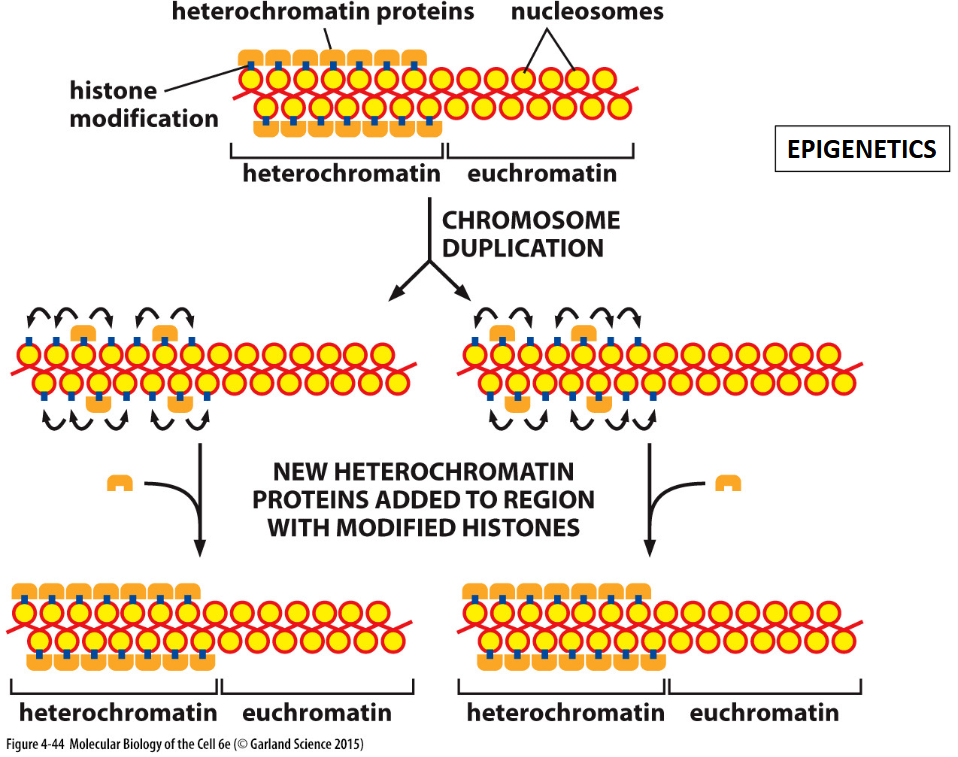

### Struttura dei geni eucariotici

#### Organizzazione del gene eucariotico

I geni eucariotici sono costituiti da **porzioni trascritte** e **porzioni non trascritte**.

Le porzioni trascritte comprendono:
- **sequenze codificanti** (esoni);
- **sequenze non codificanti**, come gli introni e le regioni non tradotte (**UTR 5'** e **UTR 3'**).

Le porzioni non trascritte comprendono invece le **sequenze regolatorie**, localizzate a monte (5') e a valle (3') del gene.

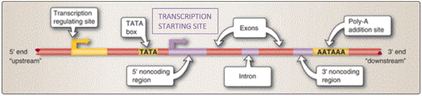

#### Esoni e introni

I geni eucariotici sono costituiti da:

- **Esoni**: sequenze che rimangono nell'mRNA maturo e, nella maggior parte dei casi, contribuiscono alla codifica della proteina.
- **Introni**: sequenze intermedie non codificanti che vengono rimosse dal trascritto primario.

La rimozione degli introni prende il nome di **splicing** e porta alla formazione dell'**mRNA maturo**, pronto per le successive modificazioni post-trascrizionali e per la traduzione.

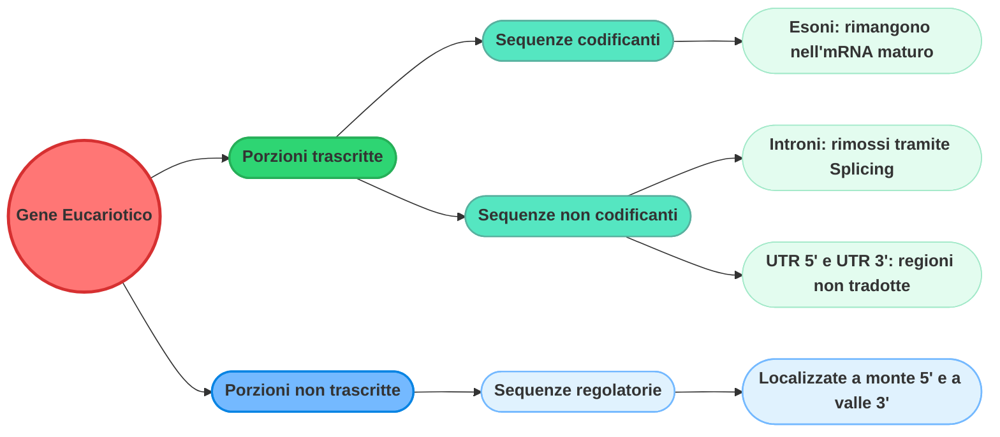
```mermaid
graph LR
    %% =========================================================================
    %% DEFINIZIONE STILI (Sfumature coerenti per ramo, NO grigi, leggibili ovunque)
    %% =========================================================================
    
    %% NODO CENTRALE (Rosso/Fucsia Inteso)
    classDef root fill:#ff7675,stroke:#d63031,stroke-width:3px,font-weight:bold;

    %% RAMO PORZIONI TRASCRITTE (Verde -> Verde Menta Chiaro Coerente)
    classDef traL1 fill:#2ed573,stroke:#26af58,stroke-width:2px,font-weight:bold;
    classDef traL2 fill:#55e6c1,stroke:#58b19f,stroke-width:1.5px;
    classDef traL3 fill:#e3fcef,stroke:#a3e9c9,stroke-width:1px;

    %% RAMO PORZIONI NON TRASCRITTE (Blu -> Celeste Chiaro Coerente)
    classDef nTraL1 fill:#74b9ff,stroke:#0984e3,stroke-width:2px,font-weight:bold;
    classDef nTraL2 fill:#e0f2fe,stroke:#74b9ff,stroke-width:1.5px;


    %% =========================================================================
    %% STRUTTURA DEL DIAGRAMMA (Integrità dei dati 1:1, angoli smussati)
    %% =========================================================================

    Gene((Gene Eucariotico)):::root

    %% Porzioni Trascritte (Ramo Verde)
    Gene --> TRA([Porzioni trascritte]):::traL1
    
    TRA --> COD([Sequenze codificanti]):::traL2
    COD --> ESO([Esoni: rimangono nell'mRNA maturo]):::traL3
    
    TRA --> NCOD([Sequenze non codificanti]):::traL2
    NCOD --> INT([Introni: rimossi tramite Splicing]):::traL3
    NCOD --> UTR([UTR 5' e UTR 3': regioni non tradotte]):::traL3

    %% Porzioni Non Trascritte (Ramo Blu)
    Gene --> NTRA([Porzioni non trascritte]):::nTraL1
    NTRA --> REG([Sequenze regolatorie]):::nTraL2
    REG --> POS([Localizzate a monte 5' e a valle 3']):::nTraL2
```

---

## Modulazione post-trascrizionale dell'mRNA

Dopo la trascrizione, il prodotto ottenuto non è ancora un mRNA pronto per essere tradotto. L'RNA sintetizzato prende il nome di **trascritto primario (pre-mRNA)** ed è generalmente più lungo dell'mRNA presente nel citoplasma perché contiene sia **esoni** sia **introni**.

Prima di poter lasciare il nucleo e raggiungere i ribosomi, il pre-mRNA deve andare incontro a una serie di modificazioni che ne aumentano la stabilità e ne permettono la corretta traduzione.

---

### Splicing

Lo **splicing** è il processo attraverso il quale gli **introni** vengono rimossi dal trascritto primario e gli **esoni** vengono uniti tra loro, formando l'**mRNA maturo**.

La lunghezza e il numero di esoni e introni variano da gene a gene.

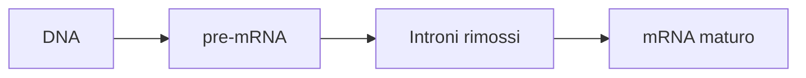
```mermaid
graph LR

A[DNA] --> B[pre-mRNA]
B --> C[Introni rimossi]
C --> D[mRNA maturo]
```

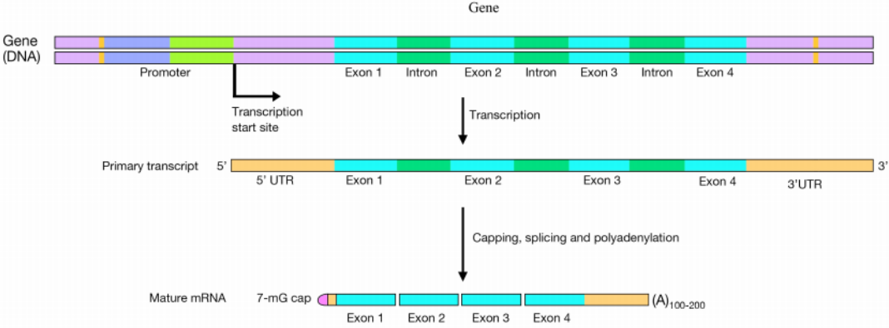

---

### Splicing alternativo

Lo **splicing alternativo** permette di ottenere proteine differenti a partire dallo stesso gene.

La cellula può infatti selezionare combinazioni diverse di esoni, producendo mRNA maturi differenti in funzione del tessuto o del momento dello sviluppo.

Ad esempio, un gene composto da tre esoni può originare:

- mRNA contenente tutti gli esoni;
- mRNA privo di un determinato esone;
- altre combinazioni di esoni.

Di conseguenza, uno stesso gene può dare origine a proteine con caratteristiche e funzioni differenti.

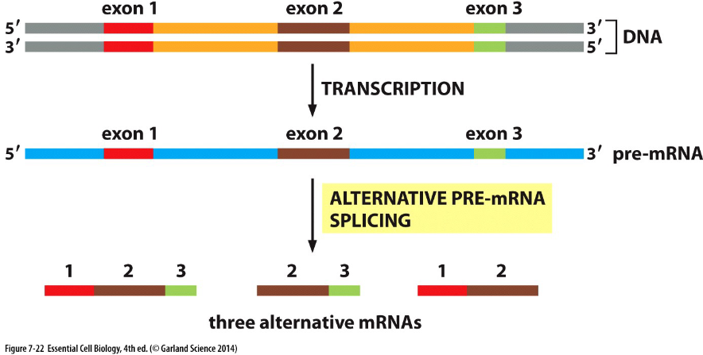

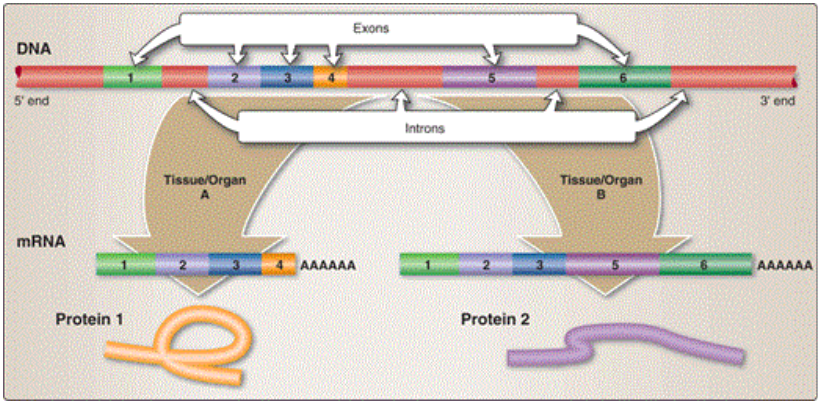

---

### 5' Cap

Quasi immediatamente dopo l'inizio della trascrizione, all'estremità **5'** dell'mRNA viene aggiunto un **residuo di metilguanosina**, chiamato **5' cap**.

Il cappuccio svolge due funzioni principali:

- protegge l'mRNA dalla degradazione ad opera delle **5'-esonucleasi**;
- facilita il riconoscimento dell'mRNA da parte del ribosoma durante la sintesi proteica.

---

### Poliadenilazione

All'estremità **3'** del trascritto primario è presente una sequenza consenso altamente conservata (**AAUAAA**), detta **segnale di poliadenilazione**.

Questa sequenza viene riconosciuta da un'endonucleasi che taglia l'RNA poco a valle del segnale.

Successivamente, l'enzima **poli(A) polimerasi** aggiunge una **coda poli(A)** costituita da circa **200-250 nucleotidi di adenina**.

La coda poli(A):

- aumenta la stabilità dell'mRNA;
- protegge il trascritto dalla degradazione da parte delle **3'-esonucleasi**;
- migliora l'efficienza della traduzione.

---

### mRNA maturo

Al termine dello splicing e dell'aggiunta del **5' cap** e della **coda poli(A)**, l'mRNA è maturo e può lasciare il nucleo per raggiungere il citoplasma, dove verrà tradotto in proteina.

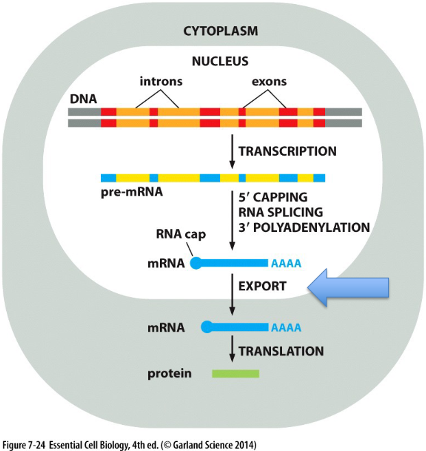

### Mermaid riassuntivo

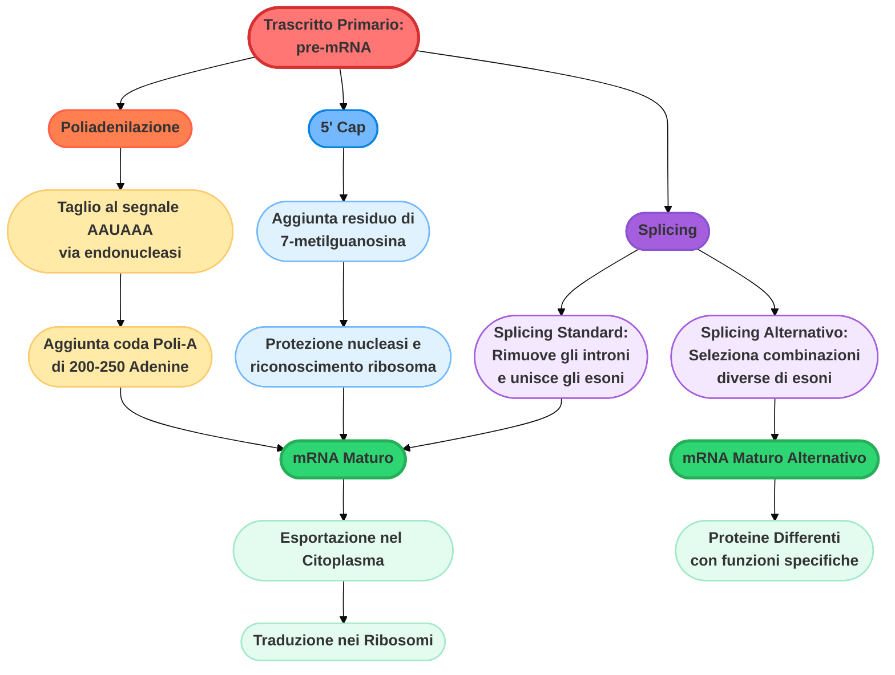
```mermaid
%%{init: {
  'theme': 'base',
  'themeVariables': {
    'fontSize': '16px',
    'fontFamily': 'arial'
  },
  'flowchart': {
    'nodeSpacing': 25,
    'rankSpacing': 45,
    'padding': 15
  }
}}%%
graph TD
    %% =========================================================================
    %% DEFINIZIONE STILI (Sfumature coerenti e leggibili)
    %% =========================================================================
    classDef root fill:#ff7675,stroke:#d63031,stroke-width:3px,font-weight:bold;
    
    classDef splL1 fill:#a55edd,stroke:#8854d0,stroke-width:2px,font-weight:bold;
    classDef splL2 fill:#f3e8ff,stroke:#a55edd,stroke-width:1.5px;

    classDef capL1 fill:#74b9ff,stroke:#0984e3,stroke-width:2px,font-weight:bold;
    classDef capL2 fill:#e0f2fe,stroke:#74b9ff,stroke-width:1.5px;

    classDef polL1 fill:#ff7f50,stroke:#ff6348,stroke-width:2px,font-weight:bold;
    classDef polL2 fill:#ffeaa7,stroke:#fdcb6e,stroke-width:1.5px;

    classDef matL1 fill:#2ed573,stroke:#26af58,stroke-width:3px,font-weight:bold;
    classDef matL2 fill:#e3fcef,stroke:#a3e9c9,stroke-width:1.5px;

    %% =========================================================================
    %% NUOVA STRUTTURA LOGICA CORRETTA (Senza incroci e senza numerazione)
    %% =========================================================================

    PRE([Trascritto Primario:<br>pre-mRNA]):::root

    %% RAMO SPLICING (Sinistra)
    PRE --> SPL([Splicing]):::splL1
    SPL --> SPL_Std([Splicing Standard:<br>Rimuove gli introni<br>e unisce gli esoni]):::splL2
    SPL --> SPL_Alt([Splicing Alternativo:<br>Seleziona combinazioni<br>diverse di esoni]):::splL2

    %% RAMO 5' CAP (Centro)
    PRE --> CAP([5' Cap]):::capL1
    CAP --> CAP_Res([Aggiunta residuo di<br>7-metilguanosina]):::capL2
    CAP_Res --> CAP_Funz([Protezione nucleasi e<br>riconoscimento ribosoma]):::capL2

    %% RAMO POLIADENILAZIONE (Destra)
    PRE --> POL([Poliadenilazione]):::polL1
    POL --> POL_Seg([Taglio al segnale AAUAAA<br>via endonucleasi]):::polL2
    POL_Seg --> POL_Enz([Aggiunta coda Poli-A<br>di 200-250 Adenine]):::polL2

    %% CONFLUENZA 1: Splicing Standard + Cap + Poli-A
    SPL_Std --> MAT([mRNA Maturo]):::matL1
    CAP_Funz --> MAT
    POL_Enz --> MAT
    
    %% Fasi finali dello standard
    MAT --> CIT([Esportazione nel Citoplasma]):::matL2
    CIT --> TRA([Traduzione nei Ribosomi]):::matL2

    %% CONFLUENZA 2: Splicing Alternativo (Genera variante che poi produce proteine differenti)
    SPL_Alt --> MAT_Alt([mRNA Maturo Alternativo]):::matL1
    MAT_Alt --> PROT([Proteine Differenti<br>con funzioni specifiche]):::matL2
```

---

## Traduzione: dal RNA alla proteina

### Componenti della traduzione

Per la sintesi di una proteina sono necessari un gran numero di componenti:

- Amminoacidi;
- mRNA da tradurre;
- RNA di riferimento (tRNA);
- Ribosomi funzionali;
- Energia;
- Enzimi e fattori proteici necessari per l'inizio, l'allungamento e la terminazione della catena polipeptidica.

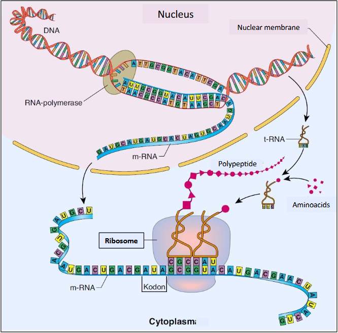

---

### Decodificazione del mRNA

#### Proprietà del codice genetico

Le caratteristiche del codice includono:

- **Specificità**: il codice genetico è specifico (univoco), ovvero un determinato codone codifica sempre lo stesso amminoacido.
- **Non sovrapposto e senza pause**: il codice genetico è non sovrapposto e senza pause, ovvero viene letto a partire da un punto di inizio fisso come una sequenza continua di basi, prese tre alla volta (codone). 
- **Degenerazione**: il codice genetico è degenerato (definito **ridondante**). Sebbene ogni codone corrisponda a un singolo amminoacido, un dato amminoacido può essere codificato da più di una tripletta. Ad esempio, l’arginina è specificata da sei codoni diversi.

#### Codoni

Un **codone** è una **sequenza di tre nucleotidi** (tre basi) presente nell'RNA messaggero (**mRNA**).
Il suo compito è dare un'istruzione al ribosoma durante la sintesi delle proteine.

Quindi, un codone, può indicare:

- Una **tripletta** di nucleotidi (AA);
- Codone **start** AUG (inizio traduzione);
- Codoni **stop** UAA, UAG, UGA (fine traduzione).

In totale, abbiamo 4 basi (AUGC) che formano 20 amminoacidi.

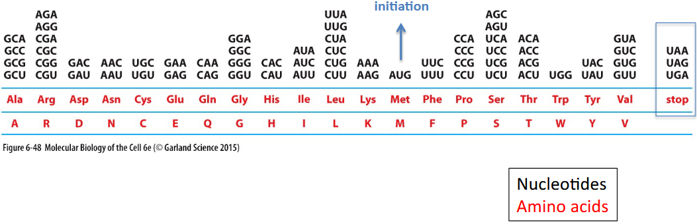

#### Mermaid riassuntivo

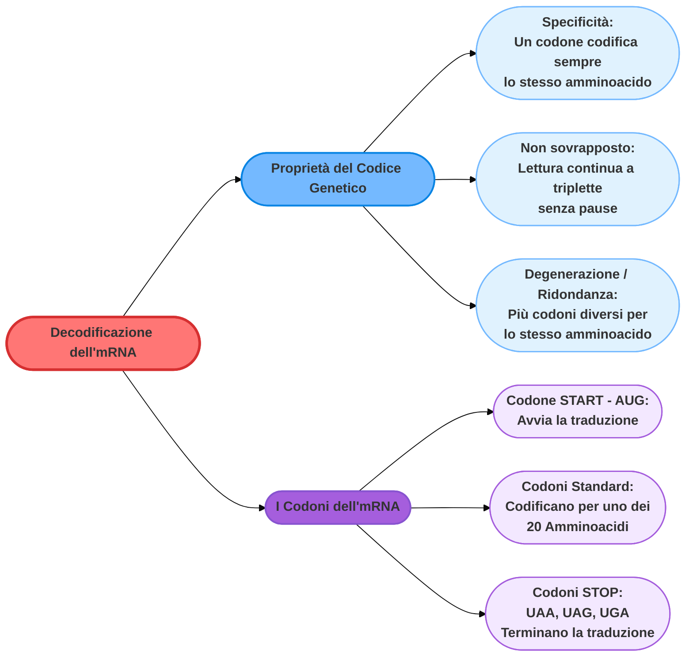
```mermaid
%%{init: {
  'theme': 'base',
  'themeVariables': {
    'fontSize': '16px',
    'fontFamily': 'arial'
  },
  'flowchart': {
    'nodeSpacing': 40,
    'rankSpacing': 50,
    'padding': 15
  }
}}%%
graph LR
    %% =========================================================================
    %% DEFINIZIONE STILI (Sfumature coerenti, leggibili in chiaro/scuro)
    %% =========================================================================
    classDef root fill:#ff7675,stroke:#d63031,stroke-width:3px,font-weight:bold;
    
    classDef prop fill:#74b9ff,stroke:#0984e3,stroke-width:2px,font-weight:bold;
    classDef propL2 fill:#e0f2fe,stroke:#74b9ff,stroke-width:1.5px;

    classDef cod fill:#a55edd,stroke:#8854d0,stroke-width:2px,font-weight:bold;
    classDef codL2 fill:#f3e8ff,stroke:#a55edd,stroke-width:1.5px;

    %% =========================================================================
    %% STRUTTURA DEL DIAGRAMMA (Senza incroci di frecce)
    %% =========================================================================

    DEC([Decodificazione dell'mRNA]):::root

    %% RAMO SINISTRO: PROPRIETÀ DEL CODICE
    DEC --> PROP([Proprietà del Codice Genetico]):::prop
    
    PROP --> P_Spec([Specificità:<br>Un codone codifica sempre<br>lo stesso amminoacido]):::propL2
    PROP --> P_Cont([Non sovrapposto:<br>Lettura continua a triplette<br>senza pause]):::propL2
    PROP --> P_Deg([Degenerazione / Ridondanza:<br>Più codoni diversi per<br>lo stesso amminoacido]):::propL2

    %% RAMO DESTRO: STRUTTURA DEI CODONI
    DEC --> CODONI([I Codoni dell'mRNA]):::cod
    
    CODONI --> C_Start([Codone START - AUG:<br>Avvia la traduzione]):::codL2
    CODONI --> C_AA([Codoni Standard:<br>Codificano per uno dei<br>20 Amminoacidi]):::codL2
    CODONI --> C_Stop([Codoni STOP:<br>UAA, UAG, UGA<br>Terminano la traduzione]):::codL2
```

---

### tRNA

#### Struttura e funzione

I **tRNA (RNA di trasferimento)** sono molecole adattatrici che permettono di trasformare l'informazione contenuta nell'mRNA in una sequenza di amminoacidi.

Il loro ruolo è fondamentale perché:

- l'mRNA contiene informazioni scritte sotto forma di **codoni di nucleotidi**;
- le proteine sono formate da **amminoacidi**; 
- il tRNA collega questi due linguaggi, portando al ribosoma l'amminoacido corretto in base al codone presente sull'mRNA.

Ogni tRNA possiede due regioni funzionali:

- **Sito di legame per l'amminoacido**: permette di trasportare uno specifico amminoacido fino al ribosoma;
- **Anticodone**: tripletta di nucleotidi complementare al codone dell'mRNA, che permette il riconoscimento della corretta posizione nella catena proteica.

Durante la traduzione, il tRNA si lega temporaneamente all'mRNA attraverso l'appaiamento **codone-anticodone** e consegna l'amminoacido corretto, che viene poi aggiunto alla catena polipeptidica in crescita.

Per ogni amminoacido è necessario almeno un tipo specifico di tRNA. Nell'uomo esistono almeno **50 specie di tRNA**; poiché gli amminoacidi sono solo 20 ma i codoni sono 64, alcuni amminoacidi possiedono più tRNA specifici.

Così il messaggio chiave diventa evidente:

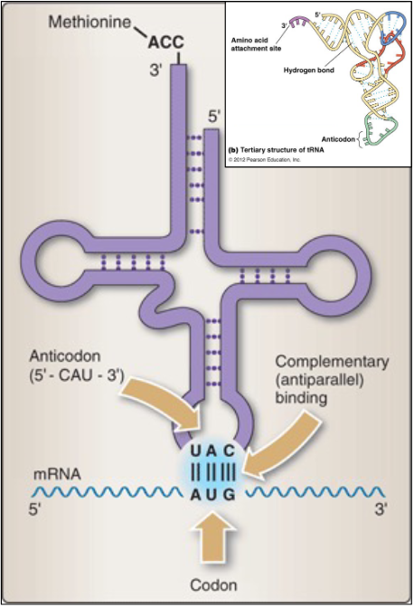

---

### Ribosomi

#### Struttura

I **ribosomi** sono grandi complessi costituiti da **RNA ribosomiale (rRNA)** e proteine. Sono formati da due subunità, una **maggiore** e una **minore**, le cui dimensioni vengono espresse attraverso il coefficiente di sedimentazione **S (Svedberg)**.

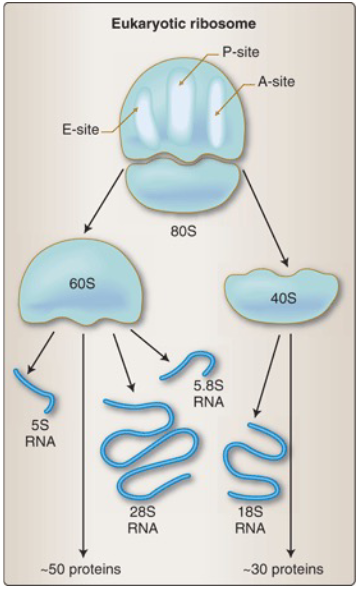

#### Funzione

Il ribosoma rappresenta la sede della **traduzione**, ovvero il processo in cui l'informazione contenuta nell'mRNA viene utilizzata per sintetizzare una proteina.

La **subunità minore** si lega all'mRNA e garantisce la corretta lettura del codice genetico, favorendo l'appaiamento tra il **codone dell'mRNA** e l'**anticodone del tRNA**.

La **subunità maggiore** catalizza invece la formazione dei **legami peptidici** che permettono di unire gli amminoacidi e formare la catena polipeptidica.

Il ribosoma possiede quattro siti funzionali importanti: un sito di legame per l'mRNA e tre siti dedicati al legame con i tRNA.

I tre siti per i tRNA sono:

- **Sito A** (aminoacyl): accoglie il tRNA che trasporta il nuovo amminoacido da aggiungere alla catena polipeptidica.
- **Sito P** (peptidyl): contiene il tRNA legato alla catena polipeptidica in crescita.
- **Sito E** (exit): permette l'uscita del tRNA ormai privo di amminoacido.

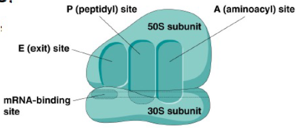

---

## Meccanismo della traduzione

La traduzione, è un processo che può essere diviso in 3 fasi:

1. Iniziazione: durante la fase di **iniziazione**, il ribosoma si lega all'mRNA e riconosce il **codone di inizio AUG**. Il tRNA iniziatore, che trasporta il primo amminoacido, si lega al codone iniziale attraverso l'appaiamento tra il proprio anticodone e il codone presente sull'mRNA. Questo permette il corretto assemblaggio dell'apparato di traduzione;
2. Elongazione: durante la fase di **allungamento** (elongazione), nuovi tRNA portano al ribosoma gli amminoacidi corrispondenti alla sequenza dei codoni presenti sull'mRNA. Il ribosoma favorisce la formazione dei **legami peptidici** tra gli amminoacidi, permettendo l'allungamento progressivo della catena polipeptidica;
3. Terminazione: durante la fase di **terminazione**, il ribosoma raggiunge un **codone di stop** sull'mRNA, che non codifica per nessun amminoacido ma viene riconosciuto da specifici **fattori di rilascio**. Questo determina il distacco della proteina appena sintetizzata e la conclusione del processo di traduzione.

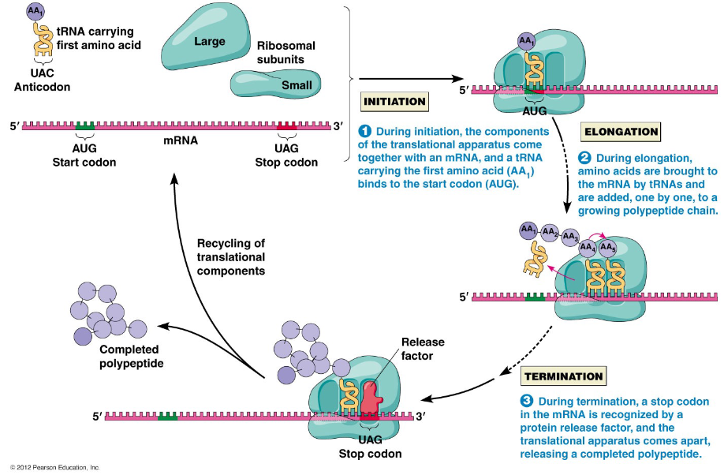

### Iniziazione

La **fase di iniziazione** della traduzione inizia con il legame dei **fattori di iniziazione** (IF nei procarioti, eIF negli eucarioti) e di una molecola di **GTP** alla **subunità minore del ribosoma**.

Successivamente l'**mRNA** si lega alla subunità minore del ribosoma nella posizione corretta, permettendo il riconoscimento del **codone di inizio AUG**.

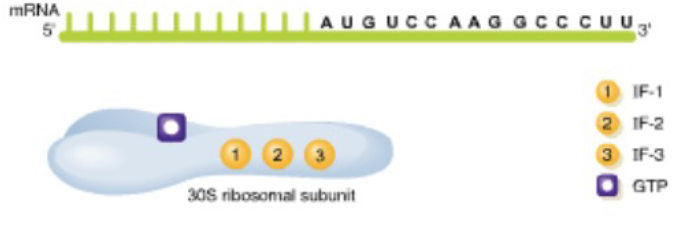

La traduzione inizia sempre dal codone **AUG**, che codifica per una **metionina**. Nei batteri il primo amminoacido inserito è una **formil-metionina (fMet)**.

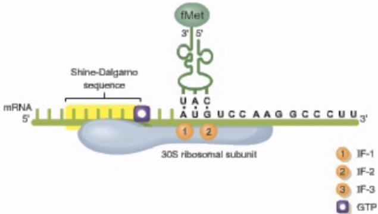

Il **tRNA iniziatore**, che trasporta la metionina, si lega al codone AUG attraverso l'appaiamento **codone-anticodone** e si posiziona direttamente nel **sito P** del ribosoma.

L'ultimo passaggio dell'iniziazione consiste nel legame della **subunità maggiore** del ribosoma, accompagnato dall'**idrolisi del GTP** e dal rilascio dei **fattori di iniziazione**.

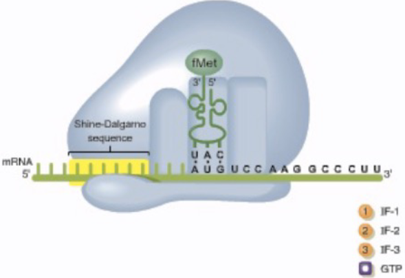

A questo punto il ribosoma è completamente assemblato e può iniziare la fase di **allungamento (elongazione)**.

---

### Allungamento (elongazione)

Durante la fase di **allungamento**, il ribosoma legge i codoni dell'mRNA e aggiunge progressivamente nuovi amminoacidi alla catena polipeptidica.

Al termine dell'iniziazione, il **Met-tRNA iniziatore** si trova nel **sito P** del ribosoma.

Un nuovo **aminoacil-tRNA**, associato al fattore di elongazione **EF-Tu** e a **GTP**, entra nel **sito A**. L'**anticodone del tRNA** riconosce il codone complementare sull'mRNA, permettendo l'inserimento dell'amminoacido corretto.

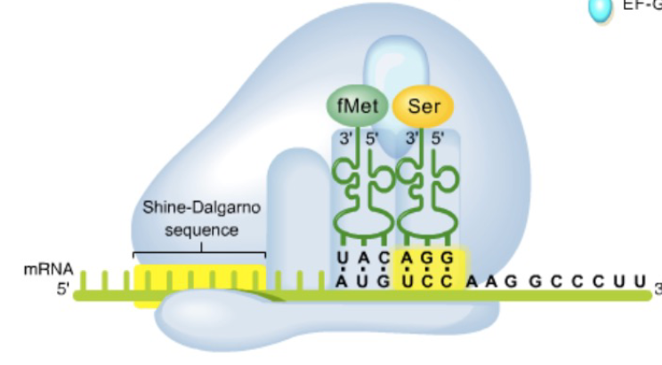

#### Formazione del legame peptidico

La **peptidil-transferasi**, presente nella subunità maggiore del ribosoma, catalizza la formazione del **legame peptidico** tra gli amminoacidi presenti nei siti P e A.

Questa attività è svolta dall'**rRNA** e non da una proteina: il ribosoma è quindi considerato un **ribozima**.

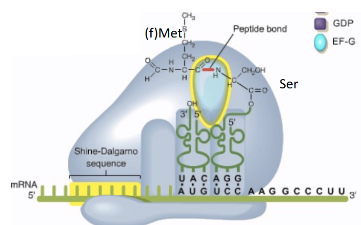

#### Traslocazione del ribosoma

Dopo la formazione del legame peptidico, il fattore di elongazione **EF-G**, associato a **GTP**, permette lo spostamento del ribosoma lungo l'mRNA.

Durante la traslocazione:

→ il tRNA scarico passa al **sito E** ed esce dal ribosoma  
→ il tRNA con la catena polipeptidica passa dal **sito A** al **sito P** 

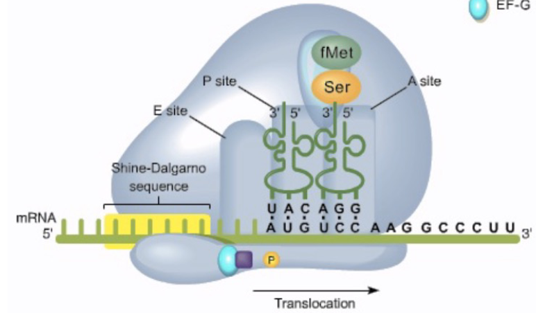

→ il **sito A** si libera per accogliere un nuovo aminoacil-tRNA

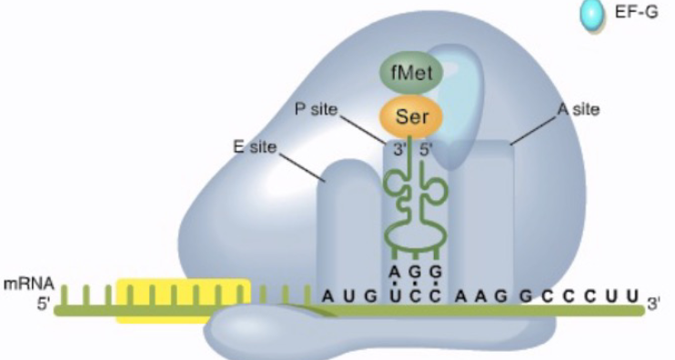

Il ciclo continua fino al raggiungimento di un **codone di stop**, che avvia la terminazione della traduzione.

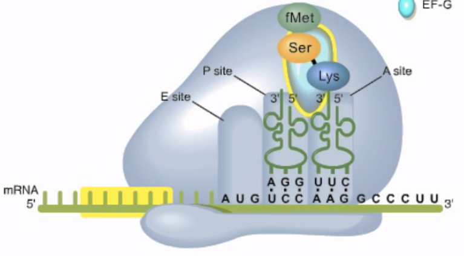

---

### Terminazione

Il processo di **allungamento** continua fino a quando il ribosoma raggiunge uno dei tre **codoni di stop** presenti sull'mRNA:

→ **UAA**  
→ **UAG**  
→ **UGA**

Per i codoni di stop non esistono tRNA corrispondenti. Al loro posto si legano specifiche proteine chiamate **fattori di rilascio**, che riconoscono il codone di stop e determinano la conclusione della traduzione.

Il legame dei fattori di rilascio provoca il distacco della **catena polipeptidica completata** e la dissociazione del complesso di traduzione.

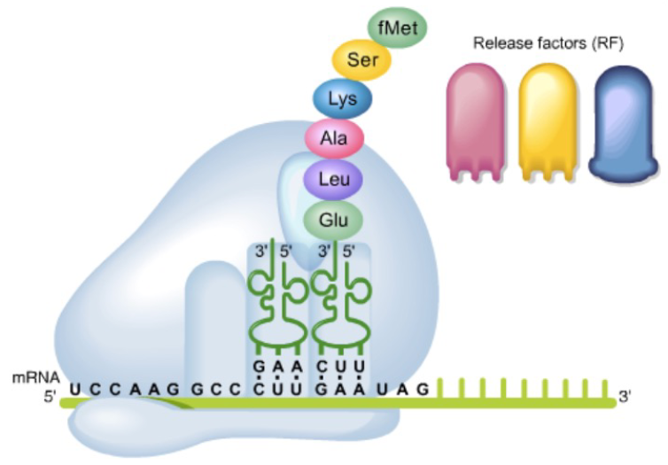

Nella descrizione precedente è stato considerato il funzionamento di un singolo ribosoma. Nella cellula reale, però, più ribosomi possono tradurre contemporaneamente la stessa molecola di mRNA formando una struttura chiamata **polisoma (o poliribosoma)**.

### Mermaid riassuntivo

```mermaid
%%{init: {
  'theme': 'base',
  'themeVariables': {
    'fontSize': '16px',
    'fontFamily': 'arial'
  },
  'flowchart': {
    'nodeSpacing': 25,
    'rankSpacing': 40,
    'padding': 15
  }
}}%%
graph TD
    %% =========================================================================
    %% DEFINIZIONE STILI (Sfumature cromatiche coerenti)
    %% =========================================================================
    classDef root fill:#ff7675,stroke:#d63031,stroke-width:3px,font-weight:bold;
    
    classDef ini fill:#a55edd,stroke:#8854d0,stroke-width:2px,font-weight:bold;
    classDef iniL2 fill:#f3e8ff,stroke:#a55edd,stroke-width:1.5px;

    classDef elo fill:#74b9ff,stroke:#0984e3,stroke-width:2px,font-weight:bold;
    classDef eloL2 fill:#e0f2fe,stroke:#74b9ff,stroke-width:1.5px;

    classDef ter fill:#ff7f50,stroke:#ff6348,stroke-width:2px,font-weight:bold;
    classDef terL2 fill:#ffeaa7,stroke:#fdcb6e,stroke-width:1.5px;

    classDef fine fill:#2ed573,stroke:#26af58,stroke-width:3px,font-weight:bold;

    %% =========================================================================
    %% STRUTTURA A CONTINUUM LINEARE
    %% =========================================================================

    TRAD([Processo della Traduzione]):::root

    %% 1. INIZIAZIONE (Ramo Viola)
    TRAD --> INI([1. Iniziazione]):::ini
    INI --> INI_1([Fattori di iniziazione + GTP<br>si legano alla subunità minore]):::iniL2
    INI_1 --> INI_2([L'mRNA si lega alla subunità minore<br>e viene riconosciuto AUG]):::iniL2
    INI_2 --> INI_3([Il tRNA iniziatore con Metionina<br>si inserisce nel Sito P]):::iniL2
    INI_3 --> INI_4([Subunità maggiore si unisce<br>con idrolisi di GTP]):::iniL2

    %% CONTINUUM VERSO L'ELONGAZIONE (Ramo Blu)
    INI_4 --> ELO([2. Elongazione]):::elo
    ELO --> ELO_1([EF-Tu + GTP inseriscono<br>nuovo aminoacil-tRNA nel Sito A]):::eloL2
    ELO_1 --> ELO_2([rRNA della subunità maggiore<br>catalizza il legame peptidico]):::eloL2
    ELO_2 --> ELO_3([EF-G + GTP spingono la traslocazione:<br>tRNA scarico va in E ed esce]):::eloL2
    ELO_3 --> ELO_4([Il peptidil-tRNA passa nel Sito P<br>e il Sito A torna libero]):::eloL2

    %% CONTINUUM VERSO LA TERMINAZIONE (Ramo Arancio)
    ELO_4 -->|Ciclo ripetuto per ogni codone| ELO
    ELO_4 -->|Raggiungimento codone di STOP| TER([3. Terminazione]):::ter
    
    TER --> TER_1([Il ribosoma incontra un codone<br>di STOP nel Sito A: UAA, UAG, UGA]):::terL2
    TER_1 --> TER_2([I Fattori di Rilascio si legano<br>al posto del tRNA]):::terL2
    TER_2 --> TER_3([Idrolisi e distacco della<br>catena polipeptidica]):::terL2

    %% FINE DEL CONTINUUM (Verde)
    TER_3 --> DIS([Dissociazione del ribosoma<br>e rilascio della proteina]):::fine
```

## Modulazione della funzione proteica

Dopo la **traduzione**, molte proteine possono subire modificazioni che ne regolano la funzione. Questi processi sono chiamati **modificazioni post-traduzionali** (*post-translational modifications*).

Le modificazioni post-traduzionali consistono nell'aggiunta o nella rimozione di gruppi chimici sulla proteina e possono influenzarne:

- attività;
- localizzazione cellulare;
- stabilità;  
- interazioni con altre molecole.  

Esempi di modificazioni post-traduzionali sono:

- **fosforilazione**  
- **glicosilazione**  
- **ubiquitinazione**  
- **lipidazione**  
- **metilazione**  
- **acetilazione**

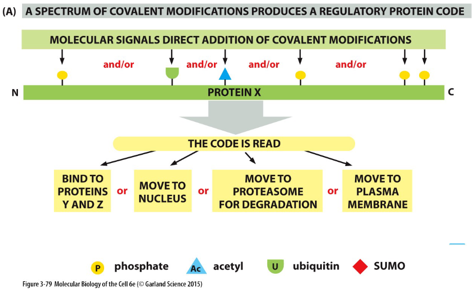

---

### Fosforilazione

Per dare un esempio, a **fosforilazione** è una modificazione post-traduzionale **reversibile** che consiste nell'aggiunta di un gruppo fosfato alla proteina.

I principali amminoacidi coinvolti sono:

- **serina**;
- **treonina**;
- **tirosina**.

La fosforilazione è regolata da due tipi di enzimi:

- **chinasi**: aggiungono un gruppo fosfato alla proteina;  
- **fosfatasi**: rimuovono il gruppo fosfato.  

Nell'uomo sono presenti circa **518 proteine chinasi**:

→ circa **428** coinvolte principalmente nella fosforilazione di serina e treonina  
→ circa **90** appartenenti alla famiglia delle tirosin-chinasi  

Al contrario, esistono circa **200 fosfatasi**, che agiscono rimuovendo gruppi fosfato da proteine o lipidi.

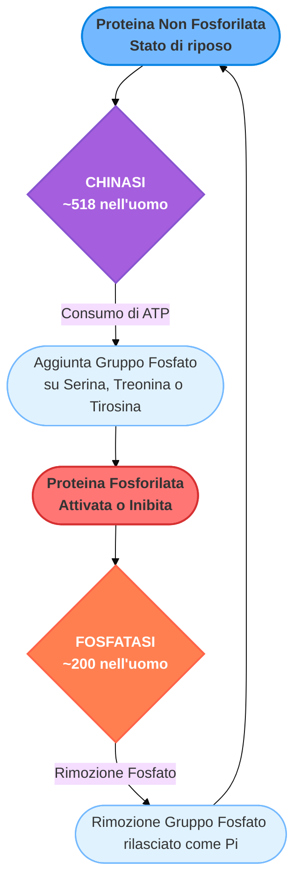
```mermaid
%%{init: {
  'theme': 'base',
  'themeVariables': {
    'fontSize': '16px',
    'fontFamily': 'arial'
  },
  'flowchart': {
    'nodeSpacing': 30,
    'rankSpacing': 45,
    'padding': 15
  }
}}%%
graph TD
    %% =========================================================================
    %% DEFINIZIONE STILI (Sfumature cromatiche coerenti)
    %% =========================================================================
    classDef stato1 fill:#74b9ff,stroke:#0984e3,stroke-width:2px,font-weight:bold;
    classDef stato2 fill:#ff7675,stroke:#d63031,stroke-width:2px,font-weight:bold;
    
    classDef enzKin fill:#a55edd,stroke:#8854d0,stroke-width:2px,font-weight:bold,color:#fff;
    classDef enzPhos fill:#ff7f50,stroke:#ff6348,stroke-width:2px,font-weight:bold,color:#fff;
    
    classDef info fill:#e0f2fe,stroke:#74b9ff,stroke-width:1.5px;

    %% =========================================================================
    %% STRUTTURA DEL CICLO DI REGOLAZIONE
    %% =========================================================================

    %% Stato Iniziale (De-fosforilata)
    PROT_OFF([Proteina Non Fosforilata<br>Stato di riposo]):::stato1

    %% Processo di Fosforilazione
    PROT_OFF --> KIN{CHINASI<br>~518 nell'uomo}:::enzKin
    
    KIN -->|Consumo di ATP| KIN_ACT([Aggiunta Gruppo Fosfato<br>su Serina, Treonina o Tirosina]):::info
    
    %% Stato Attivo/Modificato
    KIN_ACT --> PROT_ON([Proteina Fosforilata<br>Attivata o Inibita]):::stato2

    %% Processo di Defosforilazione (Ritorno)
    PROT_ON --> PHOS{FOSFATASI<br>~200 nell'uomo}:::enzPhos
    
    PHOS -->|Rimozione Fosfato| PHOS_ACT([Rimozione Gruppo Fosfato rilasciato come Pi]):::info
    
    %% Chiusura del ciclo reversibile
    PHOS_ACT --> PROT_OFF
```

---

### Regolazione attraverso la fosforilazione

Una singola proteina può possedere diversi **siti di fosforilazione**, localizzati su differenti residui di serina, treonina, tirosina. 

Ogni sito può essere regolato da una o più chinasi differenti.

Poiché una stessa chinasi può agire su più proteine e più siti, la fosforilazione permette di generare risposte cellulari complesse, attraverso l'attivazione o l'inibizione di specifiche funzioni proteiche.

---

## Degradazione proteica

### Funzioni della degradazione proteica

La degradazione delle proteine svolge un ruolo importante nella **modulazione** della funzione proteica.

Inoltre, permette alla cellula di:

- mantenere una disponibilità costante di **amminoacidi**;
- prevenire l'accumulo di **proteine anomale o danneggiate**.

Nella cellula esistono due principali vie di degradazione proteica:

- **via proteasomiale**
- **via lisosomiale**

---

### Vie principali di degradazione

#### Via proteasomiale

La via del **proteasoma** è un processo di degradazione proteica **ATP-dipendente** che avviene nel citosol.

L'energia fornita dall'ATP è necessaria principalmente per il riconoscimento, lo svolgimento (*unfolding*) e il trasferimento delle proteine all'interno del proteasoma.

È particolarmente attiva nei confronti di:

- proteine a breve emivita (*short-lived proteins*), con tempi di degradazione nell'ordine di secondi o minuti;
- proteine difettose o danneggiate;
- enzimi regolatori chiave delle vie metaboliche.

#### Via lisosomiale

La via lisosomiale coinvolge i **lisosomi**, organelli cellulari dotati della capacità di degradare diverse molecole biologiche.

Questa via è principalmente coinvolta nella degradazione di proteine con **lunga emivita**, come:

- proteine strutturali;
- proteine di membrana;
- proteine extracellulari.

---

### Proteasoma 26S

Il **proteasoma 26S** è un grande complesso proteico formato da circa 60 subunità e presenta una struttura simile a un cilindro.

È costituito da:

- un **core centrale 20S**, dove avviene la degradazione delle proteine;
- due particelle regolatorie **19S**, poste alle estremità del complesso.

#### Particella regolatoria 19S

La particella **19S** contiene diverse **ATPasi** e altri enzimi coinvolti nelle fasi iniziali della degradazione.

Le sue funzioni principali sono:

- riconoscere e legare le proteine marcate con poliubiquitina;
- rimuovere le molecole di ubiquitina;
- svolgere la proteina (*unfolding*);
- trasferire la proteina all'interno del core 20S.

#### Degradazione nel core 20S

Una volta entrata nel core centrale, la proteina viene degradata tramite **idrolisi** in peptidi più piccoli.

Questi peptidi vengono successivamente ulteriormente degradati da **peptidasi citosoliche**, liberando singoli amminoacidi riutilizzabili dalla cellula.

---

### Ubiquitinazione

La degradazione tramite proteasoma utilizza una piccola proteina chiamata **ubiquitina**.

L'ubiquitina è una proteina altamente conservata composta da **76 amminoacidi** e presente in tutti gli organismi eucariotici.

Le proteine destinate alla degradazione vengono marcate attraverso l'aggiunta covalente di numerose molecole di ubiquitina, formando una catena di **poliubiquitina**.

La poliubiquitinazione funziona come un **segnale di riconoscimento** che indirizza la proteina verso il **proteasoma** per la degradazione.

Il trasferimento dell'ubiquitina alla proteina bersaglio avviene attraverso una cascata enzimatica composta da tre principali tipi di enzimi:

- **E1 (enzima attivatore dell'ubiquitina)**: attiva l'ubiquitina in un processo dipendente dall'ATP, formando un legame covalente tra ubiquitina e un residuo di cisteina dell'enzima E1.

- **E2 (enzima coniugatore dell'ubiquitina)**: riceve l'ubiquitina dall'E1, formando un legame covalente con il residuo catalitico di cisteina.

- **E3 (ubiquitina ligasi)**: riconosce la proteina bersaglio e catalizza il trasferimento dell'ubiquitina sulla proteina, generalmente su un residuo di **lisina**. Le E3 ligasi conferiscono specificità al processo, determinando quali proteine vengono indirizzate alla degradazione.

Attraverso cicli successivi, vengono aggiunte ulteriori molecole di ubiquitina formando una catena di **poliubiquitina** che indirizza la proteina verso il proteasoma.

---

### Deubiquitinazione

Le **deubiquitinasi (DUB)** sono enzimi che rimuovono l'ubiquitina dalle proteine bersaglio o dai precursori dell'ubiquitina.

La deubiquitinazione permette:

- il **riciclo dell'ubiquitina libera**;
- la regolazione della degradazione proteica;
- il controllo del destino delle proteine prima della loro degradazione definitiva.

---

### Mermaid riassuntivo

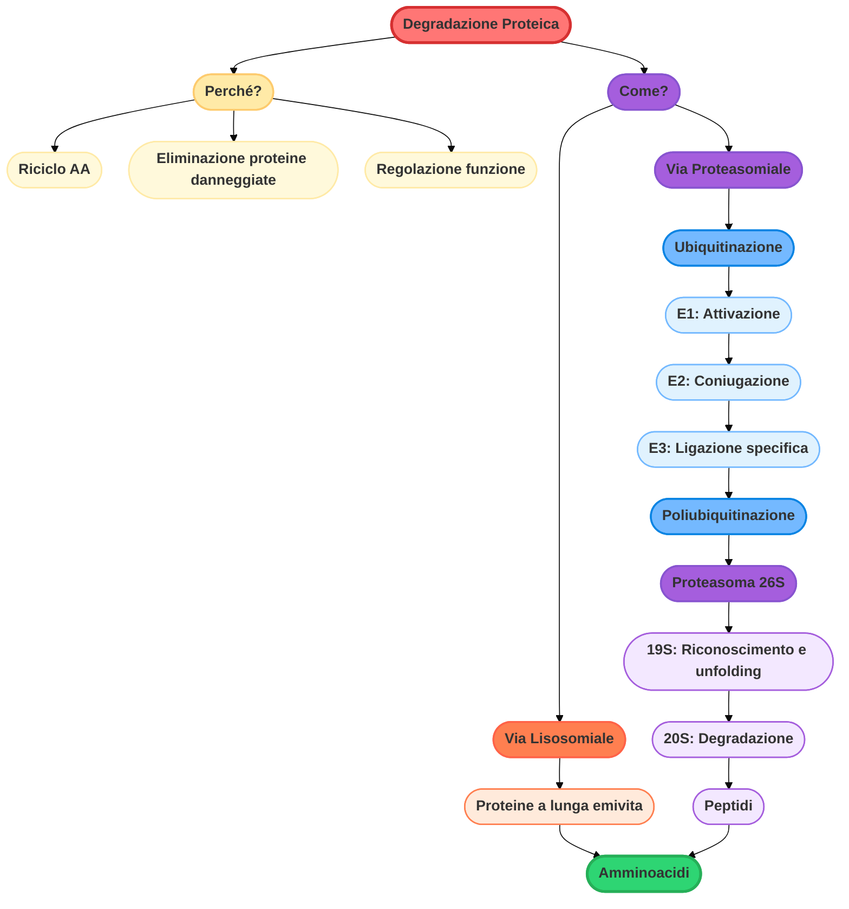
```mermaid
%%{init: {
  'theme': 'base',
  'themeVariables': {
    'fontSize': '16px',
    'fontFamily': 'arial'
  },
  'flowchart': {
    'nodeSpacing': 30,
    'rankSpacing': 35,
    'padding': 15
  }
}}%%
graph TD
    %% =========================================================================
    %% DEFINIZIONE STILI (Sfumature coerenti, bordi e testi ad alto contrasto)
    %% =========================================================================
    classDef root fill:#ff7675,stroke:#d63031,stroke-width:3px,font-weight:bold;
    
    classDef perche fill:#ffeaa7,stroke:#fdcb6e,stroke-width:2px,font-weight:bold;
    classDef percheL2 fill:#fff9db,stroke:#ffeaa7,stroke-width:1.5px;

    classDef come fill:#a55edd,stroke:#8854d0,stroke-width:2px,font-weight:bold;
    
    classDef lis fill:#ff7f50,stroke:#ff6348,stroke-width:2px,font-weight:bold;
    classDef lisL2 fill:#ffeadb,stroke:#ff7f50,stroke-width:1.5px;

    classDef prot fill:#a55edd,stroke:#8854d0,stroke-width:2px,font-weight:bold;
    classDef protL2 fill:#f3e8ff,stroke:#a55edd,stroke-width:1.5px;

    classDef ubi fill:#74b9ff,stroke:#0984e3,stroke-width:2px,font-weight:bold;
    classDef ubiL2 fill:#e0f2fe,stroke:#74b9ff,stroke-width:1.5px;

    classDef endG fill:#2ed573,stroke:#26af58,stroke-width:3px,font-weight:bold;

    %% =========================================================================
    %% STRUTTURA LINEARE E BIOLOGICAMENTE RIGOROSA
    %% =========================================================================

    A(["Degradazione Proteica"]):::root

    %% BIVIO GENERALE
    A --> B(["Perché?"]):::perche
    A --> C(["Come?"]):::come

    %% RAMO PERCHÉ
    B --> B1(["Riciclo AA"]):::percheL2
    B --> B2(["Eliminazione proteine danneggiate"]):::percheL2
    B --> B3(["Regolazione funzione"]):::percheL2

    %% RAMO COME
    C --> D(["Via Lisosomiale"]):::lis
    C --> E(["Via Proteasomiale"]):::prot

    %% FLUSSO 1: VIA LISOSOMIALE (Lineare e diretta)
    D --> D1(["Proteine a lunga emivita"]):::lisL2
    D1 --> J(["Amminoacidi"]):::endG

    %% FLUSSO 2: VIA PROTEASOMIALE (Cascata sequenziale perfetta)
    E --> F(["Ubiquitinazione"]):::ubi
    F --> F1(["E1: Attivazione"]):::ubiL2
    F1 --> F2(["E2: Coniugazione"]):::ubiL2
    F2 --> F3(["E3: Ligazione specifica"]):::ubiL2
    F3 --> G(["Poliubiquitinazione"]):::ubi
    
    %% Blocco Proteasoma 26S (Tutto coerentemente Viola)
    G --> H(["Proteasoma 26S"]):::prot
    H --> H1(["19S: Riconoscimento e unfolding"]):::protL2
    H1 --> H2(["20S: Degradazione"]):::protL2
    
    H2 --> I(["Peptidi"]):::protL2
    I --> J
```

---

## Riassunto finale

### Mermaid

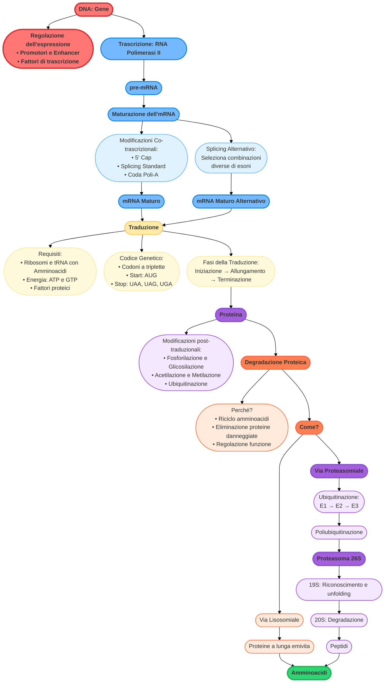
```mermaid
%%{init: {
  'theme': 'base',
  'themeVariables': {
    'fontSize': '15px',
    'fontFamily': 'arial'
  },
  'flowchart': {
    'nodeSpacing': 20,
    'rankSpacing': 35,
    'padding': 12
  }
}}%%
graph TD
    %% =========================================================================
    %% DEFINIZIONE STILI (Coerenza cromatica per ogni macro-fase biologica)
    %% =========================================================================
    classDef dna fill:#ff7675,stroke:#d63031,stroke-width:3px,font-weight:bold;
    classDef rna fill:#74b9ff,stroke:#0984e3,stroke-width:2px,font-weight:bold;
    classDef rnaL2 fill:#e0f2fe,stroke:#74b9ff,stroke-width:1.5px;
    
    classDef trad fill:#ffeaa7,stroke:#fdcb6e,stroke-width:2px,font-weight:bold;
    classDef tradL2 fill:#fff9db,stroke:#ffeaa7,stroke-width:1.5px;

    classDef prot fill:#a55edd,stroke:#8854d0,stroke-width:3px,font-weight:bold;
    classDef protL2 fill:#f3e8ff,stroke:#a55edd,stroke-width:1.5px;

    classDef deg fill:#ff7f50,stroke:#ff6348,stroke-width:2px,font-weight:bold;
    classDef degL2 fill:#ffeadb,stroke:#ff7f50,stroke-width:1.5px;

    classDef endG fill:#2ed573,stroke:#26af58,stroke-width:3px,font-weight:bold;

    %% =========================================================================
    %% FLUSSO CONTINUO DAL GENE ALLA DEGRADAZIONE
    %% =========================================================================

    A(["DNA: Gene"]):::dna
    
    %% Regolazione del Gene (Compattata in un unico blocco per non allargare)
    A --> B(["Regolazione dell'espressione<br/>• Promotori e Enhancer<br/>• Fattori di trascrizione"]):::dna

    %% Trascrizione
    A --> C(["Trascrizione: RNA Polimerasi II"]):::rna
    C --> D(["pre-mRNA"]):::rna

    %% Maturazione mRNA (Flusso standard e alternativo)
    D --> E(["Maturazione dell'mRNA"]):::rna
    E --> E_Std(["Modificazioni Co-trascrizionali:<br/>• 5' Cap<br/>• Splicing Standard<br/>• Coda Poli-A"]):::rnaL2
    E --> E_Alt(["Splicing Alternativo:<br/>Seleziona combinazioni<br/>diverse di esoni"]):::rnaL2

    E_Std --> F(["mRNA Maturo"]):::rna
    E_Alt --> F_Alt(["mRNA Maturo Alternativo"]):::rna

    %% Traduzione
    F --> G(["Traduzione"]):::trad
    F_Alt --> G

    G --> G_Comp(["Requisiti:<br/>• Ribosomi e tRNA con Amminoacidi<br/>• Energia: ATP e GTP<br/>• Fattori proteici"]):::tradL2
    
    G --> G_Cod(["Codice Genetico:<br/>• Codoni a triplette<br/>• Start: AUG<br/>• Stop: UAA, UAG, UGA"]):::tradL2

    G --> G_Fasi(["Fasi della Traduzione:<br/>Iniziazione → Allungamento → Terminazione"]):::tradL2

    %% Proteina
    G_Fasi --> H(["Proteina"]):::prot
    
    %% Modificazioni Post-Traduzionali
    H --> I(["Modificazioni post-traduzionali:<br/>• Fosforilazione e Glicosilazione<br/>• Acetilazione e Metilazione<br/>• Ubiquitinazione"]):::protL2

    %% Destino Finale: Degradazione
    H --> J(["Degradazione Proteica"]):::deg

    %% Perché e Come (Ispirato al tuo schema perfetto)
    J --> J_Perche(["Perché?<br/>• Riciclo amminoacidi<br/>• Eliminazione proteine danneggiate<br/>• Regolazione funzione"]):::degL2
    
    J --> J_Come(["Come?"]):::deg
    
    J_Come --> K(["Via Lisosomiale"]):::degL2
    J_Come --> L(["Via Proteasomiale"]):::prot

    %% Sotto-flusso 1: Lisosoma
    K --> K1(["Proteine a lunga emivita"]):::degL2
    K1 --> O(["Amminoacidi"]):::endG

    %% Sotto-flusso 2: Proteasoma (La cascata lineare e corretta)
    L --> L1(["Ubiquitinazione:<br/>E1 → E2 → E3"]):::protL2
    L1 --> L2(["Poliubiquitinazione"]):::protL2
    L2 --> M(["Proteasoma 26S"]):::prot
    M --> M1(["19S: Riconoscimento e unfolding"]):::protL2
    M1 --> M2(["20S: Degradazione"]):::protL2
    M2 --> N(["Peptidi"]):::protL2
    N --> O
```

### Immagine
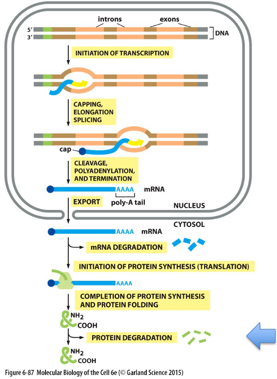