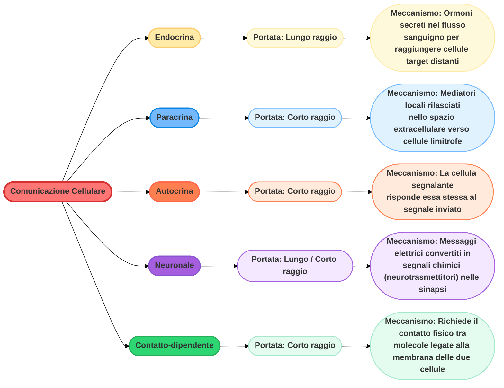
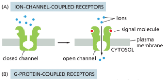
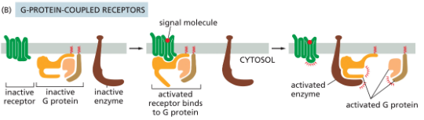
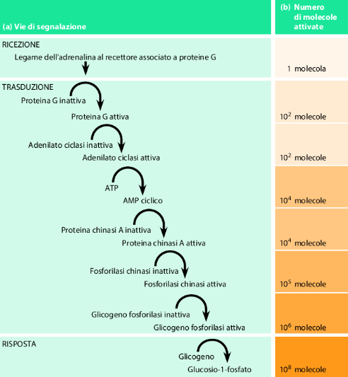
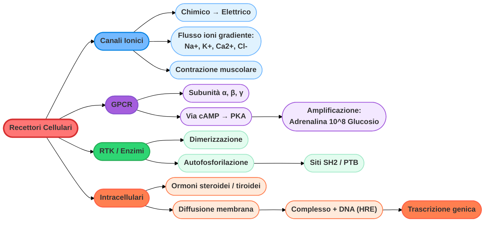
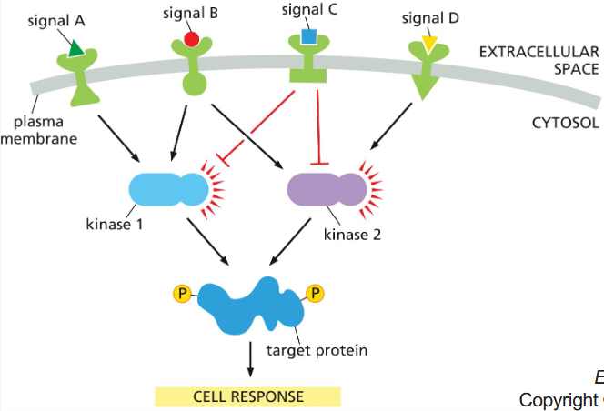

# Cell Signaling

## Principi generali del cell signaling

La segnalazione cellulare rappresenta il meccanismo fondamentale attraverso il quale le cellule percepiscono e rispondono al proprio ambiente. Il processo si articola attraverso il rilascio di molecole segnale che possono agire a corto o lungo raggio, attivando recettori specifici che trasducono l'informazione in una risposta biochimica o genetica. Principalmente si osservano queste caratteristiche:

- **Diversità e specificità**: un set limitato di segnali extracellulari può produrre una vasta gamma di comportamenti cellulari (sopravvivenza, crescita, differenziazione o morte) a seconda dell'integrazione dei segnali stessi.
- **Classificazione dei recettori**: i recettori di superficie si dividono in tre classi principali: accoppiati a canali ionici, accoppiati a proteine G (GPCR) e accoppiati a enzimi (RTK).
- **Meccanismi di amplificazione**: le cascate di segnalazione intracellulare, in particolare quelle mediate da secondi messaggeri come l'AMP ciclico (cAMP), consentono un'amplificazione del segnale fino a otto ordini di grandezza.
- **Integrazione del segnale**: le cellule non rispondono a singoli segnali in isolamento, ma integrano molteplici input attraverso reti di proteine chinasi per produrre risposte coordinate.

I segnali chimici possono essere a corto o lungo raggio e si distinguono per le seguenti azioni:

| Modalità | Portata | Meccanismo molecolare e cellulare |
| --- | --- | --- |
| **Endocrina** | Lungo raggio | Gli ormoni vengono secreti nel flusso sanguigno per viaggiare in tutto il corpo e raggiungere cellule target distanti. |
| **Paracrina** | Corto raggio | I mediatori locali vengono rilasciati nello spazio extracellulare per agire esclusivamente sulle cellule limitrofe. |
| **Autocrina** | Corto raggio | La cellula segnalante rilascia un mediatore chimico al quale risponde essa stessa, legandolo ai propri recettori. |
| **Neuronale** | Lungo / Corto raggio | I messaggi elettrici viaggiano lungo l'assone (lungo raggio) e vengono convertiti in segnali chimici (neurotrasmettitori) nella sinapsi (corto raggio). |
| **Contatto-dipendente** | Corto raggio | Non c'è rilascio di molecole solubili; richiede il contatto fisico diretto tra le molecole segnale e i recettori, entrambi legati alle rispettive membrane cellulari. |

Le cellule rispondono integrando segnalazioni di tipo diverso. Si hanno più signaling contemporaneamente che producono una risposta specifica.

La risposta ad un segnale può essere:

- **veloce (da sec. a minuti)**: dovute all'alterazione di proteine già presenti nel citoplasma;
- **lente (da minuti a ore)**: comportano modifiche nell'espressione genica, richiedendo i tempi necessari per la trascrizione e la traduzione di nuove proteine.

### Mermaid riassuntivo

## Recettori di membrana

I recettori di membrana sono divisi in 3 classi principali:

- Accoppiati a canali ionici;
- Accoppiati a proteine-G;
- Accoppiati a enzimi

### Canali ionici

Si trovano nella membrana e possono aprirsi o chiudersi a seconda di diversi stimoli. Alcuni sono perennemente aperti lasciando un passaggio diffusivo, altri, vengono aperti o chiusi meccanicamente. 

Questi recettori convertono segnali chimici in segnali elettrici. Il legame del ligando provoca un cambiamento conformazionale che apre o chiude un canale, permettendo il flusso di ioni (come $Na^{+}$, $K^{+}$, $Ca^{2+}$, $Cl^{-}$) secondo il gradiente di concentrazione. Sono cruciali nelle giunzioni neuromuscolari per la contrazione muscolare.

### Proteine-G

I recettori accoppiati a queste proteine rappresentano la classe più numerosa. Il legame della molecola segnale **attiva** una proteina(composta da subunità $α$, $β$ e $γ$) che a sua volta, modula l'attività di altri enzimi legati alla membrana.

#### Esempio dell'AMP ciclico

L'attivazione dell'adenilato ciclasi trasforma l'ATP in cAMP. Questo secondo messaggero attiva la Proteina Chinasi A (PKA), innescando cascate enzimatiche.

Allo stesso tempo, questa azione ci porta ad un classico esempio di amplificazione del segnale: la degradazione del glicogeno stimolata dall'adrenalina, mostra come una singola molecola segnale possa portare alla produzione di 108 molecole di $glucosio-1-fosfato$.

### Enzimi

I recettori possiedono un'attività enzimatica intrinseca o sono direttamente associati a enzimi. I più comuni sono i **recettori tirosina chinasi (RTK)**.

### Recettori intracellulari

Non tutti i segnali interagiscono con la superficie cellulare. Piccole molecole idrofobiche, come gli **ormoni steroidei** (cortisolo, estradiolo, testosterone) e l'**ormone tiroideo** (tiroxina), attraversano la membrana plasmatica.

1. *Si legano a recettori nel citosol o nel nucleo.*
2. *Il complesso recettore-ormone subisce un cambiamento conformazionale.*
3. *Il complesso entra nel nucleo (se non già presente) e si lega a regioni regolatrici del DNA, agendo come regolatore della trascrizione per attivare o inibire geni specifici.*

### Mermaid riassuntivo

## Integrazione dei segnali

Le cellule utilizzano reti di segnalazione complesse per elaborare le informazioni. Un recettore attivato raramente agisce in modo isolato; esso attiva catene di molecole di segnalazione intracellulare che includono:

- **Proteine di segnalazione intracellulare**: Trasmettono il segnale dal recettore agli effettori;
- **Proteine effettrici**: Proteine che alterano direttamente il comportamento cellulare (es. enzimi metabolici, proteine citoscheletriche, regolatori della trascrizione).

L'integrazione avviene quando più vie di segnalazione convergono su una singola proteina target, la cui attività dipende dalla combinazione degli input ricevuti. Questo permette alla cellula di "decidere" la risposta più appropriata a stimoli ambientali complessi e talvolta contrastanti.

