# Omeostasi durante l'esercizio fisico: controllo respiratorio e cardiovascolare

## Introduzione: esercizio fisico e omeostasi

Prima di addentrarci nei meccanismi di controllo, è utile distinguere alcuni termini che nel linguaggio comune vengono spesso usati come sinonimi:

- **Attività fisica**: qualsiasi movimento del corpo che prevede l'utilizzo dei muscoli e richiede un dispendio energetico.
- **Esercizio fisico**: attività fisica *strutturata*, caratterizzata da intenzionalità e obiettivi specifici.
- **Allenamento**: attività di esercizio svolta in modo *regolare* allo scopo di ottenere o mantenere un certo livello di *fitness fisico*.

L'esercizio fisico induce una serie di cambiamenti fisiologici disegnati per **preservare l'omeostasi** dell'intero organismo, in risposta a due esigenze principali:

- l'aumento della **richiesta di ossigeno** necessaria ad alimentare la contrazione muscolare;
- la necessità di **rimuovere i prodotti di scarto** (in primis CO₂) e di **dissipare il calore** generato dall'incremento del tasso metabolico.

Ad esempio, durante un esercizio fisico volontario che coinvolge tutto il corpo (come la corsa o il ciclismo), se la ventilazione non aumentasse in proporzione all'incremento della produzione di CO₂, il pH dell'organismo potrebbe scendere a livelli letali nel giro di pochi minuti: la risposta ventilatoria all'esercizio fisico avviene proprio in proporzione all'aumento della produzione di CO₂, proteggendo così l'equilibrio acido-base dell'organismo.

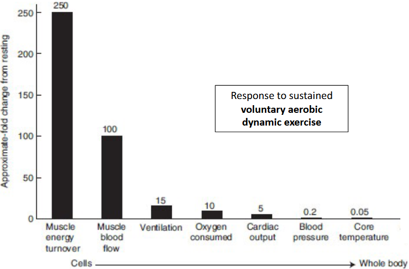

Questo grafico mostra bene la logica dell'intero capitolo: le sfide poste dall'esercizio fisico sono enormi e agiscono **sia a livello cellulare che sistemico**, ma la grandezza della risposta non è uniforme — variabili "vicine" al muscolo (turnover energetico, flusso sanguigno locale) cambiano molto di più di variabili "sistemiche" molto ben difese, come la pressione sanguigna e la temperatura corporea.

---

## Ventilazione

La respirazione viene controllata sia da **centri di controllo** presenti nel cervello, sia da **enterocettori** periferici sparsi nel corpo, che informano continuamente il sistema nervoso centrale sullo stato metabolico e meccanico dell'organismo.

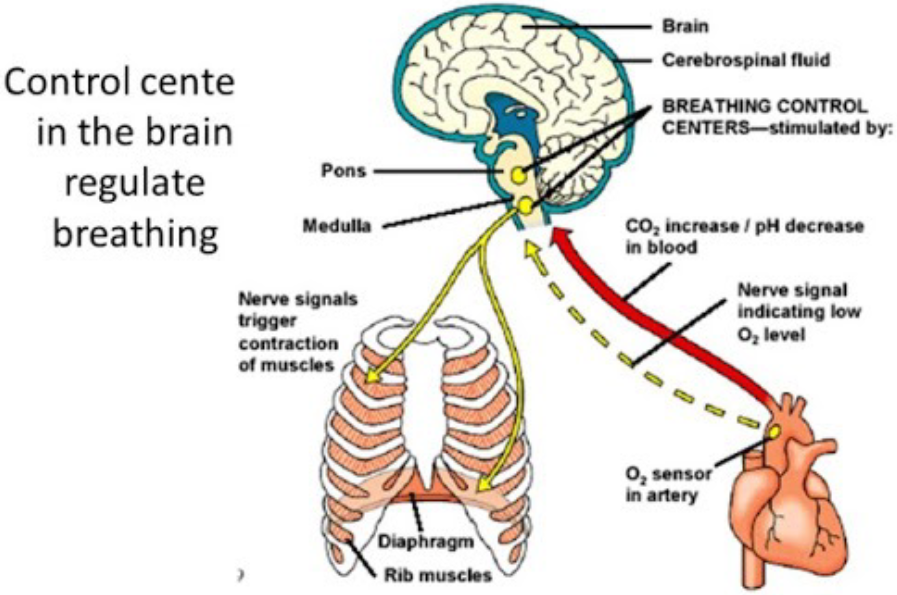

### Via afferente

- Il **centro respiratorio** riceve impulsi afferenti da diverse parti del corpo in base ai **movimenti** della **gabbia toracica** e dei **polmoni**.
- Gli impulsi provenienti dai **chemocettori** e dai **barocettori periferici** vengono trasportati, tramite i nervi **glossofaringeo** e **vago**, fino al centro respiratorio.

### Via efferente

- Le fibre nervose provenienti dal centro respiratorio lasciano il cervello e scendono nella parte anteriore della colonna laterale del midollo spinale.
- Queste fibre terminano sui motoneuroni delle cellule del corno anteriore dei segmenti cervicali e toracici del midollo spinale.
- Dai motoneuroni originano due gruppi di fibre nervose che innervano muscoli specifici:
    - **Fibre del nervo frenico**: innervano il **diaframma**.
    - **Fibre del nervo intercostale**: innervano i **muscoli intercostali**.

### Dove si trovano i chemocettori della respirazione?

I principali chemocettori coinvolti nel controllo del respiro sono localizzati in tre sedi:

- **corpi carotidei** (a livello delle carotidi interne);
- **corpi aortici** (arco aortico);
- **chemocettori centrali**, situati nel sistema nervoso centrale.

---

## Chemorecettori carotidei e controllo della respirazione

Un corpo carotideo (o aortico) è un piccolo gruppo di **chemorecettori periferici** il cui compito è il controllo della respirazione. In particolare, questi organi rilevano variazioni di:

- ↓ pressione parziale di ossigeno (**PO₂**)
- ↑ pressione parziale di anidride carbonica (**PCO₂**)
- ↓ pH (cioè un aumento della concentrazione di ioni **H⁺**)

Inoltre, rispondono anche a:

- **ipoglicemia**
- **ipoperfusione**

Quando questi parametri cambiano, il corpo carotideo/aortico invia segnali al cervello per **aumentare la ventilazione**.

### Cellule del corpo carotideo

Il corpo carotideo è un piccolo organo costituito principalmente da due tipi cellulari:

- ***Cellule di tipo I (cellule glomiche)***: sono le vere **cellule sensoriali**, che convertono lo stimolo chimico in un impulso nervoso. In pratica: **variazione della composizione del sangue → rilascio di neurotrasmettitori → attivazione delle fibre nervose afferenti**.
- ***Cellule di tipo II***: sono cellule di supporto (interstiziali), con una probabile funzione modulatrice.

### Come le cellule glomiche trasducono il segnale chimico

Le cellule di tipo I (glomiche) trasducono il segnale chimico ai terminali sensoriali attraverso una cascata di eventi:

1. Decremento della tensione di O₂ (PO₂) nel sangue.
2. **O₂ sensing** da parte della cellula glomica.
3. Chiusura dei **canali del potassio**.
4. **Depolarizzazione** della cellula.
5. Apertura dei **canali del calcio**.
6. Incremento della concentrazione citosolica di **calcio**.
7. **Rilascio del neurotrasmettitore**.
8. **Attivazione delle fibre afferenti**, che trasmettono l'informazione al sistema nervoso centrale (SNC).

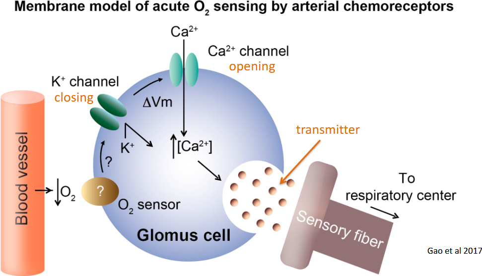

L'**ATP** funge da messaggero tra la cellula glomica e i terminali sensoriali. Un esperimento dimostra che la cellula del glomo percepisce l'ipossia e rilascia ATP: se si bloccano i recettori dell'ATP presenti sul neurone sensoriale (in particolare i sottotipi **P2X2** e **P2X3**), la comunicazione si interrompe e il neurone non è più in grado di inviare al cervello il segnale di "mancanza di ossigeno".

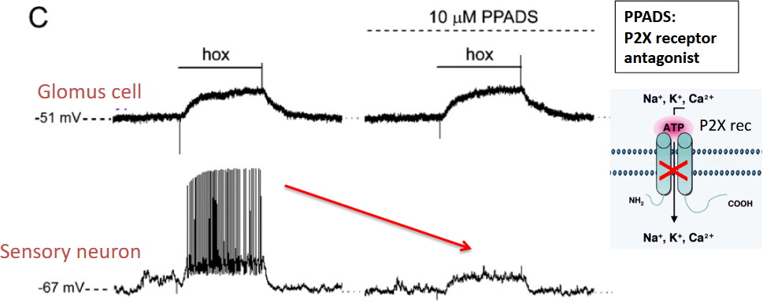

### Non solo ATP

È stato ipotizzato che l'**acetilcolina (ACh)** venga rilasciata contemporaneamente all'ATP dalle cellule di tipo I e contribuisca alla scarica nervosa, sebbene l'azione dell'ATP resti comunque necessaria per una risposta completa. Le risposte **eccitatorie** provocate dall'ATP sono inibite dal **GABA**, che svolge quindi un ruolo **inibitorio "post-sinaptico"**.

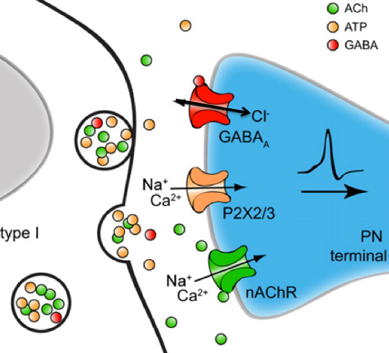

### Stimolanti respiratori e doping

Diversi stimolanti respiratori sono inclusi nella lista delle sostanze proibite della WADA. Agiscono sia a livello centrale (SNC) sia a livello periferico (corpo carotideo).

L'**amifenazolo**, la **cropropamide**, la **crotetamide**, l'**etamivana** e la **niketamide** agiscono in modo simile al **doxapram** (non esplicitamente incluso nella lista WADA): bloccano i **canali del potassio** nelle cellule glomiche, simulando l'ipossia e aumentando la respirazione *(Anderson-Beck et al., 1995)*.

> *Uso medico:* contrastare la depressione respiratoria causata da farmaci come la morfina, oppure durante la chirurgia cerebrale. Possono però essere **altamente tossici**.

Il **pentetrazolo** è un **inibitore** dell'attivazione GABA-ergica della risposta dei chemorecettori *(De Deyn et al., 1990)*.

- *Uso medico:* utilizzato per contrastare la depressione respiratoria causata da farmaci; presente in preparati a base di più principi attivi per la tosse.
- *Effetti collaterali:* può provocare convulsioni, fino all'epilessia.

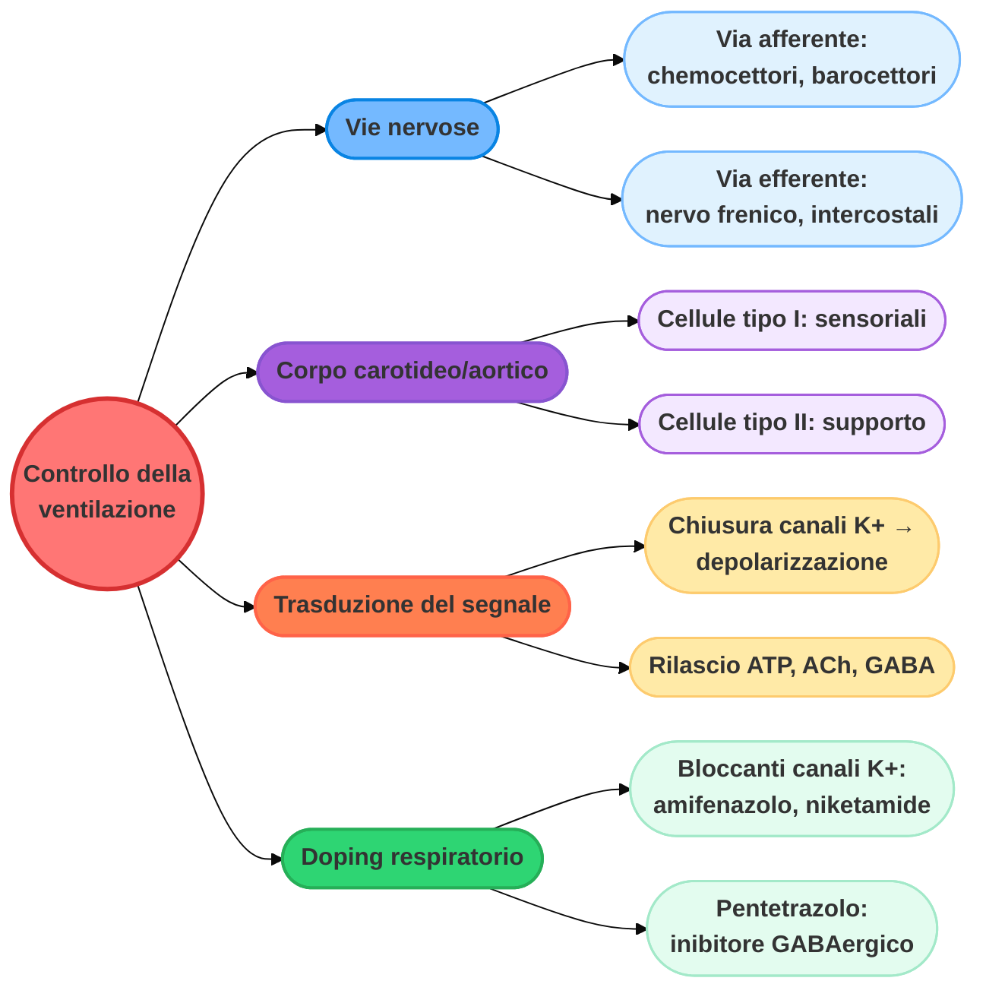

---

## Cardiac Output

### Controllo nervoso della funzione cardiaca

#### Il centro di controllo cardiovascolare: input e risposta efferente

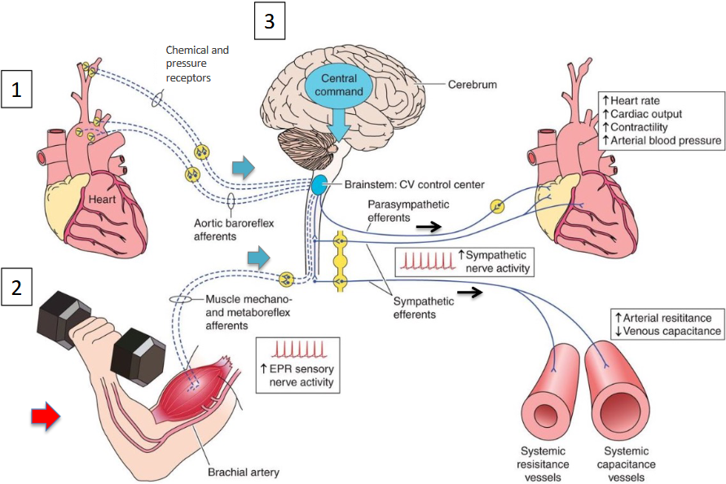

Il **centro di controllo cardiovascolare** nel tronco encefalico riceve informazioni da tre fonti principali (via afferente):

1. **Recettori cardiaci e vascolari**: barocettori (pressione) e chemocettori (chimici), situati sul cuore e sull'arco aortico, che monitorano costantemente lo stato emodinamico.
2. **Riflesso pressorio da esercizio (EPR, *exercise pressor reflex*)**: meccanocettori e metabocettori nei muscoli scheletrici, che rilevano lo sforzo fisico, la deformazione meccanica e l'accumulo di metaboliti legati al movimento.
3. **Comando centrale (*central command*)**: segnale neurale che parte direttamente dalle aree superiori del cervello (corteccia) nel momento in cui si decide di compiere un movimento, preparando il corpo allo sforzo ancor prima che i muscoli si contraggano.

Una volta integrati questi input, il centro di controllo cerebrale modifica l'attività del sistema nervoso autonomo (via efferente):

- **Riduce** l'attività del sistema **parasimpatico**.
- **Aumenta** l'attività del sistema **simpatico**.

L'attivazione del sistema simpatico sostiene lo sforzo fisico modificando il comportamento di cuore e vasi:

- **Sul cuore**: aumentano la frequenza cardiaca, la gittata cardiaca, la contrattilità del muscolo cardiaco e, di conseguenza, la pressione arteriosa complessiva.
- **Sui vasi sanguigni**: si verifica una vasocostrizione che aumenta la resistenza arteriosa e riduce la capacitanza venosa, ottimizzando il ritorno del sangue verso il cuore e la sua ridistribuzione ai muscoli in attività.

#### Exercise pressor reflex: l'esempio del controllo della sudorazione

Il sudore:

- contribuisce alla regolazione della temperatura corporea ed è stimolato dall'aumento della temperatura;
- può aumentare con l'esercizio fisico anche **indipendentemente** dall'aumento della temperatura corporea.

Il primo studio a dimostrare che la sudorazione può essere indotta da fattori non termici ha coinvolto soggetti già sottoposti a stress termico (e quindi già sudanti): lo svolgimento di un "lavoro molto intenso" ha provocato un immediato aumento della sudorazione a livello di polpacci e avambracci, **nonostante l'assenza di un aumento della temperatura interna** *(van Beaumont & Bullard, Science, 141: 643-646, 1963)*.

Questo dimostra che i recettori meccanici e metabolici presenti nel muscolo scheletrico sono coinvolti nel riflesso che controlla funzioni autonome come la sudorazione e il sistema cardiovascolare — è, in altre parole, l'*exercise pressor reflex* in azione anche al di fuori dell'ambito puramente cardiovascolare.

#### Controllo centrale nell'esercizio

Le aree cerebrali che costituiscono il **centro di comando** regolano l'attività dei circuiti neuronali nel tronco encefalico che controllano:

- la respirazione;
- il sistema cardiovascolare;
- la pressione sanguigna;
- altre funzioni controllate dal sistema nervoso autonomo.

#### Sistema nervoso autonomo: organizzazione simpatica e parasimpatica

Il sistema nervoso autonomo è suddiviso, dal punto di vista anatomico e funzionale, in due rami principali: **simpatico** e **parasimpatico**.

- Il sistema **parasimpatico** è organizzato secondo il sistema **cranio-sacrale**.
- Il sistema **simpatico** è organizzato secondo il sistema **toraco-lombare**, con una catena di gangli situata lungo il midollo spinale.

#### Innervazione autonomica del cuore

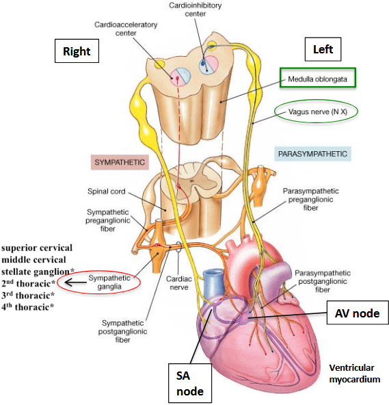

Il **cuore** è innervato sia dal sistema **simpatico** sia da quello **parasimpatico**. Il **nodo seno-atriale** (pacemaker cardiaco) si trova sul lato destro del cuore ed è innervato principalmente dai fasci di neuroni autonomi di lato destro. Il **nodo atrio-ventricolare** si trova invece sul lato sinistro e riceve un apporto prevalentemente dal lato sinistro.

#### Caratteristiche neurali: sistema somatico vs autonomo

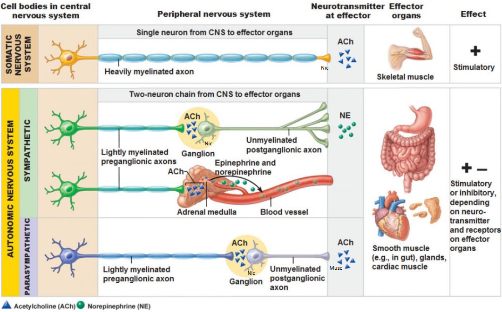

**Sistema nervoso somatico**: un singolo neurone si propaga attraverso il proprio assone fino al target (il muscolo scheletrico). I terminali sono detti **nicotinici** perché sensibili alla nicotina; il neurotrasmettitore principale è l'**acetilcolina**, con **solo effetto eccitatorio**.

**Sistema nervoso autonomo**: è organizzato invece su **più neuroni** che raggiungono il target (neurone pregangliare → ganglio → neurone postgangliare).

- *Simpatico*: il terminale assonico del **neurone pregangliare** rilascia **acetilcolina** al ganglio, mentre il terminale assonico del **neurone postgangliare** rilascia **noradrenalina**, che può avere effetto eccitatorio o inibitorio a seconda del recettore bersaglio. Fa eccezione la **midollare del surrene**: qui l'assone pregangliare rilascia acetilcolina direttamente sulle cellule ghiandolari (**epinefrina** e **norepinefrina**), che rilasciano noradrenalina/adrenalina direttamente nel circolo sanguigno, agendo quindi come un vero e proprio "terzo neurone" ormonale.
- *Parasimpatico*: sia il **neurone pregangliare** sia il **neurone postgangliare** rilasciano **acetilcolina**.

#### Neurotrasmettitori e recettori del sistema nervoso autonomo

I diversi neurotrasmettitori mediano effetti differenti sugli organi target:

- **Acetilcolina** (sistema parasimpatico)
- **Noradrenalina** (sistema simpatico)
- **Epinefrina (adrenalina)**, rilasciata dalla midollare del surrene

I neurotrasmettitori rilasciati dalle terminazioni del sistema nervoso autonomo interagiscono con recettori specifici presenti sulla membrana della cellula bersaglio. Esempio: i **recettori noradrenalinici**.

| Recettore | Localizzazione | Meccanismo | Effetto |
| :--- | :--- | :--- | :--- |
| **α₁ (A-B-D)** | Postsinaptici | Via del fosfoinositolo | Apre i canali del calcio |
| **α₂ (A-B-C)** | Prevalentemente presinaptici | Azione diretta su proteina G | — |
| **β₁** | Postsinaptici | Adenilato ciclasi | Apre indirettamente i canali del calcio |
| **β₂-₃** | Post e presinaptici | Adenilato ciclasi | Inibitori |

Le diverse componenti del sistema nervoso autonomo partecipano quindi al mantenimento dell'**omeostasi** dell'organismo, agendo come un equilibrio dinamico e costantemente regolato tra i due rami.

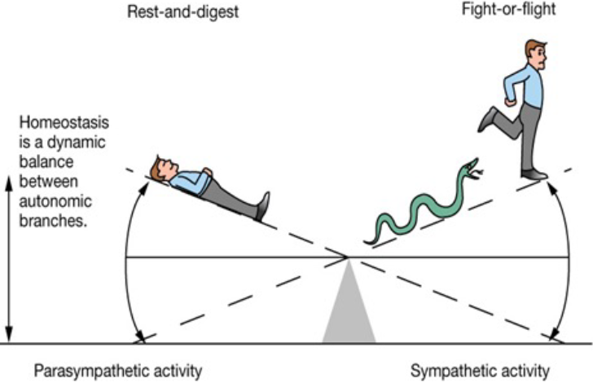

### Risposta cardiaca all'esercizio

#### Risposta all'esercizio e omeostasi

Quando l'omeostasi dell'organismo è messa a dura prova da fattori esterni o da sollecitazioni funzionali, è necessario un contributo diverso da parte dei vari componenti del sistema nervoso autonomo. Durante l'esercizio fisico, la **risposta simpatica è generalmente predominante**.

#### Effetti autonomici sul ritmo miocardico

*Stimolazione simpatica*:

- Aumento della **frequenza cardiaca** (cronotropia).
- Aumento della **conduzione atrio-ventricolare (AV)** (dromotropia).
- Aumento della **forza di contrazione** (inotropia).

*Stimolazione parasimpatica (vagale)*:

- Diminuzione della frequenza cardiaca.
- Diminuzione della conduzione atrio-ventricolare (AV).

#### Risposta omeostatica all'esercizio dinamico: il cuore

- A riposo si ha una **bassa frequenza cardiaca**, dovuta al tono parasimpatico predominante.
- All'inizio dell'esercizio fisico si osserva un **aumento della frequenza cardiaca**, dovuto inizialmente alla riduzione dell'attività parasimpatica (fino a circa 100 battiti/min), e solo successivamente a un vero e proprio incremento della stimolazione simpatica, man mano che lo stimolo si intensifica.

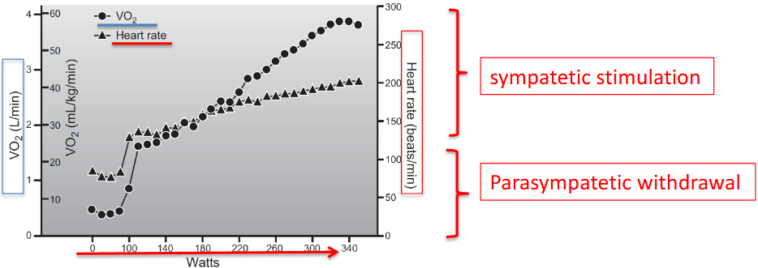

L'aumento del consumo di ossigeno determina quindi un incremento sia della **frequenza cardiaca (HR)** sia della **gittata sistolica (stroke volume)**, risultando in un aumento della **gittata cardiaca (cardiac output)**.

#### Controllo del cardiac output da parte del sistema nervoso autonomo

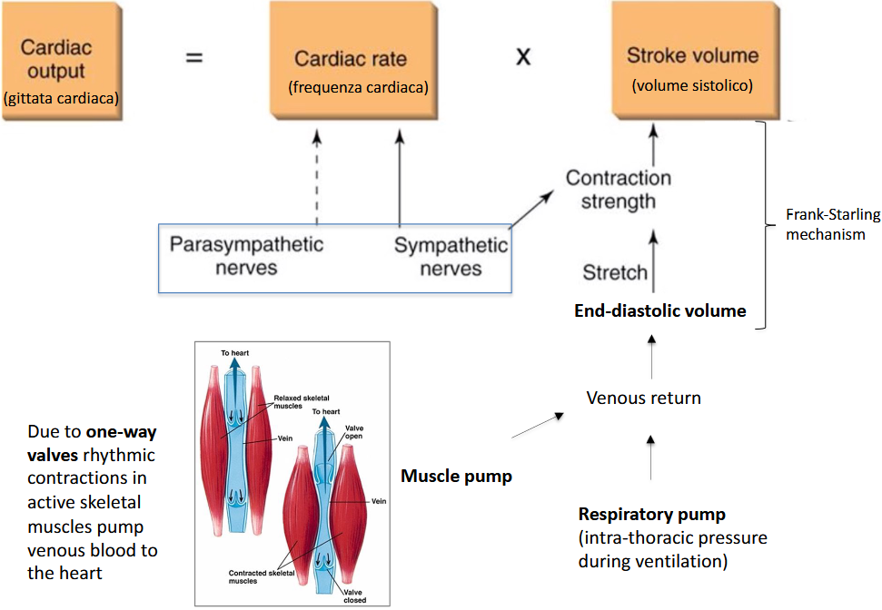

La **gittata cardiaca (cardiac output)** è il prodotto di **frequenza cardiaca** e **gittata sistolica**. La frequenza cardiaca è modulata dai nervi parasimpatico e simpatico, mentre la gittata sistolica dipende dalla forza di contrazione (via meccanismo di **Frank-Starling**, cioè in funzione dello stiramento indotto dal volume telediastolico) e dal ritorno venoso. Quest'ultimo è sostenuto, durante l'esercizio, da due "pompe" accessorie:

- la **pompa muscolare**: grazie alla presenza di valvole unidirezionali, le contrazioni ritmiche dei muscoli scheletrici attivi spingono il sangue venoso verso il cuore;
- la **pompa respiratoria**: le variazioni di pressione intratoracica durante la ventilazione favoriscono ulteriormente il ritorno venoso.

### Farmacologia cardiovascolare e doping

#### Somministrazione di beta-bloccanti a scopo medico ed esercizio fisico

I farmaci **beta-bloccanti**:

- entrano in competizione con adrenalina e noradrenalina per i **recettori beta-adrenergici** del cuore;
- riducono la **frequenza cardiaca** e la **contrattilità**;
- riducono il **fabbisogno di ossigeno** del miocardio.

Sono prescritti a pazienti affetti da **cardiopatia coronarica** e **ipertensione**, e riducono la frequenza cardiaca durante l'esercizio fisico sia submassimale che massimale — un aspetto importante da tenere in considerazione nella prescrizione dell'esercizio fisico a questi pazienti.

#### Beta-agonisti, beta-bloccanti e asma

I **recettori beta-2** sono presenti nelle cellule muscolari lisce dei bronchi. I **beta-agonisti** inducono **broncodilatazione**, contrastando l'asma. Ne deriva che un soggetto sano che assume beta-bloccanti (o, all'opposto, beta-agonisti) può trarne un beneficio in termini di performance sportiva: per questo motivo entrambe le classi di farmaci sono presenti nella lista delle sostanze vietate dalla WADA.

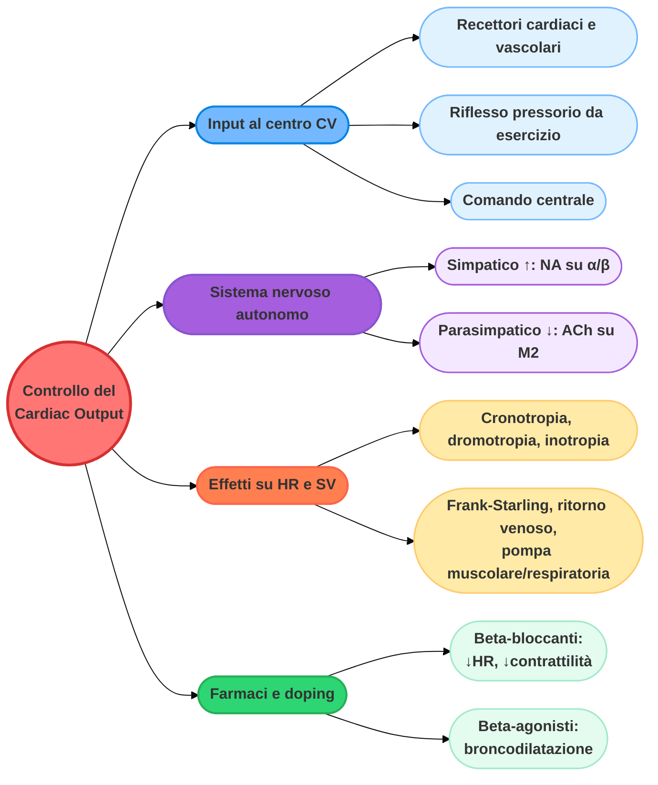

---

## Pressione sanguigna

### Controllo omeostatico della pressione sanguigna

Un **aumento** della **pressione arteriosa media (MAP)** determina un'**attivazione** del sistema **parasimpatico** a livello cardiaco: l'acetilcolina rilasciata dalle fibre parasimpatiche del cuore esercita un potente effetto **inibitorio** sul **nodo seno-atriale**, rallentando così la frequenza cardiaca.

L'aumento della MAP determina inoltre una **diminuzione** del tono vasomotorio simpatico, mediando la **vasodilatazione**. Analogamente, la **diminuzione** della MAP determina un **aumento** del tono vasomotorio simpatico e la conseguente **vasocostrizione**.

Si osservano cambiamenti direzionali simili anche nel traffico efferente simpatico diretto al cuore: l'aumento dell'attività del nervo simpatico cardiaco aumenta la frequenza cardiaca, mentre la sua diminuzione la riduce.

### Barocettori

I barocettori sono fibre afferenti **meccanosensibili**, sparse negli strati elastici delle arterie:

- nelle **carotidi interne** (seno carotideo) → monitorano la pressione sanguigna in entrata nel cervello;
- negli **archi aortici** → monitorano la pressione sanguigna in uscita dal cuore.

I barocettori possono reagire a due parametri distinti:

- l'**allungamento assoluto** (cioè la variazione assoluta della pressione);
- la **velocità** con cui si verifica l'allungamento (cioè la velocità di variazione della pressione).

### Riorganizzazione acuta del baroriflesso durante l'esercizio fisico

L'esercizio fisico intenso provoca un **riadattamento immediato** della funzione barorecettoriale *(Melcher, 1981; Joyner et al., 2015)*.

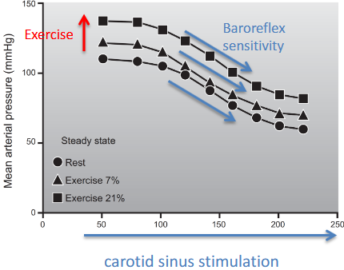

Nei cani, la **stimolazione del seno carotideo** induce variazioni simili della pressione arteriosa media (MAP) sia a riposo sia durante un esercizio fisico leggero (7% di pendenza sul tapis roulant) o moderato (23% di pendenza). Si osserva uno **spostamento** delle curve, ma senza variazioni nella loro forma — a indicare che la **sensibilità baroriflessa rimane inalterata**, mentre cambia solo il "punto di lavoro" attorno a cui il riflesso opera.

Il riadattamento consente al baroriflesso di **operare in un intervallo dinamico** (lontano dal plateau della curva) anche a **pressioni elevate**. Il mantenimento della sensibilità del baroriflesso consente quindi di mantenere più facilmente pressioni più elevate durante lo sforzo. Il riadattamento acuto è **reversibile**, e potrebbe dipendere da alterazioni nei nuclei centrali del tronco encefalico *(Potts, 2006)*.

### Meccanismi di riadattamento acuto del baroriflesso durante l'esercizio fisico

Il riadattamento dipende da cambiamenti nei **nuclei del tronco encefalico** *(Potts, 2006)*. In particolare, la **trasmissione** dai neuroni sensoriali dei barocettori ai neuroni del **nucleo del tratto solitario (NTS)** viene **modulata negativamente**: il meccanismo si basa sull'**inibizione mediata dal GABA** (acido γ-aminobutirrico).

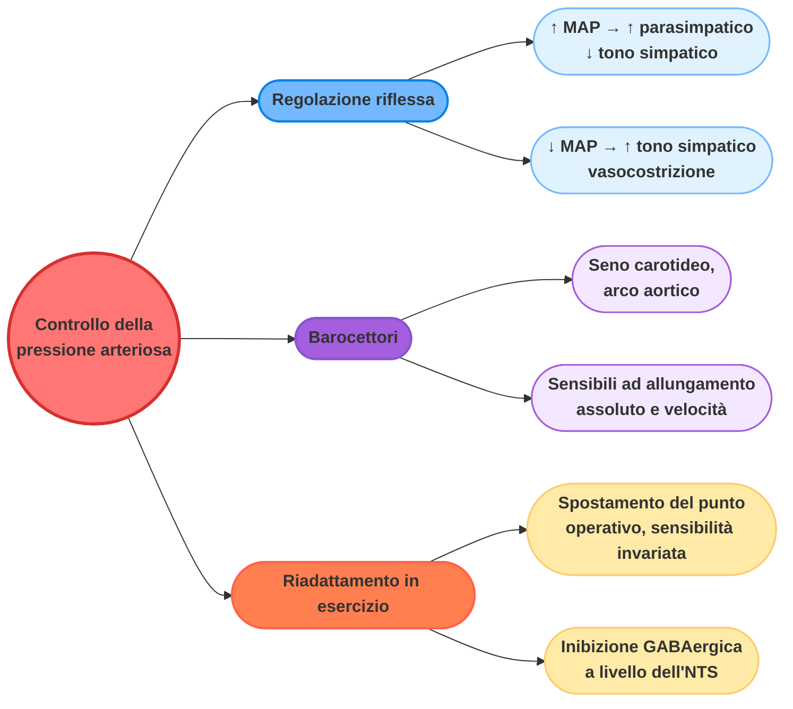

---

## Flusso sanguigno muscolare

La **vasodilatazione muscolare** aumenta la disponibilità di ossigeno e di sostanze nutritive nel muscolo scheletrico. Come osservò già alla fine del XVIII secolo il chirurgo scozzese **John Hunter**, "il sangue va dove c'è bisogno": un aumento del carico di lavoro muscolare (e quindi del fabbisogno metabolico) è associato a un aumento proporzionale del flusso sanguigno — la **perfusione sanguigna corrisponde alle richieste metaboliche dei tessuti**.

Con uno sforzo fisico massimale, nell'uomo, il flusso sanguigno verso i **muscoli scheletrici** aumenta notevolmente, incrementando dell'**80-85%**.

### Distribuzione del flusso sanguigno e controllo simpatico

#### Ridistribuzione del sangue tra i tessuti durante l'esercizio fisico

Durante uno sforzo fisico massimale, il flusso sanguigno si ridistribuisce in modo selettivo tra i diversi organi:

- verso i **muscoli scheletrici** aumenta notevolmente;
- verso le **arterie coronarie** (cuore) aumenta;
- verso il **cervello** rimane costante;
- verso gli **organi interni** (reni, fegato, apparato gastrointestinale) diminuisce;
- verso la **pelle** è relativamente basso, a meno che non si verifichino condizioni di temperatura elevata — in tal caso la dilatazione cutanea induce una significativa ridistribuzione del sangue verso questa zona, a scopo di termoregolazione.

#### L'aumento dell'attività simpatica è associato all'attività muscolare

La ridistribuzione del sangue dipende dal tasso metabolico e dall'intensità dell'esercizio fisico. Durante l'esercizio fisico (o già in previsione di esso, per effetto del comando centrale) si verifica un aumento dell'attività simpatica. Lo stesso fenomeno si osserva nella risposta di "lotta o fuga", ma con una differenza fondamentale: le aree **non muscolari** sono generalmente caratterizzate da una **vasocostrizione** dipendente dal sistema nervoso simpatico, mediata principalmente dai **recettori alfa-adrenergici**.

#### Prove a sostegno della regolazione simpatica del flusso sanguigno muscolare

La **noradrenalina** (rilasciata dal sistema nervoso simpatico, SNS) agisce **preferenzialmente** sui recettori **alfa**. Gli **agonisti dei recettori alfa** inducono **vasocostrizione** negli espianti di vena femorale.

Nei pazienti con **insufficienza autonomica** dovuta a una simpatectomia chirurgica si osserva un calo generale della pressione arteriosa durante l'esercizio fisico (cioè una vasodilatazione), mentre nei soggetti non operati tale calo non si verifica.

**L'innervazione simpatica NON è necessaria per l'aumento del flusso sanguigno indotto dall'esercizio fisico**: in assenza di innervazione simpatica, il flusso sanguigno negli arti aumenta comunque in modo proporzionale all'intensità della contrazione (nell'esperimento, contrazioni della presa della mano della durata di 0,33 s).

### Vasodilatazione colinergica: l'asse ACh-NO

#### Vasodilatazione muscolare acetilcolina-dipendente

L'**acetilcolina** somministrata aumenta il flusso sanguigno muscolare. La **denervazione simpatica NON altera** l'aumento del flusso sanguigno muscolare indotto dall'acetilcolina.

#### La vasodilatazione colinergica è mediata dal monossido di azoto (NO)

L'inibitore della sintesi di NO, la **N-monometil-L-arginina (L-NMMA)**, inibisce la vasodilatazione ACh-dipendente: questo dimostra che la **vasodilatazione colinergica è mediata dal monossido di azoto (NO)**, e non direttamente dall'acetilcolina sulle cellule muscolari lisce.

#### Qual è la fonte di acetilcolina?

Non vi sono prove a sostegno di una vera e propria **innervazione parasimpatica** dei vasi nei muscoli degli arti. La vasodilatazione è invece coordinata con l'**attività muscolare**, che a sua volta è controllata dal rilascio di acetilcolina da parte dei **motoneuroni**.

I tentativi di contrazione dei muscoli umani paralizzati (tramite somministrazione del farmaco bloccante neuromuscolare post-sinaptico **pipecuronio**) provocano solo variazioni molto modeste e incostanti nel flusso sanguigno dell'avambraccio (FBF). Questo indica che:

- la diffusione dell'ACh dai nervi motori **NON** è un fattore vasodilatatore determinante nel muscolo sotto sforzo;
- è necessaria la **contrazione muscolare locale** perché si inneschi la vasodilatazione.

#### L'endotelio in attività è la fonte dell'acetilcolina

L'acetilcolina viene rilasciata dalle cellule endoteliali *in vitro* in risposta a uno **stress meccanico** (perfusione elevata), condizione che riproduce ciò che avviene fisiologicamente durante l'esercizio fisico.

#### L'asse ACh-NO nelle cellule endoteliali induce la vasodilatazione muscolare

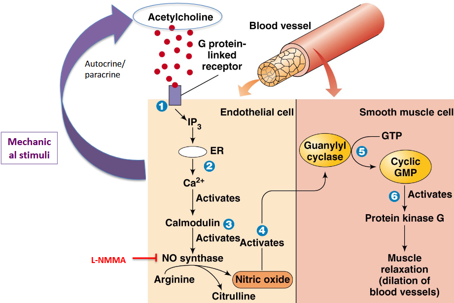

Il **NO** rilasciato dalle cellule endoteliali induce, nelle cellule muscolari lisce dei vasi sanguigni, un effetto dipendente dal **cGMP**:

- riduzione del **calcio intracellulare citoplasmatico**;
- defosforilazione della **miosina**, con conseguente **rilassamento** della muscolatura liscia vascolare.

### Meccanismi aggiuntivi ed equilibrio vascolare

#### Meccanismi multipli cooperano per indurre la vasodilatazione muscolare

Oltre all'asse ACh-NO, ulteriori meccanismi contribuiscono alla vasodilatazione muscolare:

- **ATP/adenosina** (di origine locale, prodotta da fibre muscolari e vasi in condizioni di ipossia);
- **adrenalina**, proveniente dalla midollare surrenale, che agisce a livello sistemico tramite i recettori vasodilatatori **beta-2**.

L'adrenalina ha infatti un'affinità particolarmente alta per i recettori beta-2.

#### Il sistema nervoso simpatico può limitare il flusso sanguigno nei muscoli

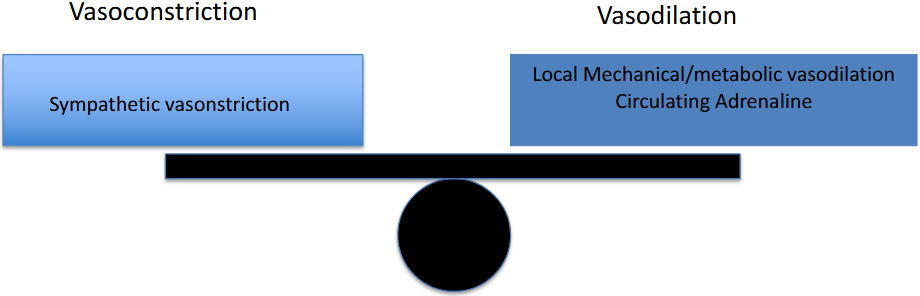

La notevole capacità dei vasi sanguigni muscolari di dilatarsi, se non controllata, potrebbe potenzialmente compromettere la capacità del cuore di mantenere una pressione sanguigna sufficiente a garantire un flusso adeguato agli altri organi, compreso il cervello. Il sistema simpatico "omeostatico" garantisce quindi il corretto equilibrio, **limitando** il flusso sanguigno nei muscoli.

#### Simpatolisi funzionale durante l'esercizio fisico ad alta intensità

La vasocostrizione "simpatica" mediata dagli agonisti alfa si **riduce localmente** all'aumentare dell'intensità dell'esercizio fisico, fornendo un ulteriore contributo alla vasodilatazione durante lo sforzo. In pratica, nel muscolo si osserva una **riduzione locale della sensibilità** dei recettori agonisti alfa con l'esercizio: questo fenomeno è noto come **simpatolisi funzionale**.

#### Equilibrio nel calibro vascolare muscolare durante l'esercizio fisico dinamico

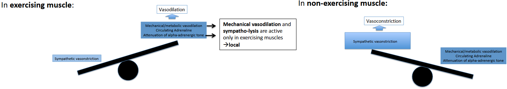

Nel muscolo **che sta facendo esercizio** prevale la vasodilatazione locale (simpatolisi funzionale + asse ACh-NO), mentre nel muscolo **che non sta facendo esercizio** prevale la vasocostrizione simpatica: questo equilibrio differenziale è ciò che permette la ridistribuzione selettiva del flusso sanguigno descritta in precedenza.

---

## Ridondanza fisiologica ed eterogeneità della risposta all'esercizio

### Ridondanza fisiologica nell'esercizio fisico

- **Ridondanza**: molteplici **meccanismi sovrapposti** contribuiscono all'**omeostasi** in risposta all'esercizio fisico.
- La **spiegazione teleologica** della ridondanza è che la capacità di fare esercizio fisico è **fondamentale per la sopravvivenza**.
- Le **alterazioni** di specifiche funzioni omeostatiche sono comunque compatibili con l'esercizio fisico:
    - i levrieri da corsa possono continuare a esercitarsi anche in caso di **denervazione cardiaca**, nonostante una risposta attenuata della frequenza cardiaca all'esercizio fisico *(Donald et al., 1964)*;
    - condizioni patologiche caratterizzate da risposte alterate della pressione sanguigna o della ventilazione sono comunque compatibili con l'esercizio fisico *(Joyner, 2006; Forster et al., 2012)*.
- **Meccanismi multipli** contribuiscono in **parallelo** alla stessa risposta fisiologica: ad esempio, l'aumento del flusso sanguigno nel muscolo in esercizio dipende sia dall'asse locale ACh-NO sia dalla simpatolisi.
- **Ridondanza molecolare**: l'**ablazione genetica** di determinanti molecolari chiave coinvolti nelle risposte all'esercizio fisico viene spesso compensata da altri meccanismi (ad esempio, si osservano risposte metaboliche sostanzialmente normali nei topi knock-out per PGC1α e AMPK).

### L'esercizio fisico è eterogeneo, e altrettanto eterogenei sono gli adattamenti

Negli studi sull'esercizio fisico intenso, le risposte principali sono influenzate da diversi fattori:

- la **massa dei muscoli** coinvolti;
- la **durata delle contrazioni**;
- la **durata della sessione** di esercizio;
- l'**intensità della contrazione**/il numero di unità motorie reclutate;
- l'**entità e il tipo di accorciamento muscolare**.

### Esercizio dinamico vs isometrico

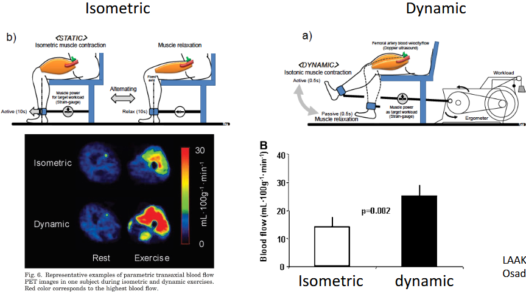

Durante la **contrazione isometrica**, l'afflusso di sangue al muscolo sollecitato è **ridotto** rispetto all'esercizio dinamico. Questo perché la lunghezza delle fibre muscolari non varia durante la contrazione isometrica: è quindi possibile che le risposte che mediano l'aumento del flusso sanguigno locale (in particolare quelle legate alla pompa muscolare meccanica) risultino attenuate.

---

## Riassunto finale

L'esercizio fisico rappresenta una sfida imponente per l'omeostasi dell'organismo, alla quale il corpo risponde attraverso l'integrazione di riflessi periferici e comando centrale, distribuiti su più sistemi effettori interconnessi.

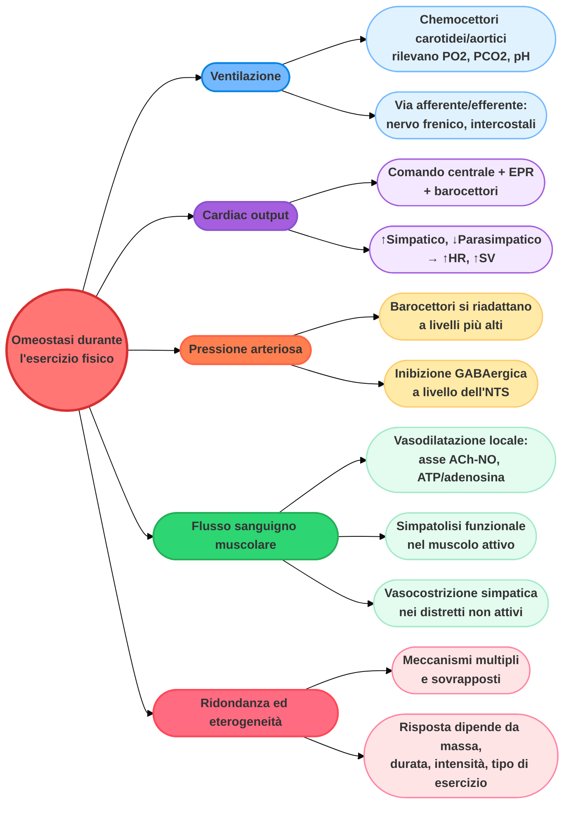

### Riassunto tabellare

| Sistema | Risposta principale durante l'esercizio |
| :--- | :--- |
| **Ventilazione** | Aumenta in proporzione alla produzione di CO₂, grazie ai chemocettori periferici (corpi carotidei/aortici) e centrali. |
| **Cuore** | ↑ Frequenza cardiaca, ↑ contrattilità, ↑ gittata cardiaca, per riduzione del tono parasimpatico e aumento di quello simpatico. |
| **Pressione arteriosa** | I barocettori si riadattano acutamente per operare a pressioni più elevate, senza perdita di sensibilità. |
| **Flusso sanguigno muscolare** | Aumenta dell'80-85% nei muscoli attivi, per vasodilatazione locale (ACh-NO, ATP/adenosina) e simpatolisi funzionale. |
| **Flusso sanguigno negli altri distretti** | Diminuisce in organi interni e muscoli inattivi, resta costante nel cervello, aumenta nel cuore. |
| **Regolazione generale** | Ridondante e sovrapposta: più meccanismi paralleli garantiscono la stessa risposta anche in caso di alterazione di uno di essi. |