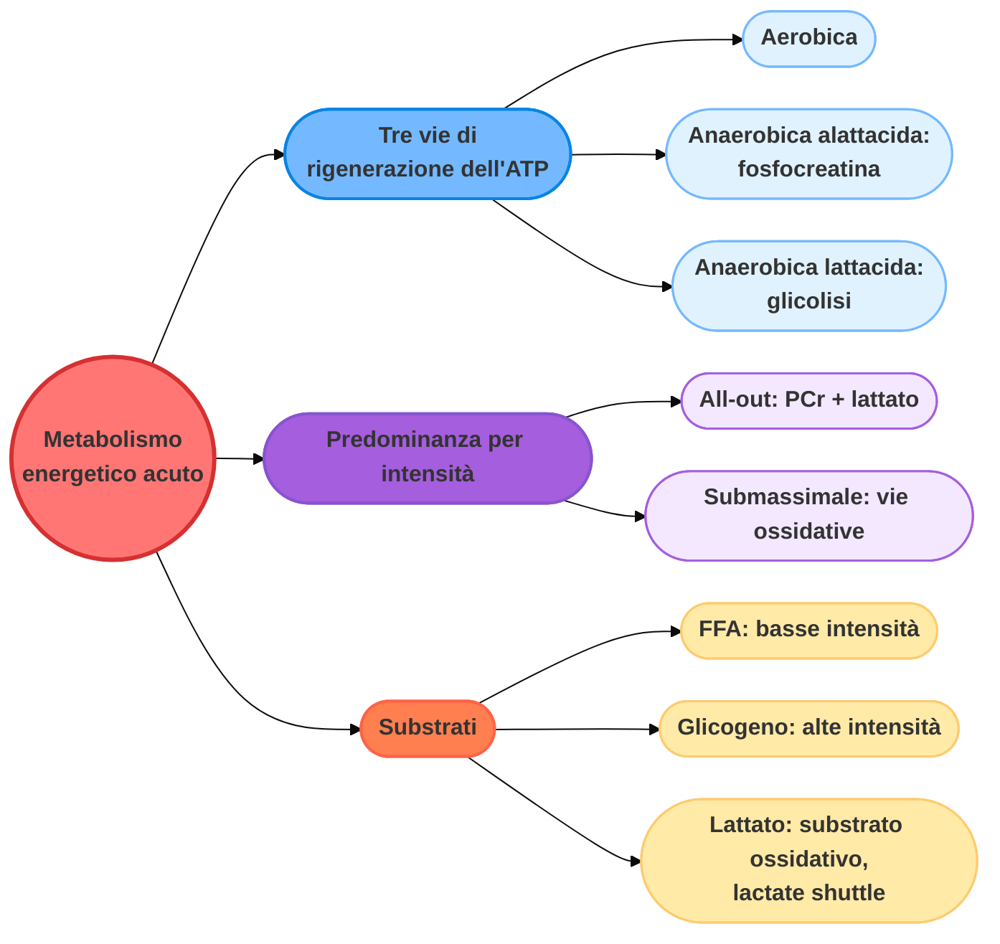
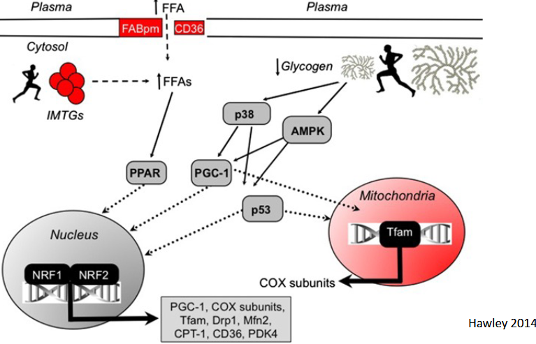
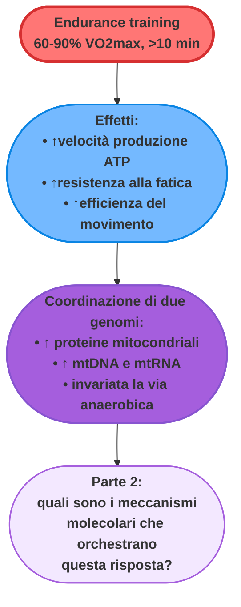

# Allenamento e metabolismo energetico: dagli adattamenti acuti alla risposta mitocondriale (Sezione Mitocondriale 1 di 4)

## Allenamento fisico: definizione e risposta omeostatica

**Allenamento fisico** (o semplicemente *allenamento*): programma regolare di esercizi fisici volto a raggiungere o mantenere un determinato livello di forma fisica. L'allenamento (cioè l'esercizio fisico ripetuto con regolarità) può modificare in modo significativo le risposte fisiologiche all'esercizio fisico intenso, inducendo adattamenti a più livelli dell'organismo.

Gli **adattamenti a lungo termine** sono il risultato cumulativo di **risposte transienti**: ripetendo nel tempo le sollecitazioni dell'esercizio fisico, si creano adattamenti stabili da parte del corpo. Poiché i diversi tipi di allenamento (forza, endurance) determinano sollecitazioni diverse, anche gli adattamenti indotti sono differenti; al variare di intensità, frequenza, durata e specificità dell'allenamento, variano di conseguenza gli adattamenti.

### Ottimizzazione dei programmi di allenamento per la competizione

Data la grande varietà di esercizi e programmi di allenamento disponibili, può risultare difficile elaborare linee guida generali. In linea di massima, allenarsi ripetendo l'attività a cui si mira è una buona pratica, ma può risultare troppo semplicistica: l'evoluzione delle prestazioni sportive è andata di pari passo con l'evoluzione dei metodi di allenamento stessi.

Un esempio storico è quello dell'allenamento per le competizioni di fondo/mezzofondo:

| Periodo | Metodo | Caratteristiche |
| :--- | :--- | :--- |
| **1912-1920** | Training aspecifico | Percorrere lunghe distanze ad andatura moderata (aerobica), adattandosi alla distanza di gara solo in prossimità della competizione. |
| **1912-1920** | Incremento di potenza | Si cerca di incrementare il più possibile la velocità (potenza). |
| **1952** | *Interval training* | Si divide la distanza di gara in frazioni più brevi da percorrere a velocità costante, ripetute un numero di volte sufficiente a coprire l'intera distanza; il recupero diventa un punto cruciale, e i suoi tempi vengono progressivamente ridotti mantenendo la velocità di esecuzione. |
| **1964** | Allenamento frazionato/periodizzazione | Si alternano corsa veloce e lenta, includendo corsa a velocità sovramassimale (attivazione dei processi lattacidi). |
| **1972 in poi** | Affinamento/specializzazione | Aumento continuo di intensità e specializzazione (es. Haile Gebrselassie: *interval training* di 50 × 400 m in meno di 64 secondi, con pause di 30 secondi). |

---

## Metabolismo energetico nell'esercizio acuto: vie aerobica e anaerobiche

La contrazione muscolare converte energia chimica in energia meccanica, e richiede l'idrolisi dell'**ATP**. L'ATP è inoltre importante per il trasporto del Ca²⁺ sarcoplasmatico e per la pompa Na⁺/K⁺-ATPasi, entrambi necessari per garantire la produzione di forza e l'eccitabilità muscolare.

Le riserve intramuscolari di ATP sono esigue (circa 5 mmol/kg di muscolo umido), sufficienti per:

- **2 secondi** di esercizio massimo *"all-out"*;
- **15 secondi** di esercizio submassimale (75% del VO₂max).

Tre principali vie metaboliche distinte rigenerano l'ATP:

- **via aerobica**;
- **via anaerobica alattacida** (fosfocreatina);
- **via anaerobica lattacida** (glicolisi).

**La durata e l'intensità dell'esercizio determinano quale delle tre vie predomina.**

### Esercizio massimale "all-out"

Durante uno sforzo massimo *"all-out"* della durata di 30 secondi, inizialmente predominano la degradazione della **fosfocreatina** e quella del **glicogeno in piruvato --> lattato**. L'affaticamento (cioè il calo della potenza erogata) durante lo sforzo massimo è **associato** a:

- accumulo di lattato, sia nei muscoli che nel sangue (*associato, non accusato da...*);
- esaurimento del glicogeno e della fosfocreatina;
- accumulo di sottoprodotti metabolici quali H⁺, ADP, AMP e Pi.

### Esercizio submassimale

Durante l'esercizio submassimale predominano invece le vie **ossidative**: quasi tutto l'ATP viene ottenuto dal metabolismo ossidativo dei **carboidrati** e dei **lipidi**. I principali substrati sono:

- glicogeno muscolare;
- glucosio ematico;
- acidi grassi (intramuscolari ed ematici).

Il **contributo relativo** dei diversi substrati varia in base all'**intensità**:

- gli **acidi grassi ematici** (FFA plasmatici) predominano a **basse intensità**;
- il **glicogeno muscolare** predomina ad **alte intensità**;
- la **massima ossidazione dei grassi** avviene a un'intensità intermedia, circa il **65% del VO₂max**.

### Il lattato non è solo un sottoprodotto dell'attività anaerobica

Il lattato è anche un importante substrato per il **metabolismo ossidativo** e per la **gluconeogenesi**. L'accumulo di lattato dipende dall'equilibrio tra produzione e utilizzo, un equilibrio che è:

- influenzato dall'**intensità dell'esercizio**;
- differente in **fibre muscolari diverse**;
- influenzato dalle **fibre vicine**, quando queste sono metabolicamente eterogenee: il lattato prodotto da una fibra può infatti essere utilizzato come substrato dalle fibre aerobiche vicine (fenomeno noto come ***lactate shuttle***).

### Substrati e vie metaboliche in discipline diverse

Discipline con durata e intensità diverse utilizzano proporzioni diverse di substrati e vie metaboliche: nei **100 metri** predominano le vie anaerobiche (fosfocreatina e glicolisi lattacida), mentre nella **maratona** il contributo aerobico (ossidazione di glicogeno epatico e acidi grassi) diventa nettamente predominante. Spesso, i protocolli di allenamento coinvolgono contemporaneamente diverse vie metaboliche che utilizzano substrati diversi: le vie **ossidative** predominano ampiamente nell'esercizio di **resistenza**.

---

## Allenamento di endurance e adattamenti mitocondriali

L'**allenamento di endurance** (attività sostenuta di durata superiore a 10 minuti, eseguita al 60-90% del VO₂max) determina diversi adattamenti:

- **aumento** della **velocità** di produzione energetica, sia attraverso le vie aerobiche glicolitiche che lipolitiche;
- maggiore **resistenza** alla **fatica**;
- controllo più rigoroso dell'**equilibrio** tra produzione e idrolisi dell'ATP;
- maggiore **efficienza** del movimento (coordinazione, articolazione).

Gli adattamenti chiave a **lungo termine** riguardano soprattutto due ambiti, che sono anche il filo conduttore del resto del capitolo:

- la **funzione e la biogenesi mitocondriale**;
- l'**apporto di substrato metabolico** ai mitocondri.

### L'allenamento di endurance aumenta il contenuto di proteine mitocondriali

*Studio sui ratti (Holloszy, 1967; Oscai e Holloszy, 1971)*

In questo studio, i ratti sono stati sottoposti ad attività fisica 5 giorni alla settimana su un tapis roulant inclinato di 20 cm. Inizialmente correvano per 10 minuti a 22 m/min, due volte al giorno, a distanza di 4 ore l'una dall'altra; il carico di lavoro è stato aumentato progressivamente nell'arco di 12 settimane. Al termine di questo periodo, gli animali correvano ininterrottamente per 120 minuti a 31 m/min, con 12 sprint a 42 m/min (30 secondi ciascuno) intervallati da pause di 10 minuti. La motivazione era fornita da una griglia elettrica situata nella parte posteriore dei compartimenti.

Sia il **contenuto proteico mitocondriale totale** sia diversi **enzimi mitocondriali** (ad esempio la DPNH deidrogenasi, l'ATPasi e il citocromo c) **raddoppiano** nel muscolo in risposta al programma di corsa di resistenza.

Studi successivi condotti sull'uomo confermano che l'esercizio di resistenza:

- aumenta l'attività di diversi enzimi mitocondriali *(Booth, 1974)*;
- aumenta il volume mitocondriale *(Hoppeler, 1973)*;
- tali aumenti si attenuano con l'avanzare dell'età *(Kiessling, 1974)*.

### L'allenamento di resistenza favorisce la produzione aerobica di ATP

Nonostante l'aumento generale delle proteine mitocondriali (che coinvolge componenti della catena di trasporto degli elettroni e del ciclo di Krebs), le attività della **creatina fosfochinasi** e dell'**adenilato chinasi citoplasmatiche** sono rimaste **invariate** nei muscoli dei ratti sottoposti a esercizio fisico *(Oscai e Holloszy, 1971)*.

Si verifica quindi un'**alterazione selettiva del repertorio enzimatico mitocondriale**: il cambiamento non è uniforme per tutti gli enzimi. In sintesi:

> L'**allenamento di resistenza aumenta** la capacità dei muscoli di **produrre ATP per via aerobica**, mentre la capacità di produrre ATP per via anaerobica rimane sostanzialmente invariata.

### Gli adattamenti mitocondriali richiedono la coordinazione di due genomi

Le proteine mitocondriali necessarie per la respirazione cellulare sono codificate sia dal **genoma nucleare** sia dal **genoma mitocondriale**: entrambi i genomi sono coinvolti nella risposta adattativa mitocondriale.

I **mitoribosomi**, situati nella matrice mitocondriale in associazione con la membrana interna, sono costituiti da complessi di subunità grandi e piccole, diversi sia dai complessi eucariotici che da quelli procariotici. Ogni complesso mitoribosomiale è formato da:

- **rRNA** e **tRNA**, codificati dal **genoma mitocondriale**;
- diverse **proteine**, quasi tutte codificate dal genoma nucleare (fa eccezione solo la Var1 del lievito, codificata dal mtDNA) e importate nei mitocondri tramite specifiche translocasi.

I mitoribosomi sono fondamentali per la **traduzione** delle **13 proteine** codificate dal mtDNA. Difetti nella traduzione mitocondriale causano gravi malattie nell'uomo, tra cui miopatie, cardiomiopatie e l'acidosi lattica neonatale fatale.

### La contrazione muscolare induce la replicazione e la trascrizione del DNA mitocondriale

L'attività contrattile del muscolo scheletrico (indotta da stimolazione elettrica o da esercizio fisico) induce la sintesi di:

- **mtDNA** (DNA mitocondriale);
- **mtRNA**, sia ribosomiale (rRNA) che messaggero (mRNA).

L'attività contrattile del muscolo modula la trascrizione e l'attività sia degli enzimi codificati dai mitocondri sia di quelli codificati dal nucleo, come mostra l'esempio delle subunità distinte del **Complesso IV** (della catena di trasporto degli elettroni, fosforilazione ossidativa):

Il fatto che l'enzima glicolitico citoplasmatico **GAPDH** rimanga invariato mentre le subunità del Complesso IV aumentano dimostra la **specificità** della modulazione indotta dall'esercizio: non si tratta di un aumento generico di tutte le proteine cellulari, ma di una risposta adattativa mirata al comparto mitocondriale.

*Continua nella [Parte 2](#) con la regolazione molecolare della biogenesi mitocondriale: il ruolo di TFAM, dell'asse PGC-1/NRF, di AMPK, del Ca²⁺ e di p53.*
