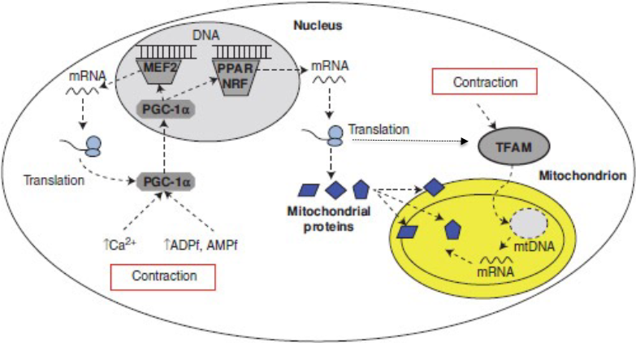
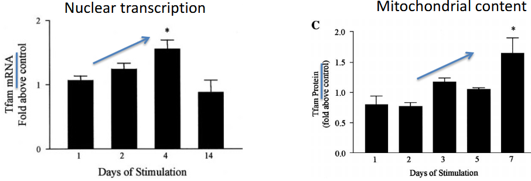
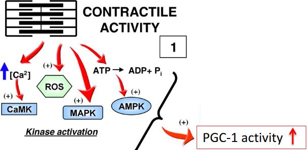
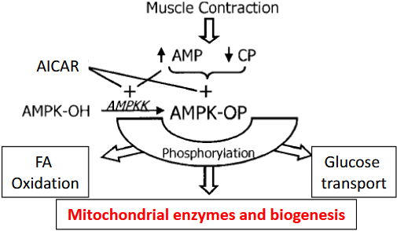
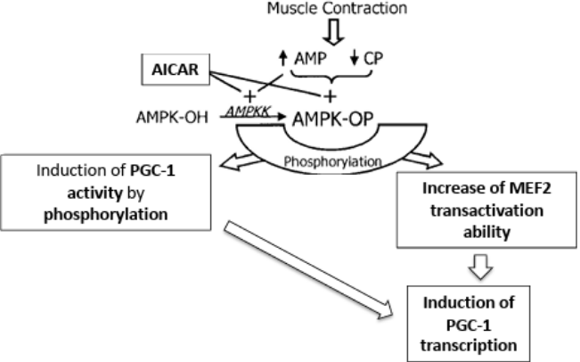
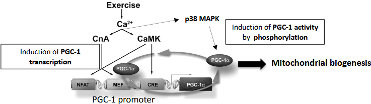
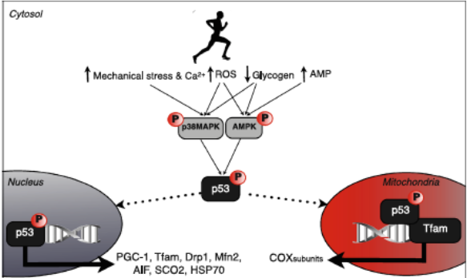
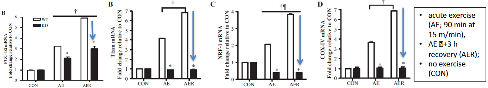
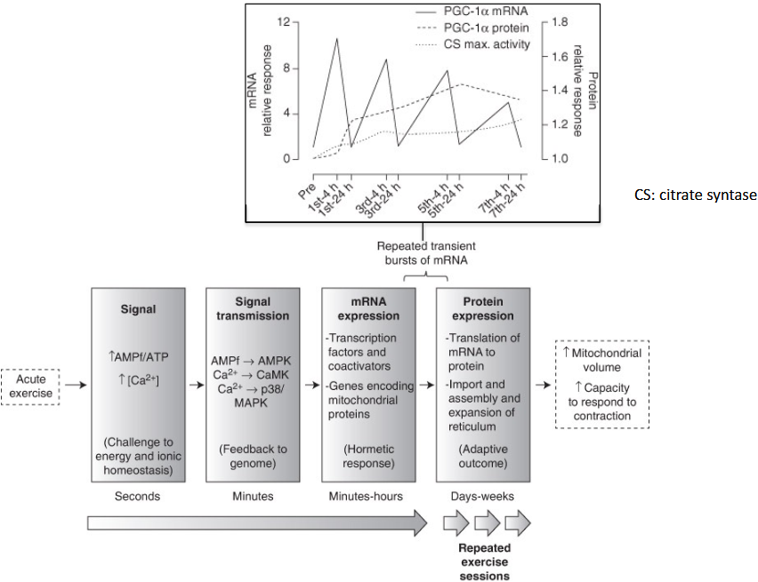
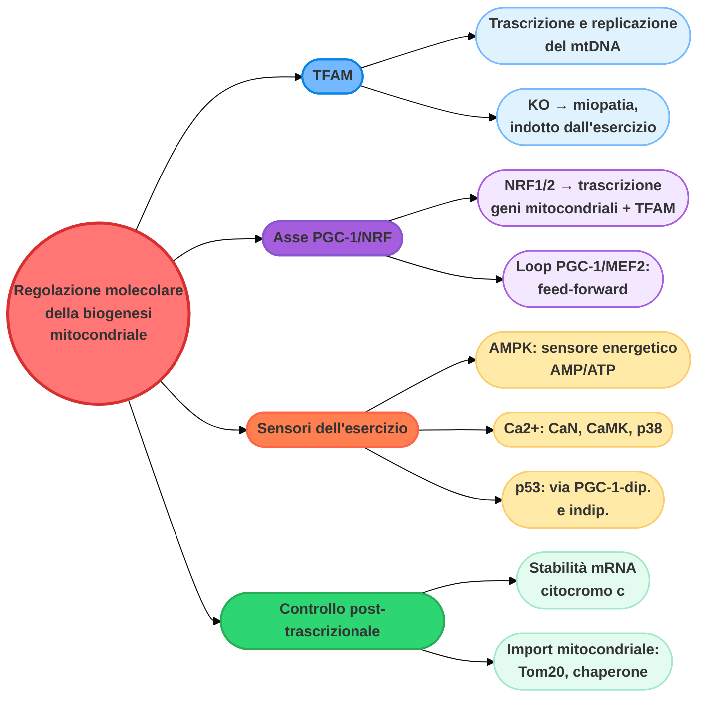

# Regolazione molecolare della biogenesi mitocondriale: TFAM, PGC-1 e i sensori dell'esercizio (Sezione Mitocondriale 2 di 4)

> Questa è la **Parte 2 di 4** del capitolo dedicato agli adattamenti mitocondriali indotti dall'allenamento. Nella [Parte 1](#) abbiamo visto che l'allenamento di endurance aumenta il contenuto di proteine mitocondriali attraverso la coordinazione di genoma nucleare e genoma mitocondriale. In questa parte analizziamo **come**, a livello molecolare, la contrazione muscolare si traduce in un aumento della trascrizione dei geni mitocondriali.

## Modulazione trascrizionale della biogenesi mitocondriale

Per **modulazione trascrizionale della biogenesi mitocondriale** si intende la regolazione dell'attività dei geni che controllano la formazione e il funzionamento dei mitocondri.

In questa sezione facciamo un percorso "a ritroso": partiamo dal mitocondrio, dove avviene l'effetto finale (la trascrizione del DNA mitocondriale), per risalire via via alla sorgente dei segnali che accendono l'intero processo.

### TFAM e la trascrizione del genoma mitocondriale

La **trascrizione mitocondriale** ha origine da **tre promotori**: due promotori del filamento "pesante", denominati **HSP1** e **HSP2**, e un promotore del filamento leggero, **LSP**. I trascritti provenienti da HSP2 e LSP sono prodotti policistronici di grandi dimensioni, che comprendono rRNA mitocondriale, tRNA e mRNA.

Il **fattore di trascrizione mitocondriale A** (**TFAM**, o h-mtTF) è uno dei componenti fondamentali della trascrizione mitocondriale. I **quattro componenti principali** necessari per la trascrizione mitocondriale umana sono tutti **codificati dal nucleo**:

- l'**RNA polimerasi mitocondriale**, **POLRMT**;
- il **fattore di trascrizione mitocondriale A**, h-mtTFA/**TFAM**;
- due fattori di trascrizione/metiltransferasi dell'rRNA, **h-mtTFB1** e **h-mtTFB2**.

#### TFAM e la replicazione del genoma mitocondriale

La **replicazione del DNA mitocondriale** è accoppiata all'inizio della trascrizione mitocondriale e richiede alterazioni strutturali del DNA. **TFAM** è direttamente coinvolto nella replicazione del mtDNA attraverso due meccanismi distinti:

1. il suo ruolo fondamentale nell'**inizio della trascrizione**;
2. la sua capacità di modulare l'**impacchettamento del DNA mitocondriale** — TFAM è infatti il principale responsabile della regolazione del numero di copie del mtDNA.

I topi con **knock-out costitutivo di TFAM** sono letali a livello embrionale, mentre quelli con **knock-out condizionale** nel cuore, nel fegato, nei reni e nel muscolo scheletrico presentano una grave deplezione di DNA mitocondriale e disfunzione della catena respiratoria. I topi con knock-out specifico per il muscolo di TFAM sono **miopatici** e presentano livelli ridotti di DNA mitocondriale, RNA mitocondriale e proteine della catena respiratoria, oltre a una forza muscolare ridotta.

> Senza TFAM, il mitocondrio perde il proprio "manuale d'istruzioni", il DNA: senza istruzioni non può costruire la catena respiratoria, la cellula non produce più energia in modo efficiente e il muscolo perde forza, portando alla miopatia.

**TFAM viene indotto dall'esercizio fisico**: la stimolazione muscolare *in vivo* con elettrodi, nei ratti, induce la trascrizione di TFAM e il suo accumulo mitocondriale.

---

## -> tutto da rifare L'asse PGC-1/NRF/TFAM

I **fattori respiratori nucleari** (**NRF1** e **NRF2**) sono proteine chiamate fattori di trascrizione: il loro compito è "leggere" il DNA nel nucleo e ordinare alla cellula di costruire i componenti necessari per i mitocondri. **NRF1/2** inducono:

- la trascrizione dei geni, codificati sia dal nucleo che dal mitocondrio, che codificano per le proteine della catena respiratoria mitocondriale;
- la trascrizione di **TFAM**, che a sua volta regola la trascrizione e la replicazione del DNA mitocondriale.

Il percorso di TFAM è quindi il seguente: viene trascritto a partire dal DNA nucleare, l'mRNA esce dal nucleo, entra nel citoplasma, e da qui viene importato nel mitocondrio attraverso trasportatori specifici.

### PGC-1: il coattivatore chiave dell'asse

**PGC-1** è un **modulatore trascrizionale** che stimola la biogenesi e la funzione mitocondriale cooperando con gli **NRF** (fattori respiratori nucleari).

<!-- INSERISCI QUI IMMAGINE: schema che mostra PGC-1 attivare NRF-1 nel nucleo, il quale a sua volta induce la trascrizione di geni codificanti citocromo c, subunità COX VIc, hQP e la subunità γ dell'ATP sintasi, oltre a TFAM; queste proteine vengono importate nel mitocondrio (ETC, catena di trasporto degli elettroni), mentre TFAM regola direttamente il mtDNA (Chau 1992; Kelly 2004) — suggerimento: images/CAP/pgc1-nrf1-etc-tfam.png -->

Quando ci si allena in modo costante (endurance), aumentano i livelli di PGC-1. Questo innesca una reazione a catena che porta alla creazione di più mitocondri: il muscolo diventa capace di produrre più ATP usando l'ossigeno, ritardando la fatica e migliorando la capacità di ossidare i grassi. Senza la cooperazione tra PGC-1 e NRF, l'allenamento non porterebbe ad alcun cambiamento strutturale nel muscolo — è proprio questo asse (**PGC-1/NRF**) a trasformare la fatica di una sessione di allenamento in un miglioramento della performance.

#### NRF-1/2 cooperano con PGC-1

PGC-1 stimola la biogenesi mitocondriale attraverso un duplice meccanismo che coinvolge gli NRF:

- induce la **trascrizione** degli mRNA di **NRF1** e **NRF2** (cioè fa produrre più NRF);
- **co-attiva** la funzione trascrizionale di NRF-1 sul promotore del **TFAM**.

<!-- INSERISCI QUI IMMAGINE: schema a "raggiera" con PGC-1 al centro, che si dirama verso: altri processi mitocondriali (punto interrogativo); PGC-1α/NRF-1, che regolano replicazione del mtDNA, trasporto degli elettroni e fosforilazione ossidativa; PGC-1α/ERRα (funzione non ancora chiarita, punto interrogativo); PGC-1α/RXR-PPAR, che regolano la beta-ossidazione mitocondriale degli acidi grassi e la termogenesi — suggerimento: images/CAP/pgc1-raggiera-nrf-err-ppar.png -->

PGC-1 è quindi un modulatore chiave non solo della biogenesi mitocondriale in generale, ma anche del pathway metabolico specifico per l'**ossidazione degli acidi grassi** (approfondito nella Parte 3).

### I membri della famiglia PGC-1

La famiglia PGC-1 è composta da diversi membri, codificati da geni differenti e con un differente modello di espressione. Sono inoltre state riportate **4 diverse isoforme** di PGC-1α, espresse da promotori alternativi e/o splicing alternativo (PGC-1α2, PGC-1α3, PGC-1α4).

*Studio sui topi transgenici*:

- I topi con **sovraespressione muscolo-specifica di PGC-1α** mostrano un aumento dell'espressione dei marcatori delle fibre lente nelle fibre veloci e una maggiore capacità di esercizio.
- I topi con **knock-out muscolo-specifico di PGC-1α** mostrano un cambiamento opposto nelle fibre muscolari e una ridotta capacità di esercizio.
- I topi con **sovraespressione muscolo-specifica di PGC-1β** mostrano un aumento dell'espressione genica mitocondriale, un cambiamento del tipo di fibra verso fibre di tipo IIX relativamente più ossidative, e una maggiore capacità di esercizio fisico.

<!-- INSERISCI QUI IMMAGINE: istogramma che confronta i livelli di mRNA di PGC-1α e PGC-1β nel muscolo soleo, gastrocnemio ed estensore lungo delle dita (EDL), mostrando come PGC-1α sia molto più espresso nel soleo (muscolo ossidativo) mentre PGC-1β è relativamente più uniforme, con una tendenza maggiore nell'EDL (muscolo glicolitico) — suggerimento: images/CAP/pgc1-alpha-beta-tipi-muscolo.png -->

In sintesi: **PGC-1α** è più presente nel muscolo **ossidativo** (soleo), mentre **PGC-1β** è più presente nel muscolo **glicolitico** (estensore lungo delle dita).

### PGC-1α è indotta dall'esercizio

Una singola sessione (*single bout*) di esercizio di resistenza induce la trascrizione di PGC-1α.

<!-- INSERISCI QUI IMMAGINE: istogramma che confronta i livelli di mRNA di PGC-1α (fold change) in ratti sedentari ed esercitati, con un aumento significativo (Koves 2005) — suggerimento: images/CAP/pgc1a-sedentari-esercitati.png -->

La risposta trascrizionale di PGC-1α a una singola sessione di esercizio **dipende dallo stato di allenamento**: in un protocollo con soggetti sottoposti a 4 settimane di allenamento monolaterale della gamba (ginocchio-estensore) seguite da 3 ore di esercizio bilaterale, l'aumento di PGC-1α mRNA a 2 e 6 ore dall'esercizio è risultato significativamente più marcato nella gamba allenata rispetto a quella non allenata *(Pilegaard, 2003)*.

<!-- INSERISCI QUI IMMAGINE: grafico che confronta l'induzione di PGC-1α mRNA (relativa al basale) tra soggetti non allenati e allenati, nei tempi pre-esercizio, subito dopo, e a 2, 6 e 24 ore dal recupero, con un picco più marcato nei soggetti allenati a 2 ore — suggerimento: images/CAP/pgc1a-allenati-vs-non-allenati.png -->

Al momento è meno chiaro se anche gli altri membri della famiglia PGC-1 siano indotti dall'esercizio fisico.

### Il ciclo di attivazione reciproca PGC-1/MEF2

L'aumento della proteina PGC-1α con l'allenamento dipende dal fatto che essa **autoregola il proprio promotore**, collaborando con l'attività trascrizionale dei fattori **MEF2**:

1. l'esercizio attiva inizialmente il fattore MEF2 (che viene fosforilato);
2. il MEF2 attivato si lega al promotore del gene PGC-1, inducendone la produzione;
3. la PGC-1 appena prodotta torna indietro e si lega a sua volta al MEF2, rendendolo molto più potente;
4. insieme, i due fattori producono ancora più PGC-1.

> Una volta che l'esercizio dà la spinta iniziale, PGC-1 collabora con i propri "operai" (MEF2) per produrre sempre più copie di se stessa — un **loop di feed-forward** che spiega perché l'allenamento di resistenza sia così efficace nel tempo: il corpo non si limita a rispondere allo stimolo, ma crea un sistema molecolare che amplifica il segnale per costruire muscoli sempre più ricchi di mitocondri. >

---

## I sensori molecolari dell'esercizio: AMPK, Ca²⁺ e p53

Diversi stimoli attivati dalla contrazione muscolare portano all'attivazione di PGC-1.

Tutti questi processi (calcio, ROS, stress meccanico, calo energetico) convergono verso un unico obiettivo: **attivare chinasi** specifiche. Queste chinasi, a loro volta, aggiungono un gruppo fosfato a PGC-1, con l'effetto finale di aumentarne l'attività. L'allenamento di endurance è uno stimolo così potente proprio perché "attacca il problema" da **quattro fronti diversi contemporaneamente**, assicurandosi che il segnale per costruire nuovi mitocondri arrivi forte e chiaro.

### AMPK come sensore energetico indotto dall'esercizio

L'**AMPK** (chinasi attivata dall'AMP, un enzima) viene attivata in modo allosterico dagli aumenti della concentrazione di **[AMP]** indotti dall'esercizio fisico, ed è inibita dall'**ATP** e dalla **fosfocreatina (CP)**.

La fosforilazione dell'AMPK da parte di una chinasi a monte (**AMPKK**), anch'essa attivata dall'[AMP], determina l'attivazione dell'AMPK; una forte amplificazione dell'attività può derivare dalla stimolazione massima di entrambi i meccanismi. **L'attivazione dell'AMPK dipende dall'intensità dell'esercizio fisico**. L'AMPK funge da **sensore** per l'induzione della biogenesi mitocondriale, dell'ossidazione degli acidi grassi e del trasporto del glucosio dipendenti dall'esercizio fisico.

*Induzione di PGC-1 da parte dell'AMPK*:

L'AMPK è una chinasi che:

- ha come bersaglio diretto **PGC-1**, che attiva tramite fosforilazione;
- fosforila e attiva le proteine **MEF2**, modulatori trascrizionali positivi di PGC-1;
- viene mimata dal farmaco **AICAR**, il cui effetto sull'aumento di PGC-1 è simile a quello dell'esercizio fisico (approfondito nella Parte 4).

È grazie a questa chinasi che l'esercizio di endurance porta ai suoi benefici tipici.

### PGC-1 indotta dall'esercizio tramite il Ca²⁺

L'aumento pulsatile di **Ca²⁺** all'inizio della contrazione muscolare è un ulteriore segnale critico. Vengono attivate almeno **3 vie di segnalazione del calcio**:

- dipendente dalla **calcineurina** (CaN);
- dipendente dalla **calmodulina chinasi** (CaMK);
- **p38 MAPK** (proteina chinasi p38 attivata da mitogeni).

> La biogenesi mitocondriale indotta dall'esercizio avviene **ancora** nei topi mutanti per le proteine chiave di queste vie: una dimostrazione di **ridondanza** dei meccanismi molecolari.

#### Ridondanza di PGC-1

PGC-1 è **sufficiente ma non necessaria** per l'espressione dei geni mitocondriali indotta dalla contrazione.

Sia nei topi con knock-out singolo, sia in quelli con **doppio knock-out** (PGC-1α e PGC-1β), si verifica ancora un **aumento parziale** della capacità di esercizio e dell'attività dei complessi della catena di trasporto degli elettroni mitocondriale in seguito all'esercizio fisico: **vie alternative indipendenti da PGC-1** stanno compensando, un'ulteriore dimostrazione di ridondanza biologica.

### p53 potrebbe cooperare con TFAM nei mitocondri

La **contrazione muscolare acuta** (sotto forma di protocollo di stimolazione elettrica affaticante) induce una variazione di due volte nella fosforilazione di **p53** sulla serina 15 — una modifica associata a maggiore stabilità e attività della proteina. La fosforilazione di p53 promuove la sua localizzazione sia **nucleare** che **mitocondriale**.

p53 induce l'attività di TFAM attraverso due tipi di meccanismi:

- **PGC-1-dipendenti** (nucleari): attivazione trascrizionale dell'asse PGC-1-NRF-TFAM;
- **PGC-1-indipendenti** (mitocondriali): interazione e collaborazione diretta con TFAM sul genoma mitocondriale.

*Studio sui ratti (Saleem, 2014)*: p53 è un protagonista cruciale nella biogenesi mitocondriale indotta dall'esercizio.

- Nei **topi p53 KO** (privi di p53), l'attivazione trascrizionale acuta dell'asse PGC-1-NRF-TFAM indotta dall'esercizio risulta **attenuata**.
- Nei topi p53 KO, la **degradazione proteica** dipendente dal **proteasoma** è **indotta** (a indicare un effetto stabilizzante di p53 sulle proteine di questo asse) — un possibile meccanismo post-traduzionale aggiuntivo, indipendente da PGC-1.

### Sintesi: biogenesi mitocondriale indotta dall'esercizio

Il processo descritto rappresenta la **cooperazione obbligatoria** tra genoma nucleare e genoma mitocondriale per aumentare la capacità aerobica del muscolo, e si sviluppa in quattro fasi principali:

1. **Lo stimolo citoplasmatico (contrazione)**: l'esercizio fisico e la contrazione muscolare generano due segnali cellulari immediati nel citoplasma — un aumento dello ione calcio (Ca²⁺) e un incremento delle molecole di segnalazione energetica (ADPf, AMPf), che indicano il consumo di ATP.
2. **L'attivazione di PGC-1α**: questi segnali convergono sulla proteina PGC-1α presente nel citoplasma. Una volta attivata, PGC-1α si sposta all'interno del nucleo cellulare; inoltre, l'esercizio stimola un ciclo di feedback positivo (autoregolazione) che aumenta la trascrizione e la traduzione di ulteriore PGC-1α, per sostenere lo sforzo.
3. **La risposta nucleare**: all'interno del nucleo, PGC-1α agisce come coattivatore, legandosi direttamente ai fattori di trascrizione (come MEF2, PPAR e NRF) già legati al DNA. Questo legame avvia la trascrizione di mRNA nucleare che, una volta tradotto nei ribosomi, produce due elementi fondamentali: le **proteine mitocondriali** (sintetizzate nel citoplasma) e il fattore di trascrizione mitocondriale A (**TFAM**).
4. **L'azione nel mitocondrio e l'assemblaggio**: la proteina TFAM entra nel mitocondrio e interagisce con il DNA mitocondriale (mtDNA), stimolando sia la sua replicazione sia la trascrizione locale di mRNA mitocondriale. Infine, le proteine importate dal citoplasma (di origine nucleare) e quelle prodotte autonomamente dal mitocondrio si uniscono per formare nuovi complessi della catena respiratoria.

> **Concetto chiave**: PGC-1α funge da vero e proprio "interruttore centrale" molecolare, che converte lo stimolo meccanico dell'esercizio in una risposta genetica coordinata, permettendo al muscolo di adattarsi e di consumare ossigeno in modo più efficiente.

---

## Cosa succede dopo: modulazione post-trascrizionale e meccanismi addizionali

### Aumento della stabilità dell'mRNA: il caso del citocromo c

Esperimenti di decadimento dell'mRNA *in vitro*, in cui l'mRNA del **citocromo c** è stato incubato con estratti citosolici provenienti da muscoli allenati (stimolati cronicamente) o non allenati, mostrano un'attività di "stabilizzazione" degli mRNA negli estratti di muscolo allenato.

Solitamente si pensa che per avere più proteine serva solo "leggere" di più il DNA (trascrizione); questo esperimento dimostra che l'allenamento agisce anche sul **riciclo** dell'mRNA:

- **efficienza**: se l'mRNA è più stabile, la cellula può usarlo più volte per costruire proteine senza doverne fabbricare di nuovo — un risparmio energetico enorme;
- **accumulo**: grazie a questa maggiore stabilità, i livelli di proteine mitocondriali possono aumentare e rimanere alti nel tempo, contribuendo ai miglioramenti tipici dell'allenamento di resistenza.

### Meccanismi addizionali: l'importazione delle proteine mitocondriali

La **contrazione cronica** favorisce la biogenesi mitocondriale anche grazie all'induzione di:

- **chaperone molecolari** citosolici e della matrice mitocondriale, che trasportano e ripiegano i precursori proteici;
- **recettori di importazione** della membrana esterna, come **Tom20**.

I livelli della proteina **Tom20** aumentano dopo 7 giorni di attività contrattile, e Tom20 importa sia TFAM sia la malato deidrogenasi. L'aumento della capacità di importazione dipende dall'esercizio e si traduce in una maggiore traslocazione di proteine citosoliche nella matrice mitocondriale.

> L'allenamento rende il muscolo più efficiente su ogni fronte: costruisce anche più "porte di ingresso" (Tom20) e recluta più "operai" (chaperone) per assicurarsi che il materiale prodotto arrivi effettivamente a destinazione.

### La biogenesi mitocondriale a lungo termine è un processo cumulativo

La biogenesi mitocondriale a lungo termine non è un evento immediato, ma un **processo cumulativo**: singoli stimoli (picchi di mRNA) ripetuti con costanza portano alla sintesi di nuove proteine e all'espansione del volume dei mitocondri. È la dimostrazione molecolare del perché l'allenamento richiede tempo e regolarità per produrre risultati visibili nella performance — tutte le risposte acute, ripetendosi, creano modificazioni ed effetti a lungo termine che si stabilizzano in una vera e propria risposta adattativa dell'allenamento (ad esempio, un aumento stabile del contenuto proteico nella fibra muscolare).

*Continua nella [Parte 3](#) con il controllo dell'apporto di substrati metabolici ai mitocondri (acidi grassi e glucosio) e con la tipizzazione delle fibre muscolari.*
