# Substrati metabolici e tipizzazione delle fibre muscolari nell'allenamento di endurance (Parte 3 di 4)

> Questa è la **Parte 3 di 4** del capitolo dedicato agli adattamenti mitocondriali indotti dall'allenamento. Nella [Parte 2](#) abbiamo visto come la contrazione muscolare, attraverso i sensori AMPK, Ca²⁺ e p53, attivi l'asse PGC-1/NRF/TFAM e induca la biogenesi mitocondriale. In questa parte vediamo come l'allenamento agisca anche **a valle**: non basta avere più mitocondri, serve anche rifornirli in modo efficiente dei substrati energetici (acidi grassi e glucosio), e l'allenamento agisce anche sul tipo di fibra muscolare.

## L'apporto di substrati metabolici ai mitocondri

L'atleta allenato non ha soltanto più mitocondri, ma è anche più bravo a **gestire i flussi** di substrati verso il ciclo di Krebs:

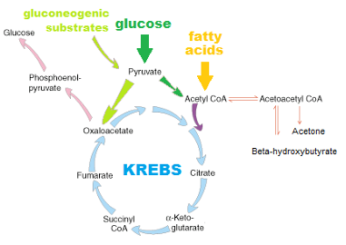

*schema del ciclo di Krebs con gli ingressi dal metabolismo del glucosio (via piruvato), degli acidi grassi (via Acetil-CoA) e dei substrati gluconeogenici, con gli intermedi del ciclo (citrato, α-chetoglutarato, succinil-CoA, fumarato, ossalacetato)*

- **maggiore capacità di ossidare i grassi**: l'allenamento aumenta gli enzimi della beta-ossidazione, permettendo di usare più grassi e "risparmiare" il prezioso glicogeno muscolare;
- **migliore trasporto del piruvato**: grazie all'aumento dei trasportatori e degli enzimi (come la piruvato deidrogenasi), il passaggio dal glucosio al ciclo di Krebs è più fluido;
- **efficienza del ciclo di Krebs**: aumenta la concentrazione di tutti gli intermedi del ciclo, permettendo al "motore" metabolico di girare a regimi più alti senza ingolfarsi.

---

## Controllo dell'ossidazione degli acidi grassi

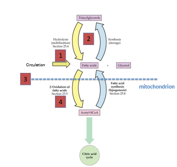

*schema che mostra i quattro livelli di controllo dell'ossidazione degli acidi grassi: (1) circolazione degli acidi grassi liberi verso la cellula; (2) idrolisi/sintesi dei trigliceridi intramuscolari; (3) membrana mitocondriale, come confine tra citoplasma e matrice; (4) beta-ossidazione degli acidi grassi fino ad Acetil-CoA, che entra nel ciclo dell'acido citrico*

L'ossidazione degli acidi grassi (FA) è controllata a diversi livelli:

1. trasporto degli acidi grassi liberi plasmatici (FA) all'interno della cellula muscolare;
2. scomposizione dei trigliceridi intramuscolari (IMTG);
3. captazione (*uptake*) degli acidi grassi da parte dei mitocondri;
4. enzimi che catalizzano l'ossidazione.

A **bassa intensità** il corpo ha tempo di gestire tutti e 4 i livelli, e quindi brucia prevalentemente grassi; ad **alte intensità** il sistema diventa troppo lento per la richiesta energetica immediata, e il corpo passa ai carboidrati. Un atleta allenato ha più enzimi e migliori trasportatori, e può quindi correre più velocemente bruciando grassi e risparmiando zuccheri.

### Trasporto degli acidi grassi nella cellula muscolare

Un livello di controllo cruciale è il trasporto degli **acidi grassi liberi (FFA) plasmatici** all'interno della cellula muscolare. Quattro proteine di membrana sono i protagonisti principali:

- **proteina legante gli acidi grassi della membrana plasmatica** (FABPpm);
- **traslocasi degli acidi grassi** (FAT/CD36);
- **proteine di trasporto degli acidi grassi 1 e 4** (FATP1 e FATP4).

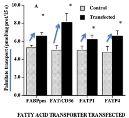

*istogramma che mostra come la sovraespressione (tramite trasfezione/elettroporazione in vivo) di ciascuno dei quattro trasportatori (FABPpm, FAT/CD36, FATP1, FATP4) aumenti significativamente il trasporto del palmitato rispetto al controllo*

Tutti questi trasportatori di FA inducono il trasporto di FA (palmitato) quando vengono sovraespressi tramite trasfezione potenziata da elettroporazione *in vivo*: il trasporto di grassi non è quindi un processo passivo, ma regolato da proteine specifiche.

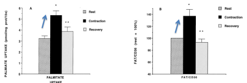

*istogrammi che mostrano come la contrazione muscolare aumenti l'assorbimento di palmitato (palmitate uptake) e l'espressione del trasportatore FAT/CD36, con un parziale ritorno verso i valori basali durante il recupero (confronto tra riposo, contrazione e recupero)*

Questi trasportatori sono espressi in misura maggiore nei muscoli rossi ossidativi rispetto a quelli bianchi glicolitici *(Bonen, 1998)*. La loro concentrazione muscolare viene indotta dalla stimolazione elettrica cronica o dalle contrazioni muscolari; anche il trasportatore FAT/CD36 è regolato dall'esercizio fisico a livello della **traslocazione** dai pool intracellulari al sarcolemma.

**Il controllo del trasporto degli acidi grassi indotto dall'esercizio dipende dall'AMPK**: come già visto nella Parte 2, l'AMPK agisce come sensore non solo per la biogenesi mitocondriale, ma anche per l'ossidazione degli acidi grassi e il trasporto del glucosio. L'agonista dell'AMPK, **AICAR**, induce l'espressione di tutti i trasportatori di FA sulla membrana. Nei topi con **doppio knock-out per AMPKα1/AMPKα2** si osservano invece una ridotta espressione dei trasportatori di FA e un ridotto utilizzo dei grassi durante l'esercizio, con conseguente riduzione dell'ossidazione dei FA — una dimostrazione ulteriore di come questi trasportatori, e non solo la disponibilità di substrato, siano un fattore limitante regolato attivamente dalla cellula:

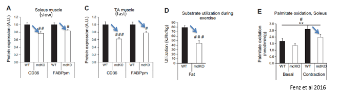
*istogrammi che confrontano, in muscolo soleo (lento) e muscolo TA (tibiale anteriore, veloce) di topi wild-type e con knock-out muscolo-specifico di CD36 (mdKO), l'espressione proteica di CD36 e FABPpm, l'utilizzo di grassi durante l'esercizio, e l'ossidazione del palmitato in condizioni basali e di contrazione, tutti ridotti nei topi mdKO (Fenz et al., 2016)*

### Scomposizione dei trigliceridi intramuscolari (IMTG)

Gli enzimi chiave coinvolti nella lipolisi dei trigliceridi dalle goccioline intramuscolari sono indotti durante l'esercizio fisico:

- i livelli di **lipasi trigliceridica degli adipociti** (ATGL) aumentano;
- l'attività della **lipasi ormono-sensibile** (HSL) è indotta dalla fosforilazione dipendente dal calcio (Ca²⁺) e dall'azione dell'adrenalina durante l'esercizio.

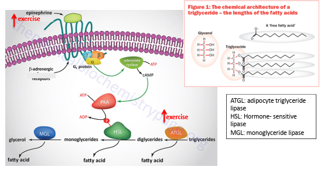
*schema della cascata di segnalazione che, tramite i recettori beta-adrenergici e la proteina Gs, attiva l'adenilato ciclasi e la produzione di cAMP, che attiva la PKA; PKA fosforila HSL, che insieme ad ATGL e MGL scompone i trigliceridi intramuscolari in diacilgliceridi, monogliceridi e infine glicerolo + acidi grassi liberi, con l'esercizio che potenzia questo processo*

- **disponibilità immediata**: avere grassi già presenti nel muscolo (IMTG) è un vantaggio enorme, perché non devono viaggiare nel sangue per arrivare alle "centrali energetiche" (i mitocondri);
- **risposta rapida**: grazie all'adrenalina e al calcio, il muscolo può iniziare a scindere queste riserve non appena inizia l'esercizio;
- **adattamento**: l'allenamento di endurance aumenta la quantità di ATGL e l'efficienza della HSL, permettendo all'atleta di attingere meglio a questa riserva energetica interna.

### Captazione mitocondriale degli acidi grassi

Il trasporto dei FA nei mitocondri è facilitato durante l'esercizio da due meccanismi principali:

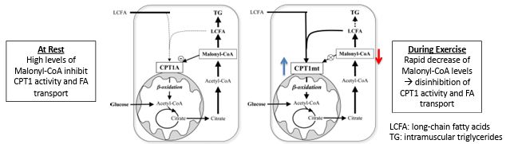
*schema che confronta le condizioni di riposo (alti livelli di malonil-CoA, che inibiscono CPT1 e il trasporto degli FA) con le condizioni di esercizio (rapida diminuzione del malonil-CoA, che disinibisce CPT1 e favorisce l'ingresso mitocondriale degli acidi grassi a lunga catena, LCFA)*

- l'**abbassamento del contenuto di malonil-CoA**, con conseguente disinibizione dell'attività del trasportatore chiave **carnitina palmitoil-transferasi 1** (CPT1);
- l'induzione, da parte dell'esercizio, del trasportatore **FAT/CD36** non solo a livello del sarcolemma (membrana cellulare), ma anche a livello delle membrane mitocondriali.

### Enzimi che catalizzano l'ossidazione: i recettori nucleari

Il PGC-1 non si lega direttamente al DNA, ma agisce in cooperazione con diverse proteine leganti il DNA — in particolare i **recettori nucleari** — per esercitare effetti molto diversi, alcuni dei quali modulati dall'allenamento fisico.

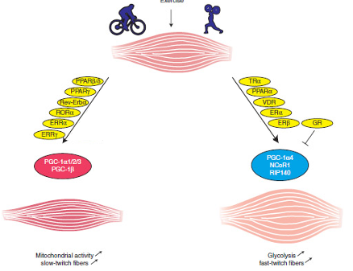

*schema che confronta l'attivazione da endurance (ciclismo), che coinvolge le isoforme PGC-1α1/2/3 e PGC-1β insieme ai recettori PPARβ/δ, PPARα, RevErbα, RORα, ERRα, ERRγ, con effetto di aumento dell'attività mitocondriale e promozione delle fibre lente; e l'attivazione da forza (sollevamento pesi), che coinvolge PGC-1α4 con i co-repressori NCoR1 e RIP140 insieme ai recettori TRα, PPARα, VDR, GR, ERα, ERβ, con effetto di aumento della glicolisi e promozione delle fibre rapide*

Quando si pratica attività di **endurance** (come il ciclismo), si attivano le isoforme **PGC-1α1, 2, 3** e **PGC-1β**, che collaborano con recettori come PPARβ/δ, ERRα ed ERRγ, portando a un aumento dell'attività mitocondriale e alla promozione delle **fibre muscolari lente** (*slow-twitch*), rosse, ricche di mioglobina e molto resistenti alla fatica.

Quando invece si pratica attività di **forza** (come il sollevamento pesi), risponde una specifica isoforma, la **PGC-1α4**, che agisce insieme ad altri co-repressori (come NCoR1 e RIP140) e a recettori come TRα, PPARα, VDR e GR, portando a un aumento della glicolisi (capacità di produrre energia senza ossigeno per sforzi esplosivi) e alla promozione delle **fibre muscolari rapide** (*fast-twitch*), ideali per la forza e la velocità ma che si affaticano presto.

#### I PPAR nel controllo dell'ossidazione degli acidi grassi

I **recettori attivati dai proliferatori dei perossisomi** (PPAR) sono una famiglia di recettori nucleari che si legano al DNA, composta da 3 membri:

- **PPARα**
- **PPARβ/δ**
- **PPARγ**

I PPAR formano eterodimeri con i **recettori X dei retinoidi** (RXR), e cooperano con PGC-1 (coattivatore 1-alfa del recettore gamma attivato dai proliferatori dei perossisomi) nel controllo di numerose vie metaboliche, tra cui l'ossidazione degli acidi grassi, l'attività del ciclo di Krebs e la respirazione mitocondriale.

**PPARβ/δ e PPARγ vs PPARα**: la sovraespressione *in vivo* di tutti i PPAR ha indotto un aumento del metabolismo ossidativo degli acidi grassi, attraverso l'aumento dell'espressione di diversi geni coinvolti nel trasporto o nell'ossidazione dei FA. La trascrizione dei **PPARβ/δ** è indotta dall'esercizio fisico sia acuto che cronico; nel muscolo, la loro espressione è rispettivamente 10 e 50 volte superiore a quella di PPARα e PPARγ.

I topi che sovraesprimono i PPARβ/δ nel muscolo presentano una conversione verso le fibre ossidative e una maggiore capacità di resistenza; i topi con ablazione condizionale dei PPARβ/δ nei muscoli presentano cambiamenti opposti *(Fink, 2005)*.

Esperimenti di perdita e guadagno di funzione nei topi indicano che il **PPARγ** potrebbe svolgere un ruolo simile a quello delle isoforme β/δ, nonostante sia espresso principalmente nel tessuto adiposo e a livelli bassi nei muscoli.

Il **PPARα** svolge invece un ruolo che, per certi aspetti, è diverso: sebbene la sua sovraespressione nei muscoli induca un metabolismo ossidativo degli acidi grassi (analogamente agli altri PPAR), si verifica al contempo una transizione verso le **fibre glicolitiche**. Nei topi con knock-out muscolo-specifico si osserva invece un maggior numero di fibre ossidative, con scarsi cambiamenti nell'ossidazione degli acidi grassi.

#### La competizione PGC-1/NCoR1 nelle risposte dipendenti dai recettori nucleari

I **recettori correlati agli estrogeni** (ERR) sono tre: alfa, beta e gamma. L'ERRα e l'ERRγ sono indotti dall'esercizio fisico, mentre l'ERRβ è meno studiato. Analogamente ai PPAR, gli ERR agiscono insieme al coattivatore PGC-1 nel controllo di numerose vie metaboliche oltre all'ossidazione degli acidi grassi, tra cui l'attività del ciclo di Krebs, la respirazione mitocondriale e la biogenesi mitocondriale stessa.

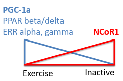

*schema che mostra come, con l'esercizio, prevalgano PGC-1α, PPARβ/δ ed ERRα/γ, mentre con l'inattività prevalga il co-repressore NCoR1*

L'attività positiva del coattivatore PGC-1 sui complessi contenenti ERR e PPAR è contrastata dall'azione repressiva di **NCoR1** (co-repressore 1 dei recettori nucleari), la cui espressione è maggiore nel muscolo scheletrico **inattivo**.

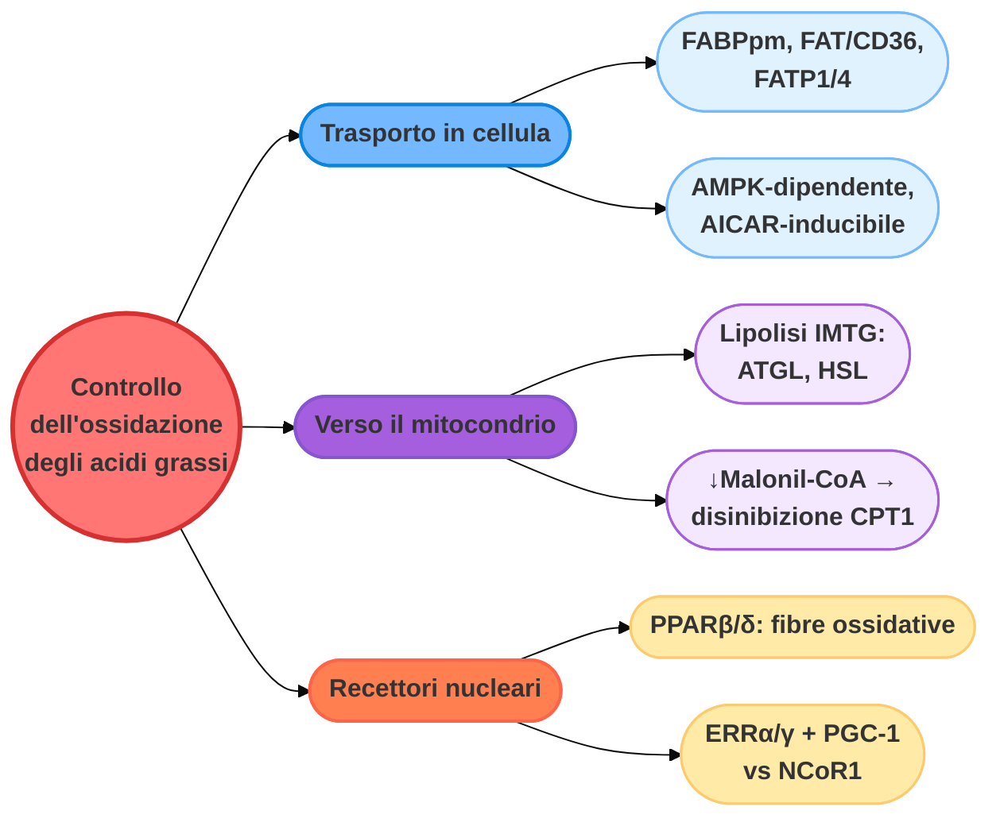

---

## Controllo del trasporto e del metabolismo del glucosio

L'ossidazione del glucosio è regolata a diversi livelli; le fasi fondamentali sembrano essere:

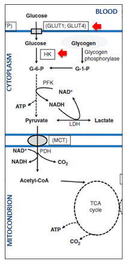

*schema del metabolismo del glucosio dal sangue al mitocondrio, con il trasporto tramite GLUT1/GLUT4, la fosforilazione da parte dell'esochinasi (HK) a glucosio-6-fosfato, la glicolisi fino a piruvato (con possibile conversione in lattato via LDH), il trasporto mitocondriale del piruvato tramite MCT e la sua ossidazione (PDH) fino ad Acetil-CoA, che entra nel ciclo di Krebs*

- il trasporto del glucosio plasmatico nella cellula muscolare;
- la fosforilazione del glucosio, ad opera dell'esochinasi (HK).

### L'esercizio induce un aumento del GLUT4 nel sarcolemma

Durante un esercizio fisico intenso, il **glicogeno muscolare** costituisce il substrato metabolico preferenziale, e la fosforilazione del glucosio mediata dall'esochinasi sembra rappresentare la fase limitante dell'utilizzo del glucosio plasmatico. Al contrario, durante un esercizio fisico acuto **submassimale**, o in condizioni di riposo, il trasporto/la disponibilità del glucosio diventa una fase limitante cruciale.

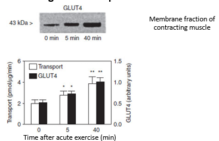

*Western blot che mostra l'aumento del trasportatore GLUT4 (43 kDa) nella frazione di membrana del muscolo in contrazione a 0, 5 e 40 minuti dall'inizio dell'esercizio, accompagnato dal relativo istogramma di trasporto del glucosio e contenuto di GLUT4, entrambi in aumento nel tempo*

- il trasporto del glucosio ai muscoli è indotto dall'aumento del flusso sanguigno indotto dall'esercizio fisico;

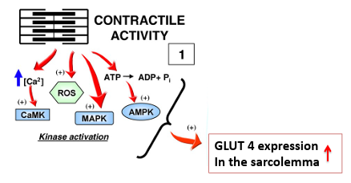

*schema che mostra come l'attività contrattile, tramite l'aumento di Ca2+, ROS e la variazione ATP→ADP+Pi, attivi CaMK, MAPK e AMPK, che convergono sull'aumento dell'espressione di GLUT4 nel sarcolemma*

- avviene una rapida **traslocazione** del trasportatore GLUT4 verso la membrana, direttamente correlata al livello di trasporto del glucosio.

Le vie dipendenti dall'attività contrattile in grado di indurre PGC-1 (viste nella Parte 2) aumentano anche i livelli di GLUT4 nel sarcolemma.

*Studio (O'Neil et al., 2001)*: topi con AMPK knock-out, o con l'uso di varianti dominanti-negative (KD), presentano un ridotto aumento dell'assorbimento del glucosio indotto dall'esercizio fisico e una diminuita presenza di GLUT4 nel sarcolemma.

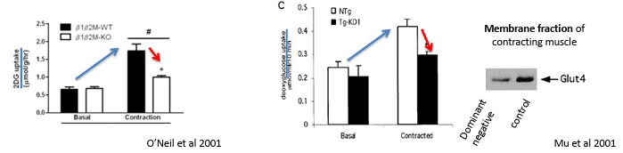
*tre grafici sperimentali: (1) O'Neil et al 2001 — confronto tra topi wild-type e AMPK-KO (β1β2M-KO) per l'assorbimento di 2-deossiglucosio, ridotto nei KO durante la contrazione; (2) confronto tra topi normali e transgenici con dominante-negativo per AMPK (Tg-KD1), con captazione ridotta durante la contrazione; (3) Mu et al 2001 — Western blot per GLUT4 sulla membrana del muscolo in contrazione, ridotto nei topi con AMPK dominante-negativo*

L'attivatore dell'AMPK, **AICAR**, induce l'assorbimento del glucosio.

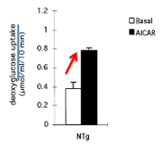

*istogramma che mostra come l'AICAR aumenti l'assorbimento del deossiglucosio rispetto alla condizione basale nei topi wild-type*

Durante l'esercizio fisico intenso, l'AMPK ha aumentato principalmente l'assorbimento del glucosio modulando la **traslocazione** del GLUT4 verso la membrana, e non aumentandone l'espressione generale.

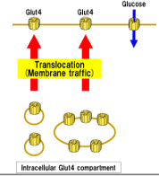

*schema che mostra i trasportatori GLUT4 presenti sulla membrana e un pool intracellulare di vescicole contenenti GLUT4, che vengono traslocate verso la membrana ("membrane traffic") in risposta alla contrazione, aumentando così il trasporto del glucosio senza necessariamente aumentare il numero totale di trasportatori*

### L'allenamento induce l'espressione di GLUT4

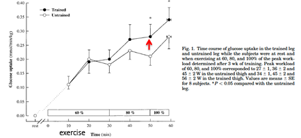

*grafico che confronta, in una gamba allenata e in una non allenata dello stesso soggetto, la captazione di glucosio nel tempo (0-60 minuti) durante un esercizio incrementale (60%, 80%, 100% del carico di lavoro di picco), con captazione più elevata nella gamba allenata*

L'allenamento fisico aumenta la capacità dei muscoli di assorbire il glucosio in risposta a uno sforzo fisico intenso; questo è correlato con un incremento totale del **contenuto di GLUT4** nel muscolo.

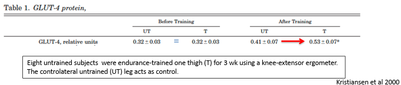
*tabella che confronta il contenuto proteico di GLUT-4 (unità relative) nella gamba non allenata e in quella allenata per 3 settimane con un ergometro a estensione di ginocchio, prima e dopo l'allenamento: il contenuto di GLUT-4 aumenta significativamente solo nella gamba allenata (Kristiansen et al., 2000)*

In acuto si osserva quindi una **rilocalizzazione** del trasportatore già presente, mentre la risposta adattativa all'allenamento cronico consiste in un aumento della **disponibilità** di recettori GLUT4 per il glucosio.

#### PGC-1/MEF2 nel controllo di GLUT4 durante l'allenamento

Le vie dipendenti dalla contrazione muscolare responsabili della traslocazione di GLUT4 sulla membrana durante l'esercizio acuto sono coinvolte anche nella regolazione trascrizionale (cronica) di GLUT4. I siti di legame per **MEF2** sono presenti nel promotore del gene GLUT4, e l'asse **PGC-1/MEF2** indotto dall'allenamento è cruciale per il suo controllo trascrizionale.

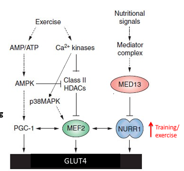

*schema che integra i segnali dell'esercizio (AMP/ATP, Ca2+) e i segnali nutrizionali: AMPK e le chinasi Ca2+-dipendenti inibiscono le HDAC di classe II e attivano p38MAPK, che insieme convergono su MEF2; MEF2, PGC-1 e NURR1 regolano insieme la trascrizione di GLUT4, mentre il complesso Mediator (tramite MED13) modula negativamente NURR1 in risposta ai segnali nutrizionali*

#### NURR1 nel controllo del metabolismo del glucosio

Il recettore nucleare **NURR1** (*Nuclear Receptor Related 1*):

- induce la trascrizione di GLUT4, lavorando in sinergia con MEF2;
- è maggiormente up-regolato (aumentato) dalla contrazione muscolare dopo l'allenamento fisico (esercizio cronico).

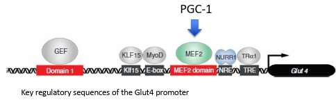
*schema del promotore del gene GLUT4, con le sequenze regolatorie chiave (Dominio 1, KLF15/E-box, dominio MEF2, NRE, TRE) legate rispettivamente da GEF, KLF15/MyoD, MEF2 (stimolato da PGC-1) e NURR1/TRα1*

#### Il complesso Mediator: un regolatore chiave del metabolismo mitocondriale

Il complesso **Mediator** è costituito da numerose proteine e funge da centro nevralgico della trascrizione, interagendo spesso con diverse classi di recettori nucleari. L'asse Mediator-recettore nucleare è modulato da numerosi metaboliti e ormoni, dipendenti dallo stato nutrizionale.

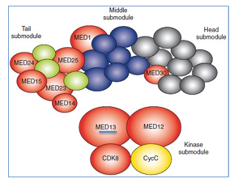

*schema strutturale del complesso Mediator, organizzato in un modulo di coda (con MED14, 15, 23, 24, 25), un modulo centrale (con MED1), un modulo di testa (con MED30) e un modulo chinasico (con MED12, MED13, CDK8, ciclina C)*

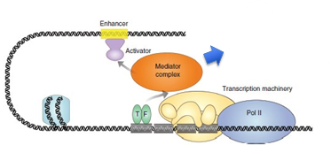

*schema che mostra il complesso Mediator fare da ponte tra un attivatore legato a una sequenza enhancer del DNA e la macchina trascrizionale (fattori generali di trascrizione, TF, e RNA polimerasi II) sul promotore del gene*

Uno dei componenti del complesso, **MED13**, esercita una **modulazione negativa** dell'espressione e dell'attività di NURR1, integrando i segnali provenienti dai segnali nutrizionali con quelli, dipendenti dall'allenamento/esercizio, che agiscono su MEF2 e NURR1. La funzione del Mediator è specifica per ciascun tessuto, e può essere opposta in tessuti diversi (come dimostrato nel caso del cuore rispetto al muscolo scheletrico).

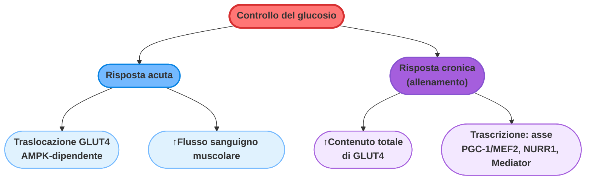

*Continua nella [Parte 4](#) con i mimetici farmacologici dell'esercizio (AICAR, GW501516) e le loro implicazioni per il doping — oltre al riassunto finale dell'intero capitolo.*
