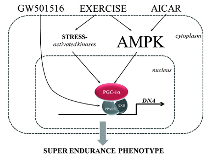
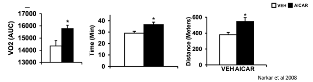
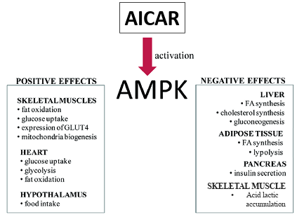
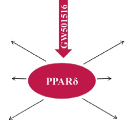
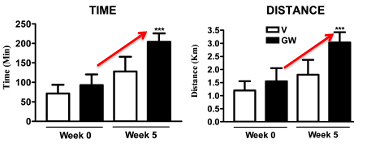
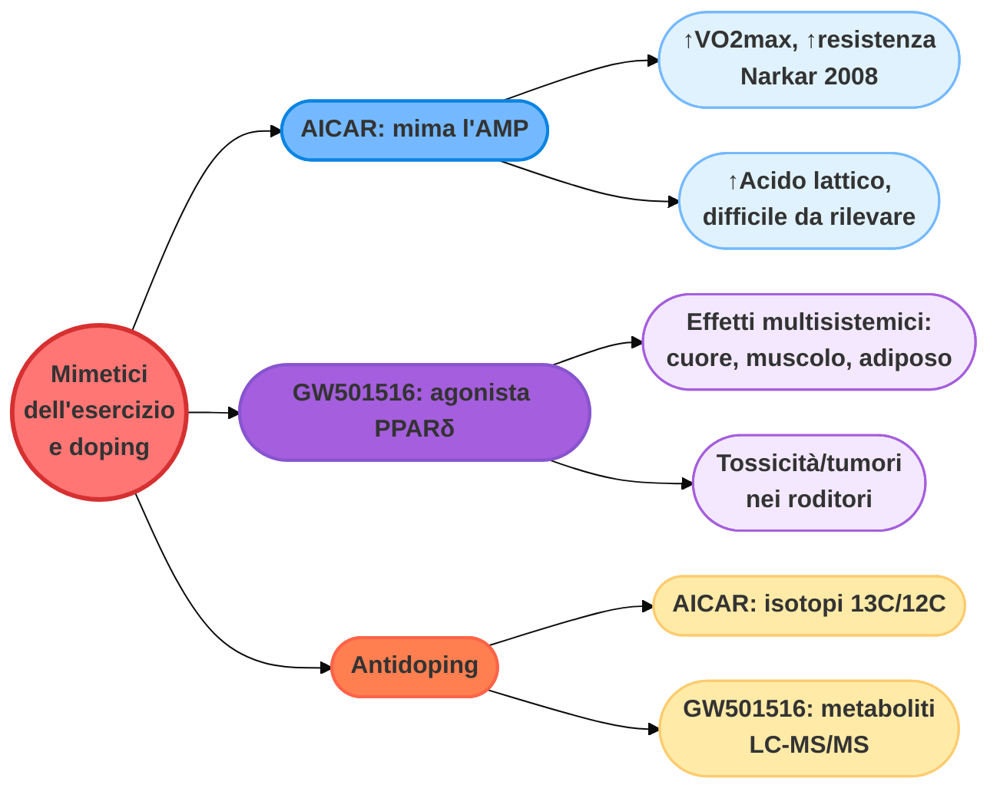
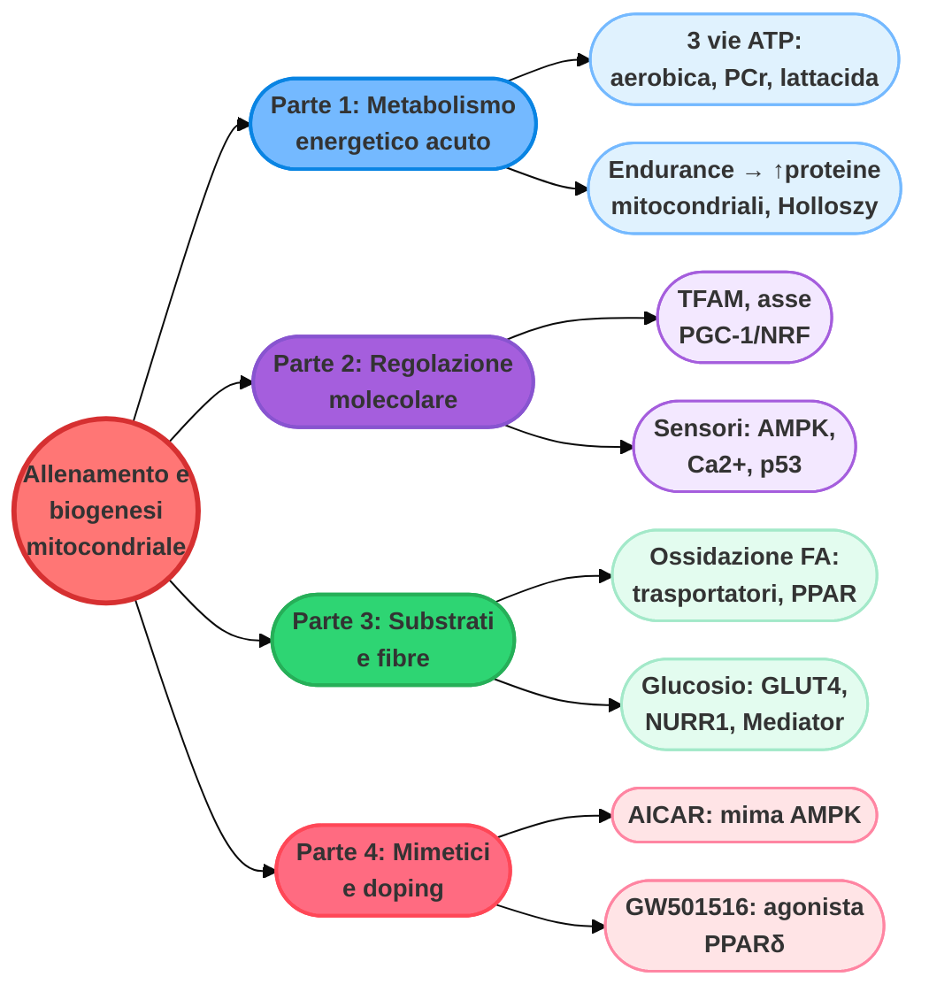

# Mimetici dell'esercizio e doping: AMPK, PPARδ e i limiti della farmacologia (Parte 4 di 4)

> Questa è la **Parte 4 di 4**, conclusiva, del capitolo dedicato agli adattamenti mitocondriali indotti dall'allenamento. Nella [Parte 3](#) abbiamo visto come l'allenamento controlli l'apporto di substrati metabolici (acidi grassi e glucosio) ai mitocondri e la tipizzazione delle fibre muscolari. In questa parte vediamo come alcune delle vie molecolari descritte nelle parti precedenti (AMPK, PPARδ) possano essere bersaglio di farmaci in grado di imitare, almeno in parte, gli effetti dell'esercizio fisico — con importanti implicazioni per l'antidoping.

## Metabolismo mitocondriale dipendente dall'esercizio e doping

Nella lista delle sostanze proibite fornita dalla **WADA** troviamo, nella **Sezione S4** (Modulatori Ormonali e Metabolici):

- **5.1** Attivatori della proteina chinasi AMP-attivata (**AMPK**): ad esempio **AICAR** e **SR9009**; e agonisti del recettore **PPARδ** (ad esempio **GW501516**). Agendo sulle diverse vie viste nelle parti precedenti, questi farmaci rendono il metabolismo mitocondriale più efficiente, e possono quindi aumentare la prestazione fisica.
- **5.2** Insuline e insulino-mimetici.
- **5.3** Meldonium.
- **5.4** Trimetazidina: inibisce la beta-ossidazione degli acidi grassi e aumenta l'ossidazione del glucosio. Poiché l'energia ottenuta dall'ossidazione del glucosio richiede un minor consumo di ossigeno rispetto alla beta-ossidazione, la somministrazione di trimetazidina protegge dall'ischemia (applicazione terapeutica), ma può essere utilizzata anche come agente dopante.

Nella **Sezione M3** (Doping Genetico e Cellulare) rientra inoltre l'uso di polimeri di acidi nucleici o di agenti di *editing* genetico per alterare la trascrizione o la regolazione genica.

---

## AICAR e GW501516: due mimetici dell'esercizio

Gli agonisti di AMPK e di PPARδ sono considerati **mimetici dell'esercizio**.

*schema che mostra come GW501516, l'esercizio e l'AICAR convergano tutti sull'attivazione dell'AMPK nel citoplasma (o direttamente sul recettore PPARδ, nel caso di GW501516); l'AMPK attiva PGC-1α nel nucleo, che coopera con PPARδ/RXR sul DNA, portando a un "fenotipo super-endurance"*

### AICAR: l'attivatore di AMPK

L'esercizio fisico naturale aumenta l'AMP, che attiva l'**AMPK**. L'**AICAR** è un farmaco che entra nella cellula e simula la presenza di AMP: l'AMPK, così "ingannata", attiva a sua volta **PGC-1α** nel nucleo. Questo porta alla creazione di nuovi mitocondri e a un metabolismo più efficiente.

### GW501516: l'agonista di PPARδ

Mentre l'esercizio agisce "dall'alto" (attivando chinasi e AMPK), il **GW501516** agisce direttamente nel nucleo: si lega al recettore **PPARδ**, già posizionato sul DNA. Una volta attivato, PPARδ collabora con PGC-1α per accendere i geni responsabili della combustione dei grassi e della resistenza muscolare.

### AICAR e performance fisica

*Studio: Narkar et al., 2008*. L'**AICAR** (ribonucleotide 5-amminoimidazolo-4-carbossamide) è un analogo dell'adenosina monofosfato (AMP), in grado di stimolare l'attività della proteina chinasi AMP-dipendente (AMPK). I topi trattati con AICAR per 4 settimane presentano un aumento del VO₂max e corrono più a lungo — il 44% in più — rispetto ai topi trattati con il veicolo (placebo).

*tre istogrammi (Narkar et al 2008) che confrontano topi trattati con veicolo (VEH) e con AICAR per VO2 (area sotto la curva), tempo di corsa (minuti) e distanza percorsa (metri), tutti significativamente aumentati nei topi trattati con AICAR*

Già dopo 5 giorni di trattamento con AICAR si osserva un aumento del trasportatore del glucosio GLUT4 e degli enzimi mitocondriali *(Barre et al., 2007)*.

### Effetti collaterali dell'AICAR

*schema riassuntivo degli effetti dell'AICAR sull'AMPK, con effetti positivi (ossidazione dei grassi, captazione del glucosio, espressione di GLUT4, biogenesi mitocondriale nel muscolo scheletrico; captazione del glucosio, glicolisi, ossidazione dei grassi nel cuore; controllo dell'appetito nell'ipotalamo) ed effetti negativi (sintesi di FA e colesterolo, gluconeogenesi nel fegato; sintesi di FA e lipolisi nel tessuto adiposo; secrezione di insulina nel pancreas; accumulo di acido lattico nel muscolo scheletrico)*

Il trattamento con AICAR induce un incremento sostanziale di **acido lattico** nel muscolo *(Aschenbach et al., 2002)*. Non sono ancora stati condotti studi a lungo termine sugli esseri umani, ma, basandosi sulle funzioni note dell'AMPK, le possibili conseguenze dannose riguardano l'impatto sulla produzione di insulina e sul metabolismo del tessuto epatico/adiposo.

### AICAR e controllo del doping

L'AICAR è apparentemente usato come sostanza dopante, ed è stato confiscato in diversi eventi sportivi. L'analisi standard basata sulla spettrometria di massa sulle urine non è finora riuscita a rilevare casi di positività, perché l'**AICAR è una molecola endogena** (cioè prodotta fisiologicamente dal corpo), che:

- aumenta durante la competizione;
- è più alta negli atleti allenati alla resistenza;
- risulta quindi difficile da rilevare.

Per ovviare al problema, sono stati recentemente sviluppati nuovi metodi:

- **LC-MS** sui campioni di sangue;
- **LC-MS** sui globuli rossi (rilevazione a lungo termine, poiché i livelli di AICAR si conservano per la vita degli eritrociti, circa 120 giorni);
- rapporto isotopico **¹³C/¹²C** tramite spettrometria di massa, per distinguere l'AICAR esogeno (esterno) da quello endogeno (interno) nelle urine.

---

## GW501516: effetti multisistemici e rischi

Il **GW501516** è una sostanza che agisce attivando il recettore nucleare **PPARδ**.

*schema che mostra GW501516 attivare centralmente PPARδ, da cui si diramano frecce verso i molteplici effetti multisistemici descritti di seguito (cuore, muscolo, tessuto adiposo, arterie, fegato, macrofagi)*

| Organo/tessuto | Effetto principale | Meccanismo |
| :--- | :--- | :--- |
| **Cuore** | Incremento della funzione contrattile | Aumento del trasporto e dell'ossidazione degli acidi grassi. |
| **Muscolo** | Incremento della capacità di resistenza (endurance) | Aumento del trasporto/ossidazione degli acidi grassi; aumento della termogenesi; aumento delle **fibre a contrazione lenta** (fibre rosse, resistenti alla fatica). |
| **Tessuto adiposo** | Prevenzione dell'obesità | Aumento del trasporto/ossidazione dei grassi e della termogenesi. |
| **Arterie** | — | Aumento del colesterolo HDL ("buono"). |
| **Fegato** | Diminuzione dell'immissione di glucosio | Aumento dello shunt dei pentoso-fosfati (via metabolica parallela alla glicolisi). |
| **Macrofagi** | Switch anti-infiammatorio | Legame/rilascio di BCL-6 (proteina regolatrice dell'infiammazione). |

### Effetti del GW501516 sulla prestazione fisica

In uno studio condotto su topi, gli animali trattati con GW501516 sono risultati più reattivi all'allenamento di resistenza (5 settimane) rispetto ai topi trattati con placebo (veicolo).

*due grafici che mostrano come, dopo 5 settimane, i topi trattati con GW501516 (barre nere) corrano per un tempo maggiore e coprano una distanza maggiore rispetto ai controlli (barre bianche)*

- il trattamento con GW501516 ha indotto alterazioni dell'espressione genica che si sovrappongono parzialmente a quelle indotte dall'allenamento;
- il trattamento con GW501516 **combinato** con l'esercizio induce un forte incremento della prestazione di resistenza, che si riflette in una firma trascrizionale specifica.

### Rischi associati all'uso di GW501516

Studi a lungo termine sui roditori hanno evidenziato una **seria tossicità** e reperti neoplastici (tumori) nel tratto gastrointestinale, nell'utero, nel fegato e nella vescica urinaria, con conseguente diminuzione della sopravvivenza. Test clinici sull'uomo, condotti con dosi significativamente inferiori (10 mg/persona/giorno, rispetto a oltre 30 mg/kg/giorno nei roditori), non hanno riportato gravi effetti collaterali — restano tuttavia necessarie indagini più attente e durature sugli effetti collaterali a lungo termine.

### GW501516 e controllo del doping

Il GW501516 è un **farmaco esogeno** (non prodotto naturalmente dal corpo). Il rilevamento delle sostanze dopanti richiede la conoscenza del processo di trasformazione metabolica ed eliminazione: il GW501516 dà origine a due **metaboliti** principali, rilevabili nelle urine:

- **GW501516-sulfone** → rilevabile per **40 giorni** dopo la somministrazione;
- **GW501516-sulfossido** → rilevabile per **25 giorni** dopo la somministrazione.

La spettrometria di massa (approccio basato su **LC-MS/MS**) ha permesso di rilevare casi di doping con GW501516 nel **ciclismo**. Un approccio simile è stato sviluppato anche per un altro agonista sintetico di PPARδ sviluppato più recentemente, il **GW0742**. Recentemente è stato inoltre sviluppato un **bio-test** (*bioassay*) basato su cellule umane trasfettate *in vitro* con un plasmide "reporter" (luciferasi) guidato da un elemento di risposta a PPAR: questo permette di analizzare la presenza di GW501516 in campioni biologici, negli integratori sportivi (venduti come prodotti "per ricerca" o "non per consumo umano") e la comparsa di nuovi agonisti di PPARδ.

---

## I recettori nucleari come bersagli farmacologici

Studi sugli animali attribuiscono ai **recettori nucleari** un ruolo chiave nel controllo non solo del metabolismo mitocondriale e della massa muscolare, ma anche della tipizzazione delle fibre (*fiber typing*); questo si correla con una prestazione fisica alterata.

### Mimetici dell'esercizio e doping: un bilancio

I farmaci che agiscono sulle vie (pathway) coinvolte nelle risposte mitocondriali all'esercizio di resistenza e sulla tipizzazione delle fibre possono essere usati come doping, ma potenzialmente anche come veri e propri "**mimetici dell'esercizio**" a scopo terapeutico. Tuttavia, prima di un loro eventuale utilizzo clinico, dovrebbero essere completati rigorosi test preclinici e clinici adeguati, con l'obiettivo di migliorare la salute con effetti collaterali dannosi trascurabili (*negligible*).

> Nonostante la comprensione sempre più profonda dei meccanismi molecolari coinvolti (PGC-1, MEF2, NURR1, PPAR), **nulla può ancora sostituire in modo sicuro l'esercizio fisico reale**, che attiva migliaia di vie metaboliche in modo perfettamente orchestrato e bilanciato dal corpo.

---

## Riassunto finale del capitolo

Questo riassunto integra i contenuti delle 4 parti del capitolo: dagli adattamenti metabolici acuti dell'esercizio fisico, fino alla regolazione molecolare della biogenesi mitocondriale, al controllo dei substrati energetici e ai suoi bersagli farmacologici.

- Le riserve intramuscolari di ATP sono insufficienti per un esercizio prolungato.
- Tre principali vie metaboliche provvedono alla rigenerazione dell'ATP: aerobica, della fosfocreatina e glicolitica lattacida. La durata e l'intensità dell'esercizio determinano la via metabolica predominante.
- L'esercizio submassimale si basa principalmente sull'ossidazione aerobica dei lipidi (acidi grassi circolanti, trigliceridi intramuscolari), dei carboidrati (glucosio ematico e glicogeno) e del lattato.
- L'allenamento di resistenza aumenta il contenuto mitocondriale e la produzione aerobica di ATP. Questa risposta dipende da:
    - la replicazione del DNA mitocondriale;
    - la modulazione concertata della trascrizione del genoma nucleare e mitocondriale;
    - il coordinamento di due tipi di ribosomi, uno dei quali costituito dai mitoribosomi, formati da rRNA mitocondriali e proteine codificate dal nucleo.
- Il **TFAM**, codificato dal nucleo, è il regolatore principale della trascrizione e della replicazione del DNA mitocondriale; la sua trascrizione nucleare e la sua traslocazione nei mitocondri sono aumentate dall'esercizio fisico.
- I **fattori respiratori nucleari 1 e 2** (NRF1/2) controllano la trascrizione dei geni mitocondriali e nucleari, compreso il TFAM.
- Il coattivatore **PGC-1**, indotto dall'esercizio fisico e dall'allenamento, controlla sia la trascrizione sia la capacità di attivazione trascrizionale degli NRF; analogamente, coattiva i fattori MEF2.
- La contrazione muscolare attiva l'adattamento mitocondriale attraverso:
    - l'attivazione dell'**AMPK** mediata dall'AMP, e la conseguente attivazione di PGC-1 da parte dell'AMPK;
    - l'attivazione mediata dal **Ca²⁺** della calcineurina (CaN), della calmodulin-chinasi (CaMK) o della p38 MAPK, che a loro volta attivano PGC-1.
- PGC-1 è un attore chiave, ma sono coinvolti anche altri percorsi, come **p53**, che stimola il TFAM e una conseguente risposta mitocondriale in modo dipendente o indipendente da PGC-1.
- Il controllo **post-trascrizionale** della risposta mitocondriale all'esercizio fisico può agire a livello di stabilità dell'mRNA e di trasporto delle proteine mitocondriali codificate nel nucleo all'interno dei mitocondri.
- Un ulteriore controllo dell'attività mitocondriale durante l'esercizio fisico dipende dal controllo dell'**apporto di substrati metabolici**. L'ossidazione degli acidi grassi è controllata a diversi livelli: trasporto dei FFA plasmatici nella cellula muscolare, degradazione dei trigliceridi intramuscolari (IMTG), assorbimento mitocondriale degli acidi grassi, ed enzimi che catalizzano l'ossidazione. L'asse **PGC-1/recettori nucleari** (in particolare PPAR ed ERR) svolge un ruolo cruciale in questo processo.
- L'ossidazione del **glucosio** è regolata dalla fosforilazione del glucosio e dal trasporto del glucosio plasmatico nella cellula muscolare. L'esercizio fisico acuto induce la traslocazione del GLUT4 verso il sarcolemma, mentre l'allenamento fisico ne attiva anche la trascrizione, attraverso l'asse AMPK/Ca²⁺-PGC-1/MEF2 e l'asse Complesso Mediator/NURR1.
- L'allenamento fisico può indurre un **cambiamento del tipo di fibra**; diversi recettori nucleari sono coinvolti in questo controllo.
- I farmaci che agiscono sulle vie coinvolte nelle risposte mitocondriali all'esercizio di resistenza e nella tipizzazione delle fibre possono essere utilizzati come doping, ma potenzialmente anche come "mimetici dell'esercizio" — previo completamento di adeguati test preclinici e clinici. L'attivatore dell'AMPK **AICAR** e l'attivatore del PPARδ **GW501516** sono esempi di mimetici dell'esercizio esplicitamente vietati dalla WADA.

