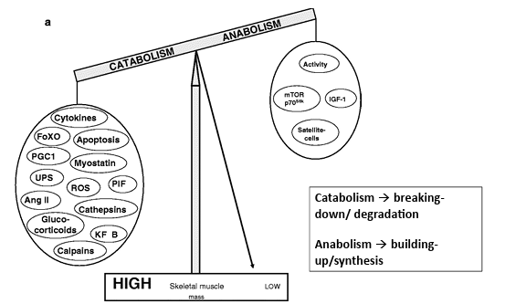
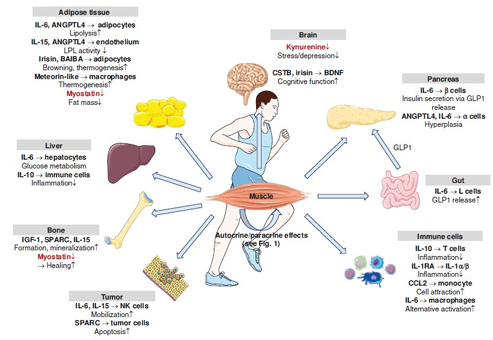
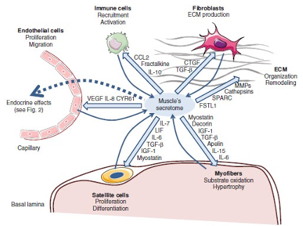
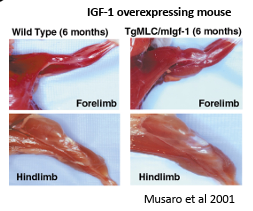
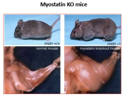
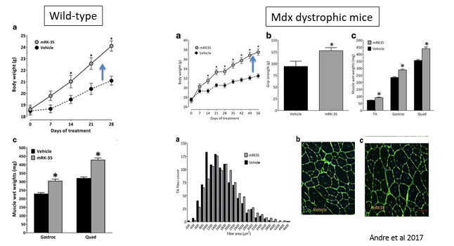
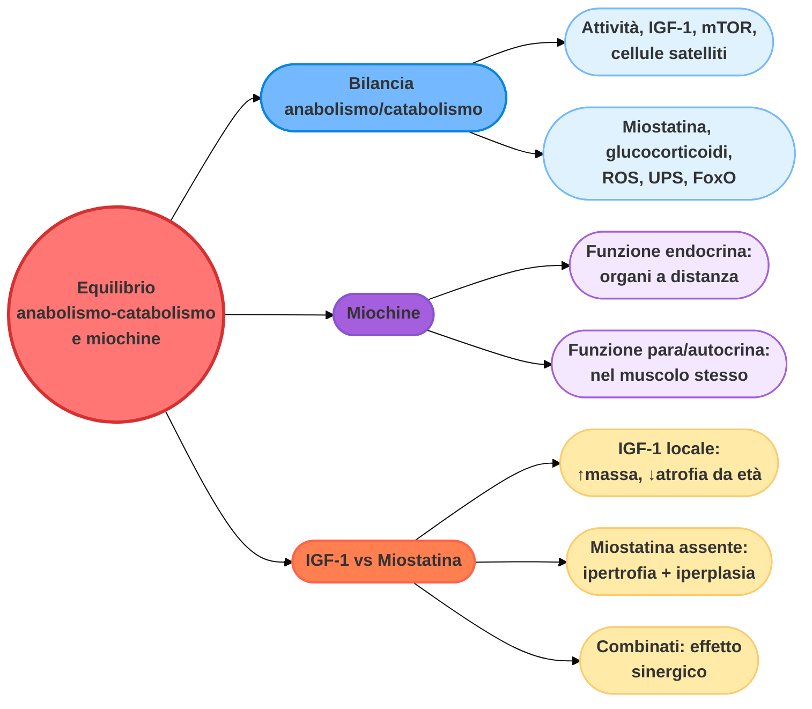

# Ipertrofia muscolare: equilibrio anabolismo-catabolismo e miochine (Parte 1 di 3)

## Allenamento della forza e ipertrofia muscolare

L'allenamento della forza porta a un aumento della forza/potenza muscolare principalmente come risultato di due fasi distinte:

- **adattamenti neuromuscolari** (fase precoce);
- **aumento della massa muscolare**, cioè ipertrofia (fase a lungo termine).

Dopo 8-12 settimane di allenamento della forza nell'uomo si osservano aumenti evidenti dell'area della sezione trasversale muscolare (CSA) rispetto alla massa, sebbene siano stati segnalati casi di ipertrofia già in fasi precedenti.

---

## Equilibrio tra anabolismo e catabolismo nel muscolo

Per **catabolismo** intendiamo lo scomporre le molecole complesse in molecole più semplici, liberando energia (ATP). Per **anabolismo**, dall'altra parte, intendiamo l'utilizzo di energia per costruire molecole complesse, essenziali per la crescita e la riparazione dei tessuti. Entrambi i processi lavorano in un continuo equilibrio, e la massa muscolare a un dato momento è il risultato netto di questa bilancia.

*schema a bilancia che mostra, da un lato, i fattori del catabolismo (Citochine, FoxO, PGC1, Miostatina, UPS, ROS, PIF, Ang II, Glucocorticoidi, Catepsine, KF-B, Calpaine) e, dall'altro, i fattori dell'anabolismo (Attività, mTOR/p70S6k, IGF-1, Cellule satellite), con l'ago della bilancia che determina se la massa muscolare scheletrica sale (HIGH) o scende (LOW)*

### Anabolismo nel muscolo

I fattori che promuovono la crescita e il mantenimento del muscolo sono:

- **attività fisica**: l'esercizio fisico, specialmente contro resistenza;
- **IGF-1**: fattore di crescita simile all'insulina, un potente segnale di costruzione;
- **mTOR / p70S6k**: la "centralina" molecolare della sintesi proteica — quando mTOR è attivo, la cellula costruisce attivamente nuove proteine;
- **cellule satelliti**: le cellule staminali del muscolo, che intervengono nella crescita e nella riparazione (approfondite nella Parte 3).

### Catabolismo nel muscolo

I fattori che portano invece alla perdita di muscolo (atrofia, approfondita nella Parte 2) sono:

- **miostatina**: una proteina che agisce come un freno naturale alla crescita muscolare;
- **glucocorticoidi**: come il cortisolo (l'ormone dello stress), che degrada le proteine muscolari;
- **ROS**: radicali liberi (stress ossidativo) che possono danneggiare le strutture cellulari;
- **UPS** (Sistema Ubiquitina-Proteasoma): il principale "tritacarne" cellulare che demolisce le proteine vecchie o danneggiate;
- **citochine**: molecole infiammatorie che, se elevate (es. in caso di malattia cronica), promuovono la perdita di muscolo;
- **FoxO**: fattori di trascrizione che "accendono" i geni della degradazione.

---

## Le miochine: i messaggeri del muscolo

Le **miochine** sono molecole proteiche, un tipo di citochine (messaggeri chimici), prodotte e rilasciate dai muscoli scheletrici durante la contrazione, specialmente grazie all'esercizio fisico. Alcuni esempi di miochine sono: miostatina, varie citochine, IGF-1.

*schema che mostra il muscolo come organo endocrino, con le miochine rilasciate durante l'esercizio che raggiungono e modulano numerosi organi e tessuti: tessuto adiposo (lipolisi, browning), cervello (funzione cognitiva, stress/depressione), pancreas (secrezione insulinica, iperplasia delle cellule α), fegato (metabolismo del glucosio), osso (formazione, mineralizzazione), intestino (rilascio di GLP1), cellule immunitarie (infiammazione) e tumore (mobilizzazione ed effetti anti-tumorali delle cellule NK)*

Le principali caratteristiche delle miochine sono:

- sono rilasciate dal muscolo scheletrico;
- possono essere modulate da una singola sessione di esercizio o dall'allenamento costante;
- possono essere rilasciate nel sangue e controllare diversi tessuti a distanza → **funzione endocrina**;
- possono agire localmente, nel muscolo stesso → **funzione para/autocrina**.

### Funzione paracrina/autocrina delle miochine nel muscolo

*schema del "secretoma" del muscolo, che mostra come le miochine rilasciate dalle fibre muscolari (miostatina, decorina, IGF-1, TGF-β, apelina, IL-15, IL-6, IL-7, LIF) agiscano localmente sulle cellule satellite (proliferazione, differenziazione) e sulle miofibre stesse (ossidazione dei substrati, ipertrofia), oltre a coinvolgere cellule endoteliali, cellule immunitarie e fibroblasti nel rimodellamento della matrice extracellulare*

Le miochine possono:

- essere rilasciate da molteplici tipi cellulari presenti nel muscolo;
- **modulare** la **funzione** di differenti cellule nel muscolo, incluse le fibre muscolari e le cellule staminali del muscolo (cellule satellite, approfondite nella Parte 3).

---

## IGF-1 contro miostatina: prove sperimentali

L'IGF-1 e la miostatina agiscono, almeno in parte, come segnali opposti nel controllo della massa muscolare: il primo la promuove, la seconda la limita. Tre studi chiave aiutano a chiarire il loro ruolo.

### IGF-1 locale e invecchiamento muscolare

*Studio: Musarò et al., 2001*

Lo studio ha indagato il ruolo dell'IGF-1 nel muscolo scheletrico utilizzando topi geneticamente modificati. In particolare, i ricercatori hanno fatto esprimere una forma di IGF-1 direttamente nel tessuto muscolare, in modo da studiarne gli effetti locali piuttosto che quelli sistemici circolanti.

I risultati hanno mostrato che questa produzione locale di IGF-1 induce un aumento della massa e della forza muscolare senza effetti patologici evidenti. Con l'avanzare dell'età, i topi transgenici mantenevano una struttura e una funzione muscolare migliori rispetto ai controlli, mostrando una riduzione dell'atrofia tipicamente associata all'invecchiamento. Inoltre, in seguito a danno muscolare, questi animali presentavano una capacità rigenerativa superiore, legata a una più efficiente attivazione delle cellule satellite.

*fotografie di arti anteriori e posteriori di topi wild type e transgenici che sovraesprimono IGF-1 nel muscolo (TgMLC/mIgf-1) a 6 mesi di età, che mostrano una massa muscolare visibilmente maggiore nei topi transgenici (Musarò et al., 2001)*

*fotografie comparative di topi wild type (mstn +/+) e topi knockout per la miostatina (mstn -/-), che mostrano la marcata ipertrofia muscolare generalizzata indotta dall'assenza di miostatina, visibile sia nella silhouette dell'animale che nella dissezione dell'arto posteriore*

Nel complesso, lo studio dimostra che l'IGF-1 prodotto localmente nel muscolo non solo promuove l'ipertrofia, ma contribuisce anche a preservare l'integrità e la capacità di rigenerazione del tessuto muscolare durante l'invecchiamento.

### Mutazioni della miostatina e massa muscolare umana

*Studio: Schuelke et al., "Myostatin Mutation Associated with Gross Muscle Hypertrophy in a Child"*

Lo studio descrive un raro caso umano che ha permesso di chiarire il ruolo della miostatina nella regolazione della massa muscolare. I ricercatori hanno analizzato un bambino che presentava uno sviluppo muscolare eccezionalmente elevato fin dalla nascita, con una quantità di grasso corporeo molto bassa e una forza superiore alla norma per la sua età.

Attraverso analisi genetiche, è stata identificata una mutazione *loss-of-function* nel gene **MSTN**, che codifica per la miostatina. Questa mutazione impediva la produzione di una proteina funzionale, eliminando di fatto il segnale inibitorio che normalmente limita la crescita del muscolo. Inoltre, è stato osservato che anche la madre, portatrice eterozigote della mutazione, mostrava una muscolatura più sviluppata della media, suggerendo un effetto dose-dipendente della miostatina.

Dal punto di vista fisiologico, il bambino presentava sia **ipertrofia** (aumento della dimensione delle fibre muscolari) sia probabilmente **iperplasia** (aumento del numero di fibre), analogamente a quanto osservato in modelli animali privi di miostatina. Questo ha fornito una prova diretta, nell'uomo, che la miostatina agisce come un potente regolatore negativo della crescita muscolare.

Nel complesso, lo studio dimostra che la perdita di funzione della miostatina porta a un aumento marcato della massa e della forza muscolare già nelle prime fasi della vita, confermando il ruolo cruciale di questo fattore come "freno" fisiologico dello sviluppo muscolare.

### Inibizione farmacologica della miostatina: sinergia con IGF-1

*Studio: Andre et al., 2017*

I ricercatori hanno incrociato topi privi di miostatina (knockout per il gene MSTN) con topi che sovraesprimono IGF-1 nel muscolo, ottenendo diversi gruppi con combinazioni di presenza/assenza di miostatina e livelli elevati o normali di IGF-1. L'obiettivo era capire se questi due fattori agissero lungo la stessa via o tramite meccanismi indipendenti.

I risultati hanno mostrato che l'IGF-1 aumenta la massa muscolare in tutti i casi, ma l'effetto è molto più marcato quando la miostatina è assente: si osserva infatti un aumento della massa muscolare superiore alla semplice somma dei due effetti, indicando una sorta di **sinergia**.

*grafici sperimentali (Andre et al., 2017) che mostrano, sia in topi wild-type sia nel modello di distrofia muscolare mdx, come il trattamento con mRK-35 (un inibitore della miostatina) induca, rispetto al veicolo, un aumento del peso corporeo, della forza di presa e del peso di diversi muscoli (TA, Gastrocnemio, Quadricipite), oltre a uno spostamento verso destra della distribuzione dell'area delle fibre*

Dal punto di vista dei meccanismi, lo studio evidenzia che i due sistemi regolano aspetti diversi della crescita muscolare: la **miostatina** controlla principalmente il numero di fibre (iperplasia), mentre l'**IGF-1** regola la dimensione delle fibre (ipertrofia). Inoltre, entrambi influenzano vie intracellulari come AKT/mTOR (approfondita nella Parte 2), ma in modo distinto e complementare.

Nel complesso, il lavoro dimostra che IGF-1 e miostatina non sono semplicemente opposti lungo la stessa via, ma agiscono tramite meccanismi diversi che, quando combinati (IGF-1 alto + miostatina assente), portano a un aumento della massa muscolare ancora più pronunciato.

*Continua nella [Parte 2](#) con le vie di segnalazione molecolare dell'ipertrofia (AKT-mTOR), la biogenesi ribosomiale e l'atrofia muscolare.*
