# Vie di segnalazione dell'ipertrofia: mTOR, ribosomi e atrofia muscolare (Parte 2 di 3)

> Questa è la **Parte 2 di 3** del capitolo dedicato all'ipertrofia muscolare. Nella [Parte 1](#) abbiamo visto l'equilibrio tra anabolismo e catabolismo nel muscolo e il ruolo delle miochine, in particolare dell'asse IGF-1/miostatina. In questa parte scendiamo nel dettaglio delle vie molecolari che traducono questi segnali in una risposta concreta: crescita (ipertrofia) o degradazione (atrofia) del muscolo.

## Le vie di segnalazione dell'ipertrofia

Le vie di segnalazione per l'ipertrofia formano una rete fitta e complessa. L'asse di segnalazione **AKT-mTOR** (*mammalian Target Of Rapamycin*) svolge un ruolo centrale nella risposta ipertrofica ai fattori di crescita e all'attività muscolare, in quanto inibisce le vie cataboliche e favorisce diverse risposte anaboliche, tra cui la funzione dei ribosomi.

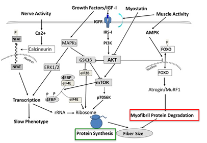

*schema integrato delle vie di segnalazione dell'ipertrofia muscolare, che mostra tre rami principali: a sinistra la via dell'attività nervosa e del calcio (Ca2+ → Calcineurina → NFAT → trascrizione, slow phenotype); al centro la via della crescita (fattori di crescita/IGF-1 → IGFR → PI3K/AKT → mTOR → p70S6K/4EBP → ribosomi → sintesi proteica, con la Miostatina che inibisce AKT); a destra la via della degradazione (attività muscolare → AMPK → FOXO → Atrogin/MuRF1 → degradazione proteica miofibrillare)*

Vediamo i tre rami singolarmente, per poi ricomporli.

### La via della crescita (anabolismo): IGF-1 → AKT → mTOR

Al centro dello schema domina l'asse **IGF-1 → AKT → mTOR**:

- quando i fattori di crescita (IGF-1) si legano al recettore (**IGFR**), attivano una cascata che culmina in **mTOR**;
- **mTOR** è il controllore dei **ribosomi**: ordina di accelerare la sintesi proteica (*protein synthesis*);
- la **miostatina** cerca di bloccare l'AKT: è il freno che tenta di fermare la crescita (coerentemente con quanto visto nella Parte 1).

### La via dell'attività e del calcio

A sinistra nello schema si osserva l'effetto dell'attività nervosa e della contrazione:

- l'aumento del **calcio (Ca²⁺)** attiva la **calcineurina**, che a sua volta attiva il fattore **NFAT**;
- NFAT entra nel nucleo e promuove la **trascrizione** di geni specifici, portando al cosiddetto **"slow phenotype"** (fibre rosse, resistenti);
- le **MAPK** (attivate dallo stress meccanico) aiutano sia la trascrizione che la sintesi proteica.

### La via della degradazione (catabolismo)

A destra nello schema si osserva cosa succede quando il muscolo viene demolito:

- l'attività muscolare intensa o la mancanza di nutrienti attivano l'**AMPK**;
- l'AMPK (e la mancanza di segnali da AKT) permette ai fattori **FOXO** di entrare nel nucleo;
- FOXO accende i geni dell'atrofia (**Atrogina-1/MuRF1**), che portano alla degradazione proteica (*protein degradation*, approfondita più avanti in questa parte).

### Come i due processi si intrecciano

Il quadro d'insieme spiega che la crescita muscolare non è solo questione di "costruire", ma di gestire simultaneamente due processi opposti — la promozione dell'anabolismo e la repressione del catabolismo — che nello schema sono spesso rappresentati rispettivamente con frecce verdi e frecce rosse.

**Promozione dell'anabolismo**: quando facciamo esercizio o sono presenti fattori di crescita (IGF-1), l'asse AKT-mTOR si accende. **AKT** attiva **mTOR**, che è il vero motore della cellula; **mTOR** attiva la proteina **p70S6K** e inibisce **4EBP**, due passaggi che servono ad accelerare i **ribosomi** (le macchine che producono proteine). Più ribosomi attivi significano più sintesi proteica.

**Repressione del catabolismo**: questa è la parte "difensiva" del processo — per crescere, il muscolo deve smettere di autodistruggersi. **AKT** invia un segnale inibitorio verso **FOXO**: se FOXO entra nel nucleo, attiva l'**Atrogina-1** e **MuRF1**, responsabili della degradazione proteica. Bloccando FOXO, l'AKT impedisce quindi al muscolo di rimpicciolirsi. Allo stesso modo, l'AKT blocca (invano, quando la miostatina è molto attiva) l'azione della miostatina stessa.

---

## I ribosomi e la traduzione proteica

I ribosomi sono complessi di **proteine e RNA**, responsabili della **traduzione proteica** — cioè della lettura dell'mRNA per costruire nuove proteine.

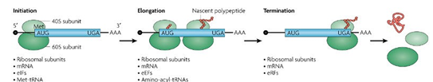
*schema delle tre fasi della traduzione proteica: Initiation (il ribosoma si assembla sul filamento di mRNA), Elongation (il ribosoma legge il codice e aggiunge amminoacidi formando la catena nascente, "nascent polypeptide") e Termination (la proteina è completa e viene rilasciata), con i relativi componenti molecolari coinvolti in ciascuna fase (subunità ribosomiali, mRNA, eIF, tRNA amminoacilati, eRF)*

Le fasi della traduzione sono quindi:

- **Initiation**: il ribosoma si assembla sul filamento di mRNA (il "codice");
- **Elongation**: il ribosoma legge il codice e aggiunge amminoacidi per formare una catena (*nascent polypeptide*);
- **Termination**: la proteina è completa e viene rilasciata.

### Capacità ed efficienza della traduzione

La sintesi proteica può essere indotta incrementando l'**efficienza** oppure la **capacità** della traduzione.

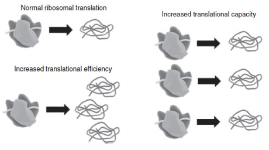

*schema che confronta la traduzione ribosomiale normale con l'aumento dell'efficienza traduzionale (stessa quantità di ribosomi che produce più catene proteiche per unità di tempo) e con l'aumento della capacità traduzionale (più ribosomi attivi contemporaneamente, ciascuno che produce la propria catena proteica)*

- per **↑ efficienza** si intende un aumento del *rate* della traduzione per ribosoma;
- per **↑ capacità** si intende l'aumento del numero di ribosomi, e quindi un aumento della biogenesi ribosomiale.

---

## mTOR e biogenesi ribosomiale

**mTOR** induce sia:

- la **capacità dei ribosomi** (biogenesi, cioè la costruzione di nuovi ribosomi);
- l'**efficienza** (cioè la velocità di lavoro di ciascun ribosoma).

Diversi regimi di esercizio aumentano l'attività di mTOR (e i marcatori della biogenesi dei ribosomi) nel muscolo.

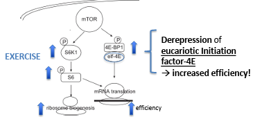

*schema che mostra come l'esercizio attivi mTOR, il quale a sua volta attiva S6K1 e S provocando un aumento della biogenesi ribosomiale, e deprime il fattore di inizio della traduzione eucariotico 4E tramite l'inibizione di 4E-BP1, aumentando così l'efficienza della traduzione dell'mRNA*

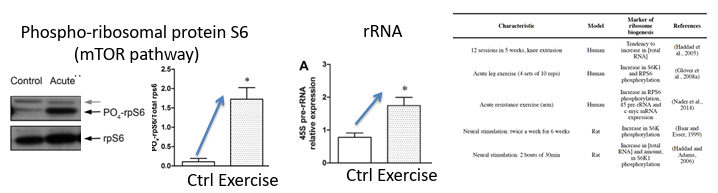
*a sinistra e al centro, dati sperimentali sull'uomo che mostrano un aumento significativo, dopo una sessione acuta di esercizio, sia della fosforilazione della proteina ribosomiale S6 (via mTOR, Western blot) sia dei livelli del precursore 45S dell'rRNA; a destra, tabella riassuntiva di diversi studi che riportano un aumento di marcatori della biogenesi ribosomiale in risposta a differenti protocolli di esercizio, sia nell'uomo che nel ratto*

### mTOR e le tre RNA polimerasi

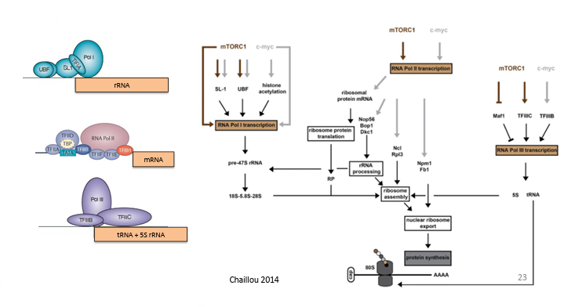
*schema che mostra come mTORC1 (in confronto a c-myc) moduli l'attività di RNA Polimerasi I (tramite SL-1, UBF, acetilazione degli istoni → trascrizione del pre-rRNA 47S), RNA Polimerasi II (trascrizione dell'mRNA per le proteine ribosomiali e per i fattori coinvolti nel processamento dell'rRNA, nell'assemblaggio del ribosoma e nell'esportazione nucleare) e RNA Polimerasi III (tramite Maf1, TFIIIC, TFIIIB → trascrizione di tRNA e rRNA 5S), con tutti i prodotti che confluiscono nell'assemblaggio del ribosoma maturo e nella sintesi proteica (Chaillou, 2014)*

mTOR (e in particolare l'isoforma **mTORC1**) modula indirettamente l'attività di:

- **RNA polimerasi I**: trascrive l'rRNA (precursore pre-47S che poi diventa gli rRNA 18S, 5.8S, 28S);
- **RNA polimerasi II**: trascrive gli mRNA per le proteine ribosomiali (RP) e per le proteine che controllano il processamento dell'rRNA, l'assemblaggio del ribosoma e l'esportazione nucleare;
- **RNA polimerasi III**: trascrive i tRNA e l'rRNA 5S.

> mTORC1 è fondamentale perché è l'unico interruttore capace di sincronizzare tre diversi processi genetici per un unico scopo: aumentare la **capacità traduzionale** del muscolo. Se anche una sola delle tre polimerasi non lavorasse, l'ipertrofia si fermerebbe.

### Evidenze sperimentali: il modello di ablazione sinergica

Un modello sperimentale molto usato per studiare l'ipertrofia è l'**ablazione del muscolo sinergico** (*synergistic ablation*, SA): la **tenectomia dell'Achille** recide i tendini del gastrocnemio, che si retrae, forzando il muscolo plantare (il "sinergico" superstite) a un sovraccarico funzionale che ne induce l'ipertrofia compensatoria.

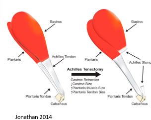

*schema anatomico della tenectomia dell'Achille (Achilles Tenectomy): recidendo il tendine d'Achille, il gastrocnemio si retrae (↓ dimensioni), mentre il muscolo plantare aumenta di dimensioni (↑ Plantaris Muscle Size) per compensare, insieme a un aumento delle dimensioni del suo tendine (Jonathan, 2014)*

Nel modello di ablazione del muscolo sinergico, la trascrizione di diversi **geni** che modulano positivamente la **biogenesi dei ribosomi** risulta **up-regolata** (aumentata).

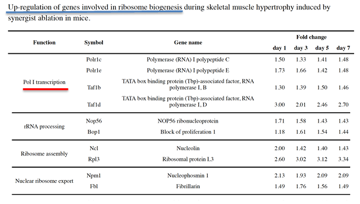
*tabella (microarray screening) che mostra l'aumento (fold change) dal giorno 1 al giorno 7 dopo ablazione sinergica di diversi geni coinvolti nella trascrizione da parte della RNA Polimerasi I (Polr1c, Polr1e, Taf1b, Taf1d), nel processamento dell'rRNA (Nop56, Bop1), nell'assemblaggio del ribosoma (Ncl, Rpl3) e nell'esportazione nucleare del ribosoma (Npm1, Fbl)*

Questa ricerca dimostra che l'ipertrofia non è solo un aumento di volume d'acqua o grasso, ma un processo guidato da una **massiccia riprogrammazione genetica**. Il muscolo "capisce" di essere sotto sforzo e risponde aumentando la sua **capacità traduzionale** (più ribosomi) per poter costruire nuove fibre più forti. In breve: più carico → più geni dei ribosomi → più ribosomi → più sintesi proteica → ipertrofia.

La trascrizione correlata alla **RNA Polimerasi I** è indicata come la fase limitante (*rate-limiting step*) nella biogenesi dei ribosomi *(Moss, 1995)*.

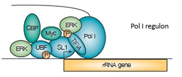

*schema del "regulone" della RNA Polimerasi I sul gene dell'rRNA, che mostra l'assemblaggio di diversi fattori (CBF, ERK, UBF, SL1, Myc, TTF1, Pol I) sul promotore, alcuni dei quali fosforilati (P)*

Nel modello di ipertrofia per ablazione muscolare sinergica, la trascrizione di diversi componenti del regulone della Pol I risulta up-regolata (aumentata).

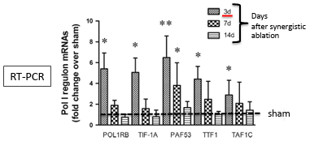

*istogramma (RT-PCR) che mostra l'aumento (fold change rispetto allo sham) dell'espressione di diversi mRNA del regulone della RNA Polimerasi I (POL1RB, TIF-1A, PAF53, TTF1, TAF1C) a 3, 7 e 14 giorni dopo l'ablazione sinergica*

Il sovraccarico dovuto all'ablazione sinergica (SA) induce nel muscolo plantare:

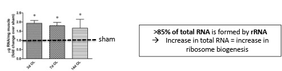
*istogramma che mostra un aumento significativo dell'RNA totale (μg RNA/mg muscolo, fold change rispetto allo sham) a 3, 7 e 14 giorni dopo l'ablazione sinergica, accompagnato dalla nota che oltre l'85% dell'RNA totale è costituito da rRNA, per cui un aumento dell'RNA totale equivale a un aumento della biogenesi ribosomiale*

- un aumento dell'**RNA totale**;
- un aumento dell'**attività o dell'espressione degli effettori della via mTOR**.

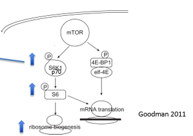

*schema che mostra mTOR attivare, tramite fosforilazione, sia S6K1/p70 sia 4E-BP1/eIF-4E; S6 (a valle di S6K1) e la via di eIF-4E convergono entrambe sulla traduzione dell'mRNA, con S6 che stimola in particolare la biogenesi ribosomiale (Goodman, 2011)*

Il **rapporto di causa-effetto** che emerge da questi esperimenti è il seguente:

1. l'esercizio/sovraccarico attiva **mTOR**;
2. **mTOR** attiva il regulone della **Pol I** (via UBF) e aumenta la produzione di **rRNA**;
3. questo aumenta il numero di **ribosomi**;
4. i ribosomi costruiscono nuove proteine → **ipertrofia**.

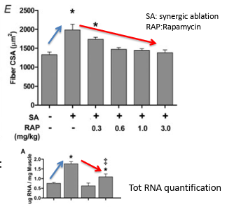

*due grafici che mostrano come, nel modello di ablazione sinergica (SA), la somministrazione dell'inibitore di mTOR rapamicina (RAP) in dosi crescenti (0.3-3.0 mg/kg) riduca progressivamente sia l'ipertrofia della fibra (Fiber CSA) sia l'aumento della quantità totale di RNA, fino quasi ad annullare l'effetto della sola ablazione sinergica*

La somministrazione dell'inibitore di mTOR **rapamicina** in modelli di ablazione sinergica porta all'**inversione dell'ipertrofia**. Questo conferma che **mTOR è il sensore indispensabile** che traduce lo sforzo fisico in crescita biologica.

---

## Equilibrio anabolismo/catabolismo durante la contrazione attiva delle fibre

Sia la contrazione che la sintesi delle proteine consumano energia: quindi, quando i muscoli sono impegnati nell'attività contrattile, ha senso dal punto di vista teleologico (finalistico) **attenuare** (*blunt*) **la sintesi proteica** muscolare, per ottimizzare il rifornimento di ATP alla coppia actina-miosina.

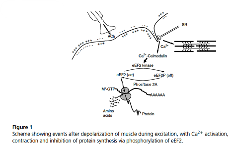

*schema che mostra la sequenza di eventi dopo la depolarizzazione della membrana muscolare durante l'eccitazione: il rilascio di Ca2+ dal reticolo sarcoplasmatico attiva sia la contrazione sia, tramite Ca2+-calmodulina, la eEF2 chinasi, che fosforila e inattiva il fattore di allungamento eEF2 (eEF2P), inibendo così la sintesi proteica durante la contrazione*

Il fattore di allungamento eucariotico **eEF2** è uno dei fattori che controlla l'efficienza/il tasso di traduzione: mostra una **maggiore fosforilazione** nel muscolo umano durante l'esercizio dinamico. La fosforilazione di eEF2 **inibisce l'attività** di eEF2 e quindi la traduzione (sintesi di proteine). Questa fosforilazione, nel muscolo scheletrico in attività, è mediata dalla **eEF2 chinasi**, attivata dalla segnalazione del calcio (Ca²⁺) via calmodulina.

La somministrazione di **inibitori della eEF2 chinasi** previene completamente l'inibizione del fattore di allungamento eEF2 tramite fosforilazione, ma previene solo **parzialmente** (circa il 30-40%) la riduzione della sintesi proteica associata alla contrazione attiva — segno che intervengono **meccanismi aggiuntivi**, che coinvolgono il rapporto **ATP/ADP** e l'inibizione dei **fattori di inizio** (ridotta funzione di eIF4F).

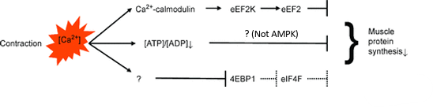

*schema che mostra tre frecce che partono dalla contrazione muscolare (aumento di Ca2+): (1) Ca2+ → calmodulina → eEF2K, che blocca l'allungamento; (2) calo del rapporto ATP/ADP, segnale metabolico di stop indipendente dall'AMPK; (3) un segnale non ancora identificato che, tramite 4EBP1 ed eIF4F, blocca l'inizio della traduzione — tutte e tre le vie convergono nel ridurre la sintesi proteica muscolare*

L'**AMPK** probabilmente non è coinvolta in questo processo, poiché la contrazione muscolare in topi transgenici con AMPKα2 chinasi-morta (con AMPK inattiva) ha comunque portato alla completa soppressione della sintesi proteica, esattamente come nei topi sani.

> **Conclusione**: il blocco della sintesi proteica durante l'esercizio è un meccanismo di sopravvivenza estremamente robusto. La natura ha previsto diverse vie ridondanti per assicurarsi che, mentre corriamo per scappare da un pericolo o solleviamo un peso, l'energia non venga "sprecata" per costruire nuovi muscoli, rimandando quel compito al momento del riposo.

---

## Atrofia muscolare

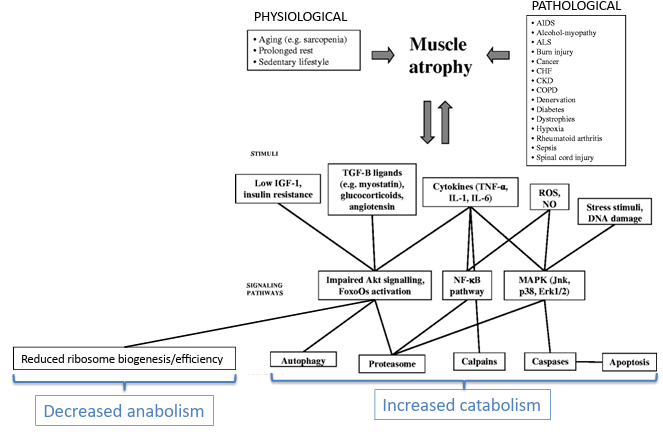
*schema riassuntivo dell'atrofia muscolare: le cause fisiologiche (invecchiamento/sarcopenia, riposo prolungato, stile di vita sedentario) e le cause patologiche (AIDS, cancro, diabete, scompenso cardiaco, BPCO, insufficienza renale, lesioni del midollo spinale, distrofie, tra le altre) convergono su stimoli comuni (basso IGF-1/insulino-resistenza, ligandi TGF-β come la miostatina, glucocorticoidi, angiotensina, citochine infiammatorie, ROS) che attivano vie di segnalazione (alterata segnalazione AKT/attivazione di FoxO, via NF-κB, MAPK) le quali determinano una diminuzione dell'anabolismo (ridotta biogenesi/efficienza dei ribosomi) e un aumento del catabolismo (autofagia, proteasoma, calpaine, caspasi, apoptosi)*

**Cause fisiologiche**: invecchiamento (es. sarcopenia), riposo prolungato (allettamento), stile di vita sedentario.

**Cause patologiche**: includono una lunga lista di malattie, come AIDS, cancro, diabete, scompenso cardiaco (CHF), BPCO (COPD), insufficienza renale (CKD), lesioni del midollo spinale e distrofie.

**Stimoli**: bassi livelli di IGF-1 e resistenza all'insulina; ligandi TGF-β (come la miostatina), glucocorticoidi (cortisolo), angiotensina; citochine infiammatorie (TNF-α, IL-1, IL-6); ROS (radicali liberi) e danno al DNA.

**Risultati finali**: diminuzione dell'anabolismo (ridotta biogenesi/efficienza dei ribosomi, coerentemente con quanto visto sopra); aumento del catabolismo (attivazione di autofagia, proteasoma, calpaine, caspasi e apoptosi).

### L'entità dell'ipertrofia dipende dal carico

L'efficacia dell'ipertrofia indotta dall'esercizio di forza dipende dal **carico**. L'allenamento ad **alto carico** (*high-load*) induce un'ipertrofia più forte e un contenuto nucleare più elevato rispetto al basso carico.

*Esperimento*: 5 settimane di allenamento con carichi diversi su ratti. Un gruppo ha eseguito contrazioni isometriche pure (**alto carico**, 100% della forza); l'altro gruppo contrazioni concentriche (**basso carico**) con il 50-60% della forza di picco. La stimolazione era elettricamente identica: 150 Hz.

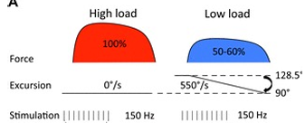

*schema del protocollo sperimentale: nel gruppo ad alto carico (100% della forza) non c'è escursione articolare (0°/s), mentre nel gruppo a basso carico (50-60% della forza) l'arto si muove rapidamente (550°/s) tra 90° e 128.5°, con la stessa stimolazione elettrica (150 Hz) in entrambi i gruppi*

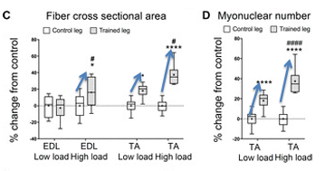

*istogrammi che mostrano l'aumento percentuale, rispetto al controllo, dell'area della sezione trasversale della fibra (Fiber CSA) e del numero di mionuclei, confrontando muscolo EDL e TA, a basso e alto carico: l'aumento è maggiore nel gruppo ad alto carico rispetto al basso carico, sia per la CSA sia per il numero di mionuclei*

I risultati mostrano quindi che, in generale, le contrazioni isometriche ad alto carico inducono un'ipertrofia superiore rispetto alle contrazioni concentriche a basso carico, a parità di stimolazione elettrica — un'ulteriore prova diretta di come la componente **meccanica** del carico sia essa stessa uno stimolo ipertrofico cruciale, indipendente dal semplice numero di impulsi nervosi. Questo tema, quello della meccanotrasduzione, è al centro della Parte 3.

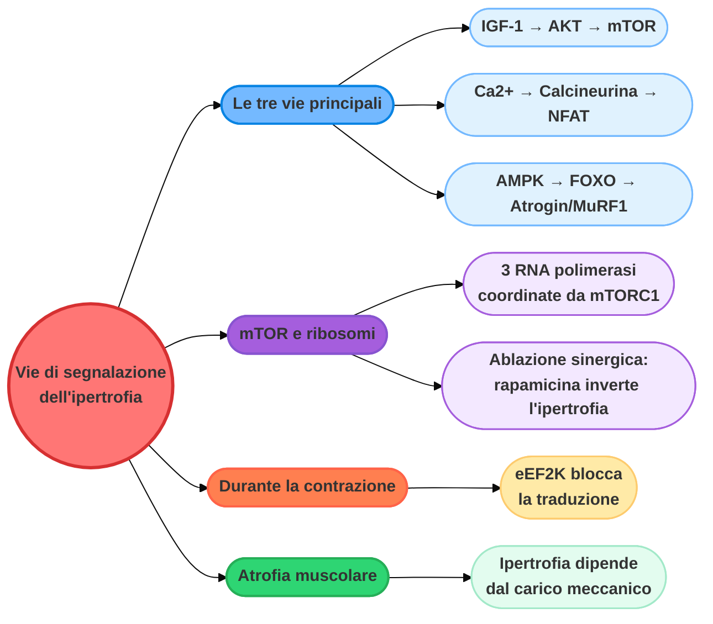

*Continua nella [Parte 3](#) con la meccanotrasduzione, il ruolo delle cellule satellite, le implicazioni per il doping e l'interazione tra allenamento di forza e di resistenza.*
