# Meccanotrasduzione, cellule satellite e doping nell'ipertrofia muscolare (Parte 3 di 3)

> Questa è la **Parte 3 di 3**, conclusiva, del capitolo dedicato all'ipertrofia muscolare. Nella [Parte 2](#) abbiamo visto le vie di segnalazione molecolare dell'ipertrofia (AKT-mTOR, biogenesi ribosomiale) e i meccanismi dell'atrofia. In questa parte vediamo come il carico meccanico agisca anche **indipendentemente dalle miochine**, il ruolo delle cellule satellite nel sostenere la crescita a lungo termine, le implicazioni delle vie dell'ipertrofia per il doping, e cosa succede quando allenamento di forza e di resistenza vengono combinati.

## Meccanotrasduzione nell'ipertrofia dipendente dall'esercizio

Il **carico meccanico** (*mechanical loading*) induce l'ipertrofia muscolare attraverso diversi meccanismi **indipendenti dalle miochine**:

1. l'asse **diacilglicerolo chinasi (DGK) / acido fosfatidico (PA) / mTOR**;
2. proteine che **connettono i sarcomeri al sarcolemma/matrice extracellulare (ECM)**, come il **complesso della distrofina** (DGC) e le **integrine**.

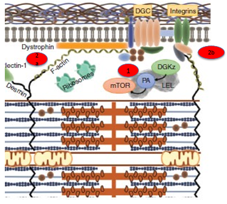

*schema della fibra muscolare che mostra come il complesso della distrofina (DGC) e le integrine, ancorati al sarcolemma e connessi al citoscheletro (F-actina, desmina, plectina-1), trasmettano lo stiramento meccanico all'enzima diacilglicerolo chinasi ζ (DGKζ), il quale produce acido fosfatidico (PA) che attiva mTOR, a sua volta responsabile dell'attivazione dei ribosomi visibili in prossimità del sarcomero*

In sintesi:

- il peso "tira" le integrine e il complesso della distrofina;
- questo stiramento attiva la **DGK**;
- la DGK produce **acido fosfatidico**;
- l'acido fosfatidico accende **mTOR**;
- mTOR attiva i **ribosomi** per costruire nuove proteine.

---

## Ipertrofia e dominio mionucleare

Il **dominio mionucleare** è la porzione di citoplasma "servita" da un singolo nucleo della fibra muscolare (le fibre muscolari sono infatti cellule multinucleate). Il dominio mionucleare sembra essere decisamente più piccolo nelle fibre più piccole, sebbene alla fine si stabilizzi (*levels off*) con l'aumentare delle dimensioni della fibra.

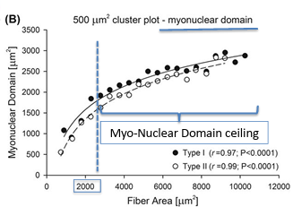
*grafico a dispersione che mostra il dominio mionucleare (μm²) in funzione dell'area della fibra (μm²), sia per le fibre di tipo I sia di tipo II, con una relazione che cresce rapidamente per le fibre piccole e poi si stabilizza (levels off) raggiungendo un plateau, il "Myo-Nuclear Domain ceiling" (soffitto del dominio mionucleare)*

### Dimensione della fibra e contenuto mionucleare

La **dimensione della fibra** (*fiber size*) e il **contenuto mionucleare** sono strettamente correlati in modo lineare in un ampio intervallo di dimensioni delle fibre.

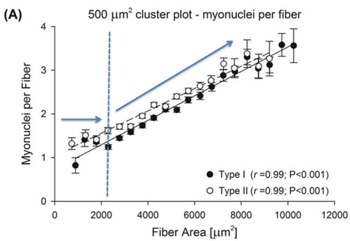

*grafico a dispersione che mostra il numero di mionuclei per fibra in funzione dell'area della fibra (μm²), con una relazione lineare molto stretta sia per le fibre di tipo I sia di tipo II (r=0.99 per entrambe), e una linea blu tratteggiata verticale che indica una soglia critica*

- **relazione lineare**: man mano che l'area della fibra aumenta (ipertrofia), il numero di nuclei deve aumentare in modo proporzionale (sia per le fibre di tipo I che di tipo II);
- **soglia critica** (linea blu tratteggiata): prima della soglia, la fibra può crescere leggermente sfruttando i nuclei che già possiede (espansione del dominio); dopo la soglia, la pendenza della retta conferma che l'aggiunta di nuovi nuclei diventa obbligatoria — per superare quella dimensione, la fibra deve necessariamente reclutare cellule satellite per "importare" nuovo materiale genetico.

### Aggiunta di mionuclei e mantenimento del dominio mionucleare

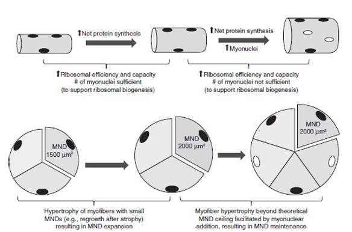
*schema in due fasi: nella prima, una fibra con dominio mionucleare piccolo (1500 μm²) cresce tramite aumento della sintesi proteica netta, espandendo il dominio fino a un valore soglia (2000 μm²) sfruttando i nuclei già presenti; nella seconda fase, oltre quella soglia, l'ulteriore crescita della fibra richiede l'aggiunta di nuovi mionuclei per mantenere il dominio a un valore costante (2000 μm²), poiché l'efficienza/capacità ribosomiale dei nuclei esistenti non è più sufficiente*

Al di sotto del **soffitto (*ceiling*)** del dominio mionucleare, gli stimoli ipertrofici inducono **l'espansione del dominio**, principalmente grazie all'aumento della **sintesi proteica** rispetto alla degradazione. Oltre il soffitto del dominio mionucleare, la dimensione del dominio viene invece mantenuta tramite l'**aggiunta di mionuclei**, fondendo le **cellule staminali del muscolo** (cellule satellite).

> **Il concetto chiave**: l'aggiunta di nuovi nuclei è ciò che permette un'ipertrofia massiccia e, soprattutto, è ciò che garantisce la **memoria muscolare**. Anche se il muscolo si rimpicciolisce in futuro, i nuclei aggiunti rimangono, rendendo molto più facile la "fase 1" (espansione) la prossima volta che si riprende ad allenarsi.

---

## Le cellule satellite: cellule staminali del muscolo

Le cellule staminali sono cellule immature non specializzate, capaci di dividersi indefinitamente e di trasformarsi (differenziarsi) nei circa 200 tipi di cellule specializzate che compongono il corpo umano.

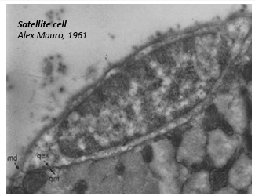

*micrografia elettronica di una cellula satellite (Alex Mauro, 1961), la prima immagine storica che ne ha documentato l'esistenza, localizzata tra la lamina basale e il sarcolemma della fibra muscolare*

Le cellule staminali residenti nel muscolo scheletrico sono strettamente associate alle fibre muscolari, identificabili in base all'espressione di marcatori specifici (ad esempio **Pax7**) e alla loro posizione, sotto la lamina basale (laminina) che circonda le fibre.

### Attivazione, differenziamento e auto-rinnovamento

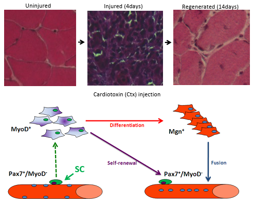

*in alto, sequenza istologica di muscolo non danneggiato, danneggiato (4 giorni dopo iniezione di cardiotossina) e rigenerato (14 giorni); in basso, schema del ciclo delle cellule satellite: le cellule quiescenti Pax7+/MyoD- (SC) si attivano diventando MyoD+, poi si differenziano in Mgn+ (miogenina) e fondono con la fibra danneggiata, mentre una parte di esse si auto-rinnova tornando allo stato Pax7+/MyoD- di riserva*

Il processo mostrato si attiva ogni volta che il muscolo subisce un danno (da infortunio o da allenamento intenso), e segue un ordine logico preciso:

1. **Attivazione**: in condizioni normali, le cellule satellite sono "quiescenti" (esprimono il marcatore Pax7). Quando avviene un danno, i segnali chimici le "svegliano": iniziano a esprimere **MyoD** e a moltiplicarsi rapidamente.
2. **Differenziamento e fusione**: le cellule moltiplicate iniziano a cambiare natura (esprimono miogenina, **Mgn+**), diventando veri e propri precursori muscolari. Questi si fondono tra loro o con la fibra danneggiata per riparare le "brecce" nel sarcolemma e per aggiungere nuovi nuclei alla fibra (fondamentale per l'ipertrofia e la riparazione).
3. **Auto-rinnovamento** (*self-renewal*): questo è un passaggio critico — se tutte le cellule satellite si trasformassero in muscolo, si esaurirebbero le scorte di staminali al primo infortunio. Invece, una parte di esse torna allo stato iniziale (**Pax7+/MyoD-**) per restare "di riserva" per il futuro.

### Le cellule satellite NON sono necessarie per la risposta ipertrofica iniziale

In topi privi di cellule satellite (modello Pax7-DTA) sottoposti a **ri-carico** (*reloading*) **dopo atrofia**, la dimensione del dominio mionucleare aumenta in modo simile rispetto ai topi dotati di cellule satellite (SC).

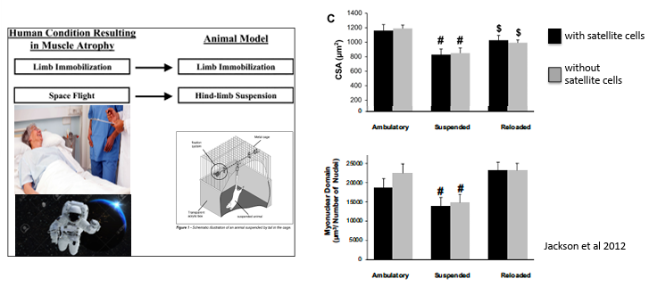
*a sinistra, schema che mette in parallelo la condizione umana (immobilizzazione degli arti, volo spaziale) con il corrispondente modello animale (immobilizzazione degli arti, sospensione degli arti posteriori); a destra, grafici (Jackson et al., 2012) che mostrano come sia l'area della sezione trasversale (CSA) sia il dominio mionucleare recuperino livelli normali dopo la sospensione (condizione "Reloaded"), sia nei topi con cellule satellite (barre nere) sia in quelli senza (barre grigie)*

**Modelli di atrofia**: nell'uomo, immobilizzazione degli arti o volo spaziale; nel modello animale, immobilizzazione degli arti o sospensione degli arti posteriori.

I grafici *(Jackson et al., 2012)* mostrano che CSA e dominio mionucleare recuperano i livelli normali dopo la sospensione (*Reloaded*), sia nei topi con cellule satellite (SC) sia in quelli senza. **Conclusione**: prima del "soffitto" del dominio nucleare (ad esempio nel recupero dall'atrofia), l'ipertrofia può avvenire in **assenza** di fusione delle cellule satellite, ed è associata unicamente all'**espansione del dominio mionucleare**.

### Le cellule satellite sono necessarie per l'ipertrofia muscolare a lungo termine

Il quadro cambia quando si considera l'ipertrofia sostenuta nel tempo, oltre il soffitto del dominio mionucleare — qui torna utile il modello di **ablazione sinergica** (SA) già visto nella Parte 2.

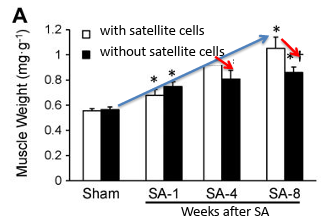

*grafico che mostra il peso del muscolo plantare (mg) nel tempo (da sham a 8 settimane dopo l'ablazione sinergica), confrontando topi con cellule satellite (barre bianche) e senza cellule satellite (barre nere): l'aumento di peso è iniziale simile nelle prime settimane, ma diverge progressivamente, con i topi privi di cellule satellite che restano indietro nelle settimane successive*

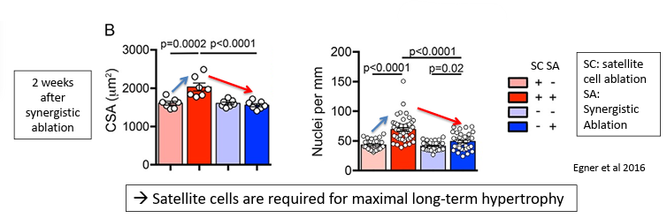
*due grafici (Egner et al., 2016) a 2 settimane dall'ablazione sinergica, che confrontano quattro gruppi (con/senza cellule satellite, con/senza ablazione sinergica) per area della sezione trasversale della fibra (CSA) e numero di nuclei per mm: sia la CSA sia il numero di nuclei aumentano significativamente solo nel gruppo con cellule satellite e ablazione sinergica, dimostrando che le cellule satellite sono necessarie per l'ipertrofia massimale a lungo termine*

**Grafico A (peso muscolare)**: peso del muscolo (mg) nel tempo dopo l'intervento di SA, confrontando topi con cellule satellite (barre bianche) e senza (barre nere).

**Grafico B (2 settimane dopo SA)**: analisi dell'area della sezione trasversale della fibra (CSA) e del numero di nuclei per mm di fibra.

*Legenda*: SC (*satellite cell ablation* = eliminazione delle cellule satellite), SA (*synergistic ablation*, ablazione sinergica).

### Cellule satellite e mantenimento del dominio mionucleare: sintesi

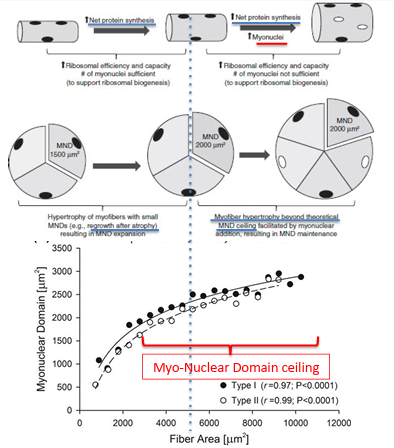

*schema riassuntivo che integra i due regimi di crescita della fibra muscolare (espansione del dominio sotto la soglia, aggiunta di mionuclei oltre la soglia) con il grafico sperimentale del dominio mionucleare in funzione dell'area della fibra per i due tipi di fibra (I e II), mostrando come il "soffitto" del dominio mionucleare (Myo-Nuclear Domain ceiling) rappresenti il punto di transizione tra i due regimi*

---

## Cellule satellite e miochine

Diverse miochine che regolano la sintesi e la degradazione proteica delle fibre muscolari durante l'ipertrofia indotta dall'esercizio fisico (viste nella Parte 1) modulano anche la funzione delle cellule satellite.

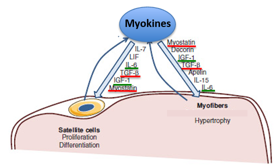
*schema che mostra le miochine (IL-7, LIF, IL-6, TGF-β, IGF-1, Miostatina) agire sia sulle cellule satellite (proliferazione, differenziazione) sia sulle miofibre (ipertrofia), con Miostatina e Decorina che agiscono in direzioni opposte, e IGF-1, TGF-β, Apelina, IL-15 e IL-6 che completano il quadro dei segnali diretti alle miofibre*

---

## Miochine e doping

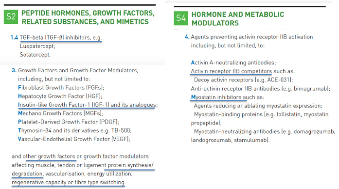
*estratto dalla lista delle sostanze proibite WADA: sezione S2 (Peptide Hormones, Growth Factors, Related Substances, and Mimetics), che include tra gli altri gli inibitori del TGF-β e i fattori di crescita come l'IGF-1 e i suoi analoghi; sezione S4 (Hormone and Metabolic Modulators), che include gli agenti che prevengono l'attivazione del recettore dell'activina IIB, tra cui i competitori del recettore (come i recettori decoy ACE-031) e gli inibitori della miostatina (come follistatina, propeptide della miostatina, anticorpi neutralizzanti)*

### IGF-1 safety

L'IGF-1 è uno dei principali fattori di rischio in diversi tumori, a causa della sua potente attività proliferativa, esercitata principalmente attraverso la modulazione del ciclo cellulare, dell'apoptosi e della sopravvivenza cellulare. Diversi studi preclinici hanno riportato che le mutazioni con perdita di funzione nei geni che controllano la via di segnalazione IGF-1/insulina/GH possono aumentare significativamente la durata della vita, sia nei modelli animali invertebrati che in quelli vertebrati. Esiste quindi un delicato equilibrio tra i livelli di IGF-1 necessari per una corretta omeostasi tissutale e i suoi effetti collaterali dannosi.

### Inibizione della miostatina: sicurezza

Studio clinico sull'**ACE-031**, un inibitore della miostatina, condotto su ragazzi affetti da distrofia muscolare di Duchenne:

- tendenza al mantenimento della distanza percorsa nel test del cammino di 6 minuti (6MWT) nei gruppi trattati con ACE-031, rispetto a un calo osservato nel gruppo placebo;
- tendenza all'aumento della massa magra e della densità minerale ossea (BMD).

Lo studio è stato **interrotto** dopo il secondo ciclo di somministrazione, a causa di potenziali problemi di sicurezza legati a **epistassi** e **teleangectasie**.

---

## Endurance training ed equilibrio anabolismo/catabolismo

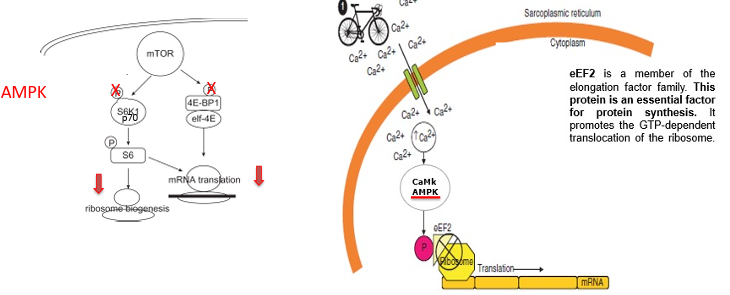
*a sinistra, schema che mostra come l'attivazione dell'AMPK (indotta ad esempio dal ciclismo) blocchi sia S6K1/p70 (con conseguente riduzione della biogenesi ribosomiale) sia 4E-BP1/eIF-4E (con conseguente riduzione della traduzione dell'mRNA), inibendo la via di mTOR; a destra, schema della fibra muscolare che mostra come il Ca2+ rilasciato dal reticolo sarcoplasmatico durante la contrazione attivi, tramite CaMK/AMPK, la fosforilazione ed inattivazione di eEF2, bloccando la traduzione dell'mRNA*

Esiste un'interazione **antagonistica** tra le vie di segnalazione dell'AMPK e dell'mTOR: le vie correlate all'AMPK attivate dall'allenamento di resistenza inibiscono la traduzione attraverso una ridotta fosforilazione di S6K e 4E-BP *(Bolster et al., 2002; Thomson et al., 2008; Lantier et al., 2010; Egawa et al., 2014)*, e un aumento della fosforilazione di eEF2 (inibizione, coerentemente con quanto visto nella Parte 2). L'effetto inibitorio dell'AMPK su mTOR sembra tuttavia essere **minore nell'uomo rispetto ai roditori** *(Hughes, 2018)*.

### Endurance training e cellule satelliti

Una sessione di esercizio di **forza** convenzionale **aumenta** transitoriamente la **densità delle cellule satellite** (+38%) dopo 4 giorni di recupero, ma l'**aggiunta** di una sessione di **ciclismo** di 90 minuti (60% del carico di lavoro massimo), effettuata immediatamente dopo l'esercizio di resistenza/forza, ha **soppresso completamente** questa risposta — un'inibizione della risposta delle cellule satellite quando l'esercizio aerobico viene effettuato dopo l'esercizio di resistenza *(Babcock et al., 2012)*.

Tuttavia, l'allenamento aerobico a intervalli (6 settimane, 3 sessioni a settimana) amplia il pool di cellule satellite **senza** conseguente ipertrofia *(Joanisse et al., 2013)*: l'attivazione delle cellule satellite non è quindi esclusiva dell'allenamento di forza. L'isoforma **AMPKα1** è stata associata alla promozione dell'attivazione delle cellule satellite e alla rigenerazione muscolare *(Fu et al., 2015)*.

### Allenamento concorrente (*single vs. concurrent training*): la visione classica

Un programma di allenamento di 10 settimane che integrava sia esercizi di forza che di resistenza ha mostrato una compromissione dello sviluppo della forza *(Hickson, 1980)* — il cosiddetto **"effetto di interferenza"**. Al contrario, esiste anche la possibilità che l'allenamento combinato di forza e resistenza possa potenziare le prestazioni di resistenza *(Rønnestad & Mujika, 2014)*.

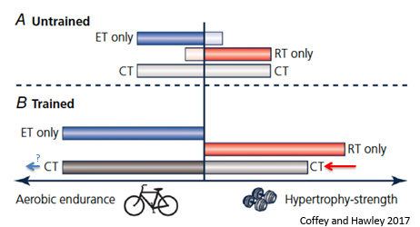

*schema che confronta, in soggetti non allenati e allenati, gli adattamenti indotti da allenamento aerobico (ET only), di forza (RT only) o combinato (CT): nei soggetti non allenati il CT produce adattamenti intermedi sia per la resistenza aerobica sia per l'ipertrofia/forza, mentre nei soggetti allenati l'allenamento combinato (CT) sembra interferire soprattutto con gli adattamenti di ipertrofia-forza (freccia rossa), con un effetto più incerto sulla resistenza aerobica (punto interrogativo) (Coffey e Hawley, 2017)*

*Conta il livello di allenamento?* Nel corso di un programma di allenamento di forza/resistenza della durata di poche settimane, la risposta ipertrofica non è stata ridotta dall'aggiunta di un allenamento di resistenza *(Lundberg, 2013)*.

In uomini sedentari che hanno eseguito sessioni separate di esercizi di forza e aerobici, oppure una sessione di esercizi combinati, si è osservato *(Donges et al., 2013)*:

1. nessun cambiamento significativo nella fosforilazione di S6K e AMPK tra le diverse modalità di esercizio;
2. aumenti comparabili nella sintesi proteica miofibrillare con l'esercizio combinato rispetto al solo esercizio di resistenza;
3. tassi simili di sintesi proteica mitocondriale tra l'esercizio combinato e quello aerobico.

### Conta il *planning* dell'allenamento?

L'aumento dell'attività dell'AMPK non inibisce la segnalazione mTOR quando l'esercizio di resistenza viene eseguito **prima** dell'esercizio di forza/resistenza *(Apro et al., 2015)*. Un periodo di riposo di **6-24 ore** è sufficiente per evitare qualsiasi interferenza tra le due modalità di esercizio, almeno per quanto riguarda l'ipertrofia muscolare e la forza *(Robineau et al., 2014)*.

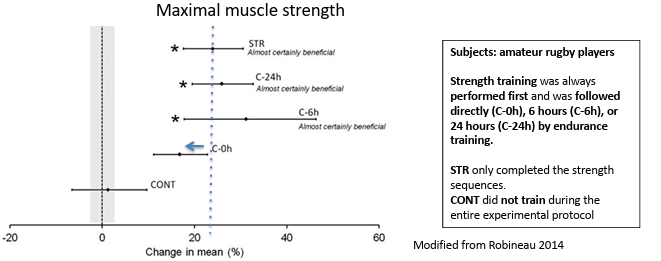
*grafico che mostra la variazione percentuale della forza muscolare massimale in giocatori di rugby dilettanti, confrontando un gruppo di controllo che non si allena (CONT) con gruppi che eseguono l'allenamento di forza seguito da allenamento di resistenza a distanza di 0 ore (C-0h), 6 ore (C-6h) o 24 ore (C-24h), oppure il solo allenamento di forza (STR): tutti i gruppi con recupero di almeno 6 ore mostrano un miglioramento della forza "quasi certamente benefico" (modificato da Robineau, 2014)*

Il fenomeno delle interferenze potrebbe quindi essere **ridotto o addirittura eliminato del tutto**, se i parametri di allenamento (soprattutto il tempo di recupero tra le due modalità) fossero pianificati in modo adeguato.

---

## Riassunto finale del capitolo

Questo riassunto integra i contenuti delle 3 parti del capitolo: dall'equilibrio anabolismo-catabolismo e dalle miochine, attraverso le vie di segnalazione molecolare dell'ipertrofia e dell'atrofia, fino alla meccanotrasduzione, alle cellule satellite e all'interazione tra i diversi tipi di allenamento.

- Il muscolo scheletrico è un tessuto multifunzionale con un'elevata capacità di rimodellamento.
- La massa muscolare è determinata dall'equilibrio tra diverse risposte anaboliche e cataboliche a una varietà di stimoli fisiopatologici.
- L'allenamento di forza induce ipertrofia.
- Diverse vie di segnalazione sono coinvolte nelle risposte anaboliche/cataboliche del muscolo, tra cui la via di segnalazione **mTOR**, che viene modulata in modo diverso da diverse miochine, tra cui i membri della superfamiglia TGF-β (ad esempio la miostatina) o l'insulina/IGF.
- La via mTOR controlla la **biogenesi dei ribosomi** o l'**efficienza della traduzione**.
- La traduzione delle proteine, la biogenesi dei ribosomi e/o l'efficienza dei ribosomi, la produzione di miochine e l'attività di mTOR nel muscolo sono modulate da stimoli ipertrofici (esercizio fisico o ablazione sinergica).
- Le **cellule satellite** sono le cellule staminali muscolari responsabili della rigenerazione muscolare in seguito a lesione.
- Le cellule satellite sono responsabili dell'**aumento del numero di nuclei** nell'ipertrofia a lungo termine (oltre il limite massimo del dominio nucleare).
- Le cellule satellite **non sono indispensabili** per l'ipertrofia iniziale (prima del limite massimo del dominio nucleare) e per il recupero dall'atrofia (in queste condizioni è sufficiente l'aumento delle dimensioni del dominio nucleare).
- Diverse molecole in grado di modulare o mimare le miochine coinvolte nell'ipertrofia sono **vietate dalla WADA**, poiché presentano rischi per la salute degli atleti.
- L'**AMPK** può inibire la via di segnalazione mTOR.
- L'allenamento di resistenza può potenzialmente **interferire** con gli adattamenti dell'allenamento di forza, in modo dipendente dallo stato di allenamento e dal regime di allenamento (in particolare, dal tempo di recupero tra le due modalità).

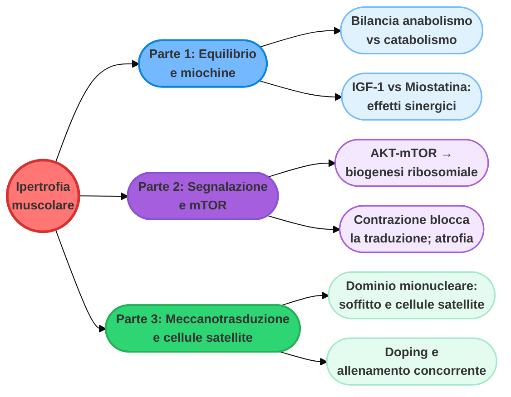
