# Introduzione all'ipossia

## Introduzione

Per **ipossia** si intende una condizione per cui il corpo, oppure una specifica regione del corpo, ha un apporto di ossigeno inadeguato. Può quindi essere classificata in:

- **locale** (affligge solo una regione o un tessuto del corpo);
- **generale**.

Nonostante il termine ipossia venga spesso associato a condizioni patologiche, può essere anche intesa in contesti fisiologici, come ad esempio l'esposizione ad altitudine, l'*hypoventilation training*, o l'esercizio fisico molto intenso (che causa ipossia a livello di tessuti/regioni muscolari specifiche).

L'ipossia è diversa dall'**ipossiemia**: l'ipossia indica una disponibilità insufficiente di ossigeno a livello *tissutale*, mentre l'ipossiemia si riferisce specificamente alla riduzione della pressione parziale dell'ossigeno *arterioso* (PaO₂). La totale assenza di ossigeno a livello tissutale è definita **anossia**.

L'ipossia generalizzata può verificarsi in persone sane quando salgono ad altitudini elevate, dove la ridotta pressione atmosferica abbassa la pressione parziale dell'ossigeno inspirato. Se la salita è rapida o l'acclimatamento è insufficiente, ciò può portare al mal di montagna e, nei casi più gravi, a complicanze potenzialmente letali come l'edema polmonare da alta quota (**HAPE**) e l'edema cerebrale da alta quota (**HACE**).

L'ipossia può verificarsi anche in individui sani quando respirano miscele di gas con una pressione parziale di ossigeno inadeguata, ad esempio durante le immersioni subacquee, specialmente quando si utilizzano sistemi di *rebreather* a circuito chiuso che regolano l'ossigeno fornito al subacqueo.

Un'ipossia intermittente lieve e non dannosa può essere invece utilizzata **intenzionalmente** durante l'allenamento in altitudine, per favorire l'adattamento delle prestazioni atletiche sia a livello sistemico che cellulare — è proprio questo l'argomento della prossima sezione.

### Come percepiamo l'ipossia

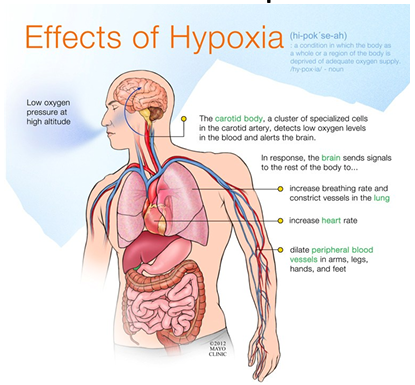

*schema riassuntivo degli effetti dell'ipossia: la bassa pressione di ossigeno in altitudine viene rilevata dal corpuscolo carotideo, un gruppo di cellule specializzate nell'arteria carotide che rileva i bassi livelli di ossigeno nel sangue e allerta il cervello; in risposta, il cervello invia segnali al resto del corpo per aumentare la frequenza respiratoria e costringere i vasi polmonari, aumentare la frequenza cardiaca, e dilatare i vasi sanguigni periferici di braccia, gambe, mani e piedi (Mayo Clinic, 2012)*

Il corpo percepisce l'abbassamento della pressione parziale di ossigeno nell'aria attraverso i **corpi carotidei**, dotati di chemocettori sensibili — tra le altre cose — a un abbassamento del pH. L'anidride carbonica, infatti, reagendo con l'acqua porta alla produzione di ioni H⁺, acidificando l'ambiente cefalorachidiano.

In risposta, il corpo aumenta la respirazione, per consentire un maggiore introito di ossigeno nei polmoni, favorire gli scambi gassosi ed eliminare il più possibile l'anidride carbonica, ristabilendo così l'equilibrio omeostatico. In condizioni di ipossia si osserva inoltre una **vasocostrizione polmonare localizzata**: negli alveoli dove lo scambio di gas è ridotto, la vasocostrizione dirotta il flusso sanguigno verso gli alveoli che garantiscono uno scambio più efficiente.

---

## Allenamento in ipossia controllata

L'organismo interpreta la minore disponibilità di ossigeno come uno **stress fisiologico** e attiva **risposte adattative**. L'obiettivo non è allenarsi "con meno ossigeno" in modo generico, ma indurre adattamenti che diventano vantaggiosi quando l'atleta torna a competere in normossia.

### Adattamenti cardio-respiratori

- **Ventilazione**: aumento della frequenza e della profondità respiratoria, con maggiore sensibilità dei chemocettori periferici all'ipossia.
- **EPO ed eritropoiesi**: stimolazione della produzione di eritropoietina, con possibile aumento di globuli rossi ed emoglobina per migliorare il trasporto di ossigeno. L'EPO viene prodotta nei reni, viaggia nel sangue fino al midollo osseo, dove stimola la produzione di nuovi globuli rossi (*eritropoiesi*), essenziali per trasportare ossigeno ai tessuti.
- **Funzione cardiovascolare**: modulazione della gittata cardiaca e della distribuzione del flusso sanguigno verso i tessuti attivi durante lo sforzo.

Uno dei compiti del fattore inducibile dall'ipossia (**HIF**, approfondito più avanti) è proprio la trascrizione del gene dell'EPO: quando la quantità di ossigeno è bassa, aumenta l'attività di HIF, che a sua volta aumenta la produzione di EPO nei reni, stimolando l'eritropoiesi (mentre ad alta concentrazione di ossigeno HIF viene disattivato).

### Adattamenti muscolari e cellulari

- **Capillarizzazione**: aumento della densità capillare muscolare, per migliorare la consegna di ossigeno alle fibre attive.
- **Efficienza mitocondriale**: adattamenti della funzione mitocondriale e del metabolismo energetico, con un migliore utilizzo dell'ossigeno durante lo sforzo.
- **Via HIF-1α**: attivazione del fattore HIF-1α, che regola geni coinvolti nell'angiogenesi, nel metabolismo glicolitico e nell'adattamento cellulare all'ipossia.

### Chi utilizza queste strategie?

Le discipline in cui la capacità aerobica, il trasporto di ossigeno e la resistenza alla fatica sono determinanti:

- corsa e triathlon;
- ciclismo;
- sci di fondo;
- canottaggio e nuoto.

L'obiettivo è lo **stress controllato**: l'allenamento in ipossia non mira a causare danno, ma a esporre l'organismo a uno stress calibrato che possa migliorare la capacità di trasportare e utilizzare l'ossigeno durante la prestazione.

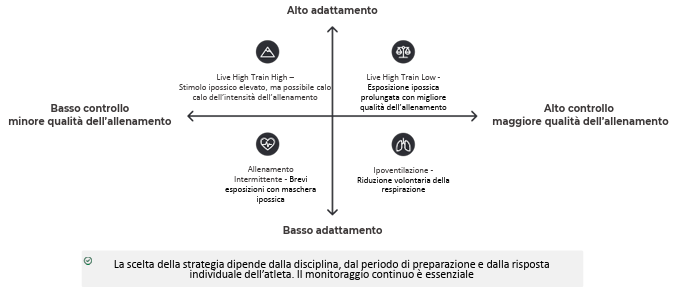

*schema a quadranti che confronta le quattro principali strategie di allenamento in ipossia lungo due assi — grado di adattamento (alto/basso) e controllo/qualità dell'allenamento (basso/alto): Live High Train High (adattamento alto, controllo basso, per lo stimolo ipossico elevato ma il possibile calo di intensità dell'allenamento), Live High Train Low (adattamento alto, controllo alto, per l'esposizione ipossica prolungata unita a una migliore qualità dell'allenamento), Allenamento Intermittente (adattamento basso, controllo basso, brevi esposizioni con maschera ipossica) e Ipoventilazione (adattamento basso, controllo alto, riduzione volontaria della respirazione); la scelta della strategia dipende dalla disciplina, dal periodo di preparazione e dalla risposta individuale dell'atleta*

### LHTH - Live High Train High

Il modello classico: l'atleta **vive** e si **allena** in **quota**, massimizzando lo stimolo ipossico. È la strategia più naturale, ma presenta un limite fondamentale: se l'ipossia è troppo marcata, l'atleta non riesce a sostenere allenamenti ad alta intensità, riducendo lo stimolo qualitativo dell'esercizio.

> Ideale per quote moderate (1800-2500 m). A quote superiori il rischio di sovrallenamento e calo delle performance aumenta significativamente.

### LHTL - Live High Train Low

L'atleta **dorme** o **vive** in **quota** — oppure utilizza camere o tende ipossiche — ma si **allena** a **quote più basse**. In questo modo mantiene lo stimolo ipossico per molte ore al giorno, favorendo gli adattamenti, ma può comunque svolgere allenamenti intensi grazie a una migliore disponibilità di ossigeno durante la seduta. È il **metodo più utilizzato oggi**.

### Allenamento intermittente in ipossia

L'atleta alterna brevi periodi di respirazione con aria povera di ossigeno a periodi di recupero in normossia. Realizzabile con maschere ipossiche o dispositivi che riducono la frazione inspirata di O₂ (FiO₂).

- **Fase attiva**: respirazione con aria a ridotta FiO₂ durante l'esercizio;
- **Fase di recupero**: ritorno alla normossia tra le serie;
- **Obiettivo**: stress metabolico controllato, senza esposizione prolungata.

### Allenamento in ipoventilazione

L'atleta riduce volontariamente la frequenza respiratoria durante alcuni esercizi. Questo aumenta la CO₂ e può ridurre temporaneamente l'O₂ disponibile, creando uno stress respiratorio e metabolico controllato.

- **Stress respiratorio**: accumulo di CO₂ e desaturazione transitoria di O₂;
- **Adattamento**: migliore tolleranza all'ipercapnia e maggiore efficienza respiratoria;
- **Applicazione**: usato in nuoto, corsa e sport con componente di apnea.

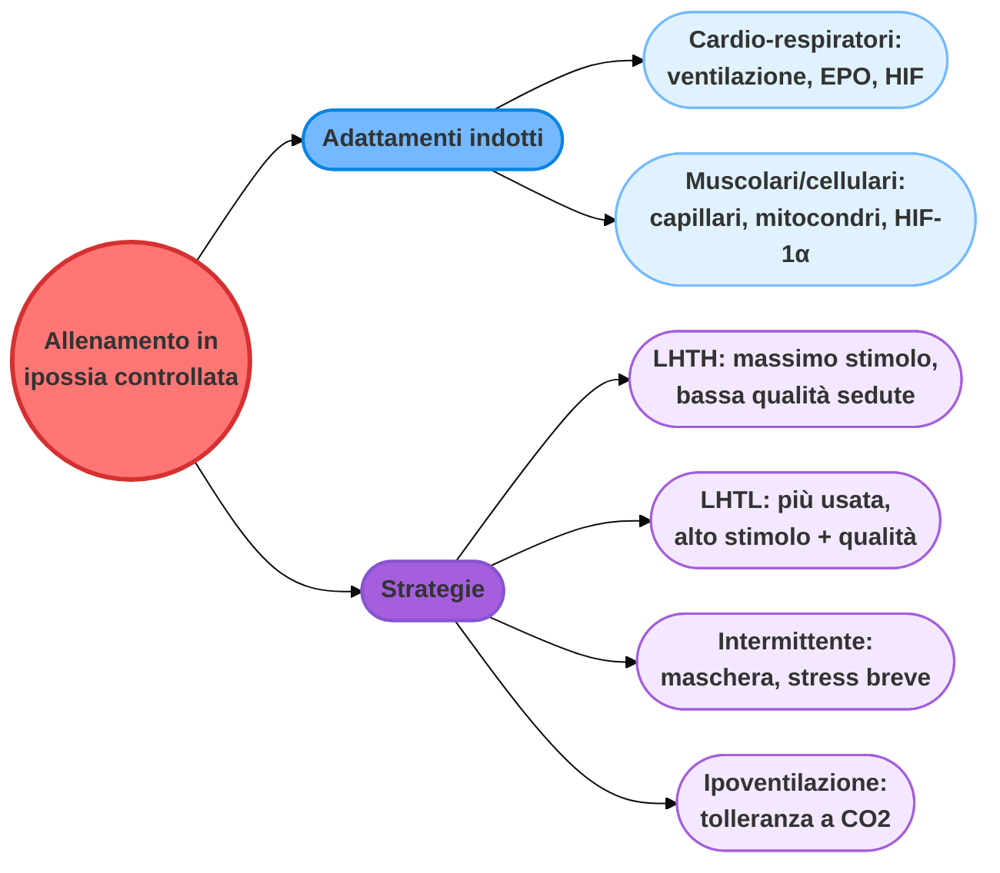

---

## HIF - Hypoxia Inducible Factor

*Perché l'ossigeno è necessario per la nostra vita?*

Il corpo umano ha bisogno di ossigeno per sostenere il **metabolismo aerobico**: dopo pochi minuti senza ossigeno, le cellule cerebrali iniziano a subire danni irreversibili. L'ossigeno entra nell'organismo attraverso l'apparato respiratorio, viene poi distribuito in tutto il corpo dal sistema circolatorio e utilizzato dai mitocondri per produrre ATP.

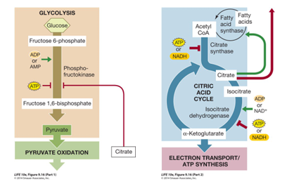
*schema del metabolismo aerobico: a sinistra, la glicolisi converte il glucosio in piruvato (con ADP/AMP che stimolano la fosfofruttochinasi, e ATP e citrato che la inibiscono), il piruvato entra nell'ossidazione piruvica; a destra, il ciclo dell'acido citrico (ciclo di Krebs) genera i substrati (Acetil-CoA da acidi grassi/citrato) per la catena di trasporto degli elettroni e la sintesi di ATP, con isocitrato deidrogenasi regolata negativamente da ATP/NADH e positivamente da ADP/NAD+*

Il fattore inducibile dall'ipossia (**HIF**, *Hypoxia Inducible Factor*) è il principale sensore molecolare della disponibilità di ossigeno nella cellula: quando l'ossigeno scarseggia, HIF si accumula e attiva la trascrizione di geni che aiutano la cellula e l'organismo ad adattarsi — dalla produzione di EPO (vista sopra) all'angiogenesi, fino al riorientamento del metabolismo energetico verso la via glicolitica, meno dipendente dall'ossigeno rispetto alla fosforilazione ossidativa.

---

## Sistema respiratorio

L'apparato respiratorio umano è costituito da una serie di organi responsabili dell'assorbimento dell'ossigeno e dell'espulsione dell'anidride carbonica. Gli organi principali dell'apparato respiratorio sono i polmoni, che effettuano lo scambio gassoso mentre respiriamo.

Dai seni paranasali, l'aria passa attraverso la trachea e raggiunge i bronchi. I bronchi sono rivestiti da minuscoli peli chiamati **ciglia**, e si ramificano ulteriormente per convogliare l'aria nei lobi di ciascun polmone. I lobi sono pieni di piccole sacche spugnose chiamate **alveoli**, dove avviene lo scambio di ossigeno e anidride carbonica.

Le pareti alveolari sono estremamente sottili (circa 0,2 micrometri) e sono costituite da un unico strato di cellule epiteliali e da minuscoli vasi sanguigni chiamati capillari polmonari. Il sangue nei capillari assorbe ossigeno e rilascia anidride carbonica. Il sangue ossigenato raggiunge quindi la vena polmonare, che trasporta il sangue ricco di ossigeno al lato sinistro del cuore, da dove viene pompato in tutte le parti del corpo. L'anidride carbonica che il sangue ha rilasciato si sposta negli alveoli e viene espulsa con il respiro espirato.

*Come entra l'aria nei polmoni?*

Tutto dipende dalla pressione dei gas e dalla diffusione. Lo scambio gassoso avviene tramite processi di diffusione regolati dalla **legge di Fick**:

$$Q = \frac{\Delta P \times A \times D}{\Delta X}$$

dove:

- **Q** = velocità di diffusione;
- **ΔP** = differenza di pressione parziale del gas;
- **A** = area di scambio (più capillari sono disponibili, maggiore è l'area di scambio);
- **D** = coefficiente di diffusione (quanto è solubile un gas in un liquido — ad esempio, quanto l'ossigeno è solubile nel sangue);
- **ΔX** = distanza percorsa dal gas durante la diffusione.

La **pressione atmosferica** (o pressione barometrica) è la pressione all'interno dell'atmosfera terrestre. L'atmosfera standard di aria secca (simbolo: atm) è un'unità di pressione definita come 101.325 Pa, che equivale a 760 mmHg.

### Respirazione e muscoli

Durante l'inspirazione si osserva lo spostamento verticale delle costole, che provoca il movimento dello sterno in avanti e verso l'alto, con conseguente espansione antero-posteriore della cavità toracica. La contrazione dei **muscoli intercostali esterni** provoca inoltre lo spostamento verticale delle costole, con conseguente espansione laterale della cavità toracica. Contraendosi, il **diaframma** si abbassa, espandendo la cavità toracica verticalmente.

### Inspirazione e pressione negativa nei polmoni

Grazie alle contrazioni dei muscoli inspiratori descritti sopra, si ha un aumento di volume dei polmoni che porta a una diminuzione di pressione, favorendo l'ingresso di aria al loro interno.

Durante l'inspirazione:

1. il diaframma si contrae;
2. la cavità toracica si espande;
3. la pressione intrapleurica diventa più negativa;
4. i polmoni si espandono;
5. l'aria affluisce ai polmoni.

### Espirazione e pressione positiva nei polmoni

Durante l'espirazione, la pressione dell'aria esterna è minore rispetto a quella interna ai polmoni, e quindi l'aria viene rimossa.

Durante l'espirazione:

1. il diaframma si rilascia;
2. la cavità toracica si contrae;
3. la pressione intrapleurica diventa meno negativa;
4. i polmoni si contraggono;
5. i gas vengono espulsi dai polmoni.

### Pressione parziale dei gas durante la respirazione

In una miscela di gas, ogni gas costituente ha una **pressione parziale**, che corrisponde alla pressione teorica di quel gas se occupasse da solo l'intero volume della miscela originale, alla stessa temperatura. La pressione totale di una miscela di gas ideale è la somma delle pressioni parziali dei gas presenti nella miscela. Poiché l'ossigeno costituisce il 21% dell'aria secca, la pressione dell'ossigeno inspirato è di 159 mmHg a livello del mare. La quantità di CO₂ nell'aria è invece molto bassa (0,03%), quindi la CO₂ viene eliminata facilmente dall'organismo.

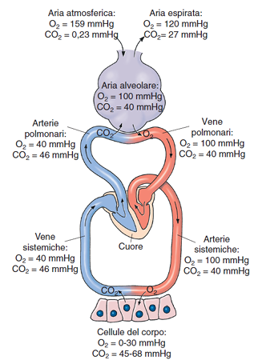

*schema del circolo polmonare e sistemico con le rispettive pressioni parziali di O2 e CO2 in ciascun punto del percorso: aria atmosferica (O2 159 mmHg, CO2 0,23 mmHg), aria espirata (O2 120 mmHg, CO2 27 mmHg), aria alveolare (O2 100 mmHg, CO2 40 mmHg), arterie e vene polmonari, arterie e vene sistemiche (O2 100/40 mmHg), e cellule del corpo (O2 0-30 mmHg, CO2 45-68 mmHg), a mostrare il gradiente di pressione che guida la diffusione dei gas lungo tutto il percorso*

### Trasporto di ossigeno nel sangue

Il 98,5% dell'ossigeno viene trasportato legato all'**emoglobina** (ogni molecola di emoglobina ha 4 siti per l'O₂), presente nei globuli rossi:

$$Hb + 4O_2 \leftrightarrow Hb(O_2)_4$$

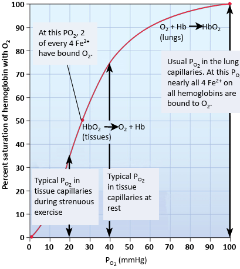
*curva di dissociazione dell'emoglobina, che mostra la percentuale di saturazione dell'emoglobina con O2 in funzione della PO2 (mmHg): a valori tipici della PO2 nei capillari tissutali a riposo (~40 mmHg) circa 2 dei 4 siti del ferro sono legati all'O2, mentre ai valori tipici della PO2 durante esercizio intenso (~20 mmHg) l'emoglobina rilascia più ossigeno; ai valori tipici della PO2 nei capillari polmonari (~100 mmHg) quasi tutti i siti del ferro sono legati all'O2*

Quando la pressione parziale di ossigeno è alta, ogni molecola di emoglobina lega 4 molecole di ossigeno (saturazione 100%). Quando la PO₂ è bassa, come nei tessuti a riposo o sotto sforzo, l'emoglobina rilascia ossigeno. La curva ha una caratteristica forma **sigmoide**, dovuta alla **cooperazione delle subunità di emoglobina**: la struttura dell'emoglobina cambia quando viene acquisita o persa una molecola di O₂, aumentando o diminuendo l'affinità per il legame verso le altre molecole.

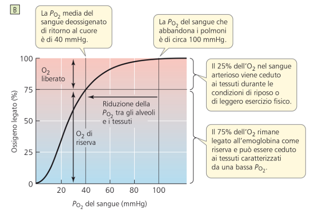

*curva di dissociazione dell'emoglobina con focus sul concetto di "ossigeno di riserva": la PO2 del sangue che abbandona i polmoni è di circa 100 mmHg (100% di ossigeno legato), mentre la PO2 media del sangue deossigenato di ritorno al cuore è di 40 mmHg; in condizioni di riposo o leggero esercizio solo il 25% dell'O2 nel sangue arterioso viene ceduto ai tessuti, mentre il restante 75% rimane legato all'emoglobina come riserva, disponibile per i tessuti con una PO2 più bassa (ad esempio durante esercizio intenso)*

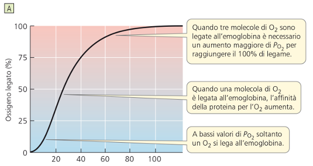
*curva di dissociazione dell'emoglobina con focus sulla cooperatività tra le subunità: a bassi valori di PO2 solo una molecola di O2 si lega all'emoglobina; una volta legata la prima molecola di O2, l'affinità della proteina per l'O2 aumenta (da qui la ripida risalita della curva); quando già tre molecole di O2 sono legate, è necessario un aumento molto maggiore di PO2 per raggiungere il 100% di legame (da qui l'appiattimento della curva verso l'alto)*

### Cambiamenti nell'affinità con l'ossigeno

La curva di dissociazione dell'emoglobina è sensibile a diversi fattori:

- **2,3-BPG** (2,3-bifosfoglicerato): deriva da un intermedio della glicolisi, e aumenta in condizioni di ipossia generalizzata. Il 2,3-BPG interagisce con le subunità beta dell'emoglobina deossigenata, riducendone l'affinità per l'ossigeno e favorendo in modo allosterico il rilascio delle molecole di ossigeno ancora legate — in questo modo, potenzia la capacità dei globuli rossi di rilasciare ossigeno in prossimità dei tessuti che ne hanno maggiormente bisogno.
- **pH**: dipende dalla concentrazione di ioni H⁺.

Quando si abbassa il pH, aumenta la temperatura, e aumenta la pressione parziale della CO₂ mentre diminuisce quella dell'ossigeno, la **curva di dissociazione dell'emoglobina si sposta verso destra** — l'emoglobina rilascia più facilmente l'ossigeno ai tessuti (è il cosiddetto *effetto Bohr*).

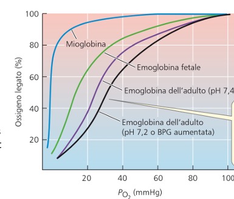

*confronto tra quattro curve di dissociazione dell'ossigeno in funzione della PO2: mioglobina (la più a sinistra, massima affinità per l'O2, coerente con il suo ruolo di riserva muscolare di ossigeno), emoglobina fetale, emoglobina dell'adulto a pH 7,4, ed emoglobina dell'adulto a pH 7,2 o con BPG aumentato (la più a destra, minima affinità, a mostrare lo spostamento della curva verso destra causato dall'acidosi e dall'aumento del BPG)*

La **mioglobina** è una catena proteica legata a una singola molecola di O₂, molto importante per i muscoli: si tratta di una vera e propria riserva locale di ossigeno, con un'affinità per l'O₂ molto più alta di quella dell'emoglobina — motivo per cui, nella curva sopra, la sua curva di dissociazione si trova più a sinistra di tutte le altre.

### CO₂ nel sangue

La CO₂ viene trasportata nel sangue principalmente sotto forma di **ione bicarbonato (HCO₃⁻)** (65%), oppure legata all'emoglobina (Hb, 25%). Il restante 10% è semplicemente disciolto nel sangue.

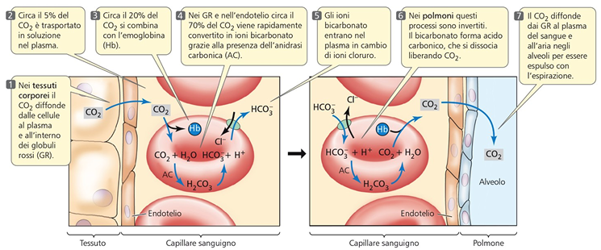
*schema in 7 passaggi del trasporto della CO2 nel sangue: (1) nei tessuti corporei la CO2 diffonde dalle cellule al plasma e ai globuli rossi (GR); (2) circa il 5% resta disciolto nel plasma; (3) circa il 20% si combina con l'emoglobina; (4) nei GR e nell'endotelio circa il 70% viene rapidamente convertito in ioni bicarbonato grazie all'anidrasi carbonica (AC), con gli ioni bicarbonato che entrano nel plasma in cambio di ioni cloruro; (5-6) nei polmoni questi processi si invertono: il bicarbonato rientra nei GR e forma acido carbonico, che si dissocia liberando CO2; (7) la CO2 diffonde dal sangue al plasma e all'aria negli alveoli, da dove viene espulsa con l'espirazione*

### Check points per il respiro regolare

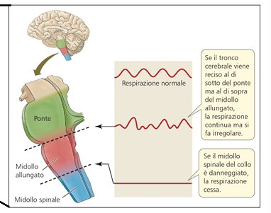

*schema del tronco encefalico (ponte, midollo allungato, midollo spinale) con i tracciati della respirazione: la respirazione normale è regolare; se il tronco encefalico viene reciso al di sotto del ponte ma al di sopra del midollo allungato, la respirazione continua ma si fa irregolare; se il midollo spinale del collo è danneggiato, la respirazione cessa completamente*

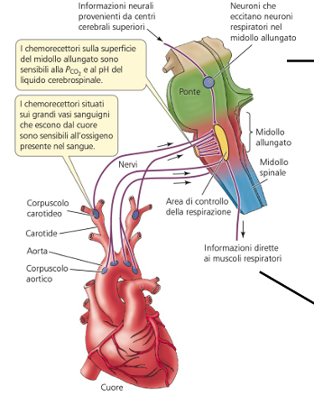

*schema dei centri di controllo della respirazione: informazioni neurali provenienti da centri cerebrali superiori e informazioni dirette ai muscoli respiratori convergono sull'area di controllo della respirazione nel midollo allungato/ponte; i chemocettori sulla superficie del midollo allungato sono sensibili alla PCO2 e al pH del liquido cerebrospinale, mentre i chemocettori situati sui grandi vasi sanguigni che escono dal cuore (corpuscolo carotideo e corpuscolo aortico) sono sensibili all'ossigeno presente nel sangue*

La regione **dorsale** del midollo allungato invia proiezioni ai motoneuroni del diaframma e dei muscoli intercostali esterni. La regione **ventrale** del midollo allungato invia invece proiezioni ai motoneuroni dei muscoli accessori. I neuroni del **ponte** controllano la frequenza respiratoria.

### Cambiamenti nella PCO₂ e PO₂ ed effetti sulla respirazione

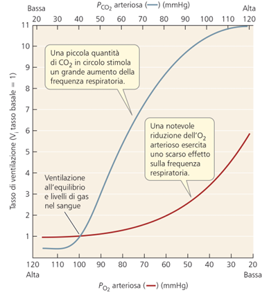

*grafico del tasso di ventilazione (rispetto al tasso basale = 1) in funzione della PCO2 arteriosa (asse superiore, blu) e della PO2 arteriosa (asse inferiore, rosso): una piccola quantità di CO2 in circolo stimola un grande aumento della frequenza respiratoria (curva blu molto ripida), mentre una notevole riduzione dell'O2 arterioso esercita uno scarso effetto sulla frequenza respiratoria finché la PO2 non scende molto in basso (curva rossa piatta fino a valori bassi di PO2)*

Questo grafico chiarisce un punto fondamentale: il sistema di controllo della respirazione è molto più sensibile alle variazioni di **CO₂** che a quelle di **O₂**. Solo quando la PO₂ scende a livelli piuttosto bassi (come può accadere in altitudine, coerentemente con quanto visto a inizio capitolo) il suo calo inizia a stimolare in modo significativo la ventilazione.

---

## Riassunto finale

- L'**ipossia** è una condizione in cui l'organismo, o una sua parte, è privato di un adeguato apporto di ossigeno a livello tissutale.
- L'ossigeno è necessario per consentire la produzione di energia nelle cellule.
- L'ossigeno entra nell'organismo attraverso la respirazione. I polmoni e gli alveoli ricevono ossigeno durante l'inspirazione ed espellono anidride carbonica durante l'espirazione.
- L'ossigeno si lega all'**emoglobina** nei capillari alveolari e viene rilasciato ai tessuti periferici.
- L'anidride carbonica è presente nel sangue principalmente sotto forma di **HCO₃⁻**, grazie all'azione dell'**anidrasi carbonica**, che converte CO₂ e H₂O in HCO₃⁻ e H⁺.
- L'aumento della produzione di **H⁺** e di **2,3-BPG** aiuta l'emoglobina a rilasciare più facilmente l'O₂ ai tessuti periferici (effetto Bohr).
- Molecole o cellule chiave da ricordare per affrontare l'ipossia: **2,3-BPG**, **H⁺**, **emoglobina**, **globuli rossi**, **anidrasi carbonica**.

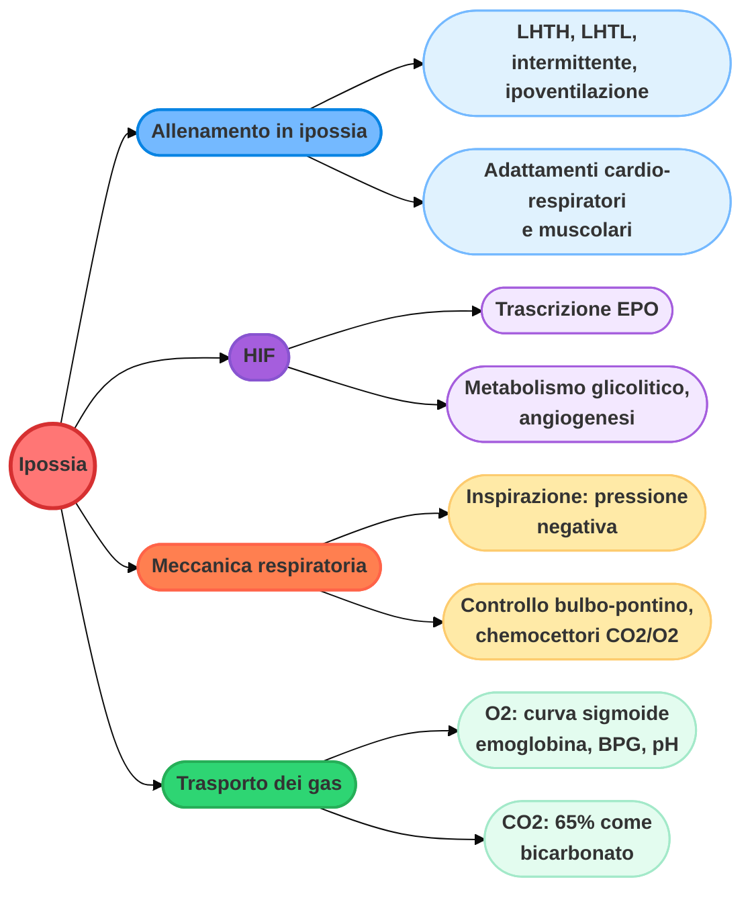
