# Cervello ed esercizio

## Introduzione

L'esercizio fisico non aiuta solo a sviluppare i muscoli e le prestazioni fisiche, ma è essenziale per attivare e aumentare il numero di connessioni neuronali. Il nostro stile di vita fisicamente inattivo ci espone al rischio di sviluppare obesità, diabete, depressione e demenza.

L'esercizio fisico può **ridurre** il tasso di **declino cognitivo** nei pazienti con disturbi **neurodegenerativi**, e ha un'influenza positiva su stress, ansia e depressione. Ha inoltre effetti positivi su:

- apprendimento;
- memoria e attenzione;
- velocità di elaborazione e funzioni esecutive;
- tempi di reazione e apprendimento delle lingue;
- abilità motorie e apprendimento;
- risultati dei test cognitivi verbali e visuo-spaziali;
- rendimento scolastico nei bambini e intelligenza negli adolescenti.

L'esercizio migliora inoltre sonno, appetito e umore. Gli effetti benefici sono stati dimostrati principalmente con l'**esercizio aerobico**.

L'esercizio aerobico porta alla produzione, da parte del corpo, di diverse molecole — **IGF-1, Miostatina, Irisina, IL-6, Catepsina B, BDNF, VEGF, Lattato, KYNA** — che hanno effetti positivi su:

- **neurogenesi** (il processo che porta alla formazione di nuovi neuroni: è stata dimostrata negli animali, mentre nell'uomo esistono ancora pareri discordanti);
- **plasticità sinaptica** (potenziamento delle connessioni tra neuroni);
- incremento del **flusso sanguigno** al cervello;
- migliore **funzione cognitiva**;
- incremento del **volume dell'ippocampo**.

Il resto del capitolo è dedicato a spiegare, molecola per molecola, come questo collegamento tra muscolo e cervello funzioni concretamente.

---

## Effetti sull'ippocampo

L'**ippocampo**, coinvolto nella memoria e nell'apprendimento, è la regione cerebrale che viene affetta maggiormente dall'esercizio fisico.

### Funzioni dell'ippocampo

L'ippocampo è una struttura situata nel lobo temporale (ce n'è uno per emisfero) ed è essenziale per la **memoria a lungo termine** e l'**apprendimento**, in particolare per:

- navigazione spaziale;
- memoria topografica;
- elaborazione delle informazioni;
- riconoscimento di oggetti;
- condizionamento alla paura;
- consolidazione della memoria.

### Fattori che regolano la neurogenesi nell'ippocampo

I fattori che stimolano e regolano la neurogenesi dell'ippocampo sono l'attività fisica, associata a stimoli sociali, manuali (ad esempio lavorare a maglia) e a un ambiente stimolante. Il movimento aerobico stimola in particolare la produzione della proteina **BDNF** (*Brain-Derived Neurotrophic Factor*), che agisce come un vero e proprio fertilizzante per i neuroni (approfondito più avanti nel capitolo).

Una domanda guida per il resto del capitolo è la seguente: *quale fattore, o quali fattori periferici, consentono una comunicazione diretta tra il muscolo in attività e le funzioni cerebrali — inclusi umore, apprendimento, memoria e appetito — che dipendono dall'ippocampo?*

### Miochine e altri mediatori dell'esercizio

Il muscolo scheletrico è un vero e proprio organo "endocrino" secretorio: il suo secretoma nell'uomo è costituito da **centinaia di fattori** regolati dall'attività fisica, tra cui le miochine.

Le **miochine** sono piccole proteine prodotte e rilasciate dai muscoli scheletrici, che possono agire in tre modi diversi:

- **autocrino**: la miochina agisce sulla stessa cellula che l'ha prodotta;
- **paracrino**: agisce sulle cellule vicine;
- **endocrino**: viene rilasciata nel sangue e agisce su organi lontani, come il cervello o il fegato.

Le miochine viaggiano attraverso i vasi sanguigni per raggiungere diversi organi bersaglio:

- **cervello**: migliorano la funzione cognitiva e l'umore;
- **fegato**: regolano la produzione di glucosio;
- **tessuto adiposo**: stimolano il metabolismo dei grassi (lipolisi).

Questo circuito prende il nome di ***muscle-brain endocrine loop***: un circuito di comunicazione bidirezionale in cui il muscolo segnala al cervello che il corpo è attivo, mentre il cervello risponde migliorando la plasticità neuronale e regolando l'appetito e il dispendio energetico in base allo sforzo in corso.

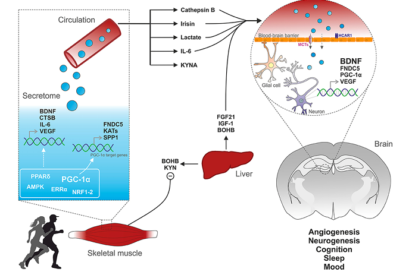
*schema riassuntivo dell'asse muscolo-cervello: il secretoma del muscolo scheletrico (regolato da PGC-1α, PPARδ, AMPK, ERRα, NRF1-2) rilascia in circolo BDNF, Catepsina B (CTSB), IL-6, VEGF, FNDC5, KAT e SPP1; questi fattori raggiungono il cervello attraversando la barriera emato-encefalica (tramite trasportatori come MCT e recettori come HCAR1), agendo su cellule gliali e neuroni per stimolare BDNF, FNDC5, PGC-1α e VEGF a livello centrale; il fegato contribuisce con FGF21, IGF-1 e BOHB (β-idrossibutirrato), mentre BOHB e la chinurenina (KYN) inibiscono l'asse a livello muscolare; il risultato finale nel cervello è angiogenesi, neurogenesi, miglior cognizione, sonno e umore*

### Altri mediatori dell'esercizio

Oltre alle miochine, altri possibili mediatori degli effetti dell'esercizio fisico sul cervello sono:

- **alterazioni dei metaboliti** indotte dall'esercizio fisico;
- **RNA non codificanti**: non si tratta dell'attivazione o della produzione di geni veri e propri, ma di piccoli segmenti di DNA che svolgono funzioni regolatorie, per lo più reprimendo l'espressione di geni specifici;
- **risposte ormonali**;
- **variazioni degli enzimi muscolari** che influenzano i composti circolanti — ad esempio la **chinurenina**, che aumenta il rischio di depressione (approfondita più avanti).

Tutti i fattori rilasciati in risposta all'esercizio fisico acuto e/o cronico — inclusi peptidi, acidi nucleici e metaboliti — possono essere definiti con il termine **"exerkine"** (le miochine prodotte dal muscolo in seguito all'attività fisica ne sono un sottoinsieme).

---

## Brain-Derived Neurotrophic Factor (BDNF)

Il **BDNF** è una proteina che agisce come fertilizzante per il cervello: aiuta il cervello ad adattarsi e imparare, migliorando tutte le forme di **plasticità** (la capacità del cervello di cambiare struttura in risposta all'esperienza).

Siamo noi, in una certa misura, a controllare i nostri livelli di BDNF:

- **esercizio fisico**: aumenta il BDNF a ogni età;
- **sonno**: la carenza di sonno porta a una riduzione del BDNF;
- **nutrizione**: una dieta ad alto contenuto di grassi e zuccheri ne porta a una riduzione;
- **stress**: il cortisolo è un antagonista del BDNF.

### Percorsi intracellulari

Quando il BDNF si aggancia al recettore **TrkB** sulla membrana del neurone, attiva quattro "autostrade" di segnali chimici:

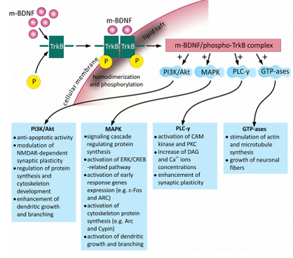

*schema del complesso m-BDNF/fosfo-TrkB sulla membrana neuronale, che dopo omodimerizzazione e fosforilazione del recettore attiva quattro vie a valle — PI3K/Akt, MAPK, PLC-γ e GTPasi — ciascuna con le proprie funzioni specifiche elencate sotto*

- **PI3K/Akt** → si occupa della **sopravvivenza**: impedisce alla cellula di morire (attività anti-apoptotica), regola la sintesi proteica e lo sviluppo del citoscheletro, e aiuta la crescita dei dendriti (i "rami" del neurone);
- **MAPK** → si occupa della **crescita e della sintesi proteica**: attiva i geni necessari per costruire nuovi pezzi di neurone e nuove ramificazioni;
- **PLC-γ** → si occupa della **plasticità sinaptica**: aumenta i livelli di calcio e la forza della connessione tra due neuroni, rendendo la comunicazione più veloce;
- **GTPasi** → si occupa della **struttura**: stimola la creazione del citoscheletro (l'impalcatura) dei neuroni, permettendo alla fibra nervosa di allungarsi.

### Il ruolo di BDNF

Uno studio sui topolini ha dimostrato che correre sulla ruota per 6 ore aumenta l'espressione dell'mRNA del BDNF, e che l'accesso libero alle ruote per l'attività fisica, per un periodo compreso tra 1 e 8 settimane, aumenta sia l'espressione dell'mRNA del BDNF nell'ippocampo sia i livelli della proteina stessa.

Diversi studi hanno dimostrato che il BDNF è coinvolto, a livello meccanicistico, nella mediazione dell'aumento — indotto dall'esercizio fisico — della proliferazione delle cellule del giro dentato dell'ippocampo, e che il BDNF è necessario per il potenziamento, indotto dall'esercizio fisico, di funzioni cognitive quali la memoria e l'apprendimento.

*I meccanismi alla base dell'aumento dei livelli di BDNF durante l'attività cardiovascolare e muscolare indotta dall'esercizio fisico non sono ancora del tutto chiari.*

Il BDNF è una proteina inducibile dalla contrazione nel muscolo scheletrico umano, in grado di potenziare l'ossidazione dei lipidi nel muscolo scheletrico attraverso l'attivazione della proteina chinasi attivata dall'AMP (**AMPK**) — cioè stimolando l'utilizzo di acidi grassi per la produzione di energia da parte dei muscoli. Il BDNF, infatti, **non viene prodotto solo nel cervello**, ma anche nel muscolo scheletrico in risposta alla contrazione.

Nel **muscolo**, il BDNF:

- funziona come una **miochina**;
- attiva l'AMPK, stimolando l'ossidazione dei grassi;
- supporta l'adattamento metabolico all'esercizio fisico.

Nel **cervello**, il BDNF:

- agisce attraverso il **recettore TrkB**;
- attiva le vie PI3K/Akt, MAPK e PLC-γ viste sopra;
- promuove la neurogenesi, la plasticità sinaptica e l'apprendimento.

Il BDNF potrebbe quindi fungere da **collegamento chiave** tra muscoli e cervello, integrando le funzioni motorie e cognitive.

> Restano ancora aperte alcune domande di ricerca: il BDNF di origine muscolare viene rilasciato dal muscolo scheletrico nel flusso sanguigno in quantità sufficienti da influire sul cervello? L'esercizio fisico induce la produzione di altri fattori circolanti di origine muscolare che attraversano la barriera emato-encefalica e stimolano la produzione di BDNF nel cervello? Quali? Le prossime sezioni del capitolo presentano alcuni dei candidati principali.

---

## Lattato e pH muscolare

Si pensa comunemente che il lattato (spesso chiamato, erroneamente, "acido lattico") sia il responsabile dell'acidificazione dei muscoli e del bruciore durante lo sforzo. In realtà:

1. il lattato **NON causa acidosi**. Al contrario, la reazione che trasforma il piruvato in lattato **consuma ioni idrogeno (H⁺)**. Poiché l'acidità è causata proprio dall'accumulo di questi ioni H⁺, la produzione di lattato aiuta effettivamente a **ritardare** l'acidificazione;
2. l'acidità reale deriva dall'**idrolisi dell'ATP** (quando le molecole di energia vengono scomposte per far contrarre il muscolo velocemente).

Il lattato non è quindi un nemico o un rifiuto tossico, ma un **tampone (buffer)** che aiuta il muscolo a lavorare più a lungo, ed è inoltre un segnale prezioso per il cervello (come parte del secretoma visto sopra).

---

## Catepsina B e regolazione del BDNF

*Studio: "Running-Induced Systemic Cathepsin B Secretion Is Associated with Memory Function" (Moon et al.)*

L'esercizio stimola il muscolo a rilasciare la **Catepsina B (CTSB)**: la proteina entra nel flusso sanguigno e attraversa la barriera emato-encefalica; una volta nel cervello, la CTSB stimola l'aumento di:

- **BDNF**;
- **neurogenesi**.

Questo si traduce in un miglioramento delle funzioni che dipendono dall'ippocampo, ovvero apprendimento, memoria e umore.

### Regolazione tra Catepsina B e BDNF

*In che misura questa miochina costituisce un fattore determinante nel miglioramento delle funzioni cognitive indotto dall'esercizio fisico nell'uomo?*

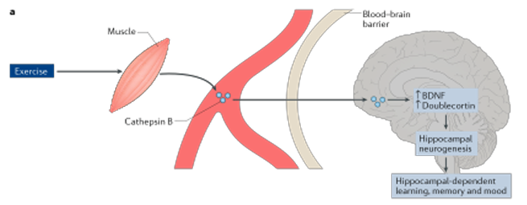
*schema del percorso della catepsina B: l'esercizio induce il rilascio di catepsina B dal muscolo, che attraversa la barriera emato-encefalica e raggiunge il cervello, dove aumenta i livelli di BDNF e di doublecortina (marcatore di nuovi neuroni immaturi), stimolando la neurogenesi ippocampale e, di conseguenza, l'apprendimento, la memoria e l'umore dipendenti dall'ippocampo*

---

## La via PGC-1α-FNDC5-BDNF: il ruolo dell'irisina

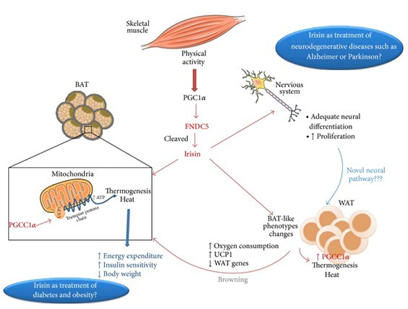

*schema della via PGC-1α-FNDC5-Irisina: l'attività fisica del muscolo scheletrico induce PGC-1α, che stimola l'espressione di FNDC5, successivamente scisso a formare l'Irisina; l'irisina agisce sul tessuto adiposo bruno (BAT, aumentando dispendio energetico, sensibilità insulinica, peso corporeo) e induce il "browning" del tessuto adiposo bianco (WAT, con aumento di consumo di ossigeno, UCP1, geni del WAT), oltre ad agire sul sistema nervoso, dove promuove la differenziazione e la proliferazione neurale — con un potenziale, ancora da esplorare, come trattamento per obesità/diabete e per malattie neurodegenerative come Alzheimer o Parkinson*

L'**attività fisica** induce l'aumento di una proteina coattivatrice trascrizionale chiamata **PGC-1α** nel muscolo scheletrico. Il PGC-1α stimola l'espressione di una proteina di membrana chiamata **FNDC5**, che viene poi "tagliata" (*cleaved*) per diventare **Irisina**.

L'irisina viaggia fino al tessuto adiposo bianco (**WAT**, quello che accumula grasso) e lo trasforma in tessuto adiposo bruno (**BAT**, quello che brucia grasso per produrre calore). Questo migliora la sensibilità all'insulina e aiuta a ridurre il peso corporeo.

*Ma che dire del cervello?* L'irisina è in grado di influenzare anche il **sistema nervoso centrale**, promuovendo la differenziazione e la proliferazione dei neuroni.

*Studio*: l'esercizio fisico di resistenza determina un aumento dell'espressione del gene *Fndc5* nell'ippocampo dei topi.

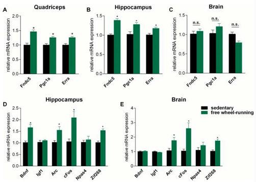
*cinque grafici sperimentali: (A) nel quadricipite, l'esercizio (free wheel-running, verde) aumenta l'espressione di Fndc5, Pgc1a ed Erra rispetto ai sedentari (nero); (B) lo stesso aumento si osserva nell'ippocampo; (C) nel "brain" (cervello nel suo complesso) le differenze non sono invece significative (n.s.); (D) nell'ippocampo, l'esercizio aumenta anche l'espressione di Bdnf, Arc, cFos e Zif268 (ma non di Igf1 e Npas4); (E) variazioni simili, seppur più contenute, si osservano nel "brain"*

Il **ruolo di PGC-1α**: nei topi privi del gene *Pgc1a* (topi -/-) si osservano livelli molto più bassi sia di *Fndc5* sia di *Bdnf* nel cervello — a dimostrazione che il PGC-1α muscolare è necessario per avere un cervello sano.

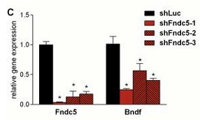

*istogramma che mostra come il knockdown di Fndc5, ottenuto tramite tre diversi shRNA (shFndc5-1/2/3) rispetto a un controllo (shLuc), riduca drasticamente non solo l'espressione di Fndc5 stesso, ma anche quella di Bdnf*

Il **knockdown di FNDC5**, mediato dall'interferenza dell'RNA, porta quindi a una riduzione dell'espressione del gene *Bdnf* — una prova diretta che FNDC5 è necessario per sostenere i livelli di BDNF.

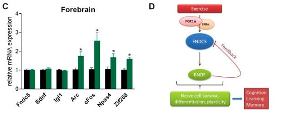
*a sinistra (pannello C), nel forebrain l'esercizio (verde) aumenta significativamente l'espressione di Arc, cFos, Npas4 e Zif268 rispetto ai sedentari (nero), ma non quella di Fndc5, Bdnf e Igf1; a destra (pannello D), schema riassuntivo del meccanismo: l'esercizio induce PGC1α/Erra nel muscolo, che stimola FNDC5, il quale a sua volta induce BDNF (con un anello di feedback negativo su FNDC5 stesso), portando a sopravvivenza, differenziazione e plasticità delle cellule nervose, e infine a cognizione, apprendimento e memoria*

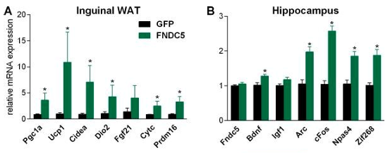
*due grafici: (A) nel tessuto adiposo inguinale (WAT), la somministrazione periferica di FNDC5 (verde) rispetto al controllo (GFP, nero) aumenta l'espressione di geni associati al browning e al dispendio energetico (Pgc1a, Ucp1, Cidea, Dio2, Fgf21, Cytc, Prdm16); (B) nell'ippocampo, la stessa somministrazione periferica di FNDC5 aumenta l'espressione di Bdnf, Arc, cFos, Npas4 e Zif268 (ma non di Fndc5 e Igf1)*

La somministrazione **periferica** di FNDC5 aumenta l'espressione di BDNF nell'ippocampo, suggerendo che l'FNDC5/irisina circolante possa effettivamente influenzare il cervello. In sintesi:

- **aumento di FNDC5**: l'esercizio di resistenza (*endurance*) aumenta l'espressione del gene *Fndc5* non solo nei muscoli (quadricipite), ma anche direttamente nell'ippocampo;
- **il ruolo di PGC-1α**: i topi privi del gene *Pgc1a* hanno livelli molto più bassi di *Fndc5* e di *Bdnf* nel cervello, a dimostrazione che il PGC-1α muscolare è necessario per un cervello sano;
- **correlazione con il BDNF**: l'attività fisica (*free wheel-running*) aumenta drasticamente i livelli di BDNF e di altri fattori di plasticità neuronale.

---

## β-idrossibutirrato e BDNF

I corpi chetonici, sotto forma di **β-idrossibutirrato** e **acetoacetato**, fungono da fonte di energia alternativa al glucosio.

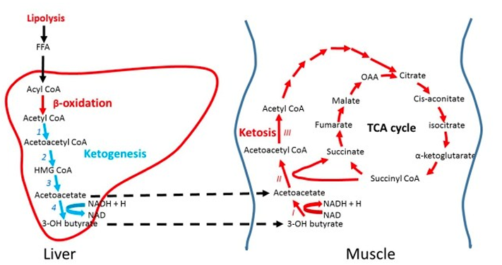
*schema della chetogenesi epatica e del suo utilizzo muscolare: nel fegato, la lipolisi produce acidi grassi liberi (FFA), che tramite β-ossidazione generano Acetil-CoA; la via della chetogenesi (1-4) converte l'Acetil-CoA in acetoacetato e infine 3-idrossibutirrato (3-OH butyrate), che viene rilasciato ed entra nel muscolo, dove viene riconvertito in acetoacetato e Acetil-CoA (via della chetosi, I-III) per alimentare il ciclo di Krebs (TCA cycle)*

È stato dimostrato che l'esercizio fisico prolungato stimola un aumento dei livelli di β-idrossibutirrato nel sangue. Il **β-idrossibutirrato** si è dimostrato un efficace agente **neuroprotettivo** in modelli sperimentali della malattia di **Huntington** e del morbo di **Parkinson**, proteggendo rispettivamente i neuroni striatali e quelli dopaminergici.

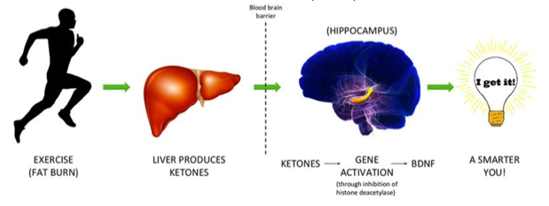
*schema semplificato: l'esercizio (che brucia grassi) stimola il fegato a produrre corpi chetonici, che attraversano la barriera emato-encefalica e raggiungono l'ippocampo, dove attivano l'espressione genica (tramite l'inibizione dell'istone deacetilasi) portando a un aumento del BDNF*

I corpi chetonici aumentano notevolmente nella circolazione sanguigna e nel cervello in seguito al **digiuno**, a **diete chetogeniche** o a basso contenuto di carboidrati, e all'**esercizio fisico intenso o prolungato**.

---

## IL-6 ed esercizio fisico

Gli studi condotti sull'uomo dimostrano chiaramente che concentrazioni fisiologiche di **IL-6** hanno molteplici effetti metabolici.

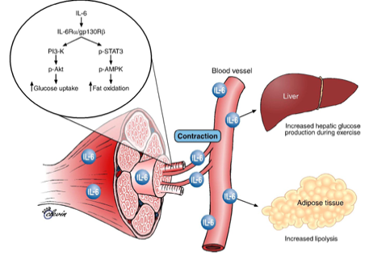

*schema della segnalazione dell'IL-6: la contrazione muscolare rilascia IL-6 in circolo, che agisce localmente sul muscolo stesso legandosi al complesso recettoriale IL-6Rα/gp130β, attivando le vie PI3-K/p-Akt (↑ captazione di glucosio) e p-STAT3/p-AMPK (↑ ossidazione dei grassi); l'IL-6 circolante raggiunge inoltre il fegato (aumentando la produzione epatica di glucosio durante l'esercizio) e il tessuto adiposo (aumentando la lipolisi)*

I livelli di IL-6 raggiungono valori fino a **100 volte superiori** a quelli basali subito dopo l'esercizio fisico, per poi tornare ai livelli basali nel giro di un paio d'ore. L'IL-6 di origine muscolare è associata a una maggiore sensibilità all'insulina e a una maggiore ossidazione dei grassi.

L'infusione acuta di IL-6 nell'uomo ha inibito l'aumento dei livelli circolanti di TNF indotto dall'endotossina, suggerendo un effetto **antinfiammatorio** dell'IL-6. L'infusione di IL-6 stimola inoltre la produzione delle molecole antinfiammatorie antagonista del recettore dell'IL-1 e IL-10.

Quando l'IL-6 viene somministrata per via endovenosa a soggetti sani, aumenta l'assorbimento del glucosio stimolato dall'insulina, stimola la lipolisi e l'ossidazione dei grassi, e ritarda lo svuotamento gastrico — con effetti benefici sul controllo glicemico postprandiale.

### IL-6 e regolazione dell'appetito

L'IL-6 di origine periferica, a concentrazioni elevate, è in grado di attraversare la barriera emato-encefalica e inibire l'assunzione di cibo nei topi. Questo lascia aperta la possibilità che l'aumento dell'IL-6 di origine muscolare, che si verifica durante l'esercizio fisico ad alta intensità e di lunga durata, possa contribuire a inibire l'appetito.

Gli anziani in buona salute (di età superiore ai 70 anni) mantengono la capacità di produrre e rilasciare IL-6 in risposta all'esercizio fisico dinamico, senza alcuna differenza rispetto agli individui più giovani.

---

## Asse PGC-1α-chinurenina

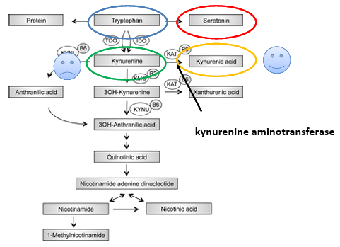
*schema del metabolismo del triptofano: il triptofano può essere convertito in serotonina, oppure (via TDO/IDO) avviare la "via della chinurenina", che genera chinurenina e, successivamente, sia acido chinurenico (KYNA, tramite l'enzima chinurenina aminotransferasi, KAT) sia una cascata di metaboliti (3-OH-chinurenina, acido chinurenico, acido chinolinico) fino alla sintesi di NAD+*

La sovraespressione di PGC-1α nel muscolo ha un effetto simile a quello degli antidepressivi, riducendo l'ingresso nel cervello della **chinurenina**, una sostanza neurotossica. L'esercizio fisico determina infatti l'attivazione della via **PGC-1α-PPARα-PPARδ**, che stimola l'espressione dell'enzima **chinurenina aminotransferasi** nei muscoli scheletrici — l'enzima responsabile della conversione della chinurenina neurotossica nell'acido chinurenico (KYNA), che non attraversa la barriera emato-encefalica ed è quindi neuroprotettivo.

---

## Adipociti e cervello

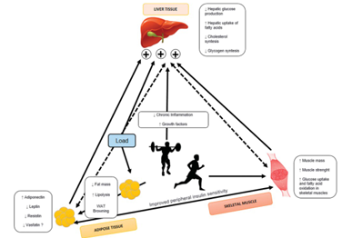
*schema del crosstalk multi-organo indotto dall'esercizio (Load): il tessuto adiposo (con variazioni di adiponectina, leptina, resistina, massa grassa, lipolisi, browning), il fegato (produzione di glucosio, captazione di acidi grassi, sintesi di colesterolo e glicogeno) e il muscolo scheletrico (massa, forza, captazione di glucosio e acidi grassi) comunicano tra loro, contribuendo insieme, insieme alla riduzione dell'infiammazione cronica, a un miglioramento della sensibilità insulinica periferica*

L'**adiponectina** è una proteina secreta dagli adipociti, prodotta e rilasciata nella circolazione principalmente dal tessuto adiposo. Studi condotti sui roditori hanno dimostrato che l'adiponectina viene espressa e rilasciata anche dal tessuto muscolare in relazione all'attività fisica.

L'adiponectina è in grado di attraversare la barriera emato-encefalica e di indurre un aumento della proliferazione cellulare e una diminuzione dei comportamenti simili alla depressione.

---

## Fegato e cervello

Il fegato rilascia proteine secretorie, note in questo caso come **epatocine**, coinvolte nel metabolismo. Epatocine quali il fattore di crescita dei fibroblasti 21 (**FGF21**) e il fattore di crescita insulino-simile 1 (**IGF-1**) sono coinvolte nell'interazione tra il fegato e i tessuti cerebrali — un'interazione che può essere modulata dall'esercizio fisico.

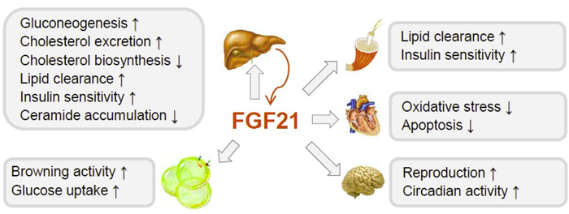
*schema degli effetti multi-organo dell'FGF21 (rilasciato principalmente dal fegato): a livello epatico aumenta la gluconeogenesi e l'escrezione di colesterolo, riduce la biosintesi di colesterolo, aumenta la clearance lipidica e la sensibilità insulinica, e riduce l'accumulo di ceramidi; a livello del tessuto adiposo aumenta l'attività di browning e la captazione di glucosio; a livello cardiaco riduce stress ossidativo e apoptosi; a livello cerebrale aumenta la riproduzione e l'attività circadiana; a livello sistemico aumenta la clearance lipidica e la sensibilità insulinica*

---

## Riassunto finale

- La comprensione di come l'esercizio fisico venga percepito dal cervello, e di come la neurogenesi ippocampale, la cognizione, l'umore e l'appetito vengano attivati o regolati dai muscoli, è stata finora limitata.
- I risultati suggeriscono l'esistenza di un vero e proprio **circolo endocrino muscolo-cerebrale**.
- Il muscolo scheletrico in attività secerne miochine, o esprime fattori muscolari, in grado di alterare la funzione ippocampale sia direttamente sia attraverso un effetto sui livelli della proteina **BDNF**.
- La miochina **Catepsina B**, quando aumentata a livello periferico dall'esercizio fisico, può attraversare la barriera emato-encefalica e potenziare la produzione di BDNF e, di conseguenza, la neurogenesi, la memoria e l'apprendimento.
- La miochina **Irisina**, dipendente da PGC-1α e rilasciata in circolo mediante scissione di FNDC5, potrebbe raggiungere il cervello e attivare la via FNDC5-BDNF.
- Anche il corpo chetonico **β-idrossibutirrato** potrebbe fornire un collegamento tra l'esercizio aerobico e l'espressione genica del BDNF nel cervello.
- La miochina **IL-6** è prodotta nel muscolo e rilasciata nel sangue con l'esercizio fisico, e i suoi livelli plasmatici aumentano esponenzialmente con la durata dell'esercizio.
- L'esercizio fisico potenzia l'espressione muscolare, dipendente da PGC-1α, dell'enzima **chinurenina aminotransferasi**, che induce un cambiamento benefico nell'equilibrio tra la chinurenina neurotossica e l'acido chinurenico neuroprotettivo, riducendo così i sintomi simili alla depressione.
- L'interazione diretta tra muscoli e cervello è mediata dalle miochine e dai metaboliti rilasciati dai muscoli, ma l'attività fisica viene percepita dal cervello anche **indirettamente**, attraverso il tessuto adiposo e il fegato.
- Questi meccanismi rappresentano potenziali **nuovi bersagli terapeutici** per le malattie neurodegenerative, oltre che possibili stimolatori delle funzioni cognitive per persone di tutte le età.

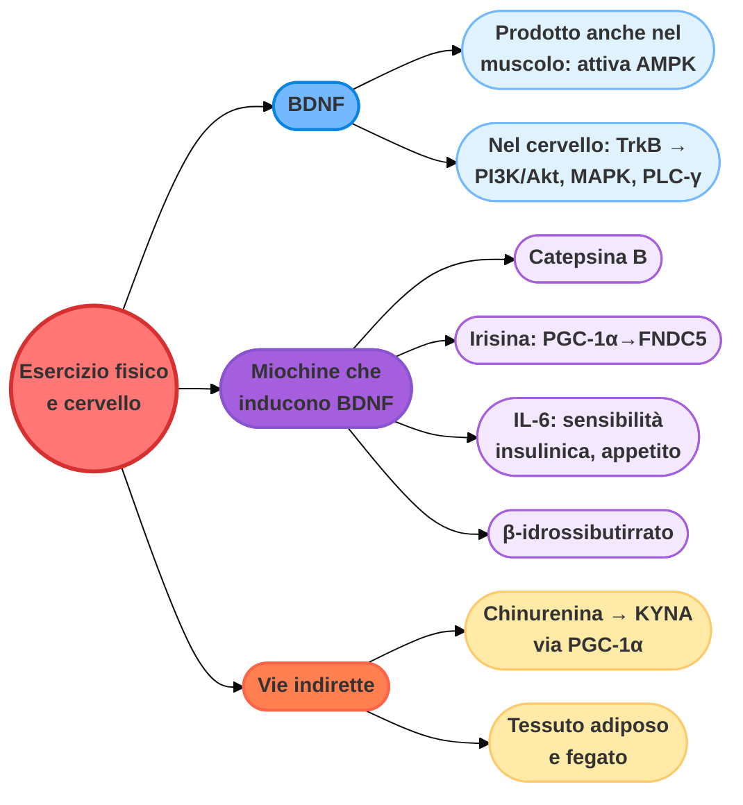
