# Ipossia molecolare: HIF-1α, riprogrammazione metabolica e proteostasi

## Introduzione: O₂, evoluzione metabolica e omeostasi

Le piante sono in grado di convertire l'energia solare in energia chimica sotto forma di legami carboniosi. Da qui hanno avuto origine gli organismi aerobici (batteri) che, per poter utilizzare l'ossigeno, hanno sviluppato i mitocondri.

Sfruttando i mitocondri, le nostre cellule riescono a produrre grandi quantità di ATP attraverso il ciclo di Krebs e la catena di trasporto degli elettroni.

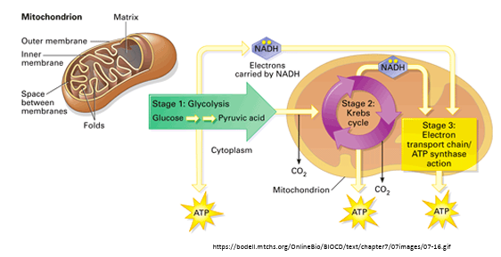

*schema delle tre fasi della respirazione cellulare all'interno del mitocondrio: Stadio 1 (glicolisi, nel citoplasma, da glucosio a acido piruvico), Stadio 2 (ciclo di Krebs, nella matrice mitocondriale, con produzione di CO2 e NADH), Stadio 3 (catena di trasporto degli elettroni/azione dell'ATP sintasi, nella membrana interna), con produzione di ATP in ciascuna fase*

All'esterno del mitocondrio avviene la **glicolisi**, che dal glucosio produce acido piruvico; quest'ultimo entra poi nel ciclo di Krebs per produrre **NADH** e **FADH₂**, trasportatori di elettroni fondamentali per la catena di trasporto degli elettroni.

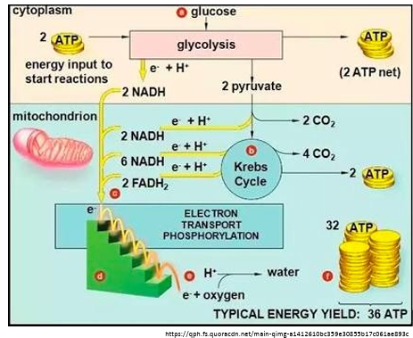

*schema completo della respirazione cellulare: nel citoplasma la glicolisi converte glucosio in 2 piruvato (consumando 2 ATP, producendo 2 NADH e un guadagno netto di 2 ATP); nel mitocondrio il ciclo di Krebs processa il piruvato producendo ulteriori NADH, FADH2 e 2 ATP, oltre a CO2; la catena di trasporto degli elettroni utilizza NADH e FADH2 per produrre la maggior parte dell'ATP (32), con un consumo di ossigeno e produzione di acqua, per una resa energetica tipica complessiva di 36 ATP per molecola di glucosio*

La **respirazione** offre un notevole vantaggio energetico rispetto al metabolismo anaerobico. Si ritiene che questo surplus di energia, disponibile per i processi biofisici e biochimici, abbia contribuito all'evoluzione della vita multicellulare, favorendo la diversificazione biotica.

L'O₂ ha inoltre dato origine a circa 10³ nuove reazioni biochimiche, generando molecole prevalentemente idrofobiche coinvolte nella segnalazione cellulare, nella difesa contro le molecole bioattive che penetrano nella cellula e nelle risposte antiossidanti (ad esempio, isoflavonoidi, acidi grassi polinsaturi e steroidi). I livelli di O₂ e di nutrienti determinano essenzialmente se le cellule ricorrono alla respirazione mitocondriale o al metabolismo glicolitico per bilanciare la sintesi di ATP, macromolecole e ROS.

### ROS: le specie reattive dell'ossigeno

L'utilizzo di O₂ induce la formazione di **specie reattive dell'ossigeno (ROS)**, tra cui l'anione superossido, l'ipoclorito e il radicale idrossile.

In condizioni non ipossiche, una piccola percentuale del consumo mitocondriale totale di O₂ (1-2%) porta comunque alla generazione di ROS, a causa della perdita di elettroni nei complessi I e III della catena di trasporto degli elettroni.

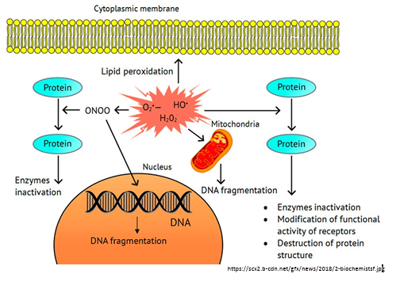

*schema dei danni cellulari provocati da un eccesso di ROS (O2•⁻, HO•, H2O2): perossidazione lipidica della membrana cellulare, inattivazione di enzimi tramite ossidazione delle proteine (ONOO), frammentazione del DNA nel nucleo, danno mitocondriale e ulteriore frammentazione del DNA — con conseguenze quali inattivazione enzimatica, modifica dell'attività funzionale dei recettori e distruzione della struttura proteica*

In quantità elevate, i ROS possono creare danni severi alla cellula, in particolare: frammentazione del DNA (nei casi più gravi), compromissione della funzionalità dei mitocondri fino alla loro distruzione, ed effetti dannosi sulle proteine, che vengono decomposte oppure mal ripiegate (diventando così citotossiche) e destinate alla degradazione da parte del complesso ubiquitina-proteasoma.

Le cellule eucariotiche hanno sviluppato diverse risposte adattative per contrastare gli effetti deleteri della carenza di ossigeno (**ipossia**) e mantenere l'omeostasi. L'ipossia intracellulare è causata spesso da:

- **consumo eccessivo di O₂** (ad esempio, esercizio fisico);
- **carenza di disponibilità di O₂** (ad esempio, altitudine, con conseguente calo della pressione parziale di O₂);
- **inefficienza di utilizzo dell'ossigeno** (in diverse condizioni patologiche);
- una **combinazione** delle situazioni sopra citate (ad esempio, attività fisica in ambiente ipossico, che produce un effetto cumulativo).

### Perché i ROS aumentano durante l'ipossia?

- **Perdita di elettroni dalla catena di trasporto (*ETC electron leakage*)**: il basso livello di O₂ compromette l'attività del Complesso IV; di conseguenza gli elettroni si accumulano nei Complessi I e III, "fuoriescono" verso l'O₂ e aumentano la formazione di superossido (O₂•⁻).
- **Disfunzione mitocondriale**: l'ipossia causa un parziale **disaccoppiamento** tra il ciclo di Krebs e il trasporto di elettroni, con conseguente aumento dei ROS dovuto a un flusso di elettroni inefficiente — ad esempio, quando si accumulano troppo piruvato e Acetil-CoA, la catena di trasporto degli elettroni non riesce a smaltire il sovraccarico.
- **Fonti non mitocondriali**: l'ipossia up-regola diversi enzimi che producono ROS, tra cui la NADPH ossidasi (NOX), la xantina ossidasi, e la NOS "disaccoppiata" (che genera O₂•⁻ invece dell'ossido nitrico NO, molecola importante per la vasodilatazione).

Nelle cellule ben ossigenate, i mitocondri rappresentano circa il **90%** del consumo cellulare totale di O₂. Il comportamento dei ROS cambia però in modo netto a seconda della severità dell'ipossia:

- in condizioni di **ipossia moderata** (1-1,5% di O₂): si osserva un aumento **transitorio** dei ROS cellulari (prevalentemente H₂O₂) — livelli comunque fisiologici, che svolgono un ruolo centrale nella segnalazione cellulare e nell'omeostasi;
- in condizioni di **ipossia grave** (<0,2% di O₂): si osserva invece una **diminuzione** dei livelli di ROS, poiché le risposte cellulari sono sempre più orientate a ridurre il dispendio energetico, limitare la crescita e preservare la vitalità cellulare — se i ROS aumentassero ulteriormente, si arriverebbe alla morte cellulare.

In condizioni di ipossia, gli intermedi del ciclo glicolitico e del ciclo dell'acido tricarbossilico (TCA) possono essere deviati dai loro percorsi canonici per favorire l'**anabolismo**: la cellula mette in atto tutti quei processi che limitano il consumo di energia e la crescita, per preservare la propria vitalità.

*Quali sono, nel dettaglio, questi cambiamenti adattativi? Le prossime sezioni del capitolo li affrontano uno per uno.*

---

## Riprogrammazione metabolica autonoma delle cellule in condizioni di ipossia

L'ossigeno è l'accettore finale degli elettroni che permette la sintesi di ATP attraverso la respirazione mitocondriale nelle cellule eucariotiche.

L'ipossia (basso livello di O₂) si è affermata come vero e proprio **principio organizzativo** dell'evoluzione cellulare, del metabolismo e della biologia, dando origine a una straordinaria gamma di adattamenti metabolici. Questi adattamenti si esprimono attraverso quattro livelli di risposta, volti a ridurre al minimo la produzione di ROS e il consumo di ATP, sostenendo così l'omeostasi e la sopravvivenza cellulare:

| Livello di risposta | Cosa significa |
| :--- | :--- |
| **Trascrizionale** | Attivazione di **fattori di trascrizione** che accendono o spengono interi programmi genici (il protagonista principale è HIF-1α, approfondito nella prossima sezione). |
| **Traduzionale** | Regolazione di quali mRNA vengono effettivamente tradotti in proteine, e con quale efficienza. |
| **Post-traduzionale** | Modifiche chimiche applicate a una proteina già prodotta (ad esempio fosforilazione o defosforilazione), che ne attivano o disattivano la funzione. |
| **Epigenetica** | Modifiche che non alterano la sequenza del DNA, ma la sua "accessibilità" — ad esempio l'aggiunta di gruppi metile (metilazione) o acetile (acetilazione) al DNA o agli istoni (le proteine attorno a cui il filamento di DNA si avvolge). |

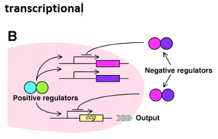

*schema semplificato della regolazione trascrizionale: regolatori positivi (a sinistra) attivano la trascrizione di più geni target, mentre regolatori negativi (a destra) la inibiscono, producendo un output finale*

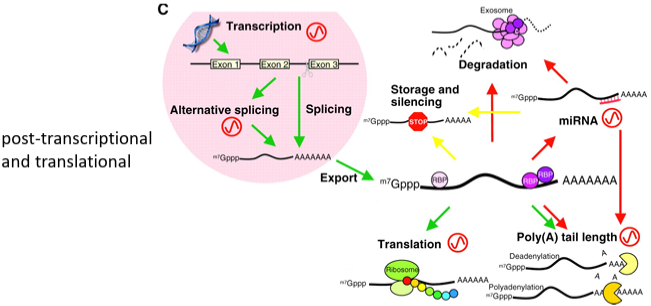

*schema della regolazione post-trascrizionale e traduzionale: dal gene trascritto (con i suoi esoni) l'mRNA può andare incontro a splicing alternativo, essere esportato dal nucleo, tradotto (translation) dal ribosoma, oppure regolato nella lunghezza della coda poli(A) (deadenilazione/poliadenilazione), immagazzinato e silenziato, degradato, o regolato da miRNA*

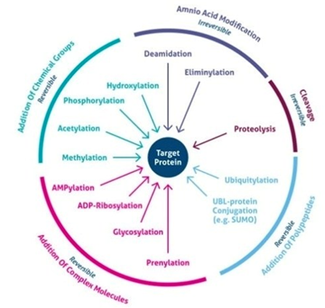

*schema circolare delle modificazioni post-traduzionali che possono interessare una proteina bersaglio (target protein): aggiunta di gruppi chimici reversibili (fosforilazione, acetilazione, metilazione, AMP-ilazione, ADP-ribosilazione, glicosilazione, prenilazione), modificazione di amminoacidi irreversibile (deammidazione, eliminilazione), aggiunta di polipeptidi reversibile (ubiquitilazione, coniugazione con proteine UBL come SUMO), e clivaggio irreversibile (proteolisi)*

### Epigenetica e ipossia

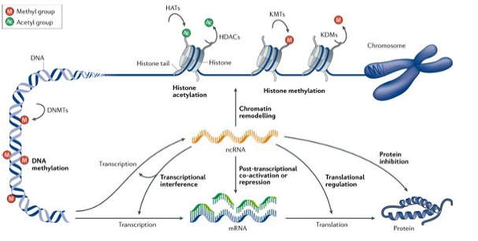
*schema dei meccanismi epigenetici: la metilazione del DNA (a opera delle DNMT) e l'acetilazione/metilazione degli istoni (a opera di HAT/HDAC e KMT/KDM) modulano il rimodellamento della cromatina; gli RNA non codificanti (ncRNA) intervengono a livello di interferenza trascrizionale, co-attivazione/repressione post-trascrizionale e regolazione traduzionale, influenzando la trascrizione dell'mRNA, la sua traduzione in proteina, o inibendo direttamente la proteina prodotta*

Per **epigenetica** si intendono quei fenomeni che non portano a cambiamenti nelle basi azotate del DNA, ma che agiscono aggiungendo gruppi metile o acetile al DNA stesso o agli istoni. Quando avviene la metilazione del DNA, questi gruppi metile si localizzano preferenzialmente in zone regolatorie — ad esempio i promotori, cioè i siti di legame per i fattori di trascrizione. Le regioni CpG dei promotori sono un bersaglio tipico di questa metilazione: il risultato è una sorta di "travestimento" del DNA, che impedisce ai fattori di trascrizione di riconoscerlo e legarsi correttamente, bloccando così la trascrizione del gene interessato.

**L'ipossia può alterare la metilazione del DNA e degli istoni**, inibendo le demetilasi ossigeno-dipendenti (enzimi che, come vedremo tra poco per le PHD, hanno bisogno di O₂ per funzionare) e modificando così l'accessibilità della cromatina e l'espressione genica.

---

## HIF-1α: il regolatore trascrizionale principale

**HIF-1α** (*Hypoxia Inducible Factor 1 alpha*) è il principale fattore di trascrizione attivato dall'ipossia.

### La scoperta di HIF-1α

Alla fine del XIX secolo, Paul Bert dimostrò che un elemento importante della risposta all'ipossia è l'aumento della produzione di globuli rossi. Questo aumento è mediato dall'ormone **eritropoietina (EPO)** e, di conseguenza, aumenta la quantità di emoglobina disponibile per trasportare l'ossigeno ai tessuti.

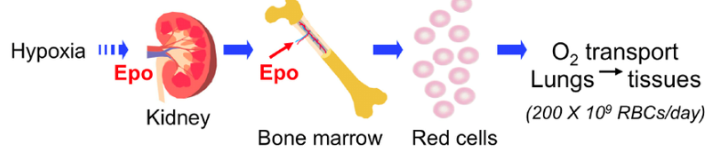

*schema del percorso dell'eritropoietina: l'ipossia stimola il rilascio di EPO da parte del rene, che raggiunge il midollo osseo (bone marrow) e stimola la produzione di globuli rossi (red cells), aumentando così il trasporto di ossigeno dai polmoni ai tessuti (circa 200×10⁹ globuli rossi al giorno)*

Fu scoperto che l'aumento della produzione di EPO indotto dall'ipossia dipende da una maggiore trascrizione del gene dell'EPO. I primi studi si concentrarono quindi sull'identificazione delle sequenze di DNA che potrebbero controllare l'espressione dell'EPO.

Negli anni '90, **Gregg Semenza** identificò, purificò e clonò un fattore di trascrizione che si lega a una sequenza regolatrice del gene dell'EPO sensibile all'ipossia, chiamandolo per l'appunto "**fattore inducibile dall'ipossia**" (HIF). Gli HIF regolano l'espressione di centinaia di geni coinvolti nell'adattamento cellulare e sistemico all'ipossia; le conseguenze dell'espressione di questi geni bersaglio portano a numerosi cambiamenti a livello biochimico, come il passaggio della respirazione cellulare da una modalità aerobica a una anaerobica.

### Come viene rilevato l'ossigeno dai tessuti?

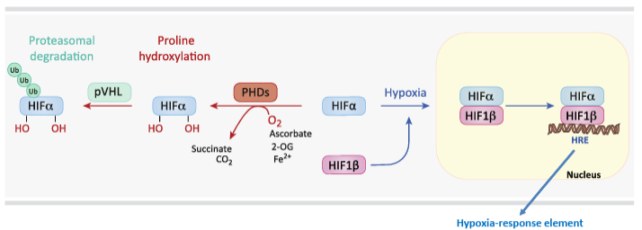

*schema del meccanismo di regolazione ossigeno-dipendente di HIFα: in presenza di O2, ascorbato, 2-ossoglutarato (2-OG) e Fe2+, le PHD idrossilano HIFα (producendo succinato e CO2); HIFα idrossilato viene riconosciuto da pVHL, poliubiquitinato e degradato dal proteasoma; in condizioni di ipossia, HIFα non idrossilato si dimerizza con HIF1β nel nucleo e si lega agli elementi responsivi all'ipossia (HRE) sul DNA*

Il meccanismo alla base è il seguente:

- l'**HIF-1α** viene sintetizzato in modo continuo, ma degradato rapidamente in condizioni di **normossia**;
- alcuni enzimi specifici, chiamati **PHD** (prolilidrossilasi), idrossilano l'HIF-1α — ma solo in presenza di ossigeno: senza O₂, le PHD non possono svolgere il loro lavoro;
- la proteina **pVHL** riconosce l'HIF-1α idrossilato, favorendone l'ubiquitinazione e la successiva degradazione da parte del proteasoma.

In **assenza** di ossigeno, l'HIF-1α non viene degradato: entra nel nucleo della cellula e forma un dimero con **HIF-1β** (già presente nel nucleo). Questo dimero è in grado di riconoscere gli elementi regolatori **HRE** (*Hypoxia Response Element*) sul DNA, avviando la trascrizione del gene bersaglio.

Per orientarsi tra i diversi protagonisti molecolari di questo meccanismo, ecco una mappa dei ruoli:

| Chi | Cosa fa |
| :--- | :--- |
| **PHD** (prolilidrossilasi) | Il "sensore" vero e proprio: usa l'O₂ come substrato per idrossilare HIF-α. Senza ossigeno, non può funzionare. |
| **pVHL** | Il "riconoscitore": si lega solo a HIF-α idrossilato e lo marca per la distruzione (ubiquitinazione → degradazione proteasomica). |
| **HIF-1α / HIF-1β** | Le due subunità che, una volta unite (dimero), possono entrare nel nucleo e agire da fattore di trascrizione. HIF-1α è la subunità "labile", degradata quando c'è ossigeno; HIF-1β è sempre presente. |
| **HRE** | La sequenza di DNA che il dimero HIF-1α/HIF-1β riconosce e a cui si lega per avviare la trascrizione dei geni bersaglio. |

### Prolyl hydroxylase (PHD)

L'enzima responsabile dell'idrossilazione di HIF-α è stato identificato come una **prolilidrossilasi (PHD)**. Questo enzima appartiene alla famiglia delle **diossigenasi**, che necessitano assolutamente di **ossigeno molecolare** come substrato. Le PHD fungono quindi da veri e propri sensori cellulari dell'ossigeno, poiché la loro attività enzimatica dipende direttamente dalla disponibilità di O₂.

### HIF in normossia: due livelli di controllo

Gli HIF sono eterodimeri composti da una subunità labile all'O₂ (HIF-1α, -2α o -3α) e da una subunità **HIF-1β** costitutiva (cioè sempre presente). Nelle cellule ben ossigenate (>5% di O₂), l'HIFα subisce un'idrossilazione enzimatica a livello dei residui di prolina da parte delle prolil-4-idrossilasi (PHD), che utilizzano l'O₂ come substrato e il 2-ossoglutarato, il Fe²⁺ e l'ascorbato come co-substrati. L'idrossilazione O₂-dipendente consente il riconoscimento di HIFα da parte del soppressore tumorale **pVHL** (von Hippel-Lindau), che recluta le E3-ubiquitina ligasi e indirizza HIFα verso la degradazione proteasomica.

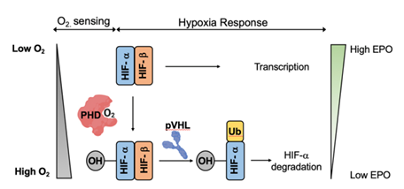

*schema riassuntivo: a bassi livelli di O2, HIFα (non idrossilato) si dimerizza con HIF-β, portando a trascrizione genica e alti livelli di EPO; ad alti livelli di O2, le PHD idrossilano HIFα, che viene riconosciuto da pVHL e marcato con ubiquitina (Ub) per la degradazione, portando a bassi livelli di EPO*

Esiste però un **secondo livello di controllo**, indipendente dalla degradazione: in condizioni non ipossiche, la transattivazione (cioè la capacità di HIF-1α di attivare effettivamente la trascrizione, una volta legato al DNA) viene contrastata dal **fattore inibitore dell'HIF-1 (FIH-1)**, un'asparaginilidrossilasi che agisce sul dominio di transattivazione C-terminale (CTAD) di HIF-α, **bloccando** l'interazione tra HIF-α e i **coattivatori trascrizionali p300/CBP** — proteine necessarie per la piena attivazione dei geni bersaglio di HIF.

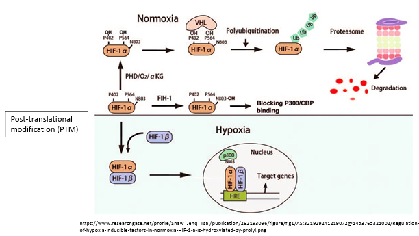

*schema dei due meccanismi di controllo di HIF-1α in normossia: (in alto) la poliubiquitinazione mediata da VHL porta HIF-1α al proteasoma per la degradazione; (in basso) FIH-1 blocca il legame tra HIF-1α idrossilato e i coattivatori p300/CBP, impedendo l'attivazione dei geni bersaglio anche quando una quota di HIF-1α sfugge alla degradazione; in ipossia, HIF-1α si dimerizza con HIF-1β ed entra nel nucleo, legando l'HRE e attivando la trascrizione dei geni bersaglio*

In sintesi, in normossia esistono quindi **due meccanismi di controllo** indipendenti che tengono a freno HIF-1α:

1. la **degradazione** vera e propria, mediata da PHD e pVHL (illustrata sopra);
2. il **blocco della transattivazione**, mediato da FIH-1, che impedisce a HIF-1α di reclutare i coattivatori p300/CBP necessari per accendere effettivamente i geni bersaglio, anche nel caso in cui una quota di proteina sfugga alla degradazione.

### HIF in ipossia: stabilizzazione e trascrizione

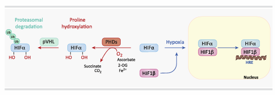

*lo stesso schema del meccanismo di regolazione ossigeno-dipendente di HIFα visto sopra, qui a supporto specifico della condizione di ipossia*

L'idrossilazione della prolina di HIF-α, mediata dalle PHD, viene **inibita** in condizioni di ipossia (<1% di O₂), determinando:

- la **stabilizzazione** di HIF-α (che non viene più degradato);
- la sua **dimerizzazione** con HIF-1β;
- il **legame** con gli elementi HRE (che presentano la sequenza consenso del DNA [A/G]CGTG);
- l'avvio della **trascrizione** dei geni bersaglio.

---

## HIF-dependent gene transcription: la riprogrammazione metabolica

L'attivazione di HIF-α in condizioni di ipossia determina una complessa riorganizzazione del metabolismo cellulare, che si articola in 7 punti principali:

1. aumento dell'assorbimento del glucosio;
2. glicolisi;
3. glicogenosintesi;
4. inibizione dell'ingresso dell'acetil-CoA nel ciclo di Krebs (tramite la fosforilazione della piruvato deidrogenasi, PDH);
5. diminuzione della capacità respiratoria, attraverso una maggiore autofagia mitocondriale;
6. passaggio a isoforme del citocromo della catena di trasporto degli elettroni (ETC) a bassa attività, per limitare la generazione di ROS;
7. aumento della sintesi lipidica, attraverso il metabolismo riduttivo della glutammina.

Vediamoli nel dettaglio, uno per uno.

### 1. Aumento dell'assorbimento del glucosio

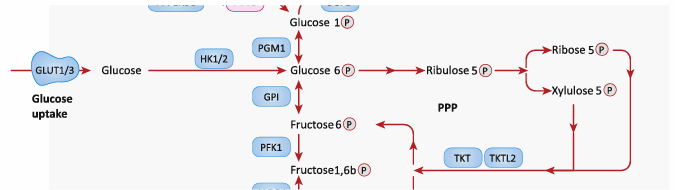

*porzione dello schema del metabolismo cellulare che evidenzia i trasportatori GLUT1/3 all'ingresso della via glicolitica, con il glucosio che entra nella cellula e viene fosforilato da HK1/2 a glucosio 6-fosfato, da cui si dirama sia la via glicolitica (verso fruttosio 6-fosfato) sia la via del pentoso fosfato (PPP, verso ribulosio 5-fosfato)*

L'HIF-α induce l'espressione dei trasportatori del glucosio **GLUT1** e **GLUT3**, aumentando l'assorbimento cellulare del glucosio.

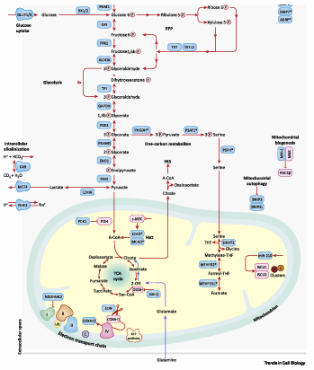

*schema completo della riprogrammazione metabolica dipendente da HIF: dal trasporto del glucosio (GLUT1/3) attraverso glicolisi e via del pentoso fosfato (PPP), fino al metabolismo a un carbonio (one-carbon metabolism), il ciclo di Krebs, la catena di trasporto degli elettroni e i processi di biogenesi/autofagia mitocondriale, con l'alcalinizzazione intracellulare e l'efflusso di lattato*

Il glucosio che entra nella cellula grazie a questi trasportatori alimenta i processi che aumentano la glicolisi e, di conseguenza, la produzione di ATP.

### 2. Glicolisi e acidificazione extracellulare

L'aumento della glicolisi comporta un incremento della produzione di piruvato e NADH. Per mantenere il flusso glicolitico, l'HIF-1α induce l'espressione della **lattato deidrogenasi A (LDH-A)**, che rigenera il **NAD⁺** convertendo piruvato + NADH in lattato + NAD⁺ — un passaggio fondamentale per sostenere la catena di trasporto degli elettroni. In sintesi: l'induzione dell'espressione della lattato deidrogenasi porta quindi a un aumento della glicolisi.

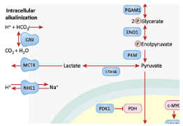

*schema dell'alcalinizzazione intracellulare: H+ e HCO3⁻ vengono convertiti (tramite l'anidrasi carbonica CAG) in CO2 e H2O; il lattato viene esportato tramite MCT4, mentre lo scambiatore NHE1 espelle H+ importando Na+; a destra, la via glicolitica fino a piruvato, con il blocco PDK1-PDH evidenziato*

Le cellule ipossiche aumentano il flusso glicolitico, determinando una maggiore produzione di lattato e un aumento del carico acido cellulare. Sebbene il lattato di per sé non sia acido (come già visto nel capitolo sull'esercizio e il cervello), il mantenimento del pH intracellulare richiede comunque un'esportazione coordinata di lattato e H⁺. Per mantenere l'omeostasi del pH, l'HIF-1α induce l'espressione di trasportatori che coordinano l'efflusso di lattato e H⁺, tra cui:

- il **trasportatore di monocarbossilati 4 (MCT-4)**;
- l'**anidrasi carbonica 9 (CA9)**;
- lo **scambiatore Na⁺/H⁺ (NHE1)**: un antiportatore di membrana che regola il pH intracellulare trasportando ioni sodio (Na⁺) all'interno della cellula, mentre espelle protoni (H⁺) nello spazio extracellulare.

Questi processi garantiscono l'efflusso di ioni H⁺ all'esterno della cellula — ioni che derivano dalla produzione di energia da parte della cellula stessa.

### 3. Glicogenosintesi

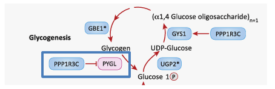

*schema della glicogenosintesi: dal glucosio 1-fosfato, tramite UGP2, si forma UDP-glucosio, da cui GYS1 forma glicogeno, ulteriormente ramificato da GBE1; PPP1R3C attiva GYS1 e, legandosi a PYGL (glicogenofosforilasi), ne inibisce l'attività, riducendo la degradazione del glicogeno*

Per **glicogenosintesi** si intende la formazione di **glicogeno**, un polisaccaride complesso formato da migliaia di molecole di glucosio legate tra loro, che serve a conservare il glucosio.

L'HIF-1α favorisce la sintesi del glicogeno inducendo l'espressione di:

- **glicogeno sintasi 1 (GYS1)**;
- **UDP-glucosio pirofosforilasi 2 (UGP2)**;
- **enzima di ramificazione del glicogeno 1 (GBE1)**.

L'espressione HIFα-dipendente della subunità regolatrice 3C della proteina fosfatasi 1 (**PPP1R3C**) attiva GYS1 e riduce la degradazione del glicogeno inibendo la glicogeno fosforilasi (**PYGL**) — un controllo che agisce a livello post-traduzionale. Il risultato netto di questi meccanismi è quindi la promozione dell'**accumulo di glicogeno**.

### 4. Inibizione dell'ingresso dell'acetil-CoA nel ciclo di Krebs

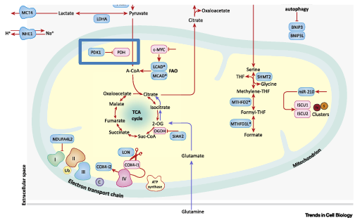

*porzione dello schema metabolico centrata sul mitocondrio, con il blocco PDK1-PDH evidenziato (riquadro blu): il piruvato, invece di essere convertito in Acetil-CoA per alimentare il ciclo di Krebs (TCA cycle), viene mantenuto come piruvato dall'inibizione della PDH*

L'HIF-1α induce la **piruvato deidrogenasi chinasi 1 (PDK1)**, che fosforila e inibisce la **piruvato deidrogenasi (PDH)**, riducendo la conversione del piruvato in acetil-CoA. In questo modo non viene prodotta acetil-CoA a partire dal piruvato, il ciclo di Krebs viene inibito e, di conseguenza, anche la fosforilazione ossidativa.

### 5. Decremento della capacità respiratoria

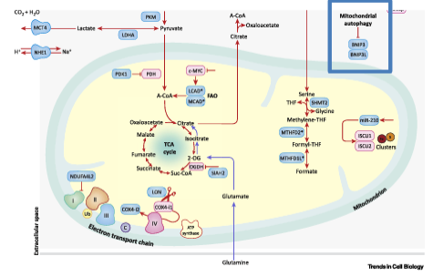

*porzione dello schema metabolico con il riquadro "Mitochondrial autophagy" evidenziato (BNIP3, BNIP3L), che innesca la degradazione selettiva dei mitocondri*

Questo punto corrisponde a un potenziamento dell'**autofagia mitocondriale**: l'HIF-1α induce l'espressione di **BNIP3** e **BNIP3L**, favorendo l'autofagia mitocondriale (*mitofagia*). L'obiettivo è ridurre il numero di mitocondri, eliminando in particolare quelli che presentano difetti — i più inclini a produrre ROS in eccesso.

### 6. Rimodellamento della catena di trasporto degli elettroni

Un'ipossia moderata aumenta i ROS mitocondriali e stabilizza l'HIF-α, creando così un vero e proprio **circolo di regolazione**: la produzione di ROS viene modulata per massimizzare la respirazione cellulare pur mantenendo l'omeostasi redox.

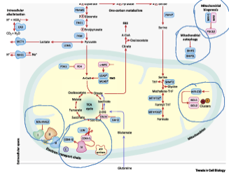

*porzione dello schema metabolico con i punti chiave del rimodellamento mitocondriale evidenziati: la catena di trasporto degli elettroni (electron transport chain) e il complesso miR-210/ISCU1-2*

L'HIF-1α induce l'espressione di **COX4-i2** e della proteasi mitocondriale **LON**, che degrada COX4-i1, favorendo il passaggio da COX4-i1 a COX4-i2 (una subunità della citocromo c ossidasi a più bassa attività). Il fattore **NDUFA4L2** inibisce inoltre l'attività del Complesso I, riducendo il consumo di ossigeno mitocondriale e la produzione di ROS.

In sintesi, l'ipossia moderata aumenta la produzione di ROS, che a sua volta aumenta la stabilizzazione di HIF-1α; HIF-1α, per contenere il danno, inibisce la produzione di ROS agendo direttamente sulla catena di trasporto degli elettroni — promuovendo la sostituzione della subunità COX4-i1 (ad alta attività) con COX4-i2 (a minore attività), il che abbassa l'attività del Complesso IV e, di conseguenza, l'attività mitocondriale complessiva e la produzione di ROS.

**Ipossia e mitocondrio: cinque meccanismi coordinati**

1. Favorire il passaggio dall'isoforma COX4-i1 a quella COX4-i2, aumentando al contempo l'espressione di LON, ottimizzando così la funzione della citocromo c ossidasi in condizioni di ipossia e limitando la generazione di ROS.
2. Indurre **Bnip3** (che favorisce l'autofagia mitocondriale, vista al punto 5) e **Mxi1** (un regolatore negativo della biogenesi mitocondriale).
3. Reprimere la biogenesi e il metabolismo mitocondriale dipendenti da PGC-1 (già incontrato nei capitoli precedenti come regolatore chiave della biogenesi mitocondriale indotta dall'esercizio).
4. Aumentare l'espressione del gene **NDUFA4L2** (subunità 4-simile del sottocomplesso 1a della NADH deidrogenasi/ubichinone 2), che sopprime l'attività del Complesso I mitocondriale.
5. Aumentare **miR-210**, che reprime l'espressione delle proteine di assemblaggio del cluster Fe-S ISCU-1 e ISCU-2, compromettendo così il metabolismo mitocondriale dipendente dal cluster ferro-zolfo (un controllo post-trascrizionale).

### 7. Incremento della sintesi lipidica

In condizioni di ipossia, la ridotta ossidazione del piruvato limita la produzione di citrato derivante dal glucosio. Per sostenere comunque la sintesi dei lipidi, il **2-ossoglutarato** derivante dalla glutammina viene carbossilato in modo riduttivo in isocitrato e citrato, che possono a loro volta generare **acetil-CoA citosolico** per la sintesi degli acidi grassi. Questo adattamento metabolico dipendente da HIF è noto come **carbossilazione riduttiva**, e inverte parzialmente il flusso del ciclo di Krebs.

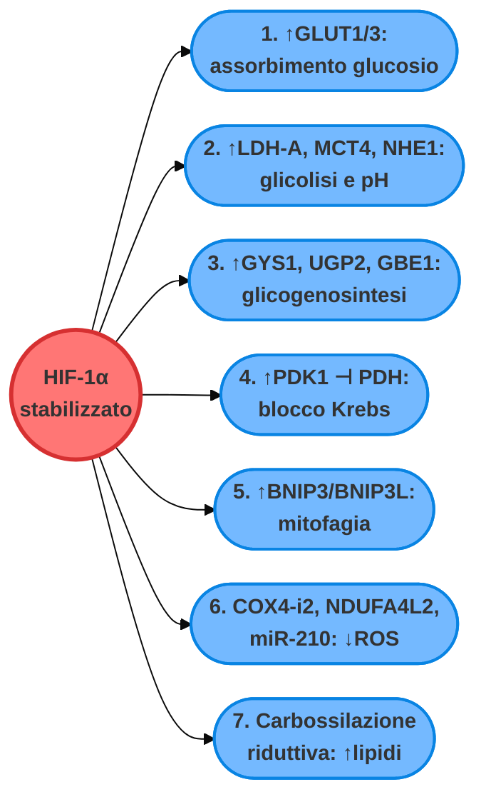

---

## Il ripiegamento ossidativo delle proteine: un secondo meccanismo ossigeno-dipendente

Il **ripiegamento delle proteine** è un requisito fondamentale per l'omeostasi cellulare. Negli eucarioti, le proteine nascenti vengono traslocate come polipeptidi non ripiegati nel lume del reticolo endoplasmatico (ER), dove subiscono modificazioni co- e post-traduzionali per acquisire il loro stato funzionale e ripiegato. I **legami disolfuro** sono un fattore determinante della stabilità proteica, e derivano dall'ossidazione dei gruppi tiolici (-SH) tra i residui di cisteina delle proteine in fase di ripiegamento.

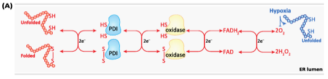

*schema del ripiegamento ossidativo nel lume del reticolo endoplasmatico (ER lumen): partendo da una proteina non ripiegata (unfolded) o già ripiegata (folded), coppie di elettroni vengono trasferite in sequenza da PDI a un ossidasi, fino a FADH2 e infine a O2, che in condizioni di ipossia (a destra) diventa un fattore limitante per il completamento del processo*

L'ossigeno è quindi importante per due motivi principali:

1. **importanza metabolica**: come già visto, per la produzione di energia;
2. **importanza per il ripiegamento (*folding*) delle proteine**: se le proteine non vengono ripiegate correttamente, non possono svolgere la propria funzione; si accumulano e diventano citotossiche, potendo innescare processi apoptotici.

Il ripiegamento ossidativo delle proteine richiede l'**O₂** come accettore terminale di elettroni per poter funzionare. L'**ipossia** induce **ERO1α**, un bersaglio di HIF-1α, e può anche aumentare l'espressione delle ossidoreduttasi della famiglia PDIA (come PDIA1) in contesti di stress ipossico. La formazione di ponti disolfuro dipendente da ERO1α genera **H₂O₂**. Le perossidasi residenti nel reticolo endoplasmatico possono consumare questo H₂O₂, spesso accoppiando la detossificazione del perossido a ulteriori reazioni di ripiegamento ossidativo — limitando così l'accumulo di perossido e lo stress ossidativo.

L'accumulo di proteine mal ripiegate nel reticolo endoplasmatico indotto dall'ipossia attiva due **meccanismi adattativi**, che ripristinano la proteostasi (l'equilibrio nella produzione, nel ripiegamento e nella degradazione delle proteine):

1. l'attivazione della **risposta alle proteine mal ripiegate (UPR, *unfolded protein response*)**;
2. la **riduzione della sintesi proteica globale**, attraverso l'inibizione della segnalazione **mTORC1**.

La mancata risoluzione dello stress del reticolo endoplasmatico, in caso di ipossia prolungata, può portare alla morte cellulare per **apoptosi**.

### La risposta alle proteine non ripiegate (UPR)

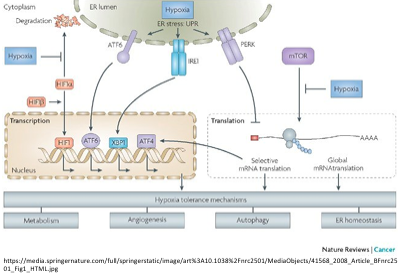

*schema generale della risposta cellulare all'ipossia: lo stress del reticolo endoplasmatico (ER stress/UPR) coinvolge tre sensori (ATF6, IRE1, PERK), mentre l'ipossia inibisce direttamente sia HIF1β (in alto a sinistra) sia mTOR (in alto a destra); il risultato converge su meccanismi di tolleranza all'ipossia: metabolismo, angiogenesi, autofagia, omeostasi del reticolo endoplasmatico*

L'UPR è una risposta conservata dal punto di vista evolutivo, che contrasta l'accumulo di proteine denaturate dovuto allo stress del reticolo endoplasmatico, sia negli organismi unicellulari sia in quelli multicellulari.

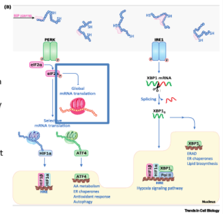

*schema dettagliato dell'UPR: PERK, fosforilato, fosforila a sua volta eIF2α, riducendo la traduzione globale dell'mRNA ma permettendo la traduzione selettiva di HIF1α e ATF4 (che attivano rispettivamente risposta ipossica/HRE, e metabolismo degli amminoacidi, chaperone dell'ER, risposta antiossidante e autofagia); IRE1, dall'altro lato, media lo splicing dell'mRNA di XBP1, generando XBP1s, che attiva ERAD, i chaperone dell'ER e la biosintesi lipidica*

Tre vie di segnalazione parallele costituiscono l'UPR:

| Via | Sigla/gene | Cosa fa |
| :--- | :--- | :--- |
| **Chinasi del reticolo endoplasmatico simile alla PKR** | **PERK** (gene *Eif2ak3*) | Fosforila eIF2α, riducendo la traduzione globale ma permettendo la traduzione selettiva di alcuni mRNA specifici (HIF-1α, ATF4). |
| **Enzima 1 che richiede inositolo** | **IRE1** (gene *Ern1*) | Media lo splicing dell'mRNA di XBP1, attivando la degradazione delle proteine mal ripiegate (ERAD) e l'espressione di chaperone. |
| **Fattore di trascrizione attivante 6** | **ATF6** | Terzo sensore dello stress del reticolo endoplasmatico. |

La **fosforilazione PERK-dipendente** del fattore di inizio della traduzione 2α (**eIF-2α**) riduce la traduzione dell'mRNA cap-dipendente in condizioni di grave ipossia (<0,1% di O₂), determinando un'inibizione del 20-70% della sintesi proteica globale.

L'**ERAD** (degradazione associata al reticolo endoplasmatico) è un sistema cellulare che rimuove le proteine mal ripiegate dal reticolo endoplasmatico e le invia nel citosol, affinché vengano distrutte dal proteasoma — aiutando le cellule a far fronte allo stress e a mantenere il corretto funzionamento del meccanismo di ripiegamento delle proteine.

L'**eIF-2α fosforilata** consente, allo stesso tempo, la traduzione **selettiva** degli mRNA di **HIF-1α** e **ATF4**. L'ATF4 è un mediatore delle risposte di rilevamento dei nutrienti, essenziale per mantenere la vitalità cellulare in condizioni di ipossia.

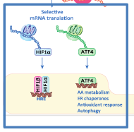

*dettaglio della traduzione selettiva mRNA-specifica: nonostante il blocco della traduzione globale, gli mRNA di HIF1α e ATF4 continuano a essere tradotti, attivando rispettivamente la risposta ipossica (via HRE) e il metabolismo amminoacidico, i chaperone dell'ER, la risposta antiossidante e l'autofagia*

L'esposizione a una **grave ipossia** (<0,02% di O₂) potenzia sia lo splicing sia la traduzione di **Xbp1**, indipendentemente da HIFα, determinando l'attivazione della via ERAD e l'up-regolazione delle chaperone associate al reticolo endoplasmatico, quali **GRP78** (nota anche come **BiP**) ed **HSP90**.

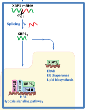

*dettaglio dello splicing di XBP1: IRE1 media lo splicing dell'mRNA di XBP1 in XBP1s, che attiva la trascrizione di geni per ERAD, chaperone dell'ER e biosintesi lipidica, attraverso la via di segnalazione ipossica*

### Inibizione del bersaglio meccanicistico della rapamicina (mTOR)

Il complesso chinasi **mTOR** è un sensore nutrizionale multimodale, che funge da segnale di "via libera/blocco" per la crescita cellulare in tutti gli eucarioti.

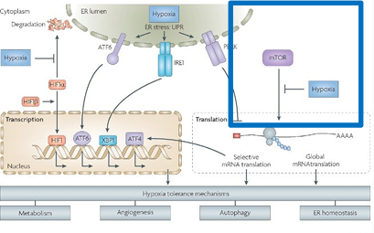

*lo stesso schema generale della risposta cellulare all'ipossia visto sopra, con il riquadro relativo a mTOR e alla sua inibizione da parte dell'ipossia evidenziato*

Il sistema mTOR è organizzato in **due complessi catalitici distinti**, classificati in base alla sensibilità acuta all'antibiotico macrolidico/immunosoppressore rapamicina: un complesso sensibile alla rapamicina (**mTORC1**) e uno insensibile (**mTORC2**).

L'**attivazione di mTOR** promuove la crescita cellulare stimolando la traduzione dell'mRNA cap-dipendente e la biosintesi di nucleotidi e lipidi, mentre **inibisce** al contempo il ricambio proteico, attraverso il blocco dell'autofagia, della biogenesi lisosomiale e della degradazione proteasomiale.

**L'ipossia inibisce l'attività di mTOR**, in modo analogo a quanto accade con l'esaurimento dei nutrienti e dell'ATP — completando così il quadro delle strategie con cui la cellula, in carenza di ossigeno, rallenta ogni processo dispendioso in termini energetici.

---

## Adattamenti molecolari HIF-1α-dipendenti: sintesi visiva

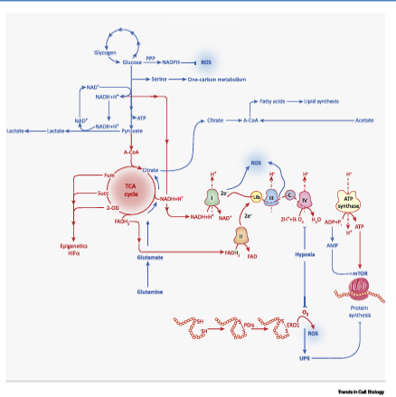

*schema riassuntivo integrato di tutti gli adattamenti metabolici HIF-dipendenti descritti nel capitolo: dalla glicolisi e la via del pentoso fosfato (PPP, con produzione di NADPH e ROS), al ciclo di Krebs (alimentato anche da glutammina/glutammato), fino alla catena di trasporto degli elettroni e alla produzione di ATP tramite ATP sintasi (modulata da AMPK/mTOR); a destra, il ripiegamento ossidativo delle proteine nel reticolo endoplasmatico (con produzione di ROS e attivazione dell'UPR) chiude il quadro complessivo della risposta cellulare all'ipossia*

---

## Riassunto finale

- L'**O₂** è essenziale per la vita.
- Livelli bassi di O₂ nel corpo, o in specifici tessuti, portano all'attivazione di una risposta adattativa che coinvolge modifiche a livello di trascrizione, traduzione e post-traduzione genica.
- **HIF-1α** è il fattore di trascrizione che attiva gli adattamenti trascrizionali all'ipossia.
- Si osservano alterazioni in numerose vie metaboliche delle cellule, che vanno dall'aumento della glicolisi all'arresto dell'attività mitocondriale e alla modulazione della produzione di ROS.
- Il ripiegamento delle proteine richiede O₂. L'aumento delle proteine non ripiegate porta all'attivazione della risposta alle proteine non ripiegate (UPR) e all'inibizione di mTOR.
- L'ossigeno è essenziale per la vita aerobica, ma la sua disponibilità è spesso limitata: le cellule eucariotiche hanno sviluppato meccanismi adattativi conservati e altamente coordinati per far fronte all'ipossia.
- L'**HIF-1α** è il principale regolatore della risposta ipossica: quando i livelli di ossigeno diminuiscono, sfugge alla degradazione e guida un ampio programma trascrizionale volto a mantenere l'omeostasi cellulare.
- Gli adattamenti cellulari all'ipossia includono:
    - **riprogrammazione metabolica**: aumento dell'assorbimento di glucosio e della glicolisi, inibizione della fosforilazione ossidativa, efflusso di lattato e protoni;
    - **adattamenti mitocondriali**: soppressione della biogenesi mitocondriale, commutazione delle isoforme per ridurre la produzione di ROS, e aumento della mitofagia;
    - **attivazione della risposta alle proteine mal ripiegate (UPR)** e inibizione della segnalazione mTOR, riducendo la sintesi proteica e il dispendio energetico in condizioni di stress.
- L'ipossia emerge quindi come un vero e proprio principio organizzativo che non solo rimodella il metabolismo, ma influenza anche le decisioni sul destino delle cellule — con implicazioni critiche nella fisiologia e nelle malattie (ad esempio ischemia, cancro, infiammazione cronica).

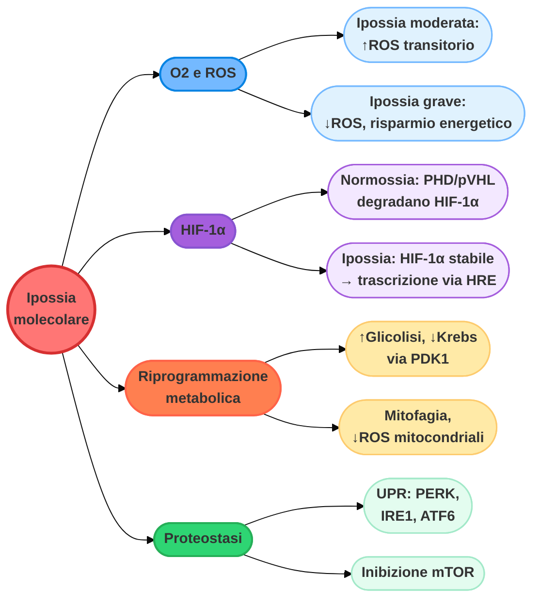