# Ipossia e attività fisica: HIF-1 nel muscolo scheletrico, angiogenesi e rigenerazione

## Introduzione

Durante un esercizio fisico intenso, la pressione parziale di ossigeno (PO₂) nei muscoli scheletrici può diminuire notevolmente; nell'esercizio fisico svolto in condizioni di ipossia può raggiungere valori molto bassi, intorno ai 2-3 mmHg, rispetto ai circa 27-30 mmHg tipici delle condizioni di riposo.

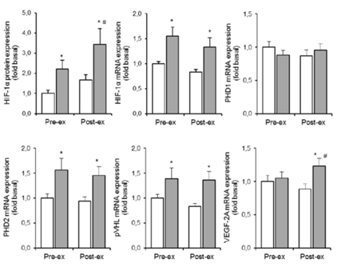

*sei grafici sperimentali che confrontano, prima (pre-ex) e dopo (post-ex) l'esercizio fisico, l'espressione di HIF-1α (proteina e mRNA), PHD1, PHD2, pVHL e VEGF-2A: l'esercizio induce un aumento significativo di HIF-1α, PHD2, pVHL e VEGF-2A*

L'**HIF-1** (già incontrato nel capitolo precedente come principale regolatore trascrizionale della risposta all'ipossia) viene attivato in risposta all'esercizio fisico di resistenza. Nell'uomo, l'HIF-1 viene attivato nel muscolo scheletrico immediatamente dopo — e fino a 6 ore dopo — una singola sessione di esercizio, con un concomitante aumento dell'mRNA dei suoi geni bersaglio *(Ameln et al., 2005)*.

---

## Muscolo scheletrico, HIF-1 ed esercizio fisico

Nel muscolo scheletrico, l'HIF-1 induce l'espressione di geni coinvolti nell'**angiogenesi**, nella **glicolisi** e nel **trasporto dell'ossigeno**. I geni bersaglio dell'HIF-1:

- aumentano il trasporto dell'ossigeno, ad esempio attraverso l'eritropoiesi mediata dall'eritropoietina e l'angiogenesi indotta dal fattore di crescita endoteliale vascolare (**VEGF**);
- e/o migliorano la funzionalità dei tessuti in condizioni di scarsa disponibilità di ossigeno, grazie all'aumento dell'espressione dei trasportatori del glucosio e degli enzimi glicolitici (coerentemente con la riprogrammazione metabolica HIF-dipendente vista nel capitolo precedente).

## VEGF e angiogenesi

Il **fattore di crescita endoteliale vascolare (VEGF)** è una proteina di segnalazione che favorisce la crescita di nuovi vasi sanguigni.

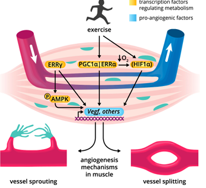

*schema che mostra come l'esercizio fisico, tramite fattori di trascrizione che regolano il metabolismo (ERRγ, PGC1α, ERRα, HIF1α, quest'ultimo stimolato dal calo di O2) e fattori pro-angiogenici (AMPK fosforilata), inducano l'espressione di Vegf e altri geni, attivando i meccanismi di angiogenesi nel muscolo — sia per gemmazione (vessel sprouting) sia per scissione (vessel splitting) dei vasi*

Il ruolo fisiologico dell'HIF-1α nel muscolo scheletrico è correlato all'**ipossia transitoria**, che può verificarsi quando la pressione dell'ossigeno diminuisce in risposta a un esercizio fisico dinamico acuto. Il consumo metabolico di ossigeno da parte delle cellule muscolari durante la contrazione può infatti superare la disponibilità di ossigeno proveniente dai capillari. In risposta a questa ipossia transitoria, l'HIF-1α si stabilizza e induce l'espressione del VEGF.

La sovraespressione sperimentale di HIF-1α o HIF-2α nel muscolo scheletrico induce l'espressione del VEGF e favorisce la formazione di capillari CD31-positivi (un marcatore tipico delle cellule endoteliali).

---

## Ipossia cronica: rimodellamento mitocondriale e controllo dei ROS

Gli alpinisti che hanno partecipato a spedizioni himalayane, come quelle sul Lhotse o sull'Everest, hanno mostrato una riduzione del contenuto mitocondriale nei muscoli scheletrici. Anche le popolazioni che vivono stabilmente ad alta quota, come i tibetani e i quechua, presentano un contenuto mitocondriale ridotto — un dato che suggerisce un vero e proprio adattamento a lungo termine all'ipossia.

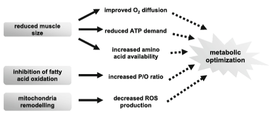

*schema che mostra come la riduzione della dimensione muscolare, l'inibizione dell'ossidazione degli acidi grassi e il rimodellamento mitocondriale contribuiscano insieme a: migliore diffusione dell'O2, ridotta richiesta di ATP, aumentata disponibilità di amminoacidi, aumento del rapporto P/O e diminuzione della produzione di ROS — tutti fattori che convergono verso una "ottimizzazione metabolica" complessiva*

Il proteoma muscolare degli abitanti delle zone di alta quota mostra una maggiore protezione contro i ROS rispetto ai soggetti di controllo che vivono a bassa quota. Nei ratti, il precondizionamento ipossico riduce il danno ossidativo indotto dall'esercizio fisico nei muscoli scheletrici.

### Ipossia e massa muscolare

*Esempio tratto dallo sviluppo del pesce zebra* (un organismo che si sviluppa molto rapidamente, ideale per questo tipo di studi): l'ipossia inibisce la segnalazione dell'IGF, mentre la riossigenazione la ripristina.

I ricercatori hanno posizionato dei pesciolini in tre condizioni diverse: un ambiente ossigenato "naturale", una vasca in condizioni ipossiche, e una condizione in cui alcuni dei pesciolini esposti a ipossia venivano successivamente riossigenati.

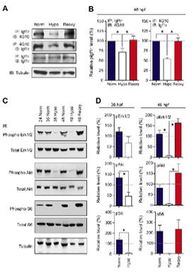

*pannelli sperimentali sul pesce zebra: (A-B) Western blot e quantificazione dell'espressione di Igf1r, che risulta marcata nell'ambiente naturale (Norm), ridotta in ipossia (Hypo) e nuovamente elevata dopo la riossigenazione (Reoxy); (C-D) livelli di fosforilazione (rispetto al totale) di Erk1/2, Akt e S6 a 36 e 48 ore post-fecondazione (hpf), che seguono un andamento analogo*

L'espressione dell'IGF risulta marcata nell'ambiente naturale, labile in quello ipossico, e di nuovo molto marcata nella condizione riossigenata: se ne deduce che l'ambiente ipossico provoca **effetti transitori** e reversibili.

La segnalazione **Akt/mTOR** è un regolatore chiave della massa muscolare, principalmente perché favorisce la sintesi proteica attraverso mTORC1 e limita le vie cataboliche (coerentemente con quanto già visto nel capitolo sull'ipertrofia muscolare). In condizioni di ipossia, la segnalazione IGF-1/Akt/mTOR è **ridotta**, contribuendo a una minore sintesi proteica e, in caso di ipossia prolungata, all'**atrofia muscolare**.

L'esposizione all'ipossia determina inoltre un aumento dell'espressione della **miostatina**, il fattore secreto dai muscoli — già incontrato nel capitolo sull'ipertrofia — che riduce la massa muscolare attraverso l'inibizione della via Akt/mTOR.

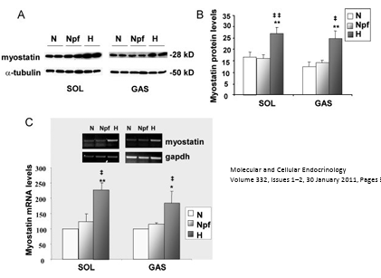

*Western blot e relativi istogrammi che mostrano un aumento significativo dei livelli proteici e dell'mRNA della miostatina nel muscolo soleo (SOL) e gastrocnemio (GAS) di ratti esposti a ipossia (H), rispetto ai controlli normossici (N) e normossici pair-fed (Npf)*

**L'inibizione della segnalazione della miostatina** (tramite somministrazione di anticorpi, inibizione del recettore o ablazione genetica) **previene in parte l'atrofia muscolare** in condizioni di ipossia, dimostrando ulteriormente che la miostatina contribuisce al deperimento muscolare mediato dall'ipossia.

### Regolazione del sistema proteolitico ipossia-correlato

La degradazione delle proteine muscolari è mediata principalmente dal **sistema ubiquitina-proteasoma (UPS)** e dalla via **autofagia-lisosoma**. Durante un'ipossia prolungata, la ridotta sintesi proteica e l'attivazione transitoria della proteolisi contribuiscono all'atrofia muscolare. Questa risposta può ridurre il fabbisogno energetico e liberare amminoacidi utilizzabili come substrati metabolici, ma se si protrae nel tempo porta alla perdita di massa muscolare.

---

## La risposta di HIF-1 all'esercizio acuto è transitoria e dipende dall'allenamento

L'attivazione dell'HIF-1 e dei suoi geni bersaglio in risposta all'esercizio fisico acuto può risultare **attenuata** dopo un periodo di allenamento fisico.

Dopo 4 settimane di allenamento unilaterale degli estensori del ginocchio, l'HIF-1α mostra un aumento transitorio solo nella gamba **non allenata**, in risposta a un esercizio fisico acuto svolto su entrambe le gambe a parità di carico di lavoro assoluto (che corrisponde però a un carico di lavoro *relativo* maggiore per la gamba non allenata) *(Lundby et al., 2006)*.

> In sintesi: allenamento = adattamento all'ipossia → decremento dell'espressione di HIF-1 in risposta allo stesso stimolo.

Analogamente, l'aumento dell'mRNA del **VEGF** osservato in risposta all'esercizio fisico acuto si attenua dopo un periodo di allenamento di *endurance* *(Richardson et al., 2000)*. Dopo l'allenamento di resistenza, la risposta dell'HIF-1 allo stesso carico di lavoro assoluto risulta quindi generalmente attenuata.

### Cosa succede quando l'HIF-1α viene eliminato dal muscolo?

La delezione specifica dell'HIF-1α nel muscolo scheletrico dei topi comporta:

- un aumento dell'attività degli enzimi ossidativi e dei marcatori dell'ossidazione degli acidi grassi;
- una riduzione della concentrazione sierica di lattato;
- un miglioramento delle prestazioni durante l'esercizio di resistenza (nuoto e corsa).

In questo modello genetico, la perdita dell'HIF-1α nel muscolo scheletrico sposta quindi il metabolismo verso le vie **ossidative** e migliora le prestazioni in alcuni test di resistenza.

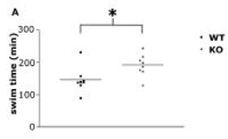

*grafico a dispersione del tempo di nuoto (swim time, minuti) in topi wild-type (WT) e con delezione di HIF-1α nel muscolo scheletrico (KO): i topi KO nuotano significativamente più a lungo*

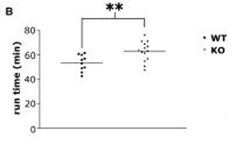

*grafico a dispersione del tempo di corsa (run time, minuti) in topi WT e KO: anche in questo caso i topi KO corrono significativamente più a lungo*

Tuttavia, i topi knockout per l'HIF-1α sono **più vulnerabili al danno muscolare** durante l'esercizio ripetuto o dannoso, come la corsa in discesa (*downhill running*).

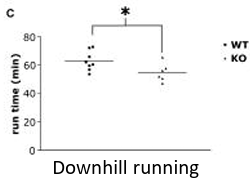

*grafico a dispersione del tempo di corsa in discesa (downhill running) in topi WT e KO: in questo caso i topi KO mostrano prestazioni significativamente inferiori*

Nei topi con delezione genica dell'HIF-1α nel muscolo scheletrico, la corsa in discesa provoca un aumento del danno muscolare e della rigenerazione, con maggiori infiltrazioni infiammatorie e maggiore disorganizzazione tissutale.

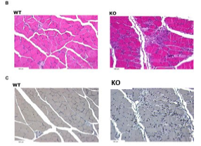

*micrografie istologiche (colorazione H&E in alto, seconda colorazione in basso) di muscolo di topi WT e KO dopo corsa in discesa: nei topi KO si osservano una più marcata disorganizzazione tissutale e infiltrazione cellulare*

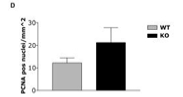

*istogramma del numero di nuclei positivi per PCNA (marcatore di proliferazione cellulare, un indice di rigenerazione in corso) per mm², più elevato nei topi KO rispetto ai WT dopo corsa in discesa*

> In sintesi, l'HIF-1α nel muscolo scheletrico rappresenta un compromesso evolutivo: la sua assenza migliora l'efficienza ossidativa e le prestazioni di resistenza "pulita", ma toglie al muscolo un meccanismo di protezione fondamentale contro il danno da sforzo eccentrico intenso.

## Esercizio fisico e adattamento: attenuazione della segnalazione di HIF-1

- Gli atleti allenati per la resistenza presentano livelli più elevati di **regolatori negativi** dell'HIF, tra cui PHD1, PHD3 e FIH *(Lindholm et al., 2014)*.
- Un programma di allenamento di resistenza della durata di 6 settimane aumenta l'espressione di questi regolatori negativi *(Lindholm et al., 2014)*.
- Dopo l'allenamento, l'esercizio fisico acuto induce una risposta dell'HIF-1α più debole, con un ridotto accumulo nucleare, un minore legame al DNA e una minore espressione del VEGF e dell'eNOS *(Rodríguez-Míguez et al., 2015)*.
- Ciò suggerisce che l'allenamento riduca la necessità di una forte risposta dell'HIF-1 allo stesso stimolo dell'esercizio.
- **Adattamento all'alta quota**: una variante del gene PHD2 nei tibetani potrebbe limitare l'attivazione dell'HIF-1α in condizioni di ipossia moderata *(Lorenzo et al., 2014)* — un ulteriore esempio, questa volta genetico e non allenamento-indotto, dello stesso principio generale: meno HIF-1α si attiva per uno stesso stimolo ipossico, meglio l'organismo tollera quello stimolo nel lungo periodo.

---

## Ipossia acuta vs. cronica

L'ipossia acuta o cronica ha effetti diversi sulla massa muscolare scheletrica.

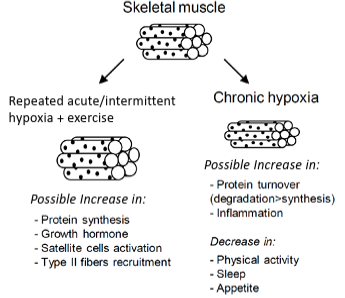

*schema che confronta gli effetti sul muscolo scheletrico di ipossia acuta/intermittente ripetuta associata a esercizio fisico (possibile aumento di sintesi proteica, ormone della crescita, attivazione delle cellule satellite, reclutamento di fibre di tipo II) rispetto a ipossia cronica (possibile aumento di turnover proteico con degradazione maggiore della sintesi, e infiammazione; diminuzione di attività fisica, sonno e appetito)*

Il termine **"ipossia cronica"** viene qui utilizzato per indicare condizioni ipossiche che si protraggono per diversi giorni, mentre il termine **"ipossia acuta"** per un periodo di alcune ore.

- L'ipossia di **lunga durata** comporta generalmente una regolazione negativa dell'equilibrio proteico e una perdita di massa muscolare.
- Esposizioni ipossiche **ripetute o intermittenti**, combinate con esercizi di resistenza, possono invece esercitare effetti positivi sugli adattamenti muscolari, in specifici contesti sperimentali.

| | Sintesi proteica | Degradazione proteica | Bilancio proteico netto |
| :--- | :--- | :--- | :--- |
| **Ipossia cronica — alta quota** | ↗ o ~ (invariata) | ↗↗ | **Negativo** |
| **Ipossia cronica — BPCO** | ↘ | ↗ | **Negativo** |
| **Ipossia acuta — esposizione singola** | ↘ o ~ | ? | ? |
| **Ipossia acuta — esposizione singola + esercizio** | ↘ *(Etheridge, 2011)* o ↗ *(Imoberdorf, 2006)* | ? | ? |
| **Ipossia acuta — esposizione ripetuta + esercizio** | — | — | **Positivo** |

*BPCO: broncopneumopatia cronica ostruttiva; "?" indica un dato ancora sconosciuto o poco studiato.*

La fosforilazione di **PKB/Akt** e **S6K1** è risultata più elevata nel muscolo scheletrico di soggetti esposti per 4 ore a ipossia normobarica, dopo un pasto standardizzato — un segnale che indica un'**attivazione** della via mTOR e, di conseguenza, della sintesi proteica.

*Quali sono le conseguenze per la massa muscolare scheletrica?*

È stata segnalata una riduzione della massa muscolare in alcune popolazioni autoctone di alta montagna, in individui di pianura esposti a condizioni di bassa concentrazione di ossigeno nell'aria per più di 3 settimane, e in pazienti affetti da patologie polmonari. I primi studi sull'atrofia muscolare in condizioni di ipossia cronica sono stati condotti su alpinisti al ritorno da una spedizione himalayana a oltre 5000 m di altitudine della durata di 8 settimane, e su soggetti sperimentali dopo 40 giorni di esposizione all'ipossia in una camera ipobarica.

L'esposizione all'ipossia è stata associata ad **atrofia** del muscolo scheletrico e a un **aumento della densità capillare** — quest'ultimo un adattamento che potrebbe favorire un trasporto più efficiente dell'ossigeno alle cellule muscolari, riducendo la distanza di diffusione tra sangue e mitocondri. Ratti maschi esposti per diversi giorni a grave ipossia ipobarica, equivalente a 7620 m di altitudine, hanno perso fino al **30%** della massa muscolare.

---

## Tipi di fibre muscolari, ipossia ed esercizio

Il muscolo scheletrico è il tessuto più esteso dell'organismo: rappresenta quasi il **40%** del peso corporeo e contribuisce in misura significativa (**20-30%**) al metabolismo basale. È un tessuto eterogeneo, composto da fibre con proprietà contrattili e metaboliche distinte:

- le **fibre di tipo I** (fibre ossidative lente) sono cellule ricche di mitocondri, con un elevato contenuto di mioglobina e una densa rete capillare, responsabili del loro caratteristico colore rosso;
- le **fibre glicolitiche veloci**, come il tipo IIX nell'uomo e il tipo IIB nei roditori, hanno generalmente un'area della sezione trasversale più ampia, un apparato glicolitico più sviluppato e sono meno irrorate;
- le **fibre di tipo IIA** hanno un profilo intermedio, ossidativo-glicolitico.

In condizioni di riposo e in condizioni aerobiche, la maggior parte della produzione di ATP nel muscolo scheletrico si basa sul metabolismo ossidativo.

### Tipo di fibra muscolare e ipossia

L'ipossia di per sé può favorire un passaggio da un metabolismo **ossidativo** a uno **glicolitico**. È stato riportato che i soggetti portatori di un polimorfismo del gene HIF1A, associato a una maggiore stabilità della proteina HIF-1α, presentano una percentuale più elevata di fibre di tipo II.

Nel muscolo scheletrico dei roditori, le fibre a contrazione rapida di tipo ossidativo-glicolitico mostrano un'espressione basale di HIF-1α più elevata rispetto alle fibre a contrazione lenta di tipo ossidativo. Le fibre di tipo II potrebbero quindi essere particolarmente sensibili al rimodellamento indotto dall'ipossia, sebbene i dati disponibili siano ancora eterogenei.

Nei ratti, l'**atrofia muscolare** è correlata positivamente con la gravità dell'ipossia: l'analisi delle variazioni dell'area media della sezione trasversale delle fibre conferma l'aggravarsi dell'atrofia muscolare in condizioni di grave ipossia.

### Tipo di fibra muscolare scheletrica: una risposta specifica all'ipossia

La sovraespressione di HIF-1α nei mioblasti murini C2C12, successivamente differenziati in miotubi, induce l'espressione delle isoforme di MyHC (catena pesante della miosina) veloci, tipiche delle fibre di tipo II. La sovraespressione di HIF-1α nei muscoli estensore lungo delle dita (EDL) e soleo *in vivo* favorisce un passaggio da fibre di tipo lento a fibre di tipo veloce.

Nel muscolo ipossico, la proporzione dei tipi di fibre cambia per adattarsi alla privazione di ossigeno in diverse condizioni fisiologiche e patologiche, con una tendenza all'aumento delle fibre **FOG** (fibre ossidative-glicolitiche veloci) rispetto alle fibre **SO** (fibre ossidative lente).

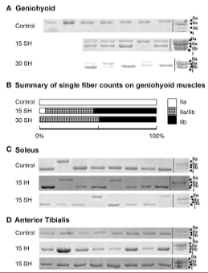

*gel elettroforetici che confrontano la composizione delle isoforme di miosina (IIa, IIa/IIb, IIb) in condizioni di controllo e dopo 15 o 30 giorni di ipossia sostenuta (SH) nel muscolo genioioideo (con relativo istogramma riassuntivo), e dopo ipossia intermittente (IH) o sostenuta (SH) nel muscolo soleo e nel tibiale anteriore*

Nel muscolo genioioideo (coinvolto nella deglutizione e nella masticazione), una grave ipossia induce un cambiamento significativo nella composizione delle miofibrille, con un passaggio dal modello di controllo a una maggiore percentuale di isoforme di miofibrille veloci. La composizione delle miofibrille dei muscoli soleo e tibiale anteriore rimane invece **invariata**.

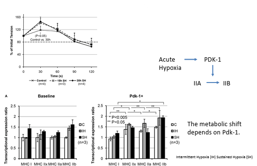

*a sinistra, grafico della tensione muscolare (% della tensione iniziale) nel tempo, che mostra un aumento transitorio nei primi 30-60 secondi di stimolazione sia nei controlli sia dopo 15 o 30 ore di ipossia sostenuta (SH); a destra, schema che riassume come l'ipossia acuta induca PDK-1, il quale sposta il fenotipo delle fibre da IIA verso IIB, un effetto che dipende da Pdk-1, con relativi istogrammi dell'espressione trascrizionale delle isoforme di MHC (I, IIx, IIa, IIb) nelle condizioni basale e con sovraespressione di Pdk-1, confrontando ipossia intermittente (IH) e sostenuta (SH)*

Un'ipossia grave può quindi aumentare temporaneamente la tensione e la forza muscolare durante la fase iniziale della stimolazione — un effetto acuto, distinto dagli adattamenti di più lungo termine sul tipo di fibra.

---

## Adattamenti all'ipossia del muscolo scheletrico: una questione di durata, intensità e contesto

Le risposte dei muscoli scheletrici all'ipossia dipendono da: durata, gravità, carico di esercizio, stato nutrizionale, e tipo di muscolo.

- L'**ipossia acuta/intermittente**, associata all'esercizio fisico, può attivare l'HIF-1α e favorire il metabolismo glicolitico in condizioni di carenza di ossigeno. In determinati contesti, ciò può favorire il passaggio a un fenotipo più veloce/glicolitico, specialmente nei muscoli metabolicamente più "plastici".
- L'**ipossia cronica** induce adattamenti più complessi: atrofia muscolare, rimodellamento mitocondriale, alterazioni del metabolismo ossidativo, e possibili cambiamenti nel tipo di fibre.

Pertanto, l'ipossia non induce una risposta uniforme: il fenotipo finale **dipende** dall'interazione tra disponibilità di ossigeno, durata dell'esposizione e richiesta funzionale.

### Il modello del deficit di PHD2: capillarizzazione e tipizzazione delle fibre

Un modello sperimentale particolarmente istruttivo per osservare gli effetti di una stabilizzazione **cronica** di HIF (senza dover ricorrere a ipossia ambientale prolungata) è quello dei topi con **deficit genetico di PHD2**: eliminando l'enzima che normalmente degrada HIF-1α, si ottiene una condizione di "ipossia molecolare permanente", anche in presenza di ossigeno normale nell'ambiente.

**La carenza di PHD2 potenzia la capillarizzazione mediata dal VEGF nel muscolo scheletrico**

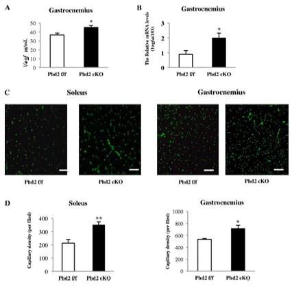

*istogrammi che mostrano, nel muscolo gastrocnemio di topi con delezione condizionale di Phd2 (Phd2 cKO) rispetto ai controlli (Phd2 f/f), un aumento significativo dei livelli di Vegf (proteina e mRNA); immagini di immunofluorescenza dei capillari (verde) nel soleo e nel gastrocnemio, con relativa quantificazione della densità capillare, entrambe aumentate nei topi Phd2 cKO*

La carenza di PHD2 stabilizza la segnalazione dell'HIF e aumenta l'espressione del VEGF, determinando una maggiore densità capillare nel muscolo scheletrico. In pratica, questa mutazione ricrea una condizione in cui l'espressione di HIF non viene più "frenata" dalla PHD2 (che normalmente ne riduce l'espressione): nel muscolo gastrocnemio si osserva infatti un aumento di HIF-1α, che agisce sulla vascolarizzazione promuovendo una maggiore espressione di VEGF e, di conseguenza, un aumento della densità dei vasi sanguigni.

**La stabilizzazione cronica dell'HIF favorisce anche lo sviluppo di caratteristiche tipiche delle fibre lente/di tipo I**

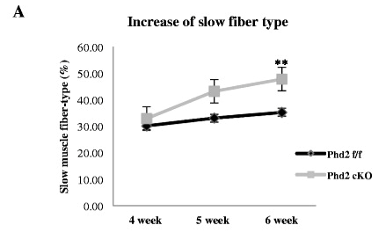

*grafico che mostra come la percentuale di fibre muscolari lente aumenti progressivamente nel tempo (4, 5, 6 settimane) nei topi Phd2 cKO rispetto ai controlli Phd2 f/f*

Si osserva un cambiamento del fenotipo del muscolo scheletrico verso le fibre di tipo I, sia nel muscolo soleo (35,8% nei topi di controllo contro il 46,7% nei topi con deficit di PHD2, p < 0,01) sia nel muscolo gastrocnemio (0,94% contro 1,89%, p < 0,01) — e l'aumento della percentuale di fibre di tipo I sembra corrispondere proprio all'area di maggiore densità capillare.

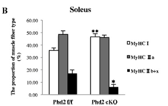

*istogramma della proporzione dei tipi di fibra (MyHC I, IIa, IIb+x) nel muscolo soleo, che mostra come i topi Phd2 cKO abbiano una proporzione maggiore di MyHC I e IIa e una proporzione nettamente minore di MyHC IIb+x rispetto ai controlli*

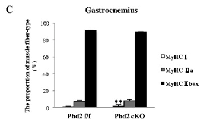

*istogramma analogo per il muscolo gastrocnemio, dove la proporzione di MyHC I e IIa aumenta lievemente nei topi Phd2 cKO, mentre la stragrande maggioranza delle fibre resta di tipo IIb+x in entrambi i gruppi*

In sintesi: si osserva un aumento delle fibre di tipo I ossidative nei topi knockout per PHD2.

**Il meccanismo: la via calcineurina/NFATc1**

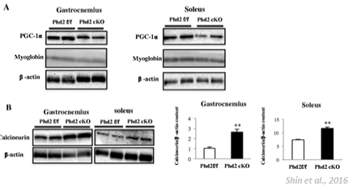

*Western blot e relativi istogrammi che mostrano, nel muscolo gastrocnemio e soleo di topi Phd2 cKO, livelli pressoché invariati di PGC-1α e mioglobina, mentre i livelli di calcineurina risultano significativamente aumentati rispetto ai controlli Phd2 f/f (Shin et al., 2016)*

Nel muscolo scheletrico con deficit di PHD2, i livelli delle proteine **calcineurina** e **NFATc1** aumentano sia nel gastrocnemio che nel soleo. Ciò suggerisce che la via di segnalazione **calcineurina/NFATc1** contribuisca alla transizione verso le caratteristiche delle fibre lente/di tipo I.

Il PGC-1α e la mioglobina mostrano invece solo variazioni minime, indicando che **non si tratta semplicemente di un classico programma ossidativo guidato dal PGC-1α** (a differenza di quanto avviene tipicamente con l'esercizio di endurance, visto nel capitolo sulla biogenesi mitocondriale). L'inibizione della calcineurina sopprime la formazione di fibre lente in questo modello — un'osservazione che suggerisce l'esistenza di un possibile legame diretto tra HIF-1α e l'espressione della calcineurina.

### Il rimodellamento delle fibre dipende dal modello di ipossia e dal tipo di muscolo

Mettendo insieme le osservazioni delle sezioni precedenti, emerge un quadro apparentemente contraddittorio, che in realtà riflette la complessità del fenomeno:

- nei modelli di **sovraespressione diretta** di HIF-1α (mioblasti C2C12, muscoli EDL e soleo), si osserva lo sviluppo di isoforme di MyHC più **veloci** *(Lunde et al., 2011; Valle-Tenney et al., 2020)*;
- in condizioni di **ipossia prolungata ambientale**, il muscolo genioioideo (misto e altamente plastico) tende a sviluppare isoforme più veloci di tipo II, mentre il soleo (posturale, lento/ossidativo) e il tibiale anteriore (veloce/glicolitico) mostrano cambiamenti minimi o nulli *(Nguyen et al., 2016)*;
- nei topi con **deficit di PHD2** (stabilizzazione cronica endogena di HIF), si osserva invece un aumento del VEGF/della capillarizzazione e la promozione di caratteristiche lente/di tipo I nel soleo, e in misura minore nel gastrocnemio *(Shin et al., 2016)*.

Il rimodellamento del tessuto muscolare dipende quindi dalla **durata del segnale**, dal **modello sperimentale**, e dal **muscolo esaminato** *(Chaillou, 2020)* — non esiste un'unica regola valida in ogni contesto.

---

## HIF-1α, lesione e rigenerazione muscolare

A seguito di una lesione muscolare acuta, la compromissione della microvascolatura locale può creare una **nicchia ipossica transitoria**. La segnalazione dell'HIF-1α viene rilevata nel muscolo scheletrico lesionato e aumenta durante la fase rigenerativa iniziale dopo una lesione indotta da cardiotossina (CTX) *(Drouin et al., 2019)*.

Questa risposta ipossica transitoria può favorire la riparazione, promuovendo l'espressione del VEGF, l'angiogenesi e il rimodellamento tissutale *(Hotta et al., 2018; Arsic et al., 2004)*. Se invece la segnalazione ipossica **persiste**, insieme all'infiammazione cronica e all'attivazione della via TGF-β/SMAD, la deposizione di matrice extracellulare può diventare **disadattiva** e contribuire alla fibrosi (approfondita più avanti), rendendo il muscolo meno funzionale e più rigido *(Valle-Tenney et al., 2020)*.

### La via HIF-1α/VEGF favorisce la rigenerazione muscolare dopo una lesione

A seguito di una lesione da contrazione eccentrica, i geni bersaglio dell'HIF, come il VEGF, aumentano durante la rigenerazione muscolare, in parallelo a una permeabilità microvascolare transitoria *(Hotta et al., 2018; Valle-Tenney et al., 2020)*. Esperimenti funzionali dimostrano che l'espressione del VEGF promuove l'angiogenesi e favorisce la rigenerazione del muscolo scheletrico *(Arsic et al., 2004)*: la somministrazione di VEGF tramite vettore virale associato ad adenovirus (**AAV-VEGF**) migliora la ricostituzione delle fibre muscolari in seguito a danno indotto da ischemia, glicerolo o cardiotossina.

Pertanto, la segnalazione transitoria di HIF-1α/VEGF può costituire parte di una risposta pro-rigenerativa a seguito di una lesione muscolare (secondo la sequenza: lesione muscolare → accumulo di macrofagi → ipossia locale).

*Un esperimento illustra bene quanto l'azione del VEGF sia importante per le funzioni rigenerative, favorendo la nascita di nuove fibre.* I ricercatori hanno utilizzato dei vettori virali capaci di incapsulare un gene e trasportarlo (*delivery*) in una struttura bersaglio: un vettore conteneva il gene **LacZ** (che colora di blu le cellule in cui riesce a entrare, usato come semplice controllo per verificare l'efficacia del vettore), un altro conteneva il gene **VEGF**.

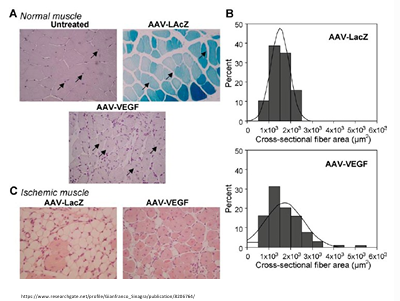

*(A) immagini istologiche di muscolo normale non trattato, trattato con AAV-LacZ (le cellule colorate di blu, indicate dalle frecce, dimostrano l'ingresso del vettore) e trattato con AAV-VEGF; (B) distribuzione dell'area della sezione trasversale delle fibre (cross-sectional fiber area) nei due gruppi, con una maggiore proporzione di fibre di area più ampia nel gruppo AAV-VEGF; (C) immagini istologiche di muscolo ischemico trattato con il solo vettore di controllo (AAV-LacZ, a sinistra) o con il vettore VEGF (AAV-VEGF, a destra)*

Nelle cellule muscolari trattate con il vettore VEGF si osserva un **maggior numero di nuclei**, sia in periferia (come di consueto nella fibra muscolare matura) sia anche all'interno della fibra — un segnale indicativo di **neogenesi cellulare** in corso. Questo dimostra che l'HIF modula diversi geni, tra cui il VEGF, che risulta importante non solo per l'angiogenesi in senso stretto, ma anche per la rigenerazione delle fibre muscolari stesse.

---

## Fibrosi del muscolo scheletrico: quando la riparazione diventa disadattiva

La **fibrosi del muscolo scheletrico** è caratterizzata da un eccessivo deposito di proteine della matrice extracellulare (MEC), in particolare collagene e fibronectina. Questo processo aumenta la rigidità dei tessuti, altera l'architettura muscolare e riduce la funzione contrattile.

A seguito di una lesione acuta, il deposito transitorio di MEC fa parte del normale processo di riparazione. In caso di danno **cronico** o **ripetuto**, invece, l'infiammazione persistente, l'attivazione dei miofibroblasti (cellule che producono ed espellono un eccesso di matrice extracellulare) e la rigenerazione asincrona possono determinare un accumulo eccessivo di MEC e, in ultima analisi, la fibrosi.

### Una segnalazione ipossica prolungata può indurre una risposta riparativa che sfocia nella fibrosi

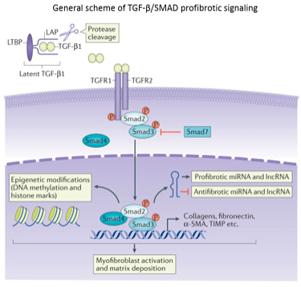

*schema generale della segnalazione profibrotica TGF-β/SMAD: il TGF-β latente (legato a LTBP e LAP) viene attivato per clivaggio proteolitico, si lega ai recettori TGFR1/TGFR2, fosforilando Smad2/Smad3 (un processo inibito da Smad7); il complesso Smad2/3/Smad4 entra nel nucleo, dove regola l'espressione di RNA non codificanti pro- e anti-fibrotici, insieme a modificazioni epigenetiche, portando infine all'attivazione dei miofibroblasti e alla deposizione di matrice extracellulare (collagene, fibronectina, α-SMA, TIMP)*

Una segnalazione ipossica prolungata può contribuire alla fibrosi del muscolo scheletrico attraverso vie di interazione tra l'HIF-1α "profibrotico" e la segnalazione TGF-β/SMAD, favorendo l'induzione del **CTGF/CCN2**, un mediatore profibrotico fondamentale. Ciò favorisce l'attivazione dei miofibroblasti e un eccessivo deposito di proteine della matrice extracellulare, tra cui il collagene e la fibronectina.

---

## Ipossia, cellule satellite e macrofagi nella rigenerazione muscolare

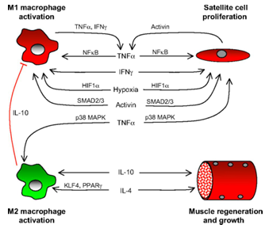

*schema del crosstalk tra macrofagi M1, cellule satellite, macrofagi M2 e rigenerazione muscolare: i macrofagi M1 (pro-infiammatori) attivati da TNFα/IFNγ stimolano la proliferazione delle cellule satellite tramite TNFα/NFκB; le cellule satellite rispondono con IFNγ; HIF1α, ipossia e Smad2/3 modulano bidirezionalmente questa comunicazione; la conversione verso macrofagi M2 (pro-riparativi, tramite IL-10, KLF4, PPARγ) promuove infine la rigenerazione e la crescita muscolare (tramite IL-10 e IL-4)*

La segnalazione ipossica contribuisce alla regolazione della quiescenza, dell'attivazione e del potenziale rigenerativo delle cellule satellite. Come già visto nel capitolo sull'ipertrofia, le cellule satellite sono le cellule staminali del muscolo scheletrico.

| Fattore | Tipo di adattamento |
| :--- | :--- |
| **HIF-1α** | Adattamento **metabolico acuto** all'ipossia. |
| **HIF-2α** | Adattamento **prolungato**, correlato alle cellule staminali e al sistema vascolare. |

L'**HIF-2α** sostiene le proprietà staminali e l'auto-rinnovamento delle cellule satellite; l'ablazione a lungo termine dell'HIF-2α porta all'esaurimento delle cellule satellite e all'insufficienza rigenerativa *(Xie et al., 2018)*. Durante la rigenerazione, i macrofagi e le cellule satellite ricevono segnali infiammatori che, attraverso meccanismi pro-rigenerativi, regolano la proliferazione, la differenziazione e la riparazione dei tessuti.

### L'HIF-1α mieloide favorisce la rigenerazione muscolare attraverso i macrofagi e la segnalazione dell'NO

La segnalazione ipossica delle cellule **mieloidi** (la linea cellulare da cui originano i macrofagi) contribuisce alla rigenerazione del muscolo scheletrico dopo una lesione *(Scheerer et al., 2013; Valle-Tenney et al., 2020)*.

Nei topi privi di HIF-1α nelle cellule mieloidi, il reclutamento dei macrofagi è **ritardato**, e un numero inferiore di cellule precursori muscolari MyoD-positive viene reclutato nel muscolo lesionato *(Scheerer et al., 2013)*.

L'inibizione delle PHD può proteggere il muscolo da lesioni eccentriche, in parte attraverso la segnalazione mieloide **iNOS/NO** dipendente da HIF-1α *(Billin et al., 2018)*. La segnalazione dell'**NO** è stata anche collegata all'attivazione delle cellule satellite *(Anderson, 2000; Buono et al., 2012; Rigamonti et al., 2013)*.

---

## Fibrosi del muscolo scheletrico: quadro generale

La fibrosi del muscolo scheletrico è caratterizzata dalla sostituzione delle fibre contrattili funzionali con un eccesso di matrice extracellulare e tessuto connettivo di tipo cicatriziale. Questo processo si verifica in diverse patologie muscolari, tra cui il miotrauma cronico, e compromette progressivamente l'architettura e la funzione muscolare *(Gonzalez et al., 2017; Pessina et al., 2014; Smith e Barton, 2018)*.

Nel processo di riparazione fisiologica, la deposizione della matrice extracellulare è transitoria. In caso di danno cronico, la segnalazione ipossica prolungata, l'infiammazione e i fattori profibrotici possono determinare un accumulo persistente della matrice extracellulare e la fibrosi *(Valle-Tenney et al., 2020)*.

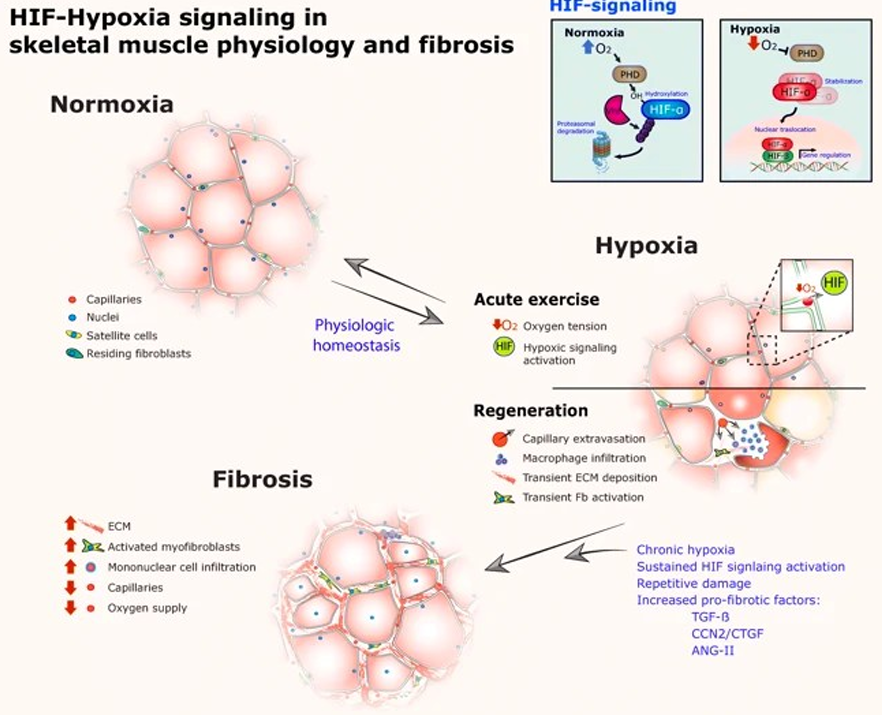

*schema riassuntivo completo del ruolo della segnalazione HIF-ipossia nella fisiologia e nella fibrosi del muscolo scheletrico: in normossia, il tessuto muscolare (capillari, nuclei, cellule satellite, fibroblasti residenti) mantiene l'omeostasi fisiologica; l'esercizio acuto abbassa la tensione di ossigeno, attivando la segnalazione ipossica (HIF) e innescando la fase di rigenerazione (extravasazione capillare, infiltrazione di macrofagi, deposizione transitoria di ECM, attivazione transitoria dei fibroblasti), che normalmente ritorna all'omeostasi fisiologica; se invece la segnalazione HIF si mantiene attiva cronicamente, con danno ripetuto e aumento dei fattori profibrotici (TGF-β, CCN2/CTGF, ANG-II), il tessuto evolve verso la fibrosi, con aumento di ECM, miofibroblasti attivati e infiltrazione di cellule mononucleate, e diminuzione di capillari e apporto di ossigeno*

### La stabilizzazione prolungata dell'HIF-1α favorisce la deposizione della matrice extracellulare

Per simulare un'attivazione prolungata dell'HIF, senza dover ricorrere a un'esposizione ipossica ambientale, è stata somministrata **DMOG** (dimetilossalilglicina) quotidianamente per 17 giorni a topi adulti, confrontandoli con un gruppo di controllo trattato con sola soluzione salina.

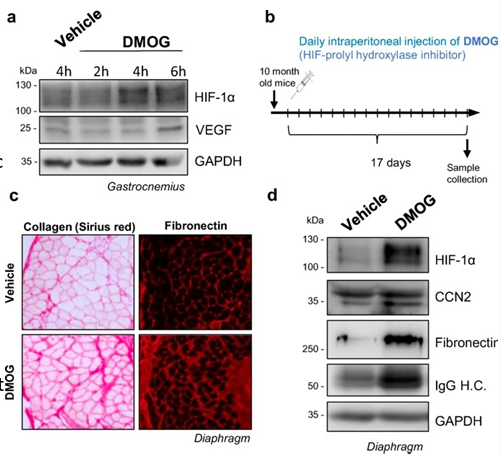

*(a) Western blot che mostra l'aumento di HIF-1α e VEGF nel muscolo gastrocnemio dopo trattamento con DMOG rispetto al veicolo (a diversi tempi: 2h, 4h, 6h); (b) schema del protocollo sperimentale: iniezione intraperitoneale giornaliera di DMOG (inibitore delle prolil idrossilasi dell'HIF) per 17 giorni in topi di 10 mesi; (c) immagini istologiche del muscolo diaframmatico che mostrano un marcato aumento della colorazione per il collagene (Sirius red) e per la fibronectina nel gruppo DMOG rispetto al veicolo; (d) Western blot che conferma l'aumento di HIF-1α, CCN2, fibronectina e IgG (indice di permeabilità vascolare) nel gruppo DMOG*

La **dimetilossalilglicina (DMOG)** inibisce le prolil idrossilasi (le stesse PHD viste nel capitolo precedente), stabilizzando l'HIF-1α e aumentando l'espressione dei suoi geni bersaglio, come il VEGF. Nel muscolo diaframmatico, la stabilizzazione prolungata di HIF-1α ha aumentato il deposito di collagene e fibronectina, e ha indotto il mediatore profibrotico CTGF/CCN2.

Questo esperimento avvalora l'ipotesi secondo cui una segnalazione persistente dell'HIF possa orientare il processo di riparazione/rimodellamento muscolare verso la **fibrosi**, chiudendo così il cerchio con quanto osservato in apertura di capitolo: la stessa via molecolare (HIF-1α) che, se attivata in modo **transitorio**, sostiene l'adattamento e la rigenerazione, diventa **disadattiva** quando la sua attivazione si protrae nel tempo.

---

## Riassunto finale

- L'attivazione **transitoria** dell'HIF-1α durante l'esercizio fisico, o nelle prime fasi di una lesione, favorisce l'adattamento glicolitico, l'espressione del VEGF e l'angiogenesi.
- L'**allenamento** attenua la risposta dell'HIF-1 allo stesso stimolo esercitativo, in parte grazie all'aumento dei regolatori negativi quali le PHD e la FIH.
- L'**ipossia cronica** può indurre un rimodellamento metabolico, una riduzione del metabolismo ossidativo e lipidico, un rimodellamento mitocondriale e una perdita di massa muscolare.
- Le risposte dei diversi **tipi di fibre** non sono uniformi: dipendono dalla durata dell'ipossia, dal modello sperimentale e dal tipo di muscolo.
- Dopo una **lesione**, la segnalazione transitoria di HIF/VEGF può favorire la rigenerazione, mentre l'attivazione persistente di HIF può favorire la deposizione di matrice extracellulare e la **fibrosi**.
- Pertanto, la segnalazione di HIF è **adattativa** quando è transitoria e controllata, ma potenzialmente **disadattiva** quando è cronica o persistente.

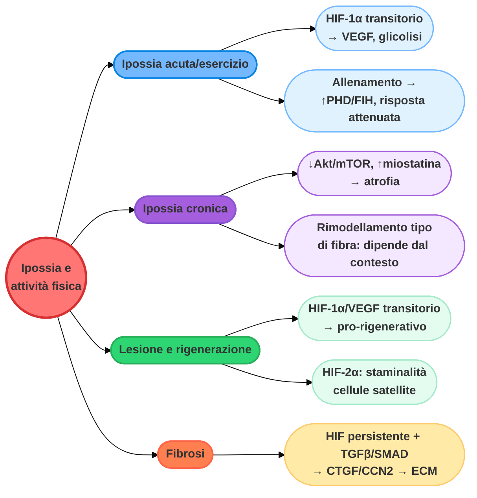