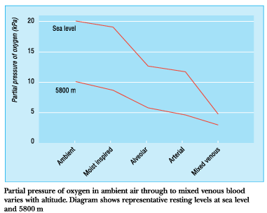
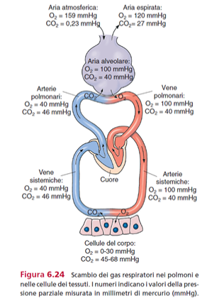
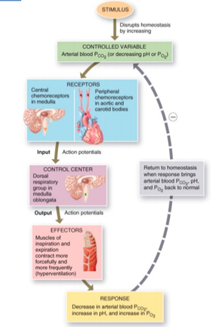
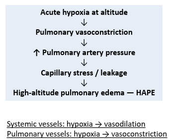
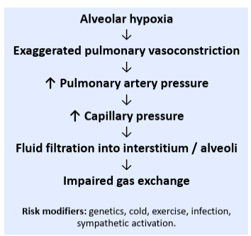
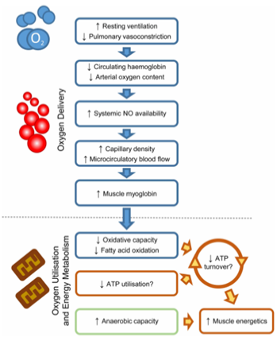
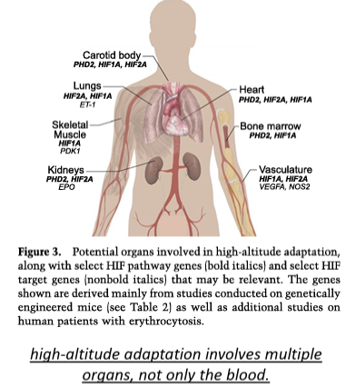
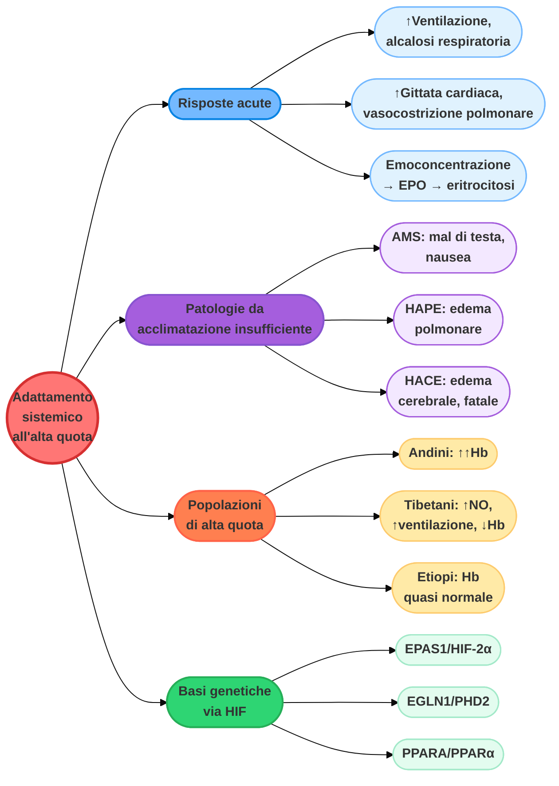

# Adattamento sistemico all'alta quota: fisiologia, patologie e genetica

## Perché l'altitudine conta

Il campo base dell'Everest si trova a 5500 m di altitudine, mentre la vetta del Monte Bianco, la montagna più alta delle Alpi, raggiunge solo i 4800 m. Le zone con le montagne più alte sono anche quelle con le infrastrutture più carenti, soprattutto per quanto riguarda l'assistenza medica.

L'alta quota espone il corpo all'**ipossia ipobarica**; il freddo, la disidratazione e lo sforzo fisico aumentano ulteriormente lo stress fisiologico. Una salita rapida, senza un adeguato acclimatamento, aumenta significativamente il rischio di mal di montagna.

---

## Disponibilità di ossigeno e altitudine

La frazione di ossigeno nell'aria rimane sempre circa il 21%, ma con l'aumentare dell'altitudine diminuisce la **pressione barometrica**. Per questo motivo, la pressione parziale di ossigeno inspirata (PPO₂) diminuisce proporzionalmente.

*grafico della pressione parziale di ossigeno (kPa) lungo il percorso dall'aria ambiente al sangue venoso misto, confrontando i livelli a riposo a livello del mare e a 5800 m: a entrambe le quote la PO2 diminuisce progressivamente passando da aria ambiente, aria inspirata umidificata, aria alveolare, sangue arterioso fino al sangue venoso misto, ma a 5800 m tutti i valori sono nettamente più bassi*

A circa 5800 m, la PPO₂ è pari a circa il **50%** di quella al livello del mare. Questo riduce il gradiente di pressione necessario per il trasferimento dell'ossigeno dai polmoni al sangue e ai tessuti — lo stesso concetto di gradiente pressorio (legge di Fick) già incontrato nel capitolo sull'ipossia fisiologica.

*schema del circolo polmonare e sistemico con le rispettive pressioni parziali di O2 e CO2 in ciascun punto del percorso — lo stesso schema già visto nel capitolo sull'ipossia, qui a richiamo del meccanismo di diffusione dei gas lungo il gradiente di pressione*

| Altitudine | Pressione barometrica (PB) | PO₂ | Temperatura |
| :--- | :--- | :--- | :--- |
| 0 m (livello del mare) | 760 mmHg | 159,1 mmHg | 15,0 °C |
| 1000 m | 674 mmHg | 141,1 mmHg | 8,5 °C |
| 2000 m (Città del Messico) | 596 mmHg | 124,7 mmHg | 2,0 °C |
| 3000 m | 526 mmHg | 110,0 mmHg | -4,5 °C |
| 4000 m | 462 mmHg | 96,7 mmHg | -10,9 °C |
| 9000 m (Everest) | 231 mmHg | 48,3 mmHg | -43,4 °C |

---

## Risposte fisiologiche all'ipossia ipobarica

La diminuzione della pressione parziale dell'ossigeno ad alta quota riduce la disponibilità di ossigeno e comporta notevoli difficoltà fisiologiche per l'organismo umano. Le risposte cellulari e sistemiche a questo stress possono causare il mal di montagna e, in una parte degli individui non ben acclimatati, possono rivelarsi fatali.

L'ascesa in alta quota è associata a risposte fisiologiche che contrastano lo stress causato dall'ipossia ipobarica, aumentando l'apporto di ossigeno e modificando l'utilizzo di ossigeno da parte dei tessuti attraverso la modulazione metabolica.

*schema del riflesso omeostatico che regola la ventilazione: uno stimolo (aumento della PCO2 arteriosa o calo della PO2) altera la variabile controllata; i chemocettori centrali (nel bulbo) e periferici (nei corpi aortici e carotidei) rilevano la variazione e inviano potenziali d'azione al centro di controllo (gruppo respiratorio dorsale nel bulbo), che a sua volta comanda i muscoli inspiratori ed espiratori a contrarsi più forte e più spesso (iperventilazione); la risposta riporta la PCO2 verso la norma, completando il ciclo omeostatico*

Durante l'esposizione **acuta** all'ipossia ipobarica sembrano prevalere i meccanismi compensatori che aumentano l'apporto di ossigeno: la **ventilazione**, la **gittata cardiaca** e l'**ematocrito** aumentano tutti nelle persone provenienti dalle pianure man mano che salgono in quota.

### Risposte ventilatorie all'altitudine

A livello del mare, la **CO₂ arteriosa** costituisce il principale stimolo alla ventilazione. In altitudine, invece, la riduzione della PO₂ inspiratoria attiva i **chemorecettori periferici**: i corpi carotidei stimolano l'iperventilazione. L'iperventilazione aumenta la PO₂ alveolare ma riduce la CO₂, causando **alcalosi respiratoria**. La risposta ventilatoria ipossica diventa rilevante quando la PO₂ inspiratoria scende a circa 100 mmHg (13,3 kPa).

### Circolazione polmonare: una risposta opposta all'ipossia

Nella circolazione **sistemica**, l'ipossia provoca solitamente una **vasodilatazione**. Nella circolazione **polmonare**, invece, l'ipossia provoca una **vasocostrizione** — una risposta opposta a quella sistemica.

*schema che riassume il meccanismo dell'edema polmonare da alta quota: l'ipossia acuta in altitudine induce vasocostrizione polmonare, che aumenta la pressione dell'arteria polmonare, causando stress e permeabilità dei capillari (leakage) fino allo sviluppo dell'HAPE; in basso, il contrasto tra vasi sistemici (ipossia → vasodilatazione) e vasi polmonari (ipossia → vasocostrizione)*

Questo meccanismo contribuisce a reindirizzare il flusso sanguigno verso le regioni polmonari meglio ventilate — una strategia utile a livello locale, quando solo alcune zone del polmone sono scarsamente ventilate. Ad alta quota, però, l'ipossia colpisce l'**intero polmone**, provocando una vasocostrizione polmonare **diffusa**. Ciò può aumentare la pressione arteriosa polmonare e contribuire all'edema polmonare da alta quota (**HAPE**, approfondito più avanti).

### Sangue: emoconcentrazione ed eritropoiesi

Per **emoconcentrazione** si intende la condizione in cui il sangue diventa più denso a causa della riduzione della sua componente liquida (il plasma).

Subito dopo l'inizio della salita, il volume plasmatico diminuisce a causa della disidratazione, provocando un'emoconcentrazione. In caso di ipossia prolungata, il rene aumenta la produzione di **eritropoietina**, che stimola la produzione di globuli rossi e aumenta la concentrazione di emoglobina. Ciò migliora la capacità di trasporto dell'ossigeno, ma può anche aumentare la **viscosità del sangue**: un'eccessiva eritrocitosi può aumentare il rischio di trombosi.

### Risposte all'altitudine di cuore e cervello

**Cuore**: inizialmente la gittata cardiaca aumenta, per supportare il trasporto di ossigeno. Con l'acclimatamento, la gittata cardiaca tende a tornare pari ai livelli osservati a livello del mare. La frequenza cardiaca rimane più alta, mentre la gittata sistolica diminuisce (ricordando che gittata cardiaca = frequenza cardiaca × gittata sistolica, come visto nel capitolo sull'omeostasi cardiovascolare). Ad altitudini molto elevate, la frequenza cardiaca massima diminuisce, limitando quindi la performance fisica massimale.

**Cervello**: è altamente sensibile all'ipossia. Diminuiscono attenzione, coordinazione, capacità decisionale e lucidità mentale. Ad altitudini estreme, queste funzioni compromesse possono portare a incidenti gravi. Alcuni deficit persistono anche dopo esposizioni prolungate in quell'ambiente — non si osserva quindi un vero e proprio adattamento, e i deficit possono persistere anche 5-6 mesi dopo il rientro da una spedizione.

### Variabilità individuale nell'acclimatazione all'altitudine

L'acclimatazione varia notevolmente da persona a persona. Gli scalatori di alto livello non presentano necessariamente un apporto sistemico di ossigeno eccezionale. Il successo dell'adattamento può dipendere non solo dal trasporto di O₂, ma anche da:

- distribuzione dell'ossigeno a livello microcircolatorio;
- utilizzo cellulare dell'ossigeno;
- efficienza metabolica.

---

## Patologie da alta quota

### Mal di montagna acuto (AMS)

Il mal di montagna acuto (**AMS**, *Acute Mountain Sickness*) si manifesta solitamente dopo una rapida salita oltre i 2500 m circa. Il mal di testa è il sintomo principale e può essere accompagnato da:

- nausea o vomito;
- vertigini;
- affaticamento;
- disturbi del sonno.

Il mal di testa da alta quota può migliorare con l'assunzione di analgesici, l'idratazione, il riposo o l'ossigeno. **Gestione**: interrompere la salita; scendere se i sintomi peggiorano o non migliorano. I casi gravi possono richiedere l'uso di acetazolamide, desametasone, ossigeno o camera iperbarica.

### Edema polmonare da alta quota (HAPE)

*schema della catena causale dell'HAPE: l'ipossia alveolare provoca un'esagerata vasocostrizione polmonare, che aumenta la pressione dell'arteria polmonare e, di conseguenza, la pressione capillare; questo causa la filtrazione di fluido nell'interstizio e negli alveoli, compromettendo gli scambi gassosi; i fattori di rischio modificabili includono predisposizione genetica, freddo, esercizio fisico, infezioni e attivazione simpatica*

L'HAPE si manifesta solitamente entro 2-4 giorni da una rapida salita oltre i 2500-3000 m, e può manifestarsi **senza** essere preceduto dal mal di montagna (AMS). I sintomi precoci comprendono dispnea da sforzo e ridotta tolleranza all'esercizio fisico; nelle forme gravi si osservano dispnea a riposo, tosse e bassa saturazione di ossigeno.

### Edema cerebrale da alta quota (HACE)

L'**HACE** rappresenta lo stadio encefalopatico finale, potenzialmente letale, del mal di montagna. Viene diagnosticato clinicamente in soggetti che sono giunti da poco in alta quota, la maggior parte dei quali presenta sintomi di AMS o HAPE. È caratterizzato da vari gradi di confusione, atassia dell'andatura, disturbi dello stato di coscienza e alterazioni psichiatriche, che possono progredire fino al coma profondo.

Si ritiene che la prevalenza dell'HACE tra gli escursionisti a circa 4500 m sia dello 0,5-1,0%. La gestione dell'HACE consiste nella discesa immediata e nella somministrazione di ossigeno e desametasone.

### Prevenzione: "Climb high, sleep low"

Il mal di montagna acuto (AMS) e l'edema cerebrale da alta quota (HACE) sono diventati veri e propri rischi professionali per i lavoratori della ferrovia Qinghai-Tibet, con un'incidenza complessiva rispettivamente del 45-95% per l'AMS e dello 0,49% per l'HACE.

L'iperventilazione, la tachicardia, la policitemia indotta dall'eritropoietina e l'aumento del flusso sanguigno cerebrale possono mantenere in parte l'apporto di ossigeno al cervello ad altitudini elevate. Poiché il cervello è estremamente sensibile all'ipossia, le funzioni neurologiche possono comunque essere compromesse quando questi meccanismi compensatori risultano insufficienti.

Una **salita graduale** rappresenta la migliore strategia di prevenzione:

- l'altitudine a cui si **dorme** è più importante dell'altitudine massima raggiunta durante il giorno;
- non aumentare l'altitudine a cui si dorme di oltre ~300 m a notte;
- prevedere un giorno di riposo ogni ~1000 m di dislivello;
- se compaiono sintomi: interrompere la salita; se i sintomi peggiorano: scendere.

---

## Popolazioni di alta quota e adattamento genetico

In diversi periodi della storia demografica dell'umanità, gli esseri umani hanno colonizzato numerose località ad alta quota, tra cui l'altopiano **tibetano**, l'Altiplano **andino** e l'altopiano del **Semien** in Etiopia. Oggi, milioni di persone vivono ad **alta quota**, comunemente definita come **oltre 2500 m**, poiché questa è l'altitudine alla quale la maggior parte delle persone presenta un calo della saturazione di ossigeno dell'emoglobina.

I modelli dei cambiamenti genetici differiscono tra le tre popolazioni — un esempio affascinante di come popolazioni diverse possano evolvere **soluzioni distinte** allo stesso problema fisiologico.

### Risposta dell'emoglobina all'altitudine

| Popolazione | Risposta dell'emoglobina |
| :--- | :--- |
| **Lowlanders / sojourners** (abitanti di pianura in visita) | L'emoglobina aumenta con l'altitudine. |
| **Andean highlanders** (Ande) | Concentrazione di emoglobina elevata. |
| **Tibetan highlanders** (Tibet) | Emoglobina relativamente bassa (rispetto alle popolazioni andine, non a quelle a livello del mare), con una risposta eritropoietica attenuata. |
| **Ethiopian highlanders** (Etiopia) | Emoglobina spesso mantenuta entro i valori tipici del livello del mare *(Beall et al., 2002)*. |

Un eccessivo contenuto di emoglobina potrebbe portare a un aumento della viscosità del sangue, contribuendo così al *chronic mountain sickness* (mal di montagna cronico).

### Risposta ventilatoria degli *highlanders*

Tra le popolazioni che vivono ad alta quota, gli abitanti delle Ande e i tibetani mostrano strategie polmonari diverse per far fronte all'ipossia cronica.

Gli **abitanti delle Ande** presentano generalmente un aumento minimo della ventilazione a riposo e una risposta ventilatoria all'ipossia attenuata. Hanno inoltre una maggiore tendenza a sviluppare **ipertensione polmonare**, che potrebbe essere correlata al rimodellamento strutturale delle arterie polmonari.

I **tibetani**, al contrario, mantengono una ventilazione a riposo più elevata e una risposta ventilatoria all'ipossia preservata, simile a quella degli abitanti delle pianure acclimatati. Mostrano inoltre un'ipertensione polmonare ipossica minima, con pressioni arteriose polmonari più vicine ai valori registrati a livello del mare.

| Popolazione | Modello di adattamento principale |
| :--- | :--- |
| **Andeans** | Emoglobina elevata, pressione polmonare più alta. |
| **Tibetans** | Ventilazione più elevata, NO elevato, migliore microcircolazione, emoglobina più bassa. |
| **Ethiopians** | Emoglobina relativamente normale, modello di adattamento distinto. |

Nel complesso, queste differenze suggeriscono che l'adattamento all'alta quota **non si basi su un unico meccanismo**, ma su combinazioni distinte di risposte ventilatorie, vascolari ed ematologiche.

### Ossido nitrico, microcircolo e delivery di ossigeno

L'**ossido nitrico (NO)** è un potente vasodilatatore prodotto dalle cellule endoteliali e da altre tipologie cellulari. Rilassando la muscolatura liscia vascolare, l'NO contribuisce a regolare il flusso sanguigno e la resistenza vascolare.

Negli abitanti degli altipiani **tibetani**, livelli più elevati di NO favoriscono la vasodilatazione e migliorano il flusso sanguigno periferico, aiutando l'ossigeno a raggiungere i tessuti senza richiedere livelli molto elevati di emoglobina. La maggiore disponibilità di NO nei tibetani potrebbe essere in parte correlata a variazioni genetiche che influenzano la sintesi dell'NO, e potrebbe contribuire a proteggere dall'ipertensione polmonare.

Gli **sherpa** presentano una maggiore densità capillare e un flusso sanguigno microcircolatorio più elevato, mentre i **tibetani** potrebbero avere un maggiore contenuto di mioglobina nei muscoli. Insieme, questi adattamenti migliorano la distribuzione dell'ossigeno ai tessuti senza fare affidamento esclusivamente su un aumento dell'emoglobina.

### Strategie metaboliche nell'ipossia cronica

L'adattamento può comportare una **riduzione del fabbisogno** di ossigeno, piuttosto che un semplice aumento dell'apporto di ossigeno. I processi che richiedono ATP, come il pompaggio ionico e la sintesi proteica, possono essere ridotti.

Nel muscolo scheletrico degli **sherpa**, i livelli di ATP vengono mantenuti o aumentati nonostante il ridotto apporto di ossigeno. Questa strategia **ipometabolica** potrebbe limitare la produzione di ROS e lo stress ossidativo (coerentemente con quanto visto nel capitolo sull'ipossia molecolare). Le persone provenienti dalle pianure che salgono al campo base dell'Everest mostrano un aumento dello stress ossidativo dopo la salita, mentre gli sherpa sembrano esserne protetti.

*schema integrato degli adattamenti degli highlanders: nella parte superiore ("Oxygen Delivery"), l'aumento della ventilazione a riposo e la riduzione della vasocostrizione polmonare, insieme a variazioni dell'emoglobina circolante e del contenuto arterioso di ossigeno, all'aumento della disponibilità sistemica di NO, della densità capillare e del flusso microcircolatorio, fino all'aumento della mioglobina muscolare; nella parte inferiore ("Oxygen Utilisation and Energy Metabolism"), la riduzione della capacità ossidativa e dell'ossidazione degli acidi grassi, insieme a un possibile aumento della capacità anaerobica, contribuiscono a un bilancio energetico muscolare più efficiente nonostante il minor apporto di ossigeno*

---

## Un quadro integrato: la via HIF coordina l'adattamento sistemico

*schema degli organi coinvolti nell'adattamento all'alta quota, con i principali geni della via HIF interessati in ciascuno: corpo carotideo (PHD2, HIF1A, HIF2A), polmoni (HIF2A, HIF1A, ET-1), cuore (PHD2, HIF2A, HIF1A), midollo osseo (PHD2, HIF1A), reni (PHD2, HIF2A, EPO), vasculatura (HIF1A, HIF2A, VEGFA, NOS2) e muscolo scheletrico (HIF1A, PDK1) — a dimostrazione che l'adattamento all'alta quota coinvolge simultaneamente più organi, non solo il sangue*

La via **HIF**, già incontrata nei capitoli precedenti come regolatore trascrizionale cellulare, funge in realtà anche da vera e propria via di **rilevamento sistemico** dell'ossigeno, coordinando la risposta di più organi contemporaneamente:

- **corpo carotideo**: rilevamento dell'O₂; HIF e le PHD potrebbero contribuire alla plasticità a lungo termine di questo sensore;
- **reni/midollo osseo**: produzione di EPO ed eritropoiesi;
- **apparato vascolare**: le vie del VEGF e dell'NO regolano il flusso sanguigno;
- **muscoli scheletrici/cuore**: rimodellamento metabolico e utilizzo dell'ossigeno.

### Adattamenti genetici all'alta quota

Studi su scala genomica hanno individuato segnali di selezione in geni correlati all'ipossia. Nei **tibetani**, i candidati più probabili includono: **EPAS1/HIF-2α**, **EGLN1/PHD2** e **PPARA/PPARα**. Questi geni sono collegati alla percezione dell'ossigeno, all'eritropoiesi e al metabolismo.

| Gene | Proteina codificata | Effetto delle varianti adattative |
| :--- | :--- | :--- |
| **EPAS1** | **HIF-2α** | Livelli di emoglobina relativamente più bassi nei tibetani, e risposta attenuata alla vasocostrizione polmonare indotta dall'ipossia. |
| **EGLN1** | **PHD2** | Alterata percezione dell'ipossia e ridotta risposta eritropoietica. |
| **PPARA** | **PPARα** (recettore nucleare, regola l'ossidazione degli acidi grassi) | Suggerisce che anche il rimodellamento metabolico faccia parte dell'adattamento; una ridotta attività di PPARα potrebbe limitare l'ossidazione mitocondriale degli acidi grassi. |

Il **PPARα**, in particolare, è lo stesso tipo di recettore nucleare già incontrato nel capitolo sulla biogenesi mitocondriale e nel capitolo sui substrati metabolici: qui, però, la sua **ridotta** attività (anziché l'aumento tipicamente indotto dall'allenamento di endurance) sembra rappresentare un adattamento vantaggioso, in un contesto in cui limitare il consumo di ossigeno da parte del metabolismo lipidico diventa più importante che massimizzarne l'efficienza.

---

## Riassunto finale

- Ad alta quota, la riduzione della pressione barometrica abbassa la PO₂ inspirata e limita l'apporto di ossigeno ai tessuti.
- Le risposte acute comprendono un aumento della ventilazione, adattamenti cardiovascolari, vasocostrizione polmonare e variazioni nella capacità del sangue di trasportare ossigeno.
- Se l'acclimatazione è insufficiente, possono insorgere patologie da alta quota: **AMS**, **HACE** e **HAPE**.
- Le popolazioni che vivono ad alta quota mostrano diverse strategie di adattamento: regolazione dell'emoglobina, ventilazione, microcircolazione mediata dall'NO e rimodellamento metabolico.
- Le varianti genetiche nei percorsi correlati all'ipossia, tra cui **EPAS1**, **EGLN1** e **PPARA**, contribuiscono alla percezione dell'ossigeno, all'eritropoiesi e al metabolismo dei substrati.
- Un adattamento efficace implica sia un miglior apporto di ossigeno, sia un suo utilizzo più efficiente.

