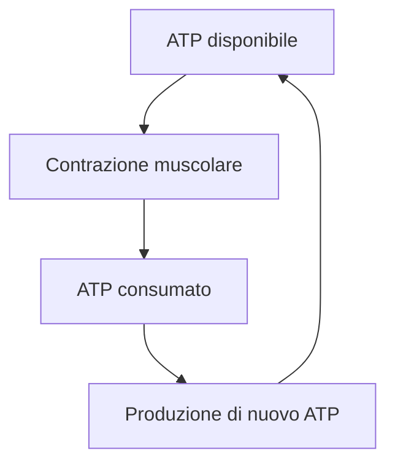
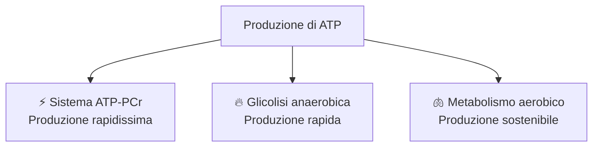
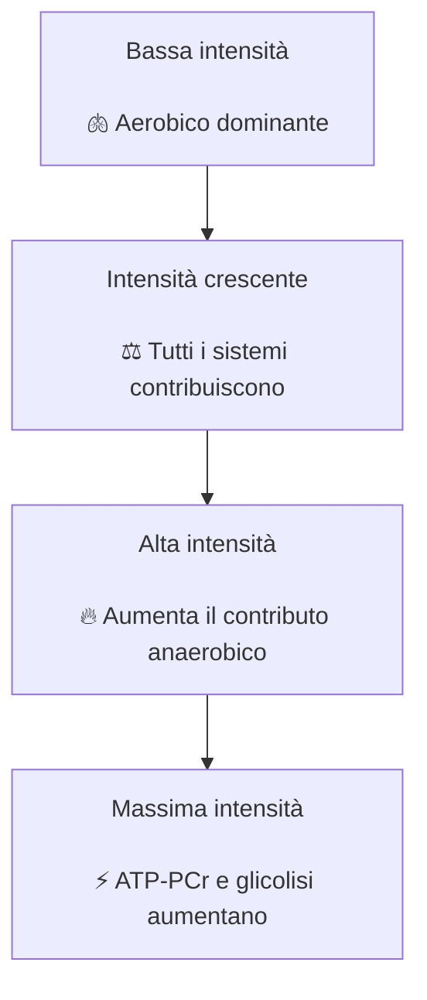

# Come funziona il motore del nostro corpo

## L'energia che permette al corpo di muoversi

Ogni movimento nasce da un processo molto semplice:

**i muscoli si contraggono.**

Camminare, correre, pedalare o sollevare un peso sono azioni diverse, ma hanno tutte lo stesso punto di partenza:

➡️ le fibre muscolari producono forza accorciandosi.

Per farlo, però, il muscolo ha bisogno di energia.

Questa energia viene fornita da una molecola fondamentale:

**l'ATP.**

---

## L'ATP: la moneta energetica del muscolo

L'ATP (**Adenosina Trifosfato**) è la molecola che fornisce direttamente l'energia necessaria alla contrazione muscolare.

Quando viene utilizzata, l'ATP viene trasformata in ADP liberando energia:

$$
\mathrm{ATP \rightarrow ADP + P_i + Energia}
$$

Questa energia permette alle fibre muscolari di sviluppare forza.

In altre parole:

> **Il muscolo non utilizza direttamente carboidrati o grassi per contrarsi. Utilizza ATP.**

---

## Il problema: l'ATP deve essere continuamente ricostruito

Il corpo possiede solo una piccola quantità di ATP già disponibile nei muscoli.

Questa riserva sarebbe sufficiente solo per pochi secondi di attività intensa.

Per continuare a muoverci, il metabolismo deve quindi:

**rigenerare continuamente nuovo ATP.**

L'obiettivo del metabolismo è quindi uno solo:

> **produrre ATP in quantità sufficiente per soddisfare la richiesta energetica del muscolo.**

---

## Come il corpo ricarica il suo motore

Per produrre nuovo ATP l'organismo utilizza diversi sistemi energetici.

Sono sistemi che lavorano contemporaneamente, ma con caratteristiche diverse:

---

### Sistema ATP-PCr: il motore di emergenza

È il sistema più rapido.

Utilizza le riserve di fosfocreatina presenti nel muscolo per rigenerare ATP quasi immediatamente.

È fondamentale negli sforzi esplosivi:

- sprint;
- salti;
- accelerazioni massimali.

Il limite è la capacità ridotta.

Può sostenere la produzione energetica solo per pochi secondi.

---

### Glicolisi anaerobica: il motore ad alta potenza

Quando serve produrre energia rapidamente, aumenta il contributo della glicolisi anaerobica.

Questo sistema utilizza principalmente il glucosio per produrre ATP senza utilizzare direttamente ossigeno.

È importante negli sforzi intensi come:

- ripetute ad alta intensità;
- salite brevi;
- sprint prolungati.

Il vantaggio è la velocità.

Il limite è la durata.

---

### Metabolismo aerobico: il motore di lunga autonomia

Il sistema aerobico utilizza:

- ossigeno;
- carboidrati;
- grassi;

per produrre ATP.

È il sistema più lento, ma anche quello con la maggiore capacità.

È il principale responsabile della produzione energetica nelle attività di lunga durata:

- camminare;
- correre;
- pedalare;
- praticare sport di endurance.

---

## I sistemi energetici lavorano insieme

Un errore comune è pensare che i sistemi energetici si accendano uno dopo l'altro.

In realtà sono sempre attivi contemporaneamente.

Ciò che cambia è il loro contributo.

Quando aumenta la richiesta energetica, il corpo deve aumentare la velocità con cui rigenera ATP.

---

## Chi ha il motore migliore?

In modo molto semplice:

> **Un atleta performante è un atleta capace di produrre energia e utilizzarla in modo efficace.**

Questo dipende da:

- capacità di rigenerare ATP;
- velocità di produzione dell'ATP;
- capacità di utilizzare ossigeno;
- efficienza muscolare;
- capacità di sostenere lo sforzo nel tempo.

Non basta avere un motore potente.

Serve anche un motore efficiente.