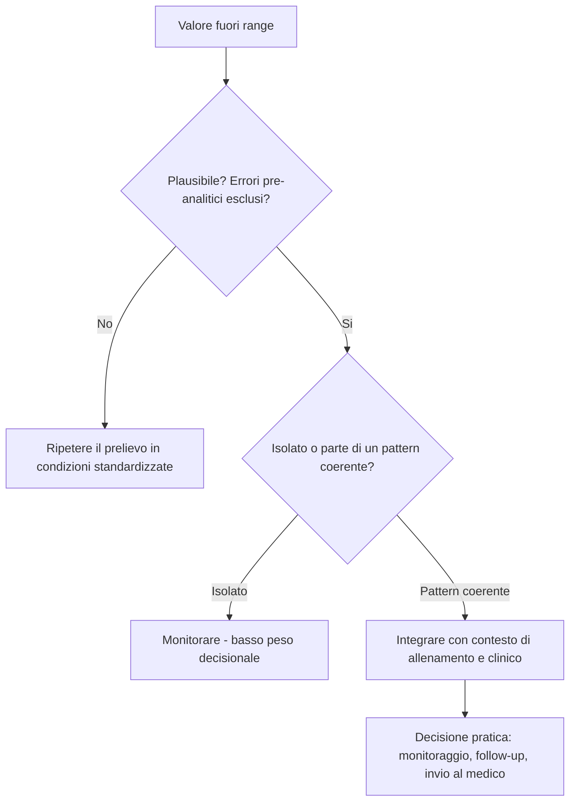

# Fondamenti di interpretazione

*Vedi [Introduzione](00_introduzione.md) per scopo, destinatari e metodo generale del manuale.*

---

### Come leggere un pannello ematico

#### L'errore del valore isolato

L'errore interpretativo più comune, anche tra professionisti esperti, è guardare un singolo parametro fuori range e trarne una conclusione isolata ("la ferritina è bassa quindi l'atleta è sideropenico", "la CK è alta quindi c'è danno muscolare importante"). Un pannello ematico va letto come un sistema di relazioni tra parametri, non come un elenco di valori indipendenti.

#### Il metodo a tre livelli

Un approccio strutturato all'interpretazione prevede tre livelli di lettura, da applicare in sequenza:

**Livello 1 — Plausibilità del dato**
Prima di interpretare, verificare che il valore sia plausibile. Un errore pre-analitico (emolisi del campione, prelievo post-esercizio intenso, disidratazione acuta) può alterare drasticamente un risultato senza che vi sia alcun significato fisiologico reale.

**Livello 2 — Lettura per assi funzionali**
Raggruppare i parametri per asse fisiologico piuttosto che leggerli in ordine di stampa del referto:
- asse eritropoietico (Hb, Ht, RBC, reticolociti, ferro);
- asse infiammatorio (PCR, VES, leucociti);
- asse di danno tissutale (CK, LDH, transaminasi);
- asse di funzione d'organo (funzione renale, epatica);
- asse endocrino-metabolico (ormoni, glicemia, profilo lipidico).

**Livello 3 — Integrazione con il contesto di allenamento**
Solo a questo punto il dato di laboratorio viene confrontato con carico recente, fase di stagione, altitudine, stato nutrizionale e storia clinica dell'atleta, per generare un'interpretazione operativa.

#### Pattern vs valore singolo

Un singolo valore fuori range ha valore interpretativo limitato. Un pattern coerente tra più parametri (ad esempio ferritina bassa + saturazione della transferrina bassa + MCV ai limiti inferiori) ha una capacità diagnostica molto più solida di un singolo dato isolato.

#### Take Home Messages

- Un pannello ematico si legge per assi funzionali, non riga per riga.
- Il valore isolato ha basso potere interpretativo; il pattern coerente ne ha molto di più.
- Prima di interpretare, va sempre verificata la plausibilità pre-analitica del dato.
- Il contesto di allenamento è parte integrante dell'interpretazione, non un'informazione accessoria.

---

### Variabilità biologica

#### Variabilità intra-individuale ed inter-individuale

Ogni parametro ematico ha una variabilità biologica intrinseca, distinta dall'errore analitico del laboratorio. Si distinguono:

- **Variabilità intra-individuale (CVi)**: oscillazione naturale dello stesso parametro nello stesso soggetto nel tempo, in assenza di patologia.
- **Variabilità inter-individuale (CVg)**: differenza tra soggetti diversi, che spiega perché i range di riferimento di popolazione sono spesso poco sensibili a variazioni clinicamente rilevanti nel singolo atleta.

Parametri come ferritina, CK e cortisolo hanno una variabilità intra-individuale molto elevata (anche >40-60%), mentre altri come sodio o creatinina sono relativamente stabili. Questo significa che per alcuni parametri il confronto più informativo non è con il range di popolazione, ma con il valore basale individuale dell'atleta (baseline testing).

#### Il concetto di baseline individuale

Per uno staff che segue un atleta nel tempo, il valore più utile non è "il paziente è nel range?" ma "questo valore è coerente con la storia di questo atleta?". Per questo motivo, dove possibile, è buona pratica costruire un profilo ematologico individuale dell'atleta con controlli ripetuti in condizioni standardizzate (stessa ora, stesso stato di idratazione, stessa fase del ciclo di allenamento), da usare come riferimento per le valutazioni successive.

#### Reference Change Value (RCV)

Il Reference Change Value è la variazione minima tra due prelievi consecutivi dello stesso soggetto che può essere considerata statisticamente significativa, tenendo conto della variabilità biologica e analitica combinata. Concettualmente utile per lo staff: una variazione della ferritina da 40 a 55 ng/mL può rientrare nella normale oscillazione biologica, mentre una caduta da 80 a 25 ng/mL è verosimilmente un cambiamento reale.

#### Fattori che contribuiscono alla variabilità

- ritmo circadiano (cortisolo, ferro sierico, GH);
- ciclo mestruale (ferritina, emoglobina, ormoni);
- stagionalità (vitamina D);
- fase di allenamento (CK, marcatori infiammatori);
- quota altimetrica recente (eritropoiesi, ferro);
- stato di idratazione (tutti i parametri "concentrazione-dipendenti").

#### Take Home Messages

- Ogni parametro ha una variabilità biologica propria: alcuni sono molto stabili, altri oscillano fisiologicamente in modo ampio.
- Il confronto più informativo nell'atleta seguito nel tempo è spesso con il proprio baseline, non solo con il range di popolazione.
- Piccole variazioni in parametri ad alta variabilità biologica (ferritina, CK, cortisolo) richiedono cautela interpretativa.
- Standardizzare le condizioni di prelievo riduce il rumore e rende i confronti longitudinali più affidabili.

---

### Effetti dell'allenamento sugli esami

#### Perché l'atleta non è il soggetto sedentario

L'esercizio cronico induce adattamenti emodinamici, ematologici e metabolici che spostano sistematicamente numerosi parametri rispetto ai range costruiti su popolazioni prevalentemente sedentarie. Applicare senza correzione i range di laboratorio standard genera falsi positivi (l'atleta "malato" che in realtà è ben adattato) e, più raramente, falsi negativi (un pattern realmente anomalo mascherato da un adattamento apparentemente fisiologico).

#### Effetti acuti vs effetti cronici

È essenziale distinguere:

- **Effetti acuti** (ore-giorni dopo una singola seduta o gara): rialzo di CK, LDH, leucociti, PCR; riduzione transitoria di ferro sierico; variazioni di volume plasmatico che diluiscono Hb ed Ht.
- **Effetti cronici** (settimane-mesi di allenamento continuativo): espansione del volume plasmatico ("pseudo-anemia dello sportivo"), aumento della massa eritrocitaria totale, riduzione della ferritina basale per aumento del turnover del ferro, possibile riduzione della testosteronemia basale in sport di endurance ad alto volume.

#### La pseudo-anemia dello sportivo

Uno dei pattern più frequentemente frainteso: l'allenamento di endurance cronico espande il volume plasmatico proporzionalmente più della massa eritrocitaria totale, con la conseguenza che Hb ed Ht misurati (concentrazioni) risultano più bassi rispetto al soggetto sedentario, pur in presenza di una massa eritrocitaria totale normale o aumentata. Non è anemia vera, ma un artefatto emodiluizionale con significato adattivo positivo (migliore reologia ematica, minore viscosità).

> **Box informativo.** Distinguere pseudo-anemia da anemia vera richiede la valutazione integrata di ferritina, TSAT, reticolociti e, quando disponibile, storia dei valori basali dell'atleta. Un singolo emocromo non è sufficiente a fare questa distinzione con certezza.

#### Take Home Messages

- I range di riferimento di laboratorio sono costruiti su popolazione generale e vanno applicati con cautela nell'atleta.
- Distinguere sempre effetti acuti (post-esercizio) da adattamenti cronici (di stagione).
- La pseudo-anemia dello sportivo è un adattamento fisiologico atteso nell'endurance, non un deficit da correggere.
- Interpretare un singolo emocromo senza contesto di allenamento espone ad alto rischio di errore.

---

### Timing corretto del prelievo

#### Perché il timing cambia il risultato

Il momento del prelievo rispetto all'ultima sessione di allenamento, all'ora del giorno e alla fase del ciclo mestruale può alterare in modo sostanziale numerosi parametri, indipendentemente da qualunque cambiamento reale nello stato di salute o allenamento dell'atleta.

#### Raccomandazioni pratiche di timing

| Contesto | Raccomandazione |
|---|---|
| Timing rispetto all'allenamento | A digiuno, al mattino, evitando allenamenti intensi nelle 24-48h precedenti quando l'obiettivo è un profilo basale |
| Idratazione | Stato di idratazione standardizzato; evitare prelievi in disidratazione acuta post-gara per parametri concentrazione-dipendenti |
| Ritmo circadiano | Prelievo alla stessa ora del giorno nei controlli seriati, per parametri con variazione circadiana (cortisolo, ferro sierico) |
| Ciclo mestruale | Annotare la fase del ciclo; preferire fase follicolare precoce per confronti seriati quando possibile |
| Quota | Evitare prelievi nei primissimi giorni di esposizione acuta all'altitudine se l'obiettivo è un profilo di ferro stabile |

#### Standardizzazione nei controlli seriati

Per uno staff che segue l'atleta con controlli ripetuti nel tempo, la standardizzazione delle condizioni di prelievo è più importante della singola "perfezione" del prelievo isolato: è la comparabilità tra prelievi successivi a rendere il dato utile per il monitoraggio longitudinale.

#### Take Home Messages

- Il timing del prelievo rispetto ad allenamento, ritmo circadiano e ciclo mestruale influenza numerosi parametri.
- Per profili basali, preferire il mattino a digiuno con almeno 24-48h di distanza da sedute intense.
- La standardizzazione delle condizioni tra controlli seriati è prioritaria per l'affidabilità del monitoraggio longitudinale.
- Annotare sempre le condizioni del prelievo nel referto o nel sistema di monitoraggio dell'atleta.

---

### Errori pre-analitici comuni

#### Cosa sono gli errori pre-analitici

Sono errori che si verificano prima dell'analisi vera e propria del campione: raccolta, trasporto, conservazione. Si stima che la maggioranza degli errori complessivi in medicina di laboratorio abbia origine pre-analitica, e questo vale ancora di più nel contesto sportivo, dove i prelievi avvengono spesso in condizioni logistiche non ideali (centri sportivi, trasferte, competizioni).

#### Principali fonti di errore

- **Emolisi del campione**: da prelievo traumatico o trasporto inadeguato; altera potassio, LDH, AST, ferro sierico.
- **Stasi venosa prolungata (laccio emostatico troppo a lungo)**: falsa elevazione di parametri concentrazione-dipendenti.
- **Esercizio nelle ore immediatamente precedenti**: rialzo di CK, leucociti, PCR; alterazioni del volume plasmatico.
- **Digiuno non rispettato**: altera glicemia, profilo lipidico.
- **Conservazione/trasporto del campione non a temperatura adeguata**: degradazione di alcuni analiti.
- **Identificazione errata del campione**: in contesti di prelievi multipli su più atleti nella stessa sessione, rischio non trascurabile.

#### Checklist pratica pre-prelievo

- [ ] Atleta a digiuno da almeno 8-10 ore (se richiesto dal pannello)
- [ ] Nessun allenamento intenso nelle 24-48h precedenti (per profilo basale)
- [ ] Stato di idratazione normale, non in fase di forte disidratazione
- [ ] Orario del prelievo coerente con i controlli precedenti
- [ ] Fase del ciclo mestruale annotata, se pertinente
- [ ] Nessuna assunzione recente di farmaci/integratori non dichiarata
- [ ] Etichettatura corretta del campione

#### Take Home Messages

- La maggior parte degli errori in medicina di laboratorio ha origine pre-analitica, non analitica.
- L'esercizio recente, l'emolisi e la stasi venosa sono le fonti di errore più rilevanti nel contesto sportivo.
- Una checklist pre-prelievo standardizzata riduce sensibilmente il rischio di dati non affidabili.
- Un valore anomalo isolato va sempre valutato anche in ottica di possibile errore pre-analitico, prima di essere considerato un dato reale.

---

### Differenza tra valore patologico e adattamento sportivo

#### Il nodo interpretativo centrale

Questo capitolo sintetizza il principio guida dell'intero manuale: lo stesso identico valore numerico può rappresentare un adattamento fisiologico positivo in un atleta e un segnale patologico in un altro, a seconda del contesto. Non esiste un valore che sia "buono" o "cattivo" in assoluto: esiste un valore che è coerente o incoerente con la storia, il carico e lo stato clinico dell'atleta.

#### Criteri per orientare la distinzione

| Criterio | Orienta verso adattamento | Orienta verso condizione da approfondire |
|---|---|---|
| Andamento temporale | Stabile o coerente con la fase di carico | Trend in peggioramento progressivo su più controlli |
| Coerenza tra parametri | Pattern coerente con adattamento noto (es. pseudo-anemia) | Pattern incoerente o discordante tra parametri correlati |
| Sintomatologia | Atleta asintomatico, performance stabile | Presenza di sintomi (fatica anomala, calo prestativo, infezioni ricorrenti) |
| Contesto di carico | Coerente con fase di carico elevato/taper | Non giustificato dal carico recente |
| Risposta a intervento | Normalizzazione attesa con recupero/intervento mirato | Persistenza nonostante intervento adeguato |

#### Il ruolo dello staff tecnico

Lo staff tecnico non sostituisce il medico nella diagnosi, ma ha un ruolo insostituibile nel fornire il contesto che rende il dato di laboratorio interpretabile: carico di allenamento, fase di stagione, quota, viaggi, stress percepito, qualità del sonno, disponibilità energetica. Un referto letto senza questo contesto perde gran parte del suo valore informativo.

#### Take Home Messages

- Lo stesso valore numerico può essere adattamento o segnale patologico a seconda del contesto individuale.
- L'andamento temporale e la coerenza tra parametri correlati sono più informativi del singolo valore assoluto.
- La presenza o assenza di sintomi clinici è un elemento centrale nella distinzione.
- Il compito dello staff tecnico è fornire contesto, non sostituirsi alla diagnosi medica.
- In caso di dubbio, la soglia di invio al medico dello sport deve essere bassa: è sempre preferibile un controllo in più che un ritardo diagnostico.
